# 第十章：*第九章*

# 热点分析

## 学习目标

在本章结束时，你将能够：

+   了解空间建模的一些应用

+   在适当的背景下部署热点模型

+   构建核密度估计模型

+   执行热点分析并可视化结果

在本章中，我们将学习核密度估计，并学习如何进行热点分析。

## 引言

让我们考虑一个假设的情景：一种新的疾病已开始在你所在的国家的多个社区传播，政府正在努力找出如何应对这一健康紧急情况。应对这一健康紧急情况的关键是流行病学知识，包括患者的位置和疾病的传播方式。能够定位和量化问题区域（通常称为热点）可以帮助卫生专业人员、政策制定者和应急响应团队制定最有效的应对策略。这个情景突出了热点建模的众多应用之一。

热点建模是一种用于识别人口在地理区域分布的方式的方法；例如，前面提到的疾病感染者在全国范围内的分布。创建这种分布依赖于代表性样本数据的可用性。请注意，人口可以是任何在地理术语上可定义的事物，包括但不限于犯罪、感染疾病的个体、具有特定人口特征的人群或飓风：

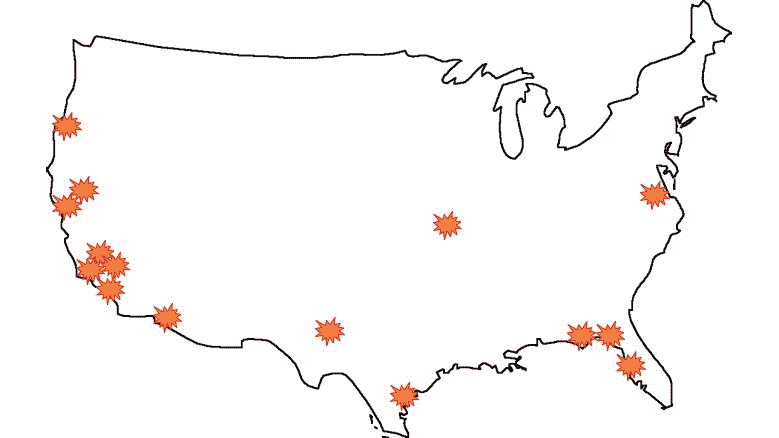

###### 图 9.1：一个虚构的火灾位置数据示例，展示了一些潜在的热点

热点分析非常流行，主要是因为它易于可视化结果，并且易于阅读和解释这些可视化图像。报纸、网站、博客和电视节目都利用热点分析来支持其中的论点、章节和话题。虽然它可能不像最流行的机器学习模型那样知名，但主要的热点分析算法——**核密度估计**，无疑是最广泛使用的分析技术之一。核密度估计是一种热点分析技术，用于估计特定地理事件的真实人口分布。

### 空间统计

**空间统计学**是统计学的一个分支，专注于分析具有空间特性的数据显示，包括地理或拓扑坐标。它与时间序列分析相似，目标是分析在某一维度上发生变化的数据。在时间序列分析中，数据变化的维度是时间，而在空间统计学中，数据则在空间维度上变化。空间统计学涵盖了多种技术，但我们这里关注的技术是核密度估计。

如大多数统计分析的目标一样，在空间统计学中，我们试图通过采样地理数据并利用这些数据生成见解和做出预测。地震分析是空间统计分析常见的一个应用领域。通过收集地震位置数据，可以生成标识高低地震可能性的地图，这可以帮助科学家确定未来地震发生的可能位置及强度预期。

### 概率密度函数

核密度估计使用**概率密度函数**（**PDF**）的概念，这是统计学中的一个基础概念。概率密度函数是一个描述连续**随机变量**行为的函数。也就是说，它表示随机变量取某一范围值的可能性或概率。以美国男性的身高为例，通过使用美国男性身高的概率密度函数，我们可以确定某位美国男性身高在 1.9 米到 1.95 米之间的概率：

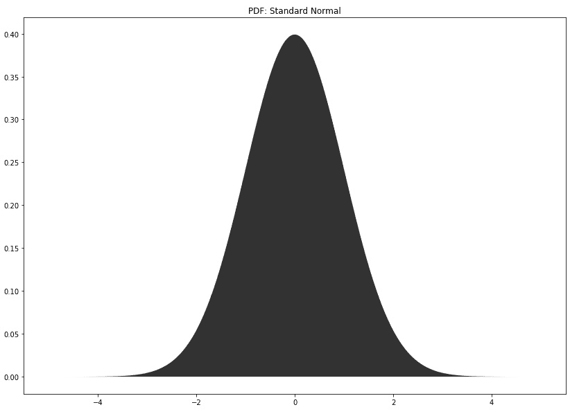

###### 图 9.2：标准正态分布

可能是统计学中最流行的密度函数就是标准正态分布，它是以零为中心，标准差为一的正态分布。

与密度函数不同，统计学家或数据科学家通常只能获得从一个未知的总体分布中随机采集的样本值。这正是核密度估计的应用场景，它是一种利用样本数据估计随机变量的未知概率密度函数的技术：

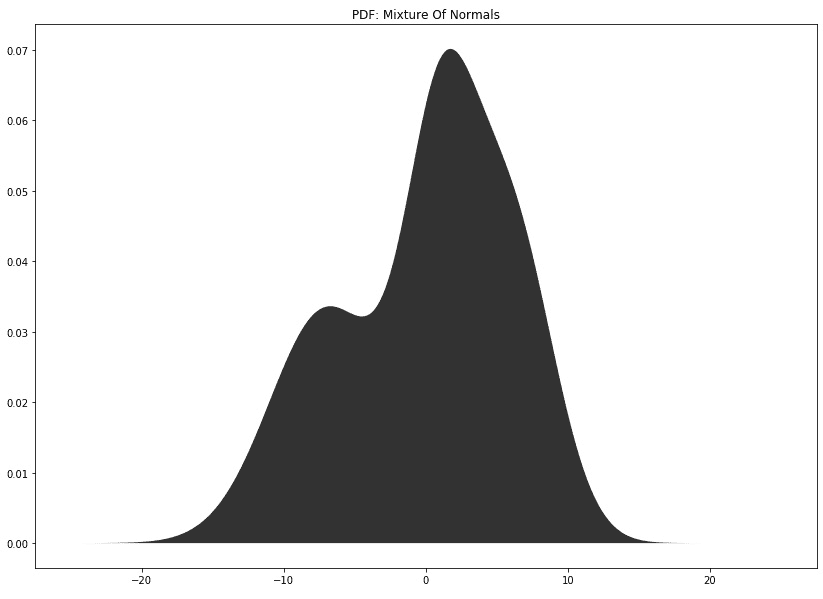

###### 图 9.3：三种正态分布的混合

### 在商业中使用热点分析

我们已经提到了一些可以利用热点建模对行业产生重要影响的方式。以下是热点建模的常见应用案例。

在报告传染性疾病时，卫生组织和媒体公司通常使用热点分析来传达疾病的地理分布及其根据地理位置的传播可能性。通过使用热点分析，这些信息可以被可靠地计算并传播。热点分析非常适合处理健康数据，因为可视化图表非常直接。这意味着数据被故意或无意地误解的可能性相对较低。

热点分析还可以用于预测某些事件在地理上的发生概率。越来越多的研究领域正在利用热点分析的预测能力，其中一个例子就是环境科学领域，包括自然灾害和极端天气事件的研究。例如，地震就以难以预测而闻名，因为重大地震之间的时间间隔可能较长，而所需的用于追踪和测量地震的机械设备相对较新。

在公共政策和资源部署方面，热点分析在分析人口统计数据时可以产生重大影响。确定应该部署哪些资源（无论是金钱还是人力）可能是具有挑战性的；然而，考虑到资源往往是特定于人口的，热点分析是一种有用的技术，因为它可以用于确定某些人口统计特征的分布。这里的人口统计特征指的是我们可以找到高中毕业生、来自特定全球区域的移民或年收入超过 10 万美元的个人的地理分布。

## 核密度估计

热点分析的主要方法之一是核密度估计。核密度估计通过样本数据和两个被称为**核函数**和**带宽值**的参数来构建估计密度。估计的密度与任何分布一样，本质上是对随机变量行为的一个指导。在这里，我们指的是随机变量取特定值的频率，。在处理通常为地理数据的热点分析时，估计的密度回答了这个问题：*特定的经纬度对出现的频率是多少？*。如果某个特定的经纬度对，，以及其他附近的经纬度对出现频率较高，那么使用样本数据构建的估计密度将预示着该经纬度对周围区域的可能性较高。

核密度估计被称为一种平滑算法，因为估计密度的过程实际上是通过忽略样本数据中的异常和离群值来估计数据的潜在形状。换句话说，核密度估计去除了数据中的噪声。该模型的唯一假设是数据确实属于某个可解释且有意义的密度，能够从中提取洞察并付诸实践。也就是说，存在一个真实的潜在分布。

可以说，比本书中的任何其他话题，核密度估计体现了统计学的基本思想，即利用有限大小的样本数据对总体做出推断。我们假设样本数据包含数据点的聚类，这些聚类意味着总体中高可能性的区域。创建高质量的真实总体密度估计的好处是，估计的密度可以用来从总体中抽取更多的数据。

在这段简要介绍之后，你可能会有以下两个问题：

+   什么是带宽值？

+   什么是核函数？

我们接下来会回答这两个问题。

### 带宽值

核密度估计中最关键的参数被称为**带宽值**，它对估计结果的影响不可过高估计。带宽值的高层次定义是，它决定了平滑的程度。如果带宽值低，那么估计的密度将具有有限的平滑度，这意味着密度会捕捉到样本数据中的所有噪声。如果带宽值高，那么估计的密度将非常平滑。过于平滑的密度会移除估计密度中那些真实的且不只是噪声的特征。

在更多的统计学或机器学习语言中，带宽参数控制着偏差-方差权衡。也就是说，低带宽值会导致高方差，因为密度对样本数据的方差非常敏感。低带宽值限制了模型适应样本数据中未在总体中出现的空缺的能力。使用低带宽值估计的密度往往会出现过拟合（这也被称为过度平滑的密度）。当使用高带宽值时，所得的密度会出现欠拟合，并且估计的密度会有较高的偏差（这也被称为过度平滑的密度）。

### 练习 46：带宽值的影响

在本练习中，我们将拟合九种不同的模型，每个模型使用不同的带宽值，来处理练习中创建的样本数据。这里的目标是巩固我们对带宽参数影响的理解，并明确表示，如果需要准确的估计密度，则必须小心选择带宽值。请注意，找到最优带宽值将是下一部分的主题。所有练习将在 Jupyter notebook 中使用 Python 3 完成；确保所有包的安装通过`pip`进行。安装`mpl_toolkits`中的`basemap`模块的最简单方法是使用*Anaconda*。下载和安装*Anaconda*的说明可以在本书的开头找到：

1.  加载本章练习所需的所有库。在这里，`matplotlib`库用于创建基本图形；`basemap`库用于创建涉及位置数据的图形；`numpy`库用于处理数组和矩阵；`pandas`库用于处理 DataFrame；`scipy`库用于 Python 中的科学计算；`seaborn`库用于创建更具吸引力和复杂的图形；`sklearn`库用于访问数据、处理数据和运行模型。此外，确保图形以内联方式运行并设置为`seaborn`，以便所有图形以`seaborn`图形的形式呈现：

    ```py
    get_ipython().run_line_magic('matplotlib', 'inline')
    import matplotlib.pyplot as plt
    import mpl_toolkits.basemap
    import numpy
    import pandas
    import scipy.stats
    import seaborn
    import sklearn.datasets
    import sklearn.model_selection
    import sklearn.neighbors
    seaborn.set()
    ```

1.  创建一些样本数据（`vals`），通过混合三个正态分布。除了样本数据外，还定义真实的密度曲线（`true_density`）以及数据将被绘制的范围（`x_vec`）：

    ```py
    x_vec = numpy.linspace(-30, 30, 10000)[:, numpy.newaxis]
    vals = numpy.concatenate((
        numpy.random.normal(loc=1, scale=2.5, size=500), 
        numpy.random.normal(loc=10, scale=4, size=500), 
        numpy.random.normal(loc=-12, scale=5, size=500)
    ))[:, numpy.newaxis]
    true_density = (
        (1 / 3) * scipy.stats.norm(1, 2.5).pdf(x_vec[:, 0]) + 
        (1 / 3) * scipy.stats.norm(10, 4).pdf(x_vec[:, 0]) +
        (1 / 3) * scipy.stats.norm(-12, 5).pdf(x_vec[:, 0])
    )
    ```

1.  定义一个元组列表，用于指导创建多图形。每个元组包含特定子图的行和列索引，以及用于在该特定子图中创建估计密度的带宽值：

    ```py
    position_bandwidth_vec = [
        (0, 0, 0.1), (0, 1, 0.4), (0, 2, 0.7), 
        (1, 0, 1.0), (1, 1, 1.3), (1, 2, 1.6), 
        (2, 0, 1.9), (2, 1, 2.5), (2, 2, 5.0)
    ]
    ```

1.  创建九个图形，每个图形使用不同的带宽值。第一个图形（索引为(0, 0)）将具有最低带宽，最后一个图形（索引为(2, 2)）将具有最高带宽。这些值不是绝对最低或绝对最高的带宽值，而仅仅是前一步中定义的列表中的最小和最大值：

    ```py
    fig, ax = plt.subplots(3, 3, sharex=True, sharey=True, figsize=(12, 9))
    fig.suptitle('The Effect of the Bandwidth Value', fontsize=16)
    for r, c, b in position_bandwidth_vec:
        kde = sklearn.neighbors.KernelDensity(bandwidth=b).fit(vals)
        log_density = kde.score_samples(x_vec)
        ax[r, c].hist(vals, bins=50, density=True, alpha=0.5)
        ax[r, c].plot(x_vec[:, 0], numpy.exp(log_density), '-', linewidth=2)
        ax[r, c].set_title('Bandwidth = {}'.format(b))
    ```

    输出如下：

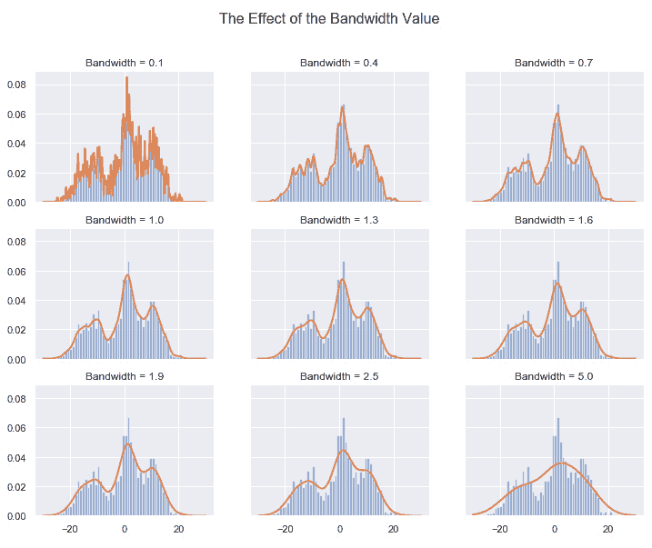

###### 图 9.4：一个 3 x 3 的子图矩阵；每个子图都使用九个带宽值之一创建了一个估计的密度

注意，在较低带宽值时，密度曲线明显过度拟合数据。随着带宽值的增加，估计的密度变得更加平滑，直到明显低估数据。视觉上看，最优带宽可能在 1.6 左右。

下一步是设计一个算法来识别最优带宽值，从而使得估计的密度最为合理，因此也是最可靠和可操作的。

### 选择最优带宽

如前一个练习中提到的，我们可以通过仅仅比较几种密度来接近选择最优带宽。然而，这既不是选择参数值的最有效方法，也不是最可靠的方法。

有两种标准方法可以优化带宽值，这两种方法将在未来的练习和活动中出现。第一种方法是插件法（或公式化方法），它是确定性的，并且没有在样本数据上进行优化。插件方法通常实现更快，代码更简单，解释起来也更容易。然而，这些方法有一个重大缺点，即与在样本数据上进行优化的方法相比，其准确性往往较差。这些方法还具有分布假设。最流行的插件方法是 Silverman 规则和 Scott 规则。默认情况下，`seaborn`包（将在未来的练习中使用）使用 Scott 规则作为确定带宽值的方法。

第二种，也是更强健的方法，是通过搜索预定义的带宽值网格来找到最优的带宽值。网格搜索是一种经验性的方法，常用于机器学习和预测建模中，以优化模型的超参数。这个过程从定义带宽网格开始，带宽网格只是待评估的带宽值的集合。使用网格中的每个带宽值来创建估计的密度；然后，使用伪对数似然值对估计的密度进行评分。最优带宽值是具有最大伪对数似然值的那个。可以把伪对数似然值看作是获取我们确实获得数据点的概率和未获取数据点的概率。理想情况下，这两个概率应该都很大。考虑一下获取我们确实获得数据点的概率较低的情况。在这种情况下，意味着样本中的数据点是异常的，因为在真实分布下，获取我们确实获得的点的概率应该不高。

现在，让我们实现网格搜索方法来优化带宽值。

### 练习 47：使用网格搜索选择最优带宽

在本练习中，我们将为*练习 46*中创建的样本数据生成估计密度，*带宽值的影响*，并使用网格搜索和交叉验证方法确定最优带宽值。为了进行带有交叉验证的网格搜索，我们将使用`sklearn`，这是本书中一直使用的工具。这个练习是练习 1 的延续，因为我们使用的是相同的样本数据，并继续探索带宽值：

1.  定义带宽值的网格和网格搜索交叉验证模型。理想情况下，应该使用逐一剔除交叉验证方法，但为了使模型在合理的时间内运行，我们将采用 10 倍交叉验证。按如下方式拟合模型：

    ```py
    bandwidths = 10 ** numpy.linspace(-1, 1, 100)
    grid = sklearn.model_selection.GridSearchCV(
        estimator=sklearn.neighbors.KernelDensity(kernel="gaussian"),
        param_grid={"bandwidth": bandwidths},
        cv=10 #sklearn.model_selection.LeaveOneOut().get_n_splits(vals)
    )
    grid.fit(vals)
    ```

1.  从模型中提取最优带宽值，如下所示：

    ```py
    best_bandwidth = grid.best_params_["bandwidth"]
    print(
        "Best Bandwidth Value: {}"
        .format(best_bandwidth)
    )
    ```

    最优带宽值应该大约为 2。我们可以将最优带宽值解释为生成最大伪对数似然值的带宽值。请注意，根据网格中包含的值，最优带宽值可能会有所变化。

1.  绘制样本数据的直方图，叠加真实密度和估计密度。在这种情况下，估计密度将是最优估计密度：

    ```py
    fig, ax = plt.subplots(figsize=(14, 10))
    ax.hist(vals, bins=50, density=True, alpha=0.5, label='Sampled Values')
    ax.fill(
          x_vec[:, 0], true_density,
          fc='black', alpha=0.3, label='True Distribution'
          )
    log_density = numpy.exp(grid.best_estimator_.score_samples(x_vec))
    ax.plot(
            x_vec[:, 0], log_density,
            '-', linewidth=2, label='Kernel = Gaussian'
            )
    ax.legend(loc='upper right')
    ```

    输出如下：

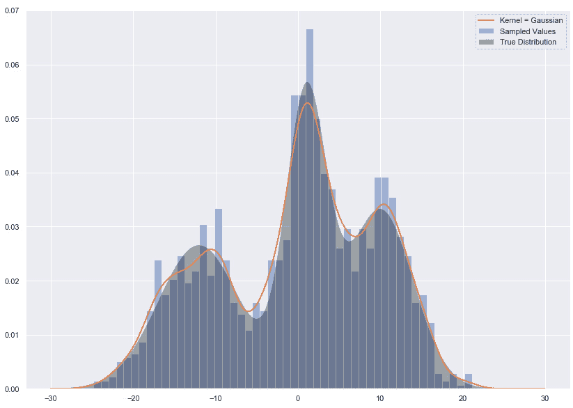

###### 图 9.5：随机样本的直方图，叠加了真实密度和最优估计密度

估计密度没有明显的过拟合或欠拟合，且它确实捕捉到了三个聚类。可以说，它可能会更好地映射到真实密度，但这只是由有局限性的模型生成的估计密度。

现在让我们继续第二个问题：什么是核函数，它在模型中扮演什么角色？

### 核函数

另一个需要设置的参数是核函数。核是一个非负函数，控制密度的形状。像主题模型一样，我们在一个非负环境中工作，因为负的可能性或概率是没有意义的。

核函数通过系统地加权点来控制估计密度的形状。这种加权的系统方法相当简单；与许多其他数据点接近的数据点会被加权，而孤立或远离其他数据点的数据点则会被减权。加权的数据点将对应于最终估计密度中较高可能性的点。

可以使用多种函数作为核，但六种常见选择是高斯核、顶帽核、埃潘尼基诺夫核、指数核、线性核和余弦核。这些函数分别代表独特的分布形状。请注意，在每个公式中，参数*h*表示带宽值：

+   高斯：


###### 图 9.6：高斯核函数的公式

+   Tophat 核：


###### 图 9.7：Tophat 核函数的公式

+   Epanechnikov 核：


###### 图 9.8：Epanechnikov 核函数的公式

+   指数型：


###### 图 9.9：指数核函数的公式

+   线性型：


###### 图 9.10：线性核函数的公式

+   余弦型：


###### 图 9.11：余弦核函数的公式

这里是六种核函数的分布形状：


###### 图 9.12：六种核函数的整体形状

核函数的选择并非完全不重要，但它绝对没有带宽值的选择那么重要。一个合理的行动方案是，对于所有的密度估计问题使用高斯核函数，这也是我们在接下来的练习和活动中将要做的。

### 练习 48：核函数的影响

本练习的目标是理解核函数的选择如何影响密度估计的质量。就像我们在探索带宽值的影响时一样，我们将保持其他所有参数不变，使用在前两个练习中生成的相同数据，并使用先前指定的六种核函数运行六个不同的核密度估计模型。六个估算的密度之间应该能看到明显的差异，但这些差异应该比使用不同带宽值时的密度差异稍微小一些：

1.  定义一个与之前定义的类似的元组列表。每个元组包括子图的行列索引，以及用于创建密度估计的核函数：

    ```py
    position_kernel_vec = [
        (0, 0, 'gaussian'), (0, 1, 'tophat'), 
        (1, 0, 'epanechnikov'), (1, 1, 'exponential'), 
        (2, 0, 'linear'), (2, 1, 'cosine'), 
    ]
    Fit and plot six kernel density estimation models using a different kernel function for each. To truly understand the differences between the kernel functions, we will set the bandwidth value to the optimal bandwidth value found in Exercise 2 and not adjust it:
    fig, ax = plt.subplots(3, 2, sharex=True, sharey=True, figsize=(12, 9))
    fig.suptitle('The Effect of Different Kernels', fontsize=16)
    for r, c, k in position_kernel_vec:
        kde = sklearn.neighbors.KernelDensity(
            kernel=k, bandwidth=best_bandwidth
            ).fit(vals)
        log_density = kde.score_samples(x_vec)
        ax[r, c].hist(vals, bins=50, density=True, alpha=0.5)
        ax[r, c].plot(x_vec[:, 0], numpy.exp(log_density), '-', linewidth=2)
        ax[r, c].set_title('Kernel = {}'.format(k.capitalize()))
    ```

    输出结果如下：

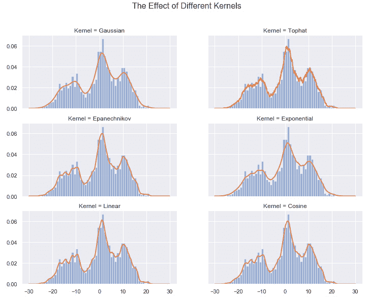

###### 图 9.13：一个 3 x 2 的子图矩阵，每个子图展示使用六种核函数之一估算的密度

在这六种核函数中，高斯核函数产生了最合理的估算密度。更进一步，注意到不同核函数下的估算密度之间的差异小于使用不同带宽值时的差异。这证明了之前的观点，即带宽值是更重要的参数，应该在模型构建过程中重点关注。

在我们大致理解的基础上，接下来让我们以高层次的方式讨论核密度估计的推导过程。

### 核密度估计推导

我们跳过正式的数学推导，而采用直观的流行推导方法。核密度估计将样本中的每个数据点转化为其自身的分布，其宽度由带宽值控制。然后，将这些单独的分布相加，以创建所需的密度估计。这个概念相对容易演示；然而，在接下来的练习中之前，让我们尝试以抽象的方式思考它。对于包含许多样本数据点的地理区域，单独的密度将会重叠，并且通过加总这些密度，将在估计密度中创建高概率点。同样，对于包含少量甚至没有样本数据点的地理区域，单独的密度不会重叠，因此在估计密度中对应的将是低概率点。

### 练习 49：模拟核密度估计的推导

这里的目标是演示将单独分布相加，以创建随机变量的总体估计密度的概念。我们将通过从一个样本数据点开始，逐步建立这个概念，随后增加更多的样本数据点。此外，还将应用不同的带宽值，从而进一步巩固我们对带宽值对这些单独密度影响的理解：

1.  定义一个函数来评估正态分布。输入值包括代表随机变量范围的网格 *X*、采样数据点 *m* 和带宽 *b*：

    ```py
    def eval_gaussian(x, m, b):
        numerator = numpy.exp(
            -numpy.power(x - m, 2) / (2 * numpy.power(b, 2))
        )
        denominator = b * numpy.sqrt(2 * numpy.pi)
        return numerator / denominator
    ```

1.  将单个样本数据点绘制为直方图，并与不同带宽值下的单独密度进行比较：

    ```py
    m = numpy.array([5.1])
    b_vec = [0.1, 0.35, 0.8]
    x_vec = numpy.linspace(1, 10, 100)[:, None]
    fig, ax = plt.subplots(2, 3, sharex=True, sharey=True, figsize=(15, 10))
    for i, b in enumerate(b_vec):
        ax[0, i].hist(m[:], bins=1, fc='#AAAAFF', density=True)
        ax[0, i].set_title("Histogram: Normed")
        evaluation = eval_gaussian(x_vec, m=m[0], b=b)

        ax[1, i].fill(x_vec, evaluation, '-k', fc='#AAAAFF')
        ax[1, i].set_title("Gaussian Dist: b={}".format(b))
    ```

    输出如下：

    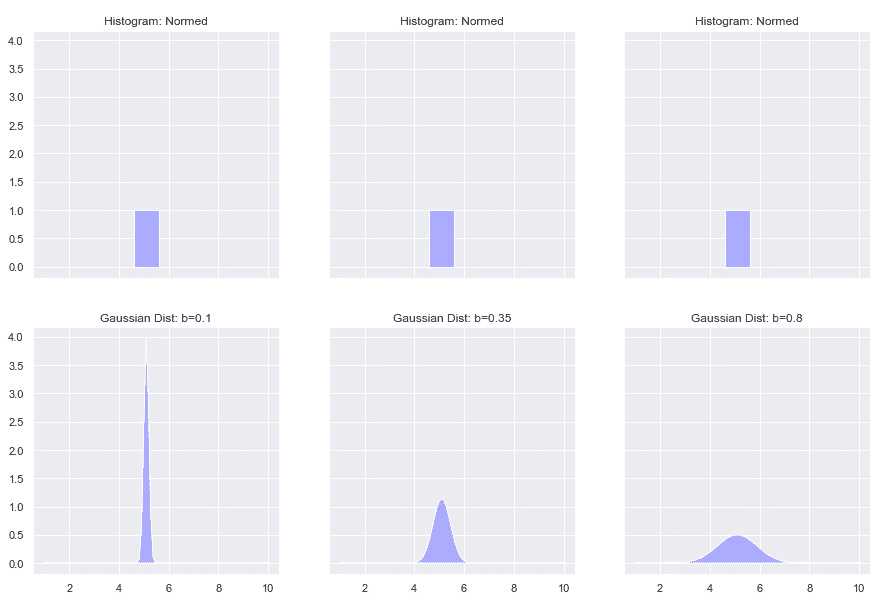

    ###### 图 9.14：展示一个数据点及其在不同带宽值下的单独密度

    在这里，我们看到已经建立的结论，即较小的带宽值会产生非常狭窄的密度，容易导致数据过拟合。

1.  重新生成*步骤 2*中的工作，但这次扩展到 16 个数据点：

    ```py
    m = numpy.random.normal(4.7, 0.88, 16)
    n = len(m)
    b_vec = [0.1, 0.35, 1.1]
    x_vec = numpy.linspace(-1, 11, 100)[:, None]
    fig, ax = plt.subplots(2, 3, sharex=True, sharey=True, figsize=(15, 10))
    for i, b in enumerate(b_vec):
        ax[0, i].hist(m[:], bins=n, fc='#AAAAFF', density=True)
        ax[0, i].set_title("Histogram: Normed")

        sum_evaluation = numpy.zeros(len(x_vec))

        for j in range(n):
            evaluation = eval_gaussian(x_vec, m=m[j], b=b) / n
            sum_evaluation += evaluation[:, 0]

            ax[1, i].plot(x_vec, evaluation, '-k', linestyle="dashed")
        ax[1, i].fill(x_vec, sum_evaluation, '-k', fc='#AAAAFF')
        ax[1, i].set_title("Gaussian Dist: b={}".format(b))
    ```

    输出如下：

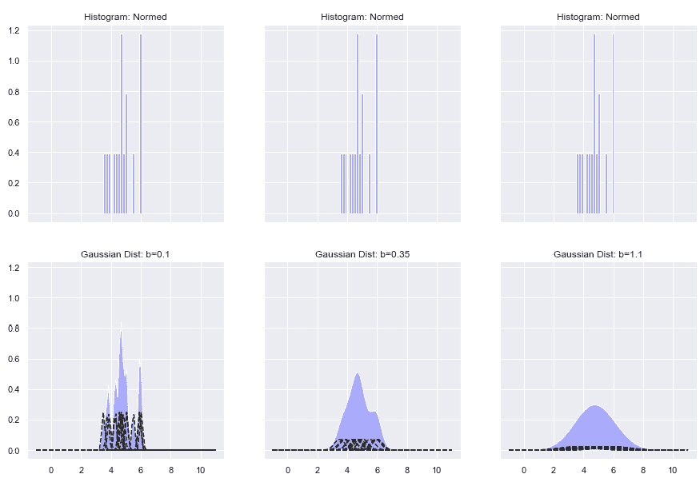

###### 图 9.15：展示 16 个数据点、它们在不同带宽值下的单独密度，以及它们单独密度的总和

如预期的那样，使用最小带宽值的图形呈现出严重过拟合的估计密度。也就是说，估计密度捕捉到了样本数据中的所有噪声。在这三种密度中，第二种密度，即带宽值设置为 0.35 时的估计密度，最为合理。

### 活动 21：估计一维密度

在这第一个活动中，我们将生成一些虚拟示例数据，并使用核密度估计估计密度函数。带宽值将通过网格搜索交叉验证进行优化。目标是通过在一个简单的单维案例中运行模型，巩固我们对这一有用方法论的理解。我们将再次使用 Jupyter notebooks 来完成这项工作。

假设我们将要创建的示例数据描述的是美国某州的房价。暂时忽略以下示例数据中的数值。问题是，*房价的分布是什么样的，我们能否提取出房子价格落在某个特定范围内的概率？*这些问题以及更多的问题都可以通过核密度估计来回答。

完成该活动的步骤如下：

1.  打开一个新的笔记本，并安装所有必要的库。

1.  从标准正态分布中采样 1,000 个数据点。将 3.5 加到样本的最后 625 个值上（即，375 到 1,000 之间的索引）。设置随机状态为 100。为此，使用`numpy.random.RandomState`设置一个随机状态为 100，以保证相同的采样值，然后使用`randn(1000)`调用随机生成数据点。

1.  将 1,000 个样本数据绘制成直方图，并在其下方添加散点图。

1.  定义一个带宽值的网格。然后，定义并拟合一个网格搜索交叉验证算法。

1.  提取最佳带宽值。

1.  重新绘制*步骤 3*中的直方图，并叠加估计的密度。

    输出结果如下：

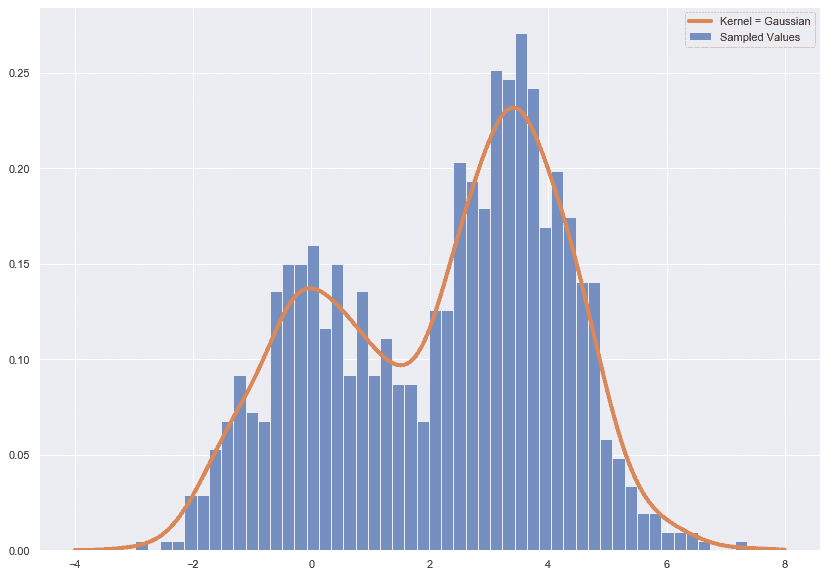

###### 图 9.16：带有最佳估计密度叠加的随机样本直方图

#### 注意

这个活动的解决方案可以在第 374 页找到。

## 热点分析

首先，热点是数据点浓度较高的区域，例如犯罪率异常高的特定街区，或遭受异常多龙卷风影响的某些地区。热点分析是通过使用采样数据，在总体中寻找这些热点的过程。这个过程通常通过利用核密度估计来完成。

热点分析可以通过四个高层次步骤来描述：

1.  **收集数据**：数据应包括对象或事件的位置。如我们简要提到的，进行分析并获得可操作结果所需的数据量相对灵活。理想状态是拥有一个能够代表总体的样本数据集。

1.  **确定基础地图**：下一步是确定哪种基础地图最适合项目的分析和展示需求。在这张基础地图上，将叠加模型的结果，以便更容易地以城市、街区或区域等更易理解的术语表达热点的位置。

1.  **执行模型**：在此步骤中，您将选择并执行一种或多种提取空间模式以识别热点的方法。对于我们来说，这种方法将是——毫无悬念——核密度估计。

1.  **创建可视化**：热点图是通过将模型结果叠加在基础地图上生成的，旨在支持解决任何悬而未决的业务问题。

从可用性角度来看，热点分析的一个主要问题是热点的统计显著性并不是特别容易确定。关于统计显著性的大部分问题围绕热点的存在展开。也就是说，发生可能性的波动是否真的构成统计学上的显著波动？需要注意的是，执行核密度估计并不要求统计显著性，且我们在后续过程中将完全不涉及显著性问题。

尽管“热点”一词传统上用来描述一组地理位置数据点，但它不限于位置数据。任何类型的数据都可能有热点，无论这些数据是否被称为热点。在接下来的练习中，我们将对一些非位置数据进行建模，以找出热点，这些热点是特征空间中发生可能性较高或较低的区域。

### 练习 50：加载数据并使用 Seaborn 进行建模

在本次练习中，我们将使用 `seaborn` 库来拟合和可视化核密度估计模型。这将应用于位置数据和非位置数据。开始建模之前，我们加载数据，这些数据是与 `sklearn` 一起自动加载的加利福尼亚住房数据集。该数据集来源于 1990 年美国人口普查，描述了当时加利福尼亚的住房情况。数据集中的每一行描述了一个人口普查块组。人口普查块组的定义与本次练习无关，因此我们将跳过对其的定义，专注于更多的实操编码与建模。需要提到的是，所有变量都是按人口普查块进行聚合的。例如，`MedInc` 是每个人口普查块的家庭收入中位数。关于此数据集的更多信息，请访问 [`scikit-learn.org/stable/datasets/index.html#california-housing-dataset`](https://scikit-learn.org/stable/datasets/index.html#california-housing-dataset)：

1.  使用 `fetch_california_housing()` 加载加利福尼亚住房数据集。使用 `pandas` 将数据转换为 DataFrame 并打印出 DataFrame 的前五行：

    ```py
    housing = sklearn.datasets.fetch_california_housing()
    df = pandas.DataFrame(housing['data'], columns=housing['feature_names'])
    print("Dataframe Dimensions: {dims}".format(dims=df.shape))
    df.head()
    ```

    输出如下：

    

    ###### 图 9.17：来自 sklearn 的加利福尼亚住房数据集的前五行

1.  根据`HouseAge`特征过滤数据框，该特征表示每个普查区块的房屋中位数年龄。仅保留`HouseAge`小于或等于 15 的行，并将数据框命名为`dfLess15`。打印数据框的前五行；然后，将数据框缩减为仅包含经度和纬度特征：

    ```py
    dfLess15 = df[df['HouseAge'] <= 15.0]
    dfLess15 = dfLess15[['Latitude', 'Longitude']]
    print(
        "Less Than Or Equal To 15 Years Dataframe Dimensions: {dims}"
        .format(dims=dfLess15.shape)
    )
    dfLess15.head()
    ```

    输出如下：

    

    ###### 图 9.18：过滤后的数据集前五行，仅包含`HouseAge`列值小于或等于 15 的行

1.  使用`seaborn`拟合并可视化基于经度和纬度数据点构建的核密度估计模型。`seaborn`拟合这些模型的方法使用了 Scott 规则。该模型有四个输入，它们是求估计密度的两列的名称（即经度和纬度）、这些列所属的数据框，以及密度估计的方法（即`kde`或核密度估计）：

    ```py
    seaborn.jointplot("Longitude", "Latitude", dfLess15, kind="kde")
    ```

    输出如下：

    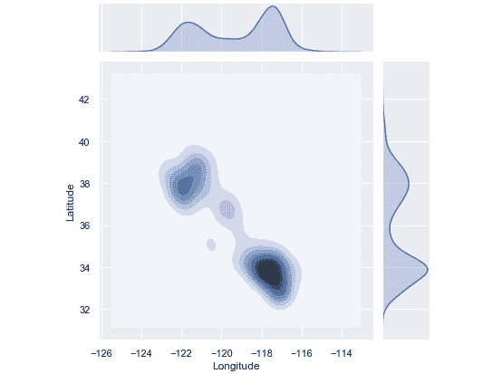

    ###### 图 9.19：包含二维估计密度以及 dfLess15 数据集的边际密度的联合图

    如果我们将这些结果叠加到加利福尼亚州的地图上，我们将看到热点位于南加州，包括洛杉矶和圣地亚哥，湾区，包括旧金山，以及在一定程度上被称为中央谷地的地区。这个`seaborn`图形的一个优点是，我们可以得到二维估计密度以及经度和纬度的边际密度。

1.  基于`HouseAge`特征创建另一个过滤后的数据框；这次仅保留`HouseAge`大于 40 的行，并将数据框命名为`dfMore40`。此外，移除所有列，保留经度和纬度。然后，打印数据框的前五行：

    ```py
    dfMore40 = df[df['HouseAge'] > 40.0]
    dfMore40 = dfMore40[['Latitude', 'Longitude']]
    print(
        "More Than 40 Years Dataframe Dimensions: {dims}"
        .format(dims=dfMore40.shape)
    )
    dfMore40.head()
    ```

    输出如下：

    

    ###### 图 9.20：过滤后的数据集顶部，仅包含`HouseAge`列中大于 40 的行

1.  重复*步骤 3*的过程，但这次使用新的过滤后的数据框：

    ```py
    seaborn.jointplot("Longitude", "Latitude", dfMore40, kind="kde")
    ```

    输出如下：

    

    ###### 图 9.21：包含二维估计密度以及 dfMore40 数据集的边际密度的联合图

    这个估算密度要紧凑得多，因为数据几乎完全聚集在两个区域。这些区域是洛杉矶和湾区。将其与*步骤 3*中的图形进行比较，我们注意到住房开发已经遍布全州。此外，新建住房开发在更多普查区块中出现的频率更高。

1.  我们再次创建一个新的过滤后的 DataFrame。这次仅保留`HouseAge`小于或等于 5 的行，并将该 DataFrame 命名为`dfLess5`。绘制`Population`和`MedInc`的散点图，方法如下：

    ```py
    dfLess5 = df[df['HouseAge'] <= 5]
    x_vals = dfLess5.Population.values
    y_vals = dfLess5.MedInc.values
    fig = plt.figure(figsize=(10, 10))
    plt.scatter(x_vals, y_vals, c='black')
    plt.xlabel('Population', fontsize=18)
    plt.ylabel('Median Income', fontsize=16)
    ```

    输出结果如下：

    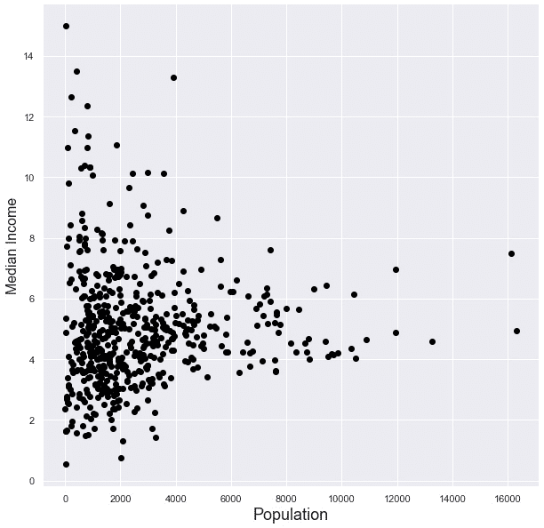

    ###### 图 9.22：中位收入与人口的散点图，HouseAge 列中的值为 5 或以下

1.  使用另一个`seaborn`函数来拟合核密度估计模型。同样，使用 Scott 规则找到最优带宽。重新绘制直方图并叠加估算密度，如下所示：

    ```py
    fig = plt.figure(figsize=(10, 10))
    ax = seaborn.kdeplot(
        x_vals, 
        y_vals,
        kernel='gau',
        cmap='Blues', 
        shade=True, 
        shade_lowest=False
    )
    plt.scatter(x_vals, y_vals, c='black', alpha=0.05)
    plt.xlabel('Population', fontsize=18)
    plt.ylabel('Median Income', fontsize=18)
    plt.title('Density Estimation With Scatterplot Overlay', size=18)
    ```

    输出结果如下：

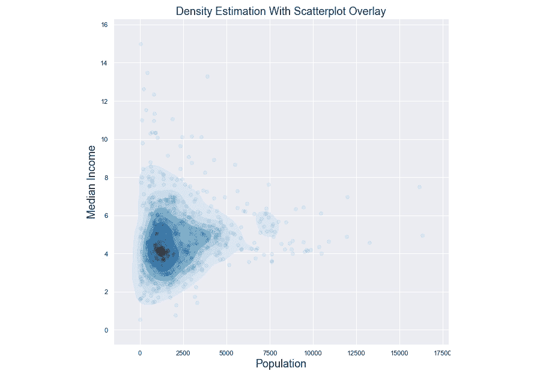

###### 图 9.23：与步骤 6 中创建的散点图相同，叠加了估算密度

在这里，估算密度显示，人口较少的普查区块比人口较多的普查区块更有可能拥有较低的中位收入，而不是较高的中位收入。本步骤的目的是展示如何在非位置数据上使用核密度估计。

在展示热点分析结果时，应当使用某种地图，因为热点分析通常是基于位置数据进行的。获取可以叠加估算密度的地图并不是一个简单的过程。由于版权问题，我们将使用非常基础的地图，称为底图，来叠加我们的估算密度。如何将本章获得的知识扩展到更复杂和详细的地图将留给你自己去做。地图环境的下载和安装可能也会很复杂且耗时。

### 练习 51：与底图一起工作

这个练习利用了`mpl_toolkits`中的`basemap`模块。`basemap`是一个地图绘制库，可以用来创建基础的地图或地理区域的轮廓。这些地图可以叠加核密度估计的结果，从而清晰地看到热点的位置。

首先，通过在 Jupyter Notebook 中运行`import mpl_toolkits.basemap`来检查`basemap`是否已安装。如果加载没有错误，那么你已经准备好了，无需进一步操作。如果调用失败，则使用`pip`安装`basemap`，方法是运行`python3 -m pip install basemap`。在重新启动任何已打开的 Notebook 之后，你应该就可以正常使用。请注意，`pip`安装只有在安装了 Anaconda 的情况下才有效。

本练习的目标是重新建模并重新绘制*练习 50*中位置数据的图表，使用`sklearn`的核密度估计功能和`basemap`的映射能力。从名为`dfLess15`的筛选后的 DataFrame 中提取经纬度值，如下所示：

1.  形成将要叠加估算密度的位置网格。位置网格是定义随机变量范围的一维向量的二维位置等价物，在练习 1 中已涉及。

    ```py
    xgrid15 = numpy.sort(list(dfLess15['Longitude']))
    ygrid15 = numpy.sort(list(dfLess15['Latitude']))
    x15, y15 = numpy.meshgrid(xgrid15, ygrid15)
    print("X Grid Component:\n{}\n".format(x15))
    print("Y Grid Component:\n{}\n".format(y15))
    xy15 = numpy.vstack([y15.ravel(), x15.ravel()]).T
    print("Grid:\n{}\n".format(xy15))
    ```

    输出如下：

    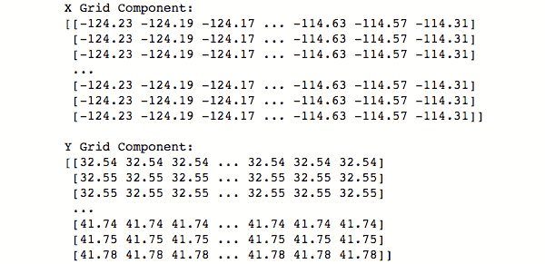

    ###### 图 9.24：表示 dfLess15 数据集的网格的 x 和 y 分量

1.  定义并拟合一个核密度估计模型。设置带宽值为 0.05，以节省运行时间；然后，为位置网格中的每个点创建似然值：

    ```py
    kde = sklearn.neighbors.KernelDensity(
        bandwidth=0.05, 
        metric='minkowski',
        kernel='gaussian', 
        algorithm='ball_tree'
    )
    kde.fit(dfLess15.values)
    log_density = kde.score_samples(xy15)
    density = numpy.exp(log_density)
    density = density.reshape(x15.shape)
    print("Shape of Density Values:\n{}\n".format(density.shape))
    ```

    注意，如果你打印出似然值的形状，它是 3,287 行和 3,287 列，总共有 10,804,369 个似然值。这与预设的经纬度网格（称为`xy15`）中的值数量相同。

1.  创建加利福尼亚州的轮廓，并叠加在*步骤 2*中估算的密度值上：

    ```py
    fig = plt.figure(figsize=(10, 10))
    fig.suptitle(
        """
        Density Estimation:
        Location of Housing Blocks
        Where the Median Home Age <= 15 Years
        """, 
        fontsize=16
    )
    the_map = mpl_toolkits.basemap.Basemap(
        projection='cyl',
        llcrnrlat=y15.min(), urcrnrlat=y15.max(),
        llcrnrlon=x15.min(),urcrnrlon=x15.max(),
        resolution='c'
    )
    the_map.drawcoastlines(linewidth=1)
    the_map.drawcountries(linewidth=1)
    the_map.drawstates(linewidth=1)
    levels = numpy.linspace(0, density.max(), 25)
    plt.contourf(x15, y15, density, levels=levels, cmap=plt.cm.Reds)
    plt.show()
    ```

    输出如下：

    

    ###### 图 9.25：将 dfLess15 的估算密度叠加到加利福尼亚州的轮廓上

    0.05 的值是故意设置为稍微过拟合数据的。你会注意到，与在*练习 50，使用 Seaborn 加载数据和建模*中组成密度的大型聚类不同，这里的估算密度由许多更小的聚类组成。这个稍微过拟合的密度可能比之前的版本更有帮助，因为它能更清楚地显示出高似然值的普查区块真正的位置。前一个密度中的一个高似然区域是南加州，但南加州是一个巨大的地区，拥有庞大的人口和许多市政区。请记住，在使用结果做出商业决策时，可能需要特定的精度级别，并且如果样本数据可以支持这样的结果，应该提供该精度或粒度。

1.  重复*步骤 1*，但使用`dfMore40` DataFrame：

    ```py
    xgrid40 = numpy.sort(list(dfMore40['Longitude']))
    ygrid40 = numpy.sort(list(dfMore40['Latitude']))
    x40, y40 = numpy.meshgrid(xgrid40, ygrid40)
    print("X Grid Component:\n{}\n".format(x40))
    print("Y Grid Component:\n{}\n".format(y40))
    xy40 = numpy.vstack([y40.ravel(), x40.ravel()]).T
    print("Grid:\n{}\n".format(xy40))
    ```

    输出如下：

    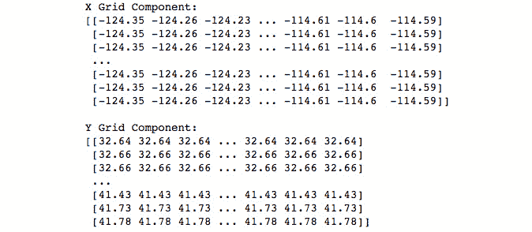

    ###### 图 9.26：表示 dfMore40 数据集的网格的 x 和 y 分量

1.  使用*步骤 4*中建立的网格，重复*步骤 2*：

    ```py
    kde = sklearn.neighbors.KernelDensity(
        bandwidth=0.05, 
        metric='minkowski',
        kernel='gaussian', 
        algorithm='ball_tree'
    )
    kde.fit(dfMore40.values)
    log_density = kde.score_samples(xy40)
    density = numpy.exp(log_density)
    density = density.reshape(x40.shape)
    print("Shape of Density Values:\n{}\n".format(density.shape))
    ```

1.  使用*步骤 3*中估算的密度值，重复操作：

    ```py
    fig = plt.figure(figsize=(10, 10))
    fig.suptitle(
        """
        Density Estimation:
        Location of Housing Blocks
        Where the Median Home Age > 40 Years
        """, 
        fontsize=16
    )
    the_map = mpl_toolkits.basemap.Basemap(
        projection='cyl',
        llcrnrlat=y40.min(), urcrnrlat=y40.max(),
        llcrnrlon=x40.min(),urcrnrlon=x40.max(),
        resolution='c'
    )
    the_map.drawcoastlines(linewidth=1)
    the_map.drawcountries(linewidth=1)
    the_map.drawstates(linewidth=1)
    levels = numpy.linspace(0, density.max(), 25)
    plt.contourf(x40, y40, density, levels=levels, cmap=plt.cm.Reds)
    plt.show()
    ```

    输出如下：

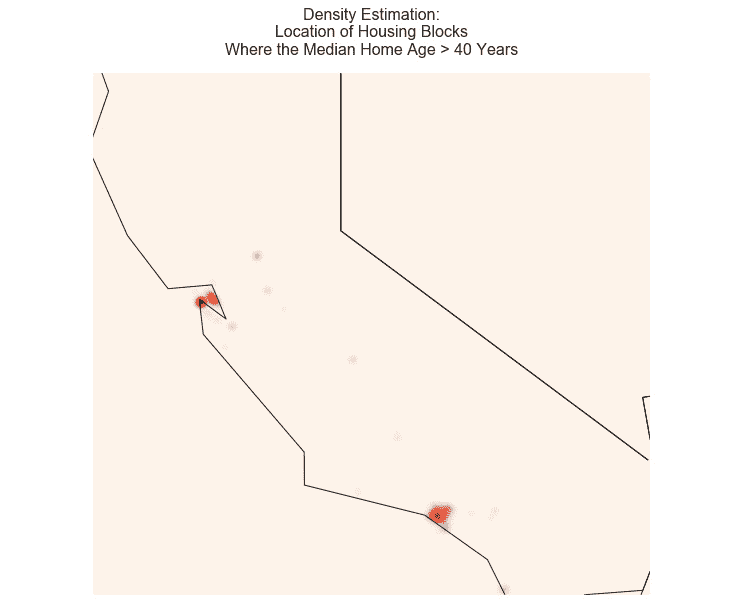

###### 图 9.27：将 dfMore40 的估算密度叠加到加利福尼亚州的轮廓上

这个估计密度是我们在*练习 50*中重新做的那个，*使用 Seaborn 加载数据和建模*。虽然*第 3 步*中的密度会为对房地产或人口普查感兴趣的人提供更多细节，但这个密度实际上与*练习 50*中的对应密度差别不大。聚类主要集中在洛杉矶和旧金山，几乎没有在其他地方出现数据点。

### 活动 22：伦敦犯罪分析

在此活动中，我们将对来自[`data.police.uk/data/`](https://data.police.uk/data/)的伦敦犯罪数据进行核密度估计的热点分析。由于处理地图数据的困难，我们将使用`seaborn`来可视化分析结果。不过，如果你觉得有信心并且能够运行*练习 51*中的所有图表，*与底图一起工作*，那么鼓励你尝试使用地图。

对这个犯罪数据进行热点分析的动机有两个方面。我们首先需要确定某些类型的犯罪在高概率区域发生的位置，以便能够最大化地分配警察资源。然后，作为后续分析，我们需要确定某些类型犯罪的热点是否随时间变化。这两个问题都可以通过核密度估计来回答。

#### 注意事项

这个数据集是从[`data.police.uk/data/`](https://data.police.uk/data/)下载的。

你可以从 Packt GitHub 下载，网址是[`github.com/TrainingByPackt/Applied-Unsupervised-Learning-with-Python/tree/master/Lesson09/Activity21-Activity22`](https://github.com/TrainingByPackt/Applied-Unsupervised-Learning-with-Python/tree/master/Lesson09/Activity21-Activity22)。

或者，为了直接从源下载数据，前往前面的警察网站，勾选**大都市警察局**，然后设置日期范围为**2018 年 7 月**至**2018 年 12 月**。接下来，点击**生成文件**，然后点击**立即下载**并将下载的文件命名为**metro-jul18-dec18**。确保你知道如何获取或能够找到下载目录的路径。

这个数据集包含根据开放政府许可证 v3.0 许可的公共部门信息。

以下是完成活动的步骤：

1.  加载犯罪数据。使用你保存下载目录的路径，创建年份-月份标签的列表，使用`read_csv`命令逐个加载文件，然后将这些文件合并在一起。

1.  打印完整（六个月）和合并数据集的诊断信息。

1.  将数据框架（DataFrame）缩小到四个变量（`经度`、`纬度`、`月份`和`犯罪类型`）。

1.  使用`seaborn`中的`jointplot`函数，为 2018 年 7 月、9 月和 12 月的自行车盗窃数据拟合并可视化三个核密度估计模型。

1.  重复*第 4 步*；这次，使用 2018 年 8 月、10 月和 11 月的商店盗窃犯罪数据。

1.  重复*第 5 步*；这次，使用 2018 年 7 月、10 月和 12 月的入室盗窃犯罪数据。

    *第 6 步* 的最后输出如下：

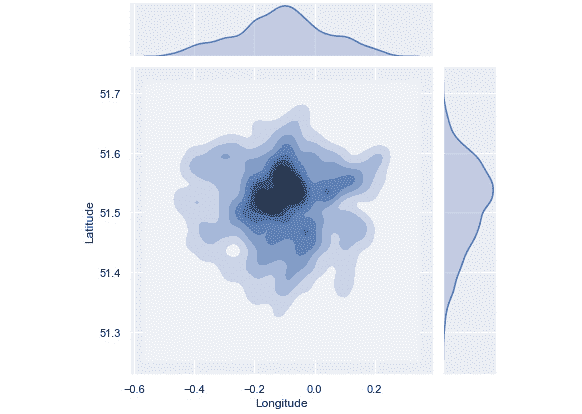

###### 图 9.28：2018 年 12 月入室盗窃的联合和边缘密度估计

再次强调，本活动中找到的密度应该在地图上叠加显示，以便我们能够看到这些密度覆盖的具体区域。如果您有合适的地图平台，请尝试自行叠加结果在地图上显示。如果没有，您可以访问在线地图服务，并使用经度和纬度对来获取关于具体位置的洞察。

#### 注意

此活动的解决方案可在第 377 页找到。

## 总结

核密度估计是一种经典的统计技术，与直方图技术属于同一类。它允许用户从样本数据中推断出对特定对象或事件的人群进行洞察和预测。这种推断以概率密度函数的形式呈现，这非常好，因为结果可以解读为概率或可能性。这个模型的质量取决于两个参数：带宽值和核函数。正如讨论的那样，成功利用核密度估计的关键组成部分是设置一个最佳的带宽值。最常用的方法是使用网格搜索交叉验证，以伪对数似然作为评分指标来确定最佳带宽。核密度估计的优点在于其简单性和适用性广泛。

在犯罪学、流行病学、气象学和房地产等多个领域中，经常可以找到核密度估计模型。无论您从事哪个领域的业务，核密度估计都应该适用。

在本书中，我们探讨了如何在 Python 库的支持下，使用无监督学习技术的最佳实践，并从非结构化数据中提取有意义的信息。现在，您可以自信地使用 Python 构建自己的模型。
