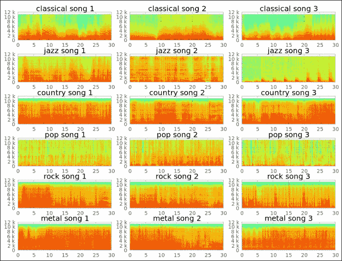
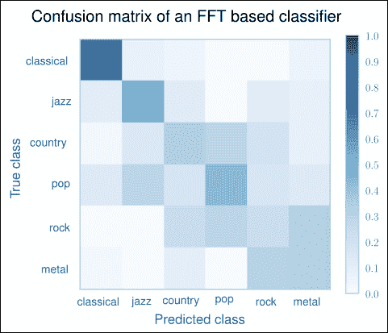
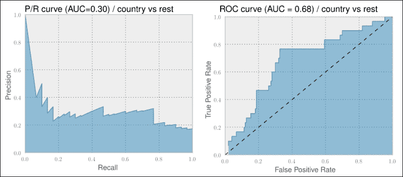
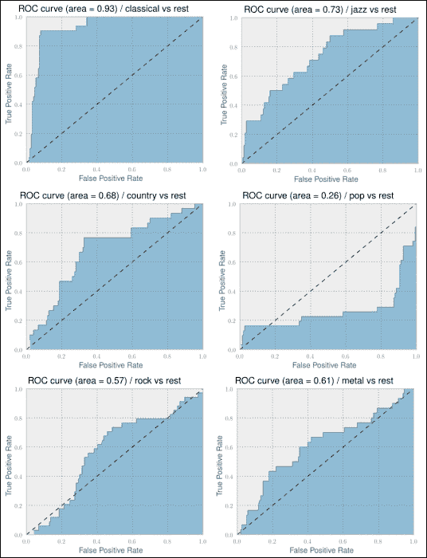
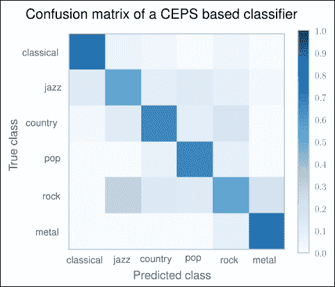

# 第九章 分类 – 音乐流派分类

到目前为止，我们的训练数据实例每个都可以通过一组特征值向量轻松描述。例如，在 Iris 数据集中，花卉是通过包含花的某些部分长度和宽度值的向量表示的。在基于文本的示例中，我们可以将文本转化为词袋表示，并手动创建自己的特征来捕捉文本中的某些方面。

在本章中，当我们尝试根据流派对歌曲进行分类时，情况将有所不同。例如，我们应该如何表示一首三分钟的歌曲呢？我们是否应该取 MP3 表示中的每个单独的比特？可能不是，因为将其视为文本并创建类似于“声音片段袋”的东西肯定会太复杂。然而，我们仍然必须将一首歌曲转换为一系列足够描述它的值。

# 绘制我们的路线图

本章将展示如何在一个超出我们舒适区的领域中构建一个合理的分类器。首先，我们将不得不使用基于声音的特征，这比我们之前使用的基于文本的特征复杂得多。接着，我们将学习如何处理多分类问题，而目前为止我们只遇到过二分类问题。此外，我们还将了解一些新的分类性能衡量方法。

假设我们遇到一个场景，在某种原因下，我们的硬盘中出现了一堆随机命名的 MP3 文件，假设这些文件包含音乐。我们的任务是根据音乐流派将它们分类到不同的文件夹中，比如爵士、古典、乡村、流行、摇滚和金属。

# 获取音乐数据

我们将使用 GTZAN 数据集，该数据集常用于基准测试音乐流派分类任务。它包含 10 个不同的流派，我们为了简单起见，只使用其中的 6 个：古典音乐、爵士乐、乡村音乐、流行音乐、摇滚乐和金属乐。该数据集包含每个流派 100 首歌曲的前 30 秒。我们可以从[`opihi.cs.uvic.ca/sound/genres.tar.gz`](http://opihi.cs.uvic.ca/sound/genres.tar.gz)下载数据集。

### 提示

这些音轨以 22,050 赫兹（每秒 22,050 次采样）单声道的 WAV 格式录制。

## 转换为 WAV 格式

事实证明，如果我们以后想要在私人 MP3 收藏中测试我们的分类器，我们可能无法提取太多有意义的信息。这是因为 MP3 是一种有损的音乐压缩格式，它会去除人耳无法感知的部分。这种格式对存储非常友好，因为使用 MP3，你可以在设备上存储更多的歌曲。但对于我们的任务来说，这就不太合适了。为了分类，我们使用 WAV 文件会更简单一些，因为它们可以被`scipy.io.wavfile`包直接读取。因此，如果我们希望使用分类器处理 MP3 文件，我们就必须将它们转换成 WAV 格式。

### 提示

如果你附近没有转换工具，你可以查看 [`sox.sourceforge.net`](http://sox.sourceforge.net)上的 SoX。它号称是声音处理的瑞士军刀，我们也同意这个**大胆的**说法。

将所有音乐文件保存为 WAV 格式的一个优点是，SciPy 工具包可以直接读取它：

```py
>>> sample_rate, X = scipy.io.wavfile.read(wave_filename)

```

`X`现在包含了样本，而`sample_rate`是它们被采样的速率。让我们利用这些信息，快速查看一些音乐文件，初步了解数据的样子。

# 查看音乐

获取不同风格歌曲“外观”的一种非常方便的方法是为一个风格的歌曲集绘制频谱图。频谱图是歌曲中频率的可视化表示。它在*y*轴上显示频率的强度，在*x*轴上显示特定时间间隔的强度。也就是说，颜色越深，某一时间窗口内该频率的强度越大。

Matplotlib 提供了一个方便的函数`specgram()`，它为我们执行了大部分底层计算和绘图工作：

```py
>>> import scipy
>>> from matplotlib.pyplot import specgram
>>> sample_rate, X = scipy.io.wavfile.read(wave_filename)
>>> print sample_rate, X.shape
22050, (661794,)
>>> specgram(X, Fs=sample_rate, xextent=(0,30))

```

我们刚刚读取的 WAV 文件的采样率为 22,050 Hz，包含 661,794 个样本。

如果我们现在为这些前 30 秒的不同 WAV 文件绘制频谱图，我们可以看到同一类型歌曲之间的共性，如下图所示：



仅从图像中，我们立刻能看出金属和古典歌曲在频谱上的差异。例如，金属歌曲在大部分频率范围内始终具有较高的强度（它们很有活力！），而古典歌曲则在时间上展示出更为多样化的模式。

应该可以训练一个分类器，以足够高的准确率区分至少金属与古典歌曲。然而，像乡村与摇滚这种其他音乐风格对比可能会更具挑战性。这对我们来说看起来像是一个真正的挑战，因为我们不仅需要区分两类，还要区分六类。我们需要能够合理地区分所有这些类别。

## 将音乐分解成正弦波分量

我们的计划是从原始样本数据（之前存储在`X`中的）中提取各个频率强度，并将它们输入分类器。这些频率强度可以通过应用所谓的**快速傅里叶变换**（**FFT**）来提取。由于傅里叶变换的理论超出了本章的范围，我们只看一个例子，直观地理解它的作用。稍后，我们将把它作为一个黑箱特征提取器。

例如，我们可以生成两个 WAV 文件，`sine_a.wav`和`sine_b.wav`，它们分别包含 400 Hz 和 3,000 Hz 的正弦波声音。前面提到的“瑞士军刀”SoX，就是实现这一目标的一种方法：

```py
$ sox --null -r 22050 sine_a.wav synth 0.2 sine 400
$ sox --null -r 22050 sine_b.wav synth 0.2 sine 3000

```

在接下来的图表中，我们绘制了它们的前 0.008 秒。下面我们可以看到正弦波的 FFT。毫不奇怪，我们在对应的正弦波下看到 400 Hz 和 3,000 Hz 的尖峰。

现在，让我们将两者混合，将 400 Hz 的声音音量设置为 3,000 Hz 的音量的一半：

```py
$ sox --combine mix --volume 1 sine_b.wav --volume 0.5 sine_a.wav sine_mix.wav

```

我们在合成声音的 FFT 图中看到两个尖峰，其中 3,000 Hz 的尖峰几乎是 400 Hz 的两倍大小。


对于真实的音乐，我们很快发现 FFT 不像前面的玩具示例那样漂亮：


# 使用 FFT 构建我们的第一个分类器

然而，我们现在可以使用 FFT 创建歌曲的某种音乐指纹。如果我们对几首歌曲这样做，并手动分配相应的音乐类型标签，我们就得到了可以输入到我们第一个分类器的训练数据。

## 提高实验灵活性

在深入分类器训练之前，让我们先思考一下实验的灵活性。尽管 FFT 中有“快”这个词，但它比我们在基于文本的章节中创建特征的速度要慢得多。而且由于我们仍处于实验阶段，我们可能想考虑如何加速整个特征创建过程。

当然，每次运行分类器时，创建每个文件的 FFT 都会是相同的。因此，我们可以缓存它，并读取缓存的 FFT 表示，而不是完整的 WAV 文件。我们通过`create_fft()`函数来实现这一点，后者又使用`scipy.fft()`来创建 FFT。为了简单起见（以及提高速度！），我们在这个示例中将 FFT 组件的数量固定为前 1,000 个。根据我们当前的知识，我们不知道这些是否是与音乐类型分类最相关的组件——只知道它们在前面的 FFT 示例中显示了最高的强度。如果以后我们想使用更多或更少的 FFT 组件，当然需要为每个音频文件重新创建 FFT 表示。

```py
import os
import scipy

def create_fft(fn):
 sample_rate, X = scipy.io.wavfile.read(fn)
 fft_features = abs(scipy.fft(X)[:1000])
 base_fn, ext = os.path.splitext(fn)
 data_fn = base_fn + ".fft"
 scipy.save(data_fn, fft_features)

```

我们使用 NumPy 的`save()`函数保存数据，该函数总是将`.npy`附加到文件名。每个 WAV 文件只需为训练或预测做一次此操作。

对应的 FFT 读取函数是`read_fft()`：

```py
import glob

def read_fft(genre_list, base_dir=GENRE_DIR):
 X = []
 y = []

 for label, genre in enumerate(genre_list):
 genre_dir = os.path.join(base_dir, genre, "*.fft.npy")
 file_list = glob.glob(genre_dir)

 for fn in file_list:
 fft_features = scipy.load(fn)

 X.append(fft_features[:1000])
 y.append(label)

 return np.array(X), np.array(y)

```

在我们的音乐目录中，我们预期以下音乐类型：

```py
genre_list = ["classical", "jazz", "country", "pop", "rock", "metal"]

```

## 训练分类器

让我们使用逻辑回归分类器，它已经在第六章中为我们提供了很好的效果，*分类 II - 情感分析*。增加的难度是，我们现在面临的是一个多类分类问题，而之前我们只需要区分两类。

需要提到的一个令人惊讶的方面是，从二分类问题切换到多分类问题时准确率的评估。在二分类问题中，我们已经了解到 50%的准确率是最差的情况，因为这个结果仅仅是通过随机猜测就能达到的。而在多分类设置下，50%的准确率可能已经很不错了。例如，在我们的六个类别中，随机猜测的结果大约只有 16.7%的准确率（假设类别大小相同）。

## 使用混淆矩阵来衡量多类问题中的准确性

在多类问题中，我们不仅要关注我们能多好地正确分类不同的类型。此外，我们还应该注意哪些类别之间我们存在混淆。这可以通过所谓的混淆矩阵来实现，如下所示：

```py
>>> from sklearn.metrics import confusion_matrix
>>> cm = confusion_matrix(y_test, y_pred)
>>> print(cm)
[[26  1  2  0  0  2]
 [ 4  7  5  0  5  3]
 [ 1  2 14  2  8  3]
 [ 5  4  7  3  7  5]
 [ 0  0 10  2 10 12]
 [ 1  0  4  0 13 12]]

```

该图展示了分类器对每个类别的测试集标签分布。对角线代表正确分类的结果。由于我们有六个类别，因此矩阵是六行六列。矩阵的第一行表示，对于 31 个古典音乐（第一行的总和），分类器预测了 26 个属于古典音乐，1 个属于爵士音乐，2 个属于乡村音乐，2 个属于金属音乐。对角线显示了正确分类的结果。在第一行中，我们看到，在（26+1+2+2）=31 首歌曲中，26 首被正确分类为古典音乐，5 首被误分类。实际上，这并不算太差。第二行则更为令人失望：在 24 首爵士歌曲中，只有 7 首被正确分类——也就是说，准确率只有 29%。

当然，我们遵循前几章中的训练/测试集拆分设置，因此我们实际上需要记录每个交叉验证折中的混淆矩阵。之后，我们需要对其进行平均和归一化处理，以便将结果的范围控制在 0（完全失败）和 1（全部分类正确）之间。

图形化的可视化通常比 NumPy 数组更易于阅读。matplotlib 的`matshow()`函数是我们的好朋友：

```py
from matplotlib import pylab

def plot_confusion_matrix(cm, genre_list, name, title):
 pylab.clf()
 pylab.matshow(cm, fignum=False, cmap='Blues', 
 vmin=0, vmax=1.0)

 ax = pylab.axes()    ax.set_xticks(range(len(genre_list)))
 ax.set_xticklabels(genre_list)
 ax.xaxis.set_ticks_position("bottom")
 ax.set_yticks(range(len(genre_list)))
 ax.set_yticklabels(genre_list)

 pylab.title(title)
 pylab.colorbar()
 pylab.grid(False)
 pylab.xlabel('Predicted class')
 pylab.ylabel('True class')
 pylab.grid(False)

 pylab.show()

```

### 提示

创建混淆矩阵时，请确保选择一个适当的颜色映射（`matshow()`的`cmap`参数），使得颜色的深浅变化能够立即显现其含义。尤其不推荐使用这些类型的图表的彩虹色图，比如 matplotlib 的默认`jet`色图，甚至`Paired`色图。

最终的图表看起来如下所示：



对于一个完美的分类器，我们期望从左上角到右下角呈现一条深色的对角线，其他区域则为浅色。在之前的图表中，我们可以立即看到我们的基于 FFT 的分类器离完美还有很大距离。它只正确预测了古典音乐（深色方块）。例如，对于摇滚音乐，它大多数时间都将标签预测为金属音乐。

显然，使用 FFT 点指向了正确的方向（古典音乐类别并不那么糟糕），但这还不足以得到一个不错的分类器。当然，我们可以调整 FFT 组件的数量（固定为 1,000）。但是在深入调整参数之前，我们应该先进行一些研究。结果表明，FFT 确实是一个不错的特征用于类别分类——只是它的精度还不够高。很快，我们将看到如何通过使用经过处理的 FFT 版本来提高分类性能。

然而，在我们进行这个分析之前，我们将学习另一种衡量分类性能的方法。

## 使用接收器操作特征（ROC）来衡量分类器性能的另一种方式

我们已经了解到，仅仅通过衡量准确率不足以真正评估一个分类器。相反，我们依赖于**精准率-召回率**（**P/R**）曲线来深入理解分类器的性能。

P/R 曲线有一个姐妹曲线，叫做**接收器操作特征**（**ROC**），它衡量分类器性能的相似方面，但提供了另一种分类性能的视角。两者的关键区别在于，P/R 曲线更适合于正类比负类更为重要，或者正类样本远少于负类样本的任务。信息检索和欺诈检测是典型的应用领域。另一方面，ROC 曲线则更好地展示了分类器整体表现。

为了更好地理解这些差异，假设我们来看一下先前训练的分类器在正确分类乡村歌曲方面的表现，如下图所示：



在左侧，我们可以看到 P/R 曲线。对于一个理想的分类器，我们希望看到的曲线是从左上角直接到右上角，再到右下角，从而形成一个面积（AUC）为 1.0 的曲线。

右侧的图展示了相应的 ROC 曲线。它绘制了真正例率与假正例率之间的关系。在这里，一个理想的分类器曲线应该从左下角走到左上角，然后到达右上角。而一个随机分类器则表现为从左下角到右上角的直线，如虚线所示，AUC 为 0.5。因此，我们不能将 P/R 曲线的 AUC 与 ROC 曲线的 AUC 进行比较。

独立于曲线，在比较同一数据集上两个不同分类器时，我们总是可以安全地假设，一个分类器的 P/R 曲线的 AUC 较高，也意味着其对应的 ROC 曲线的 AUC 较高，反之亦然。因此，我们通常不会生成两者。关于这一点的更多信息可以在 Davis 和 Goadrich（ICML，2006）撰写的非常有见地的论文《**精准率-召回率与 ROC 曲线的关系**》中找到。

以下表格总结了 P/R 曲线与 ROC 曲线之间的差异：

|   | x 轴 | y 轴 |
| --- | --- | --- |
| P/R |  |  |
| ROC |  |  |

看着这两条曲线的* x *轴和* y *轴的定义，我们可以看到，ROC 曲线的* y *轴上的真正阳性率与 P/R 图的* x *轴上的召回率是相同的。

假阳性率衡量被错误识别为阳性的真正负例的比例，在完美的情况下为 0（没有假阳性），否则为 1。与此对比，精准度则关注完全相反的内容，即我们正确分类为阳性的真正例的比例。

以后，让我们使用 ROC 曲线来衡量分类器的性能，以便更好地感知其效果。我们多类问题的唯一挑战是，ROC 和 P/R 曲线假设的是二分类问题。因此，为了我们的目的，我们将为每个音乐类型创建一张图表，展示分类器在一对其余类别分类中的表现：

```py
from sklearn.metrics import roc_curve

y_pred = clf.predict(X_test)

for label in labels:
 y_label_test = scipy.asarray(y_test==label, dtype=int)
 proba = clf.predict_proba(X_test)
 proba_label = proba[:,label] 

 # calculate false and true positive rates as well as the
 # ROC thresholds
 fpr, tpr, roc_thres = roc_curve(y_label_test, proba_label)

 # plot tpr over fpr ...

```

结果是以下六个 ROC 图。如我们已经发现的，我们的第一个版本的分类器只对古典歌曲表现良好。然而，查看个别的 ROC 曲线告诉我们，大部分其他类型的表现确实不佳。只有爵士乐和乡村音乐带来了一些希望。其余的类型显然无法使用。



# 使用梅尔频率倒谱系数提高分类性能

我们已经了解到，FFT 指向了正确的方向，但它本身不足以最终得到一个成功的分类器，能够将我们乱序的、包含多种音乐类型的歌曲目录整理到各个单独的类型目录中。我们需要一个稍微更高级的版本。

此时，承认我们需要做更多的研究总是明智的。其他人可能曾面临类似的挑战，并且已经找到了新的方法，可能也能帮助我们。事实上，甚至每年都有一场专注于音乐类型分类的会议，由**国际音乐信息检索学会**（**ISMIR**）组织。显然，**自动音乐类型分类**（**AMGC**）已经成为音乐信息检索的一个成熟子领域。快速浏览一些 AMGC 的论文，我们看到有很多针对自动类型分类的工作，可能会帮助我们。

在许多研究中似乎成功应用的一个技术叫做梅尔频率倒谱系数（Mel Frequency Cepstral Coefficients）。**梅尔频率倒谱**（**MFC**）编码了声音的功率谱，即声音包含的每个频率的功率。它是通过对信号谱的对数进行傅里叶变换来计算的。如果这听起来太复杂，简单记住，“倒谱”这个名字源于“谱”（spectrum）一词的前四个字母倒过来。MFC 已被成功应用于语音和说话人识别。我们来看看它是否也能在我们的案例中发挥作用。

我们正处于一个幸运的情况，因为别人已经恰好需要这个并且发布了一个实现，叫做 Talkbox SciKit。我们可以从[`pypi.python.org/pypi/scikits.talkbox`](https://pypi.python.org/pypi/scikits.talkbox)安装它。之后，我们可以调用`mfcc()`函数来计算 MFC 系数，方法如下：

```py
>>> from scikits.talkbox.features import mfcc
>>> sample_rate, X = scipy.io.wavfile.read(fn)
>>> ceps, mspec, spec = mfcc(X)
>>> print(ceps.shape)
(4135, 13)

```

我们希望输入到分类器中的数据存储在`ceps`中，它包含了每个歌名为`fn`的歌曲的 4,135 帧的 13 个系数（`mfcc()`函数的`nceps`参数的默认值）。如果直接使用所有数据，会使分类器过载。相反，我们可以对每个系数在所有帧上进行平均。假设每首歌的开始和结束部分可能不如中间部分具有明显的音乐类型特征，我们也忽略了前后各 10%的数据。

```py
x = np.mean(ceps[int(num_ceps*0.1):int(num_ceps*0.9)], axis=0)

```

不出所料，我们将使用的基准数据集只包含每首歌的前 30 秒，因此我们不需要剪掉最后 10%。不过我们还是这么做了，以确保我们的代码可以在其他可能没有截断的数据集上运行。

类似于我们使用 FFT 的工作，我们当然也希望缓存一次生成的 MFCC 特征，并在每次训练分类器时读取它们，而不是每次都重新生成。

这导致了以下代码：

```py
def write_ceps(ceps, fn):
 base_fn, ext = os.path.splitext(fn)
 data_fn = base_fn + ".ceps"
 np.save(data_fn, ceps)
 print("Written to %s" % data_fn)

def create_ceps(fn):
 sample_rate, X = scipy.io.wavfile.read(fn)
 ceps, mspec, spec = mfcc(X)
 write_ceps(ceps, fn)

def read_ceps(genre_list, base_dir=GENRE_DIR):
 X, y = [], []
 for label, genre in enumerate(genre_list):
 for fn in glob.glob(os.path.join(
 base_dir, genre, "*.ceps.npy")):
 ceps = np.load(fn)
 num_ceps = len(ceps)
 X.append(np.mean(
 ceps[int(num_ceps*0.1):int(num_ceps*0.9)], axis=0))
 y.append(label)

 return np.array(X), np.array(y)

```

我们通过一个每首歌只使用 13 个特征的分类器得到了以下有希望的结果：


所有音乐类型的分类表现都有所提升。古典音乐和金属音乐的 AUC 几乎达到了 1.0。实际上，下面的混淆矩阵现在看起来好多了。我们可以清楚地看到对角线，显示出分类器在大多数情况下能够正确地分类各个音乐类型。这个分类器实际上相当适用于解决我们的初始任务。



如果我们想在这方面有所改进，这个混淆矩阵会迅速告诉我们需要关注的地方：非对角线位置的非白色区域。例如，我们在一个较暗的区域中错误地将摇滚歌曲标记为爵士乐，且这种错误有相当大的概率。要解决这个问题，我们可能需要更深入地研究这些歌曲，提取诸如鼓点模式和类似的音乐风格特征。然后——在浏览 ISMIR 论文时——我们还读到了一种名为**听觉滤波器带时域包络**（**AFTE**）的特征，似乎在某些情况下优于 MFCC 特征。或许我们也该看看它们？

好消息是，只要配备了 ROC 曲线和混淆矩阵，我们可以随时借用其他专家在特征提取器方面的知识，而无需完全理解它们的内部工作原理。我们的测量工具总是会告诉我们，何时方向正确，何时需要改变。当然，作为一个渴望学习的机器学习者，我们总会有一种模糊的感觉，觉得在特征提取器的黑箱中埋藏着一个激动人心的算法，正等着我们去理解。

# 总结

在本章中，我们在构建音乐类型分类器时完全走出了舒适区。由于对音乐理论没有深入理解，最初我们未能训练出一个合理准确地预测歌曲音乐类型的分类器。通过快速傅里叶变换（FFT）进行尝试失败。但随后，我们使用 MFC 特征创建了一个表现出真正可用性能的分类器。

在这两种情况下，我们使用的特征我们只是了解得足够多，知道如何以及在哪里将它们放入分类器设置中。一个失败了，另一个成功了。它们之间的区别在于，在第二种情况下，我们依赖的是领域专家创建的特征。

这完全没问题。如果我们主要关心结果，有时候我们只是需要走捷径——我们只需要确保这些捷径来自于特定领域的专家。而且，因为我们学会了如何在这个新的多类别分类问题中正确地衡量性能，所以我们能够充满信心地走这些捷径。

在下一章，我们将探讨如何将你在本书其余部分学到的技术应用到这种特定类型的数据中。我们将学习如何使用 mahotas 计算机视觉包，通过传统的图像处理功能来预处理图像。
