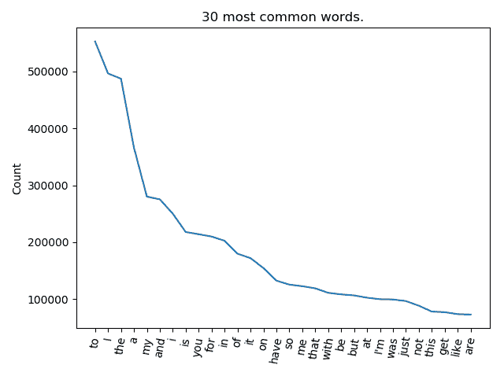
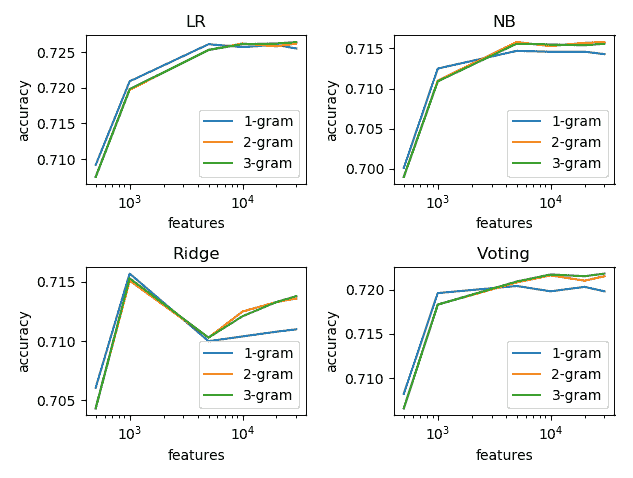

# 在 Twitter 上评估情感

Twitter 是一个非常受欢迎的社交网络，拥有超过 3 亿月活跃用户。该平台围绕简短的帖子（字符数量有限，目前限制为 280 个字符）开发。帖子本身称为推文。平均每秒发布 6000 条推文，相当于每年约 2000 亿条推文。这构成了一个庞大的数据量，包含了大量信息。显然，手动分析如此大量的数据是不可能的。因此，Twitter 和第三方都采用了自动化解决方案。最热门的话题之一是推文的情感分析，或者说用户对他们发布的主题的情感。情感分析有很多种形式。最常见的方法是对每条推文进行正面或负面分类。其他方法则涉及更复杂的正负面情感分析，如愤怒、厌恶、恐惧、快乐、悲伤和惊讶等。在本章中，我们将简要介绍一些情感分析工具和实践。接下来，我们将介绍构建一个利用集成学习技术进行推文分类的分类器的基础知识。最后，我们将看到如何通过使用 Twitter 的 API 实时分类推文。

本章将涵盖以下主题：

+   情感分析工具

+   获取 Twitter 数据

+   创建模型

+   实时分类推文

# 技术要求

你需要具备基本的机器学习技术和算法知识。此外，还需要了解 Python 的约定和语法。最后，熟悉 NumPy 库将极大帮助读者理解一些自定义算法实现。

本章的代码文件可以在 GitHub 上找到：

[`github.com/PacktPublishing/Hands-On-Ensemble-Learning-with-Python/tree/master/Chapter11`](https://github.com/PacktPublishing/Hands-On-Ensemble-Learning-with-Python/tree/master/Chapter11)

查看以下视频，了解代码的实际应用：[`bit.ly/2XSLQ5U`](http://bit.ly/2XSLQ5U)。

# 情感分析工具

情感分析可以通过多种方式实现。最容易实现和理解的方法是基于词典的方法。这些方法利用了极性单词和表达的词典列表。给定一个句子，这些方法会计算正面和负面单词及表达的数量。如果正面单词/表达的数量更多，则该句子被标记为正面。如果负面单词/表达比正面更多，则该句子被标记为负面。如果正面和负面单词/表达的数量相等，则该句子被标记为中性。虽然这种方法相对容易编码，并且不需要任何训练，但它有两个主要缺点。首先，它没有考虑单词之间的相互作用。例如，*not bad*，实际上是一个正面的表达，但可能被分类为负面，因为它由两个负面单词组成。即使该表达在词典中被归为正面，表达*not that bad*也可能没有包含在内。第二个缺点是整个过程依赖于良好和完整的词典。如果词典遗漏了某些单词，结果可能会非常糟糕。

另一种方法是训练一个机器学习模型来分类句子。为此，必须创建一个训练数据集，其中一些句子由人工专家标记为正面或负面。这个过程间接揭示了情感分析中的一个隐藏问题（也表明了其难度）。人类分析师在 80%到 85%的情况下达成一致。这部分是由于许多表达的主观性。例如，句子*今天天气很好，昨天很糟糕*，可以是正面、负面或中性。这取决于语调。假设**粗体**部分有语调，*今天天气很好，昨天很糟糕*是正面的，*今天天气很好，昨天很糟糕*是负面的，而*今天天气很好，昨天很糟糕*实际上是中性的（只是简单地观察天气变化）。

你可以在此链接阅读更多关于人类分析师在情感分类中分歧的问题：[`www.lexalytics.com/lexablog/sentiment-accuracy-quick-overview`](https://www.lexalytics.com/lexablog/sentiment-accuracy-quick-overview)。

为了从文本数据中创建机器学习特征，通常会创建 n-grams。N-grams 是从每个句子中提取的*n*个词的序列。例如，句子"Hello there, kids"包含以下内容：

+   1-grams: "Hello"，"there,"，"kids"

+   2-grams: "Hello there,"，"there, kids"

+   3-grams: "Hello there, kids"

为了为数据集创建数值特征，为每个唯一的 N-gram 创建一个特征。对于每个实例，特征的值取决于它在句子中出现的次数。例如，考虑以下玩具数据集：

| **句子** | **极性** |
| --- | --- |
| 我的头很痛 | 正面 |
| 食物很好吃 | 负面 |
| 刺痛很严重 | 正面 |
| 那是一个很棒的时光 | 负面 |

一个情感玩具数据集

假设我们只使用 1-gram（单字）。数据集中包含的唯一单字有：“My”，“head”，“hurts”，“The”，“food”，“was”，“good”，“sting”，“That”，“a”和“time”。因此，每个实例有 11 个特征。每个特征对应一个单元词（在本例中是单字）。每个特征的值等于该单元词在该实例中的出现次数。最终的数据集如下所示：

| **我的** | **头** | **疼** | **这** | **食物** | **很好** | **刺痛** | **那** | **一** | **时间** | **极性** |
| --- | --- | --- | --- | --- | --- | --- | --- | --- | --- | --- |
| 1 | 1 | 1 | 0 | 0 | 0 | 0 | 0 | 0 | 0 | 0 | 正面 |
| 0 | 0 | 0 | 1 | 2 | 1 | 1 | 0 | 0 | 0 | 0 | 负面 |
| 0 | 0 | 1 | 1 | 0 | 0 | 0 | 1 | 0 | 0 | 0 | 正面 |
| 0 | 0 | 0 | 0 | 0 | 1 | 1 | 0 | 1 | 1 | 1 | 负面 |

提取的特征数据集

通常，每个实例会被归一化，因此每个特征表示的是每个单元词的相对频率，而不是绝对频率（计数）。这种方法被称为**词频**（**TF**）。TF 数据集如下所示：

| **我的** | **头** | **疼** | **这** | **食物** | **很好** | **刺痛** | **那** | **一** | **时间** | **极性** |
| --- | --- | --- | --- | --- | --- | --- | --- | --- | --- | --- |
| 0.33 | 0.33 | 0.33 | 0 | 0 | 0 | 0 | 0 | 0 | 0 | 0 | 正面 |
| 0 | 0 | 0 | 0.2 | 0.4 | 0.2 | 0.2 | 0 | 0 | 0 | 0 | 负面 |
| 0 | 0 | 0.33 | 0.33 | 0 | 0 | 0 | 0.33 | 0 | 0 | 0 | 正面 |
| 0 | 0 | 0 | 0 | 0 | 0.2 | 0.2 | 0 | 0.2 | 0.2 | 0.2 | 负面 |

TF 数据集

在英语中，一些词语的出现频率非常高，但对表达情感的贡献很小。为了考虑这一事实，采用了**逆文档频率**（**IDF**）。IDF 更加关注不常见的词语。对于*N*个实例和*K*个唯一的单词，单词*u*的 IDF 值计算公式如下：


以下表格显示了 IDF 转换后的数据集：

| **我的** | **头** | **疼** | **这** | **食物** | **很好** | **刺痛** | **那** | **一** | **时间** | **极性** |
| --- | --- | --- | --- | --- | --- | --- | --- | --- | --- | --- |
| 0.6 | 0.6 | 0.3 | 0 | 0 | 0 | 0 | 0 | 0 | 0 | 0 | 正面 |
| 0 | 0 | 0 | 0.3 | 0.6 | 0.3 | 0.3 | 0 | 0 | 0 | 0 | 负面 |
| 0 | 0 | 0.3 | 0.3 | 0 | 0 | 0 | 0.6 | 0 | 0 | 0 | 正面 |
| 0 | 0 | 0 | 0 | 0 | 0.3 | 0.3 | 0 | 0.6 | 0.6 | 0.6 | 负面 |

IDF 数据集

# 词干提取

词干提取是情感分析中常用的另一种做法。它是将单词还原为词根的过程。这使得我们可以将来源于相同词根的单词作为同一个单元词处理。例如，*love*、*loving*和*loved*都会作为相同的单元词，*love*来处理。

# 获取 Twitter 数据

收集 Twitter 数据有多种方式。从网页抓取到使用自定义库，每种方式都有不同的优缺点。对于我们的实现，由于我们还需要情感标注，我们将使用 `Sentiment140` 数据集（[`cs.stanford.edu/people/alecmgo/trainingandtestdata.zip`](http://cs.stanford.edu/people/alecmgo/trainingandtestdata.zip)）。我们不收集自己的数据，主要是因为需要标注数据的时间。在本章的最后部分，我们将看到如何收集自己的数据并实时分析。该数据集包含 160 万条推文，包含以下 6 个字段：

+   推文的情感极性

+   数字 ID

+   推文的日期

+   用于记录推文的查询

+   用户的名字

+   推文的文本内容

对于我们的模型，我们只需要推文的文本和情感极性。如以下图表所示，共有 80 万个正面推文（情感极性为 4）和 80 万个负面推文（情感极性为 0）：


情感极性分布

在这里，我们还可以验证我们之前关于单词频率的说法。以下图表展示了数据集中最常见的 30 个单词。显然，它们没有表现出任何情感。因此，IDF 转换对我们的模型将更有帮助：



数据集中最常见的 30 个单词及其出现次数

# 创建模型

情感分析中最重要的步骤（就像大多数机器学习问题一样）是数据的预处理。以下表格包含从数据集中随机抽取的 10 条推文：

| **id** | **文本** |
| --- | --- |
| 44 | @JonathanRKnight 哎呀，我真希望我能在那儿看到... |
| 143873 | 胃部翻腾……天啊，我讨厌这个... |
| 466449 | 为什么他们拒绝把好东西放进我们的 v... |
| 1035127 | @KrisAllenmusic 访问这里 |
| 680337 | Rafa 退出温布尔登，因 BLG 感情失控... |
| 31250 | 官方宣布，打印机讨厌我，准备沉沦... |
| 1078430 | @_Enigma__ 很高兴听到这个 |
| 1436972 | 亲爱的 Photoshop CS2\. 我爱你，我想你！ |
| 401990 | 我的男朋友今天出了车祸！ |
| 1053169 | 生日快乐，威斯康星州！161 年前，你... |

数据集中的 10 个随机样本大纲

我们可以立即得出以下观察结果。首先，有对其他用户的引用，例如`@KrisAllenmusic`。这些引用并没有提供有关推文情感的信息。因此，在预处理过程中，我们将删除它们。其次，有数字和标点符号。这些也没有贡献推文的情感，因此它们也必须被删除。第三，部分字母是大写的，而其他字母则不是。由于大小写不会改变单词的情感，我们可以选择将所有字母转换为小写或大写。这确保像*LOVE*、*love*和*Love*这样的词将被视为相同的单元词。如果我们再取样更多推文，可以识别出更多问题。有话题标签（例如`#summer`），这些同样不贡献推文的情感。此外，还有网址链接（例如[`www.packtpub.com/eu/`](https://www.packtpub.com/eu/)）和 HTML 属性（如`&amp`对应`&`）。这些在预处理中也将被删除。

为了对数据进行预处理，首先，我们必须导入所需的库。我们将使用 pandas，Python 内置的正则表达式库`re`，`string`中的`punctuation`，以及**自然语言工具包**（**NLTK**）。可以通过`pip`或`conda`轻松安装`nltk`库，方法如下：

```py
import pandas as pd
import re
from nltk.corpus import stopwords
from nltk.stem import PorterStemmer
from string import punctuation
```

加载完库后，我们加载数据，将极性从*[0, 4]*更改为*[0, 1]*，并丢弃除了文本内容和极性之外的所有字段：

```py
# Read the data and assign labels
labels = ['polarity', 'id', 'date', 'query', 'user', 'text']
data = pd.read_csv("sent140.csv", names=labels)

# Keep only text and polarity, change polarity to 0-1
data = data[['text', 'polarity']]
data.polarity.replace(4, 1, inplace=True)
```

正如我们之前所看到的，许多单词并不对推文的情感产生影响，尽管它们在文本中经常出现。搜索引擎通过去除这些单词来处理此问题，这些单词被称为停用词。NLTK 提供了最常见的停用词列表，我们将利用该列表。此外，由于有一些停用词是缩写词（如"you're"和"don't"），而且推文中通常省略缩写词中的单引号，因此我们将扩展该列表，以包括没有单引号的缩写词（如"dont"）。

```py
# Create a list of stopwords
stops = stopwords.words("english")
# Add stop variants without single quotes
no_quotes = []
for word in stops:
    if "'" in word:
        no_quotes.append(re.sub(r'\'', '', word))
stops.extend(no_quotes)
```

然后我们定义了两个不同的函数。第一个函数`clean_string`通过删除我们之前讨论过的所有元素（如引用、话题标签等）来清理推文。第二个函数通过使用 NLTK 的`PorterStemmer`去除所有标点符号或停用词，并对每个单词进行词干化处理：

```py
def clean_string(string):
    # Remove HTML entities
    tmp = re.sub(r'\&\w*;', '', string)
    # Remove @user
    tmp = re.sub(r'@(\w+)', '', tmp)
    # Remove links
    tmp = re.sub(r'(http|https|ftp)://[a-zA-Z0-9\\./]+', '', tmp)
    # Lowercase
    tmp = tmp.lower()
    # Remove Hashtags
    tmp = re.sub(r'#(\w+)', '', tmp)
    # Remove repeating chars
    tmp = re.sub(r'(.)\1{1,}', r'\1\1', tmp)
    # Remove anything that is not letters
    tmp = re.sub("[^a-zA-Z]", " ", tmp)
    # Remove anything that is less than two characters
    tmp = re.sub(r'\b\w{1,2}\b', '', tmp)
    # Remove multiple spaces
    tmp = re.sub(r'\s\s+', ' ', tmp)
    return tmp

def preprocess(string):
    stemmer = PorterStemmer()
    # Remove any punctuation character
    removed_punc = ''.join([char for char in string if char not in punctuation])
    cleaned = []
    # Remove any stopword
    for word in removed_punc.split(' '):
        if word not in stops:
            cleaned.append(stemmer.stem(word.lower()))
    return ' '.join(cleaned)
```

由于我们希望比较集成模型与基学习器本身的性能，我们将定义一个函数，用于评估任何给定的分类器。定义我们数据集的两个最重要因素是我们将使用的 n-gram 和特征数量。Scikit-learn 提供了一个 IDF 特征提取器实现，即 `TfidfVectorizer` 类。这使得我们可以仅使用 *M* 个最常见的特征，并通过 `max_features` 和 `ngram_range` 参数定义我们将使用的 n-gram 范围。它创建了稀疏特征数组，这节省了大量内存，但结果必须在被 scikit-learn 分类器处理之前转换为普通数组。这可以通过调用 `toarray()` 函数来实现。我们的 `check_features_ngrams` 函数接受特征数量、最小和最大 n-gram 的元组，以及命名分类器的列表（名称，分类器元组）。它从数据集中提取所需的特征，并将其传递给嵌套的 `check_classifier`。该函数训练并评估每个分类器，并将结果导出到指定的文件 `outs.txt`：

```py
def check_features_ngrams(features, n_grams, classifiers):
    print(features, n_grams)

    # Create the IDF feature extractor
    tf = TfidfVectorizer(max_features=features, ngram_range=n_grams,
                         stop_words='english')

    # Create the IDF features
    tf.fit(data.text)
    transformed = tf.transform(data.text)
    np.random.seed(123456)

    def check_classifier(name, classifier):
        print('--'+name+'--')

        # Train the classifier
        x_data = transformed[:train_size].toarray()
        y_data = data.polarity[:train_size].values
        classifier.fit(x_data, y_data)
        i_s = metrics.accuracy_score(y_data, classifier.predict(x_data))

        # Evaluate on the test set
        x_data = transformed[test_start:test_end].toarray()
        y_data = data.polarity[test_start:test_end].values
        oos = metrics.accuracy_score(y_data, classifier.predict(x_data))

        # Export the results
        with open("outs.txt","a") as f:
            f.write(str(features)+',')
            f.write(str(n_grams[-1])+',')
            f.write(name+',')
            f.write('%.4f'%i_s+',')
            f.write('%.4f'%oos+'\n')

    for name, classifier in classifiers:
        check_classifier(name, classifier)
Finally, we test for n-grams in the range of [1, 3] and for the top 500, 1000, 5000, 10000, 20000, and 30000 features.

# Create csv header
with open("outs.txt","a") as f:
    f.write('features,ngram_range,classifier,train_acc,test_acc')
# Test all features and n-grams combinations
for features in [500, 1000, 5000, 10000, 20000, 30000]:
    for n_grams in [(1, 1), (1, 2), (1, 3)]:
    # Create the ensemble
        voting = VotingClassifier([('LR', LogisticRegression()),
                                   ('NB', MultinomialNB()),
                                    ('Ridge', RidgeClassifier())])
    # Create the named classifiers
    classifiers = [('LR', LogisticRegression()),
                    ('NB', MultinomialNB()),
                    ('Ridge', RidgeClassifier()),
                    ('Voting', voting)]
     # Evaluate them
     check_features_ngrams(features, n_grams, classifiers)
```

结果如下面的图表所示。如图所示，随着特征数量的增加，所有分类器的准确率都有所提高。此外，如果特征数量相对较少，单一的 unigram 优于 unigram 与 bigram/trigram 的组合。这是因为最常见的表达式往往没有情感色彩。最后，尽管投票法的表现相对令人满意，但仍未能超过逻辑回归：



投票法与基学习器的结果

# 实时分类推文

我们可以利用我们的模型通过 Twitter 的 API 实时分类推文。为了简化操作，我们将使用一个非常流行的 API 封装库 `tweepy`（[`github.com/tweepy/tweepy`](https://github.com/tweepy/tweepy)）。安装可以通过 `pip install tweepy` 很容易地完成。通过编程访问 Twitter 的第一步是生成相关的凭证。这可以通过访问 [`apps.twitter.com/`](https://apps.twitter.com/) 并选择“创建应用”来实现。申请过程简单，通常很快就会被接受。

使用 tweepy 的 `StreamListener`，我们将定义一个监听器类，当推文到达时，它会立即对其进行分类，并打印原始文本和预测的极性。首先，我们将加载所需的库。作为分类器，我们将使用之前训练的投票集成模型。首先，加载所需的库。我们需要 `json` 库，因为推文以 JSON 格式接收；还需要部分 `tweepy` 库以及之前使用过的 scikit-learn 组件。此外，我们将 API 密钥存储在变量中：

```py
import pandas as pd
import json
from sklearn.ensemble import VotingClassifier
from sklearn.feature_extraction.text import TfidfVectorizer
from sklearn.linear_model import LogisticRegression, RidgeClassifier
from sklearn.naive_bayes import MultinomialNB
from tweepy import OAuthHandler, Stream, StreamListener
# Please fill your API keys as strings
consumer_key="HERE,"
consumer_secret="HERE,"

access_token="HERE,"
access_token_secret="AND HERE"
```

接下来，我们创建并训练我们的`TfidfVectorizer`和`VotingClassifier`，使用 30,000 个特征和范围为*[1, 3]*的 n-gram：

```py
# Load the data
data = pd.read_csv('sent140_preprocessed.csv')
data = data.dropna()
# Replicate our voting classifier for 30.000 features and 1-3 n-grams
train_size = 10000
tf = TfidfVectorizer(max_features=30000, ngram_range=(1, 3),
                         stop_words='english')
tf.fit(data.text)
transformed = tf.transform(data.text)
x_data = transformed[:train_size].toarray()
y_data = data.polarity[:train_size].values
voting = VotingClassifier([('LR', LogisticRegression()),
                           ('NB', MultinomialNB()),
                           ('Ridge', RidgeClassifier())])
voting.fit(x_data, y_data)
```

接下来，我们定义`StreamClassifier`类，负责监听到达的推文并对其进行分类。它继承自`tweepy`的`StreamListener`类。通过重写`on_data`函数，我们可以在推文通过流到达时对其进行处理。推文以 JSON 格式到达，因此我们首先使用`json.loads(data)`解析它们，返回一个字典，然后使用`"text"`键提取文本。我们可以使用拟合好的`vectorizer`提取特征，并利用这些特征预测其情感：

```py
# Define the streaming classifier
class StreamClassifier(StreamListener):
    def __init__(self, classifier, vectorizer, api=None):
        super().__init__(api)
        self.clf = classifier
        self.vec = vectorizer
    # What to do when a tweet arrives
    def on_data(self, data):
        # Create a json object
        json_format = json.loads(data)
        # Get the tweet's text
        text = json_format['text']
        features = self.vec.transform([text]).toarray()
        print(text, self.clf.predict(features))
        return True
    # If an error occurs, print the status
    def on_error(self, status):
        print(status)
```

最后，我们实例化`StreamClassifier`，并将训练好的投票集成和`TfidfVectorizer`作为参数传入，使用`OAuthHandler`进行身份验证。为了启动流，我们实例化一个`Stream`对象，将`OAuthHandler`和`StreamClassifier`对象作为参数，并定义我们想要追踪的关键字`filter(track=['Trump'])`。在这个例子中，我们追踪包含关键字“特朗普”的推文，如下所示：

```py
# Create the classifier and authentication handlers
classifier = StreamClassifier(classifier=voting, vectorizer=tf)
auth = OAuthHandler(consumer_key, consumer_secret)
auth.set_access_token(access_token, access_token_secret)

# Listen for specific hashtags
stream = Stream(auth, classifier)
stream.filter(track=['Trump'])
```

就是这样！前面的代码现在可以实时追踪任何包含“特朗普”关键字的推文，并预测其情感。下表显示了一些简单的推文及其分类结果：

| **文本** | **情感** |
| --- | --- |
| **RT @BillyBaldwin**: 比我兄弟模仿特朗普还要好笑的只有两件事。你女儿模仿一个诚实正直的... | 消极 |
| **RT @danpfeiffer**: 这是民主党人必须阅读的一篇非常重要的文章。媒体报道特朗普的不当行为只是开始。这是... | 积极 |
| **RT @BillKristol**: "换句话说，特朗普把自己逼到了死角，而不是墨西哥。他们抓住了他。他不得不妥协。而且他确实妥协了。他去... | 积极 |
| **RT @SenJeffMerkley**: 尽管没有被提名，肯·库奇内利今天还是开始工作了，这是无法接受的。特朗普正在绕过参议院... | 消极 |

推文分类示例

# 总结

在本章中，我们讨论了使用集成学习对推文进行分类的可能性。虽然简单的逻辑回归可能优于集成学习技术，但它是自然语言处理领域的一个有趣入门，并且涉及到数据预处理和特征提取的技术。总的来说，我们介绍了 n-gram、IDF 特征提取、词干化和停用词移除的概念。我们讨论了清理数据的过程，并且训练了一个投票分类器，使用 Twitter 的 API 进行实时推文分类。

在下一章中，我们将看到如何在推荐系统的设计中利用集成学习，目的是向特定用户推荐电影。
