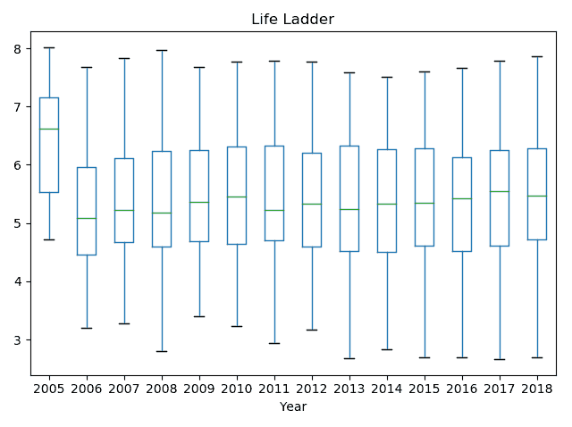
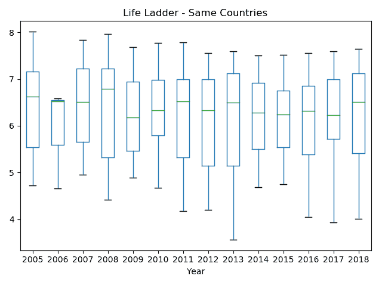
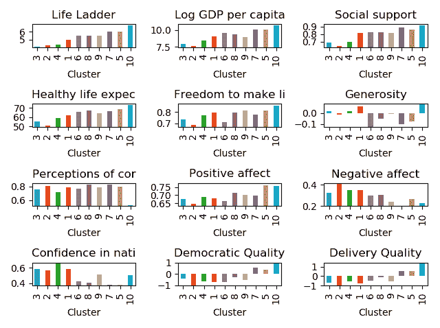

# 聚类世界幸福

在本书的最后一章，我们将利用集成聚类分析来探索全球幸福感的关系。为此，我们将使用 `OpenEnsembles` 库。首先，我们将展示数据及其目的。然后，我们将构建我们的集成模型。最后，我们将尝试深入了解数据中的结构和关系。

以下是本章将涵盖的主题：

+   理解《世界幸福报告》

+   创建集成模型

+   获得洞察

# 技术要求

你需要具备基本的机器学习技术和算法知识。此外，还需要了解 Python 语言的约定和语法。最后，熟悉 NumPy 库将大大有助于读者理解一些自定义算法实现。

本章的代码文件可以在 GitHub 上找到：

[`github.com/PacktPublishing/Hands-On-Ensemble-Learning-with-Python/tree/master/Chapter13`](https://github.com/PacktPublishing/Hands-On-Ensemble-Learning-with-Python/tree/master/Chapter13)

查看以下视频，了解代码的实际应用：[`bit.ly/2ShFsUm`](http://bit.ly/2ShFsUm)[.](http://bit.ly/2ShFsUm)

# 理解《世界幸福报告》

《世界幸福报告》是对各个国家幸福状况的调查。该报告源自联合国关于全球福祉和幸福感的会议。调查通过使用来自盖洛普世界调查的数据生成幸福排名，受访者会评估他们的整体生活质量（包含评价的变量是生活阶梯变量）。数据可以在*世界幸福报告*网站的下载部分找到（[`worldhappiness.report/ed/2019/`](https://worldhappiness.report/ed/2019/)）。除了生活阶梯之外，数据集还包含许多其他因素。我们将关注的因素如下：

+   人均 GDP 对数

+   社会支持

+   出生时的健康预期寿命

+   选择生活方式的自由

+   慷慨

+   腐败感知

+   积极情绪（幸福、笑声和享受的平均值）

+   负面情绪（担忧、悲伤和愤怒的平均值）

+   对国家政府的信任

+   民主质量（政府的民主程度）

+   政府效能（政府的执行力）

我们可以通过在散点图上查看每个因素如何影响生活阶梯。下图展示了每个因素（*x 轴*）与生活阶梯（*y 轴*）之间的散点图：


各种因素与生活阶梯的散点图

如图所示，**人均 GDP 对数**和**出生时的健康预期寿命**与生活阶梯的相关性最强且呈线性正相关。**民主质量**、**交付质量**、**选择生活方式的自由**、**积极情感**和**社会支持**也与生活阶梯呈正相关。**消极情感**和**腐败感知**显示负相关，而**对国家政府的信任**则未显示出显著的相关性。通过检查每个因素与生活阶梯的皮尔逊**相关系数** (**r**)，我们可以确认我们的视觉发现：

| **因素** | **相关系数** (**r**) |
| --- | --- |
| 人均 GDP 对数 | 0.779064 |
| 社会支持 | 0.702461 |
| 出生时的健康预期寿命 | 0.736797 |
| 选择生活方式的自由 | 0.520988 |
| 慷慨 | 0.197423 |
| 腐败感知 | -0.42075 |
| 积极情感 | 0.543377 |
| 消极情感 | -0.27933 |
| 对国家政府的信任 | -0.09205 |
| 民主质量 | 0.614572 |
| 交付质量 | 0.70794 |

每个因素与生活阶梯的相关系数

多年来，共有 165 个国家参与了调查。根据地理位置，这些国家被分为 10 个不同的区域。最新报告中各区域的国家分布可以通过以下饼图看到。显然，撒哈拉以南非洲、西欧以及中东欧地区包含的国家最多。这并不意味着这些地区人口最多，而仅仅是表示这些地区的独立国家数量最多：


2018 年各区域国家分布

最后，观察生活阶梯在各年中的进展会非常有趣。下图展示了 2005 年到 2018 年生活阶梯的变化情况。我们注意到，2005 年是一个得分异常高的年份，而其他年份的得分大致相同。考虑到没有全球性事件能够解释这一异常，我们推测数据收集过程中的某些因素可能影响了这一结果：



不同年份的生活阶梯箱线图

事实上，如果我们检查每年调查的国家数量，就会发现 2005 年的国家数量相较于其他年份非常少。2005 年仅有 27 个国家，而 2006 年有 89 个国家。这个数字一直增加，直到 2011 年，才趋于稳定：

| **年份** | **国家数量** |
| --- | --- |
| 2005 | 27 |
| 2006 | 89 |
| 2007 | 102 |
| 2008 | 110 |
| 2009 | 114 |
| 2010 | 124 |
| 2011 | 146 |
| 2012 | 142 |
| 2013 | 137 |
| 2014 | 145 |
| 2015 | 143 |
| 2016 | 142 |
| 2017 | 147 |
| 2018 | 136 |

每年调查的国家数量

如果我们只考虑最初的 27 个国家，箱线图显示了预期的结果。均值和偏差结果有一些波动；然而，平均而言，生活阶梯值围绕相同的数值分布。此外，如果我们将这些平均值与前一个箱线图的结果进行比较，我们会发现，平均来看，这 27 个国家比后来加入数据集的其他国家更幸福：



仅使用最初 2005 年数据集中包含的 27 个国家的箱线图

# 创建集成模型

为了创建集成模型，我们将使用我们在[第八章](https://cdp.packtpub.com/hands_on_ensemble_learning_with_python/wp-admin/post.php?post=36&action=edit#post_31)中介绍的`openensembles`库，*聚类*。由于我们的数据集没有标签，我们无法使用同质性评分来评估我们的聚类模型。相反，我们将使用轮廓系数（silhouette score），它评估每个聚类的凝聚性以及不同聚类之间的分离度。首先，我们必须加载数据集，这些数据存储在`WHR.csv`文件中。第二个文件`Regions.csv`包含每个国家所属的区域。我们将使用 2017 年的数据，因为 2018 年的数据缺失较多（例如，**交付质量**和**民主质量**完全缺失）。我们将使用数据集的中位数填充任何缺失的数据。对于我们的实验，我们将使用前面介绍的因素。为了便于引用，我们将它们存储在`columns`变量中。然后，我们继续生成 OpenEnsembles 的`data`对象：

```py
import matplotlib.pyplot as plt
import numpy as np
import openensembles as oe 
import pandas as pd

from sklearn import metrics

# Load the datasets
data = pd.read_csv('WHR.csv')
regs = pd.read_csv('Regions.csv')

# DATA LOADING SECTION START #
# Use the 2017 data and fill any NaNs
recents = data[data.Year == 2017]
recents = recents.dropna(axis=1, how="all")
recents = recents.fillna(recents.median())

# Use only these specific features
columns = ['Log GDP per capita',
 'Social support', 'Healthy life expectancy at birth',
 'Freedom to make life choices', 'Generosity',
 'Perceptions of corruption','Positive affect', 'Negative affect',
 'Confidence in national government', 'Democratic Quality',
 'Delivery Quality']

# Create the data object
cluster_data = oe.data(recents[columns], columns)
# DATA LOADING SECTION END #
```

为了创建我们的 K-means 集成模型，我们将测试多个*K*值和多个集成大小。我们将测试*K*值为 2、4、6、8、10、12 和 14，集成大小为 5、10、20 和 50。为了合并各个基础聚类，我们将使用共现连接（co-occurrence linkage），因为这是第八章中三种算法中最稳定的一种，*聚类*。我们将把结果存储在结果字典中，便于后续处理。最后，我们将从结果字典创建一个 pandas DataFrame，并将其排列成一个二维数组，其中每一行对应某个*K*值，每一列对应某个集成大小：

```py
np.random.seed(123456)
results = {'K':[], 'size':[], 'silhouette': []}
# Test different ensemble setups
Ks = [2, 4, 6, 8, 10, 12, 14]
sizes = [5, 10, 20, 50]
for K in Ks:
    for ensemble_size in sizes:
        ensemble = oe.cluster(cluster_data)
        for i in range(ensemble_size):
            name = f'kmeans_{ensemble_size}_{i}'
            ensemble.cluster('parent', 'kmeans', name, K)

        preds = ensemble.finish_co_occ_linkage(threshold=0.5)
        print(f'K: {K}, size {ensemble_size}:', end=' ')
        silhouette = metrics.silhouette_score(recents[columns], 
        preds.labels['co_occ_linkage'])
        print('%.2f' % silhouette)
        results['K'].append(K)
        results['size'].append(ensemble_size)
        results['silhouette'].append(silhouette)

results_df = pd.DataFrame(results)
cross = pd.crosstab(results_df.K, results_df['size'], 
results_df['silhouette'], aggfunc=lambda x: x)
```

结果如下面的表格所示。显而易见，随着*K*的增加，轮廓系数逐渐下降。此外，对于*K*值小于或等于六，似乎存在一定的稳定性。尽管如此，我们的数据未经任何预处理直接输入到聚类集成中。因此，距离度量可能会受到值较大的特征的支配：

| SizeK | 5 | 10 | 20 | 50 |
| --- | --- | --- | --- | --- |
| 2 | 0.618 | 0.618 | 0.618 | 0.618 |
| 4 | 0.533 | 0.533 | 0.533 | 0.533 |
| 6 | 0.475 | 0.475 | 0.475 | 0.475 |
| 8 | 0.396 | 0.398 | 0.264 | 0.243 |
| 10 | 0.329 | 0.248 | 0.282 | 0.287 |
| 12 | 0.353 | 0.315 | 0.327 | 0.350 |
| 14 | 0.333 | 0.309 | 0.343 | 0.317 |

来自不同 K 值和集成大小实验的结果

为了排除某些特征主导其他特征的可能性，我们将通过使用归一化特征以及**t-分布随机邻域嵌入**（**t-SNE**）变换后的特征重复实验。首先，我们将测试归一化特征。我们必须先减去均值，然后除以每个特征的标准差。使用标准的 pandas 函数可以轻松实现，如下所示：

```py
# DATA LOADING SECTION START #

# Use the 2017 data and fill any NaNs
recents = data[data.Year == 2017]
recents = recents.dropna(axis=1, how="all")
recents = recents.fillna(recents.median())

# Use only these specific features
columns = ['Log GDP per capita',
 'Social support', 'Healthy life expectancy at birth',
 'Freedom to make life choices', 'Generosity',
 'Perceptions of corruption','Positive affect', 'Negative affect',
 'Confidence in national government', 'Democratic Quality',
 'Delivery Quality']

# Normalize the features by subtracting the mean
# and dividing by the standard deviation
normalized = recents[columns]
normalized = normalized - normalized.mean()
normalized = normalized / normalized.std()

# Create the data object
cluster_data = oe.data(recents[columns], columns)
# DATA LOADING SECTION END #
```

然后，我们测试相同的*K*值和集成大小。如下表所示，结果与原始实验非常相似：

| SizeK | 5 | 10 | 20 | 50 |
| --- | --- | --- | --- | --- |
| 2 | 0.618 | 0.618 | 0.618 | 0.618 |
| 4 | 0.533 | 0.533 | 0.533 | 0.533 |
| 6 | 0.475 | 0.475 | 0.475 | 0.475 |
| 8 | 0.393 | 0.396 | 0.344 | 0.264 |
| 10 | 0.311 | 0.355 | 0.306 | 0.292 |
| 12 | 0.346 | 0.319 | 0.350 | 0.350 |
| 14 | 0.328 | 0.327 | 0.326 | 0.314 |

归一化数据的轮廓系数

最后，我们使用 t-SNE 作为预处理步骤重复实验。首先，我们通过`from sklearn.manifold import t_sne`导入 t-SNE。为了对数据进行预处理，我们调用`TSNE`的`fit_transform`函数，以下代码片段展示了这一过程。需要注意的是，`oe.data`现在的列名为`[0, 1]`，因为 t-SNE 默认只创建两个组件。因此，我们的数据将只有两列：

```py
# DATA LOADING SECTION START #

# Use the 2017 data and fill any NaNs
recents = data[data.Year == 2017]
recents = recents.dropna(axis=1, how="all")
recents = recents.fillna(recents.median())

# Use only these specific features
columns = ['Log GDP per capita',
 'Social support', 'Healthy life expectancy at birth',
 'Freedom to make life choices', 'Generosity',
 'Perceptions of corruption','Positive affect', 'Negative affect',
 'Confidence in national government', 'Democratic Quality',
 'Delivery Quality']

# Transform the data with TSNE
tsne = t_sne.TSNE()
transformed = pd.DataFrame(tsne.fit_transform(recents[columns]))
# Create the data object
cluster_data = oe.data(transformed, [0, 1])

# DATA LOADING SECTION END #
```

结果如下表所示。我们可以看到，对于某些值，t-SNE 的表现优于其他两种方法。我们特别关注*K*值为 10 的情况，因为数据集中有 10 个区域。在下一部分中，我们将尝试使用*K*值为 10 和集成大小为 20 来获取数据的洞察：

| SizeK | 5 | 10 | 20 | 50 |
| --- | --- | --- | --- | --- |
| 2 | 0.537 | 0.537 | 0.537 | 0.537 |
| 4 | 0.466 | 0.466 | 0.466 | 0.466 |
| 6 | 0.405 | 0.405 | 0.405 | 0.405 |
| 8 | 0.343 | 0.351 | 0.351 | 0.351 |
| 10 | 0.349 | 0.348 | 0.350 | 0.349 |
| 12 | 0.282 | 0.288 | 0.291 | 0.288 |
| 14 | 0.268 | 0.273 | 0.275 | 0.272 |

t-SNE 变换数据的轮廓系数

# 获取洞察

为了深入了解我们数据集的结构和关系，我们将使用 t-SNE 方法，集成大小为 20，基本的**k-近邻**（**k-NN**）聚类器，K 值设为 10。首先，我们创建并训练聚类。然后，我们将聚类结果添加到 DataFrame 中作为额外的 pandas 列。接着，我们计算每个聚类的均值，并为每个特征绘制柱状图：

```py
# DATA LOADING SECTION START #

# Use the 2017 data and fill any NaNs
recents = data[data.Year == 2017]
recents = recents.dropna(axis=1, how="all")
recents = recents.fillna(recents.median())

# Use only these specific features
columns = ['Log GDP per capita',
 'Social support', 'Healthy life expectancy at birth',
 'Freedom to make life choices', 'Generosity',
 'Perceptions of corruption','Positive affect', 'Negative affect',
 'Confidence in national government', 'Democratic Quality',
 'Delivery Quality']

# Transform the data with TSNE
tsne = t_sne.TSNE()
transformed = pd.DataFrame(tsne.fit_transform(recents[columns]))
# Create the data object
cluster_data = oe.data(transformed, [0, 1])

# DATA LOADING SECTION END #

# Create the ensemble
ensemble = oe.cluster(cluster_data)
for i in range(20):
    name = f'kmeans_{i}-tsne'
    ensemble.cluster('parent', 'kmeans', name, 10)

# Create the cluster labels
preds = ensemble.finish_co_occ_linkage(threshold=0.5)

# Add Life Ladder to columns
columns = ['Life Ladder', 'Log GDP per capita',
 'Social support', 'Healthy life expectancy at birth',
 'Freedom to make life choices', 'Generosity',
 'Perceptions of corruption','Positive affect', 'Negative affect',
 'Confidence in national government', 'Democratic Quality',
 'Delivery Quality']
# Add the cluster to the dataframe and group by the cluster
recents['Cluster'] = preds.labels['co_occ_linkage']
grouped = recents.groupby('Cluster')
# Get the means
means = grouped.mean()[columns]
# Create barplots
def create_bar(col, nc, nr, index):
    plt.subplot(nc, nr, index)    
    values = means.sort_values('Life Ladder')[col]
    mn = min(values) * 0.98
    mx = max(values) * 1.02
    values.plot(kind='bar', ylim=[mn, mx])
    plt.title(col[:18])

# Plot for each feature
plt.figure(1)
i = 1
for col in columns:
    create_bar(col, 4, 3, i)
    i += 1
plt.show()
```

条形图如下所示。聚类按照它们的平均生活阶梯值进行排序，以便于在各个特征之间做比较。如我们所见，聚类 3、2 和 4 的平均幸福感（生活阶梯）相当接近。同样，聚类 6、8、9、7 和 5 也有类似的情况。我们可以认为，聚类的集合只需要 5 个聚类，但通过仔细检查其他特征，我们发现情况并非如此：



每个特征的聚类均值条形图

通过观察*健康预期寿命*和*生活选择自由度*，我们可以看到，聚类 3 和 4 明显优于聚类 2。事实上，如果我们检查其他特征，会发现聚类 3 和 4 在平均水平上要比聚类 2 更幸运。也许可以有趣地看到每个国家如何分布在各个聚类中。下表显示了聚类分配情况。实际上，我们看到聚类 2、3 和 4 涉及的国家，近期不得不克服我们特征中没有体现的困难。事实上，这些国家是世界上最常遭受战争摧残的地区之一。从社会学角度来看，极为有趣的是，尽管这些战火纷飞、困境重重的地区展现出极其消极的民主和治理特质，它们似乎仍然对政府保持着极高的信任：

| **N** | **国家** |
| --- | --- |
| 1 | 柬埔寨、埃及、印度尼西亚、利比亚、蒙古、尼泊尔、菲律宾和土库曼斯坦 |
| 2 | 阿富汗、布基纳法索、喀麦隆、中非共和国、乍得、刚果（金）、几内亚、象牙海岸、莱索托、马里、莫桑比克、尼日尔、尼日利亚、塞拉利昂和南苏丹 |
| 3 | 贝宁、冈比亚、加纳、海地、利比里亚、马拉维、毛里塔尼亚、纳米比亚、南非、坦桑尼亚、多哥、乌干达、也门、赞比亚和津巴布韦 |
| 4 | 博茨瓦纳、刚果（布拉柴维尔）、埃塞俄比亚、加蓬、印度、伊拉克、肯尼亚、老挝、马达加斯加、缅甸、巴基斯坦、卢旺达和塞内加尔 |
| 5 | 阿尔巴尼亚、阿根廷、巴林、智利、中国、克罗地亚、捷克共和国、爱沙尼亚、黑山、巴拿马、波兰、斯洛伐克、美国和乌拉圭 |
| 6 | 阿尔及利亚、阿塞拜疆、白俄罗斯、巴西、多米尼加共和国、萨尔瓦多、伊朗、黎巴嫩、摩洛哥、巴勒斯坦地区、巴拉圭、沙特阿拉伯、土耳其和委内瑞拉 |
| 7 | 保加利亚、匈牙利、科威特、拉脱维亚、立陶宛、毛里求斯、罗马尼亚、中国台湾省 |
| 8 | 亚美尼亚、波斯尼亚和黑塞哥维那、哥伦比亚、厄瓜多尔、洪都拉斯、牙买加、约旦、马其顿、墨西哥、尼加拉瓜、秘鲁、塞尔维亚、斯里兰卡、泰国、突尼斯、阿联酋和越南 |
| 9 | 孟加拉国、玻利维亚、格鲁吉亚、危地马拉、哈萨克斯坦、科索沃、吉尔吉斯斯坦、摩尔多瓦、俄罗斯、塔吉克斯坦、特立尼达和多巴哥、乌克兰和乌兹别克斯坦 |
| 10 | 澳大利亚、奥地利、比利时、加拿大、哥斯达黎加、塞浦路斯、丹麦、芬兰、法国、德国、希腊、中国香港特别行政区、冰岛、爱尔兰、以色列、意大利、日本、卢森堡、马耳他、荷兰、新西兰、挪威、葡萄牙、新加坡、斯洛文尼亚、韩国、西班牙、瑞典、瑞士和英国 |

聚类分配

从聚类 1 开始，我们可以看到这些国家的人们幸福感明显优于之前的聚类。这可以归因于更高的预期寿命（战争较少）、更高的人均 GDP、社会支持、慷慨程度和对生活变动做出选择的自由。然而，这些国家的幸福感仍未达到最大化，主要是因为民主质量和交付质量存在问题。尽管如此，他们对政府的信任仅次于我们之前讨论的聚类组。聚类 6、8 和 9 的幸福感大体相当，它们的差异主要体现在人均 GDP、预期寿命、自由、慷慨和信任度上。我们可以看到，聚类 6 的经济和预期寿命相对较强，但自由度、慷慨程度以及政府效率似乎有所欠缺。聚类 8 和 9 的经济较弱，但似乎拥有更多的自由和运作更为高效的政府。此外，它们的慷慨程度，平均来说，超过了聚类 6。接下来是聚类 7 和 5，我们看到它们在幸福感方面也较为接近。这些国家的民主质量和交付质量较为积极，具备足够的自由、经济实力、社会支持和健康的预期寿命。这些国家是发达国家，人民普遍过着富裕的生活，不必担心因经济、政治或军事原因而死亡。这些国家的问题主要集中在对腐败的感知、人们对政府的信任以及政府的效率上。最后，聚类 10 包含了与世界其他地方相比几乎在各方面都更优秀的国家。这些国家的平均人均 GDP、预期寿命、慷慨程度和自由度都位居世界前列，同时对国家政府的信任度很高，腐败感知较低。如果有相符的文化背景，这些国家可以被视为理想的居住地。

# 总结

在这一章节中，我们介绍了《世界幸福报告》数据，提供了数据目的的描述，并描述了数据的属性。为了进一步深入理解数据，我们利用了集群分析，并结合了集成技术。我们使用了共现矩阵链接法来结合不同基础集群的集群分配。我们测试了不同的设置，包括不同的集成大小和邻居数量，以提供一个 k-NN 集成。在确定可以利用 t-SNE 分解，并且*K*值为 10 且基础集群数为 20 的情况下进行分析后，我们对集群分配进行了分析。我们发现报告相同幸福水平的国家实际上可能有不同的特征。这些最不幸福的国家通常是发展中国家，它们需要克服许多问题，既包括经济问题，也包括在某些情况下的战争问题。有趣的是，这些国家对政府最有信心，尽管这些政府被认为是功能失调的。属于中等幸福度集群的国家，要么有强大的经济但自由度较低，要么则反之。

经济强大、生活质量高的发达国家，尽管认为政府腐败，却未能获得最高的幸福得分。最后，唯一认为自己政府不腐败的国家，拥有最强的经济、民主与交付质量以及最长的预期寿命。这些国家大多属于欧盟或欧洲经济区，包括加拿大、澳大利亚、新西兰、日本、韩国、哥斯达黎加、以色列、香港和冰岛。

本书涵盖了大多数集成学习技术。在简短的机器学习回顾后，我们讨论了机器学习模型中出现的主要问题。这些问题是偏差和方差。集成学习技术通常试图通过生成方法和非生成方法来解决这些问题。我们讨论了非生成方法，如投票法和堆叠法，以及生成方法，如自助法、提升法和随机森林。此外，我们还介绍了可以用于创建聚类集成的方法，如多数投票法、图闭包法和共现链接法。最后，我们专门花了一些章节介绍了具体应用，以展示如何处理一些现实世界中的问题。如果这本书有需要强调的地方，那就是数据质量对模型性能的影响大于所使用的算法。因此，集成学习技术，如同任何机器学习技术一样，应当用于解决算法的弱点（即之前生成模型的弱点），而非数据质量差的问题。
