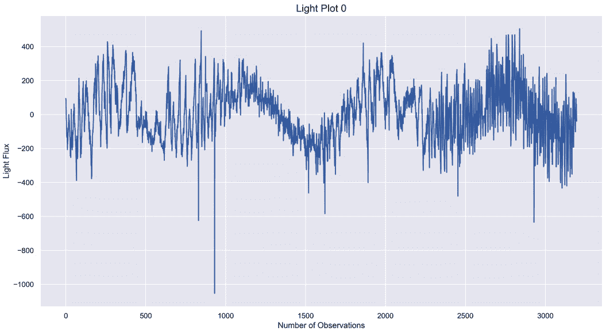

# *第七章*：利用 XGBoost 发现外星行星

在本章中，你将穿越星际，尝试使用`XGBClassifier`来发现外星行星。

本章的目的有两个。首先，掌握从头到尾使用 XGBoost 进行分析的实践经验非常重要，因为在实际应用中，这正是你通常需要做的事情。尽管你可能无法凭借 XGBoost 独立发现外星行星，但本章中你所实施的策略，包括选择正确的评分指标并根据该指标精心调整超参数，适用于 XGBoost 的任何实际应用。第二个原因是，本案例研究非常重要，因为所有机器学习从业者必须熟练处理不平衡数据集，这是本章的关键主题。

具体来说，你将掌握使用`scale_pos_weight`等技能。要从`XGBClassifier`中获得最佳结果，需要仔细分析数据的不平衡性，并明确手头的目标。在本章中，`XGBClassifier`是贯穿始终的核心工具，用来分析光数据并预测宇宙中的外星行星。

本章将涵盖以下主要内容：

+   寻找外星行星

+   分析混淆矩阵

+   重采样不平衡数据

+   调优和缩放 XGBClassifier

# 技术要求

本章的代码可以在[`github.com/PacktPublishing/Hands-On-Gradient-Boosting-with-XGBoost-and-Scikit-learn/tree/master/Chapter07`](https://github.com/PacktPublishing/Hands-On-Gradient-Boosting-with-XGBoost-and-Scikit-learn/tree/master/Chapter07)找到。

# 寻找外星行星

在本节中，我们将通过分析外星行星数据集来开始寻找外星行星。我们将在尝试通过绘制和观察光图来探测外星行星之前，提供外星行星发现的历史背景。绘制时间序列是一个有价值的机器学习技能，可以用来洞察任何时间序列数据集。最后，在揭示一个明显的缺陷之前，我们将利用机器学习做出初步预测。

## 历史背景

自古以来，天文学家就一直在从光线中收集信息。随着望远镜的出现，天文学知识在 17 世纪迎来了飞跃。望远镜与数学模型的结合使得 18 世纪的天文学家能够精确预测我们太阳系内的行星位置和日食现象。

在 20 世纪，天文学研究随着技术的进步和数学的复杂化不断发展。围绕其他恒星运转的行星——外星行星——被发现位于宜居区。位于宜居区的行星意味着该外星行星的位置和大小与地球相当，因此它可能存在液态水和生命。

这些外行星不是通过望远镜直接观测的，而是通过恒星光的周期性变化来推测的。周期性围绕一颗恒星旋转、足够大以阻挡可检测的恒光的一部分的物体，按定义是行星。从恒光中发现外行星需要在较长时间内测量光的波动。由于光的变化通常非常微小，因此很难判断是否确实存在外行星。

本章我们将使用 XGBoost 预测恒星是否有外行星。

## 外行星数据集

你在 *第四章*《从梯度提升到 XGBoost》中预览了外行星数据集，揭示了 XGBoost 在处理大数据集时相较于其他集成方法的时间优势。本章将更深入地了解外行星数据集。

这个外行星数据集来自于 *NASA Kepler 太空望远镜*，*第 3 次任务*，*2016 年夏季*。关于数据源的信息可以在 Kaggle 上找到，链接为 [`www.kaggle.com/keplersmachines/kepler-labelled-time-series-data`](https://www.kaggle.com/keplersmachines/kepler-labelled-time-series-data)。在数据集中的所有恒星中，5,050 颗没有外行星，而 37 颗有外行星。

超过 300 列和 5000 多行数据，总共有超过 150 万条数据点。当乘以 100 棵 XGBoost 树时，总共有 1.5 亿多个数据点。为了加速处理，我们从数据的一个子集开始。使用子集是处理大数据集时的常见做法，以节省时间。

`pd.read_csv` 包含一个 `nrows` 参数，用于限制行数。请注意，`nrows=n` 会选择数据集中的前 *n* 行。根据数据结构，可能需要额外的代码来确保子集能够代表整个数据集。我们开始吧。

导入 `pandas`，然后用 `nrows=400` 加载 `exoplanets.csv`。然后查看数据：

```py
import pandas as pd
df = pd.read_csv('exoplanets.csv', nrows=400)
df.head()
```

输出应如下所示：


图 7.1 – 外行星数据框

数据框下列出的大量列（**3198**列）是有道理的。在寻找光的周期性变化时，需要足够的数据点来发现周期性。我们太阳系内的行星公转周期从 88 天（水星）到 165 年（海王星）不等。如果要检测外行星，必须频繁检查数据点，以便不会错过行星在恒星前面经过的瞬间。

由于只有 37 颗外行星恒星，因此了解子集中包含了多少颗外行星恒星是很重要的。

`.value_counts()` 方法用于确定特定列中每个值的数量。由于我们关注的是 `LABEL` 列，可以使用以下代码查找外行星恒星的数量：

```py
df['LABEL'].value_counts()
```

输出如下所示：

```py
1    363 2     37 Name: LABEL, dtype: int64
```

我们的子集包含了所有的外行星恒星。如 `.head()` 所示，外行星恒星位于数据的开头。

## 绘制数据图表

期望的是，当外行星遮挡了恒星的光时，光通量会下降。如果光通量下降是周期性的，那么很可能是外行星在起作用，因为根据定义，行星是绕恒星运行的大型天体。

让我们通过绘图来可视化数据：

1.  导入`matplotlib`、`numpy`和`seaborn`，然后将`seaborn`设置为暗网格，如下所示：

    ```py
    import matplotlib.pyplot as plt
    import numpy as np
    import seaborn as sns
    sns.set()
    ```

    在绘制光变曲线时，`LABEL`列不感兴趣。`LABEL`列将作为我们机器学习的目标列。

    提示

    推荐使用`seaborn`来改进你的`matplotlib`图表。`sns.set()`默认设置提供了一个漂亮的浅灰色背景和白色网格。此外，许多标准图表，如`plt.hist()`，在应用 Seaborn 默认设置后看起来更加美观。有关 Seaborn 的更多信息，请访问[`seaborn.pydata.org/`](https://seaborn.pydata.org/)。

1.  现在，让我们将数据拆分为`X`（预测列，我们将绘制它们）和`y`（目标列）。请注意，对于外行星数据集，目标列是第一列，而不是最后一列：

    ```py
    X = df.iloc[:,1:]
    y = df.iloc[:,0]
    ```

1.  现在编写一个名为`light_plot`的函数，该函数以数据的索引（行号）为输入，将所有数据点绘制为*y*坐标（光通量），并将观测次数作为*x*坐标。图表应使用以下标签：

    ```py
    def light_plot(index):
        y_vals = X.iloc[index]
        x_vals = np.arange(len(y_vals))
        plt.figure(figsize=(15,8))
        plt.xlabel('Number of Observations')
        plt.ylabel('Light Flux')
        plt.title('Light Plot ' + str(index), size=15)
        plt.plot(x_vals, y_vals)
        plt.show()
    ```

1.  现在，调用函数绘制第一个索引。这颗恒星已被分类为外行星恒星：

    ```py
    light_plot(0)
    ```

    这是我们第一个光曲线图的预期图表：

    

    图 7.2 – 光曲线 0\. 存在周期性光通量下降

    数据中存在明显的周期性下降。然而，仅凭这张图表，无法明确得出有外行星存在的结论。

1.  做个对比，将这个图与第 37 个索引的图进行比较，后者是数据集中第一个非外行星恒星：

    ```py
    light_plot(37)
    ```

    这是第 37 个索引的预期图表：

    

    图 7.3 – 光曲线 37

    存在光强度的增加和减少，但不是贯穿整个范围。

    数据中确实存在明显的下降，但它们在整个图表中并不是周期性的。下降的频率并没有一致地重复。仅凭这些证据，还不足以确定是否存在外行星。

1.  这是外行星恒星的第二个光曲线图：

    ```py
    light_plot(1)
    ```

    这是第一个索引的预期图表：


图 7.4 – 明显的周期性下降表明存在外行星

图表显示出明显的周期性，且光通量有大幅下降，这使得外行星的存在极为可能！如果所有图表都如此清晰，机器学习就不再必要。正如其他图表所示，得出外行星存在的结论通常没有这么明确。

这里的目的是突出数据的特点以及仅凭视觉图表分类系外行星的难度。天文学家使用不同的方法来分类系外行星，而机器学习就是其中的一种方法。

尽管这个数据集是一个时间序列，但目标不是预测下一个时间单位的光通量，而是基于所有数据来分类恒星。在这方面，机器学习分类器可以用来预测给定的恒星是否有系外行星。这个思路是用提供的数据来训练分类器，进而用它来预测新数据中的系外行星。在本章中，我们尝试使用`XGBClassifier`来对数据中的系外行星进行分类。在开始分类数据之前，我们必须先准备数据。

## 准备数据

我们在前一节中已经看到，并非所有图表都足够清晰，无法仅凭图表来确定系外行星的存在。这正是机器学习可以大有帮助的地方。首先，让我们为机器学习准备数据：

1.  首先，我们需要确保数据集是数值型的且没有空值。使用`df.info()`来检查数据类型和空值：

    ```py
    df.info()
    ```

    这是预期的输出：

    ```py
    <class 'pandas.core.frame.DataFrame'>
    RangeIndex: 400 entries, 0 to 399
    Columns: 3198 entries, LABEL to FLUX.3197
    dtypes: float64(3197), int64(1)
    memory usage: 9.8 MB
    ```

    子集包含 3,197 个浮点数和 1 个整数，因此所有列都是数值型的。由于列数较多，因此没有提供关于空值的信息。

1.  我们可以对`.null()`方法使用`.sum()`两次，第一次是对每一列的空值求和，第二次是对所有列的空值求和：

    ```py
    df.isnull().sum().sum()
    ```

    预期的输出如下：

    ```py
    0
    ```

由于数据中没有空值，并且数据是数值型的，我们将继续进行机器学习。

## 初始的 XGBClassifier

要开始构建初始的 XGBClassifier，请按照以下步骤操作：

1.  导入`XGBClassifier`和`accuracy_score`：

    ```py
    from xgboost import XGBClassifier from sklearn.metrics import accuracy_score
    ```

1.  将模型拆分为训练集和测试集：

    ```py
    from sklearn.model_selection import train_test_split X_train, X_test, y_train, y_test = train_test_split(X, y, random_state=2)
    ```

1.  使用`booster='gbtree'`、`objective='binary:logistic'`和`random_state=2`作为参数构建并评分模型：

    ```py
    model = XGBClassifier(booster='gbtree', objective='binary:logistic', random_state=2)model.fit(X_train, y_train)y_pred = model.predict(X_test)score = accuracy_score(y_pred, y_test)print('Score: ' + str(score))
    ```

    评分如下：

    ```py
    Score: 0.89
    ```

正确分类 89%的恒星看起来是一个不错的起点，但有一个明显的问题。

你能弄明白吗？

假设你向天文学教授展示了你的模型。假设你的教授在数据分析方面受过良好训练，教授可能会回应：“我看到你得到了 89%的准确率，但系外行星仅占数据的 10%，那么你怎么知道你的结果不是比一个总是预测没有系外行星的模型更好呢？”

这就是问题所在。如果模型判断没有恒星包含系外行星，它的准确率将约为 90%，因为 10 颗恒星中有 9 颗不包含系外行星。

*对于不平衡的数据，准确度并不够。*

# 分析混淆矩阵

混淆矩阵是一个表格，用来总结分类模型的正确预测和错误预测。混淆矩阵非常适合分析不平衡数据，因为它提供了哪些预测正确，哪些预测错误的更多信息。

对于外行星子集，以下是完美混淆矩阵的预期输出：

```py
array([[88, 0],
       [ 0,  12]])
```

当所有正例条目都位于左对角线时，模型的准确度为 100%。在此情况下，完美的混淆矩阵预测了 88 个非外行星恒星和 12 个外行星恒星。请注意，混淆矩阵不提供标签，但在这种情况下，可以根据大小推断标签。

在深入细节之前，让我们使用 scikit-learn 查看实际的混淆矩阵。

## confusion_matrix

从 `sklearn.metrics` 导入 `confusion_matrix`，代码如下：

```py
from sklearn.metrics import confusion_matrix
```

使用 `y_test` 和 `y_pred` 作为输入运行 `confusion_matrix`（这些变量在上一部分中获得），确保将 `y_test` 放在前面：

```py
confusion_matrix(y_test, y_pred)
```

输出如下：

```py
array([[86, 2],
       [9,  3]])
```

混淆矩阵对角线上的数字揭示了 `86` 个正确的非外行星恒星预测，以及仅 `3` 个正确的外行星恒星预测。

在矩阵的右上角，数字 `2` 显示有两个非外行星恒星被误分类为外行星恒星。同样，在矩阵的左下角，数字 `9` 显示有 `9` 个外行星恒星被误分类为非外行星恒星。

横向分析时，88 个非外行星恒星中有 86 个被正确分类，而 12 个外行星恒星中只有 3 个被正确分类。

如你所见，混淆矩阵揭示了模型预测的重要细节，而准确度得分无法捕捉到这些细节。

## classification_report

在上一部分中混淆矩阵所揭示的各种百分比数值包含在分类报告（classification report）中。让我们查看分类报告：

1.  从 `sklearn.metrics` 导入 `classification_report`：

    ```py
    from sklearn.metrics import classification_report
    ```

1.  将 `y_test` 和 `y_pred` 放入 `classification_report` 中，确保将 `y_test` 放在前面。然后将 `classification_report` 放入全局打印函数中，以确保输出对齐且易于阅读：

    ```py
    print(classification_report(y_test, y_pred))
    ```

    这是预期的输出：

    ```py
                  precision    recall  f1-score   support
               1       0.91      0.98      0.94        88
               2       0.60      0.25      0.35        12
        accuracy                           0.89       100
       macro avg       0.75      0.61      0.65       100
    weighted avg       0.87      0.89      0.87       100
    ```

了解上述得分的含义很重要，让我们逐一回顾它们。

### 精确度（Precision）

精确度给出了正类预测（2s）中实际上是正确的预测。它在技术上是通过真正例和假正例来定义的。

#### 真正例（True Positives）

以下是关于真正例的定义和示例：

+   定义 – 正确预测为正类的标签数。

+   示例 – 2 被正确预测为 2。

#### 假正例（False Positives）

以下是关于假正例的定义和示例：

+   定义 – 错误地预测为负类的正标签数。

+   示例 – 对于外行星恒星，2 被错误地预测为 1。

精确度的定义通常以其数学形式表示如下：


这里，TP 代表真正例（True Positive），FP 代表假正例（False Positive）。

在外行星数据集中，我们有以下两种数学形式：


和


精确率给出了每个目标类的正确预测百分比。接下来，让我们回顾分类报告中揭示的其他关键评分指标。

### 召回率

召回率给出了你的预测发现的正样本的百分比。召回率是正确预测的正样本数量除以真正例加上假负例的总和。

#### 虚假负例

这里是虚假负例的定义和示例：

+   定义 – 错误预测为负类的标签数量。

+   示例 – 对于外行星星的预测，2 类被错误地预测为 1 类。

数学形式如下所示：


这里 TP 代表真正例（True Positive），FN 代表假负例（False Negative）。

在外行星数据集中，我们有以下内容：


和


召回率告诉你找到了多少正样本。在外行星的例子中，只有 25%的外行星被找到了。

### F1 分数

F1 分数是精确率和召回率的调和平均值。使用调和平均值是因为精确率和召回率基于不同的分母，调和平均值将它们统一起来。当精确率和召回率同等重要时，F1 分数是最优的。请注意，F1 分数的范围从 0 到 1，1 为最高分。

## 替代评分方法

精确率、召回率和 F1 分数是 scikit-learn 提供的替代评分方法。标准评分方法的列表可以在官方文档中找到：[`scikit-learn.org/stable/modules/model_evaluation.html`](https://scikit-learn.org/stable/modules/model_evaluation.html)。

提示

对于分类数据集，准确率通常不是最佳选择。另一种常见的评分方法是`roc_auc_score`，即接收者操作特征曲线下面积。与大多数分类评分方法一样，越接近 1，结果越好。更多信息请参见[`scikit-learn.org/stable/modules/generated/sklearn.metrics.roc_auc_score.html#sklearn.metrics.roc_auc_score`](https://scikit-learn.org/stable/modules/generated/sklearn.metrics.roc_auc_score.html#sklearn.metrics.roc_auc_score)。

选择评分方法时，了解目标至关重要。外行星数据集的目标是找到外行星。这一点是显而易见的。但并不明显的是，如何选择最佳评分方法以实现期望的结果。

想象两种不同的情境：

+   场景 1：机器学习模型预测的 4 颗外行星星中，实际为外行星的有 3 颗：3/4 = 75% 精确率。

+   场景 2：在 12 颗外行星星中，模型正确预测了 8 颗外行星星（8/12 = 66% 召回率）。

哪种情况更为理想？

答案是这取决于情况。召回率适合用于标记潜在的正样本（如外行星），目的是尽可能找到所有的正样本。精确率则适用于确保预测的正样本（外行星）确实是正样本。

天文学家不太可能仅仅因为机器学习模型说发现了外星行星就宣布这一发现。他们更可能在确认或否定这一发现之前，仔细检查潜在的外星行星，并根据额外的证据作出判断。

假设机器学习模型的目标是尽可能多地找到外星行星，召回率是一个极好的选择。为什么？召回率告诉我们找到了多少颗外星行星（例如：2/12、5/12、12/12）。让我们尝试找到所有的外星行星。

精确率说明

更高的精确率并不意味着更多的外星行星。例如，1/1 的召回率是 100%，但只发现了一颗外星行星。

### recall_score

如前一节所述，我们将使用召回率作为评分方法，针对外星行星数据集寻找尽可能多的外星行星。让我们开始吧：

1.  从`sklearn.metrics`导入`recall_score`：

    ```py
    from sklearn.metrics import recall_score
    ```

    默认情况下，`recall_score`报告的是正类的召回率，通常标记为`1`。在外星行星数据集中，正类标记为`2`，负类标记为`1`，这比较少见。

1.  为了获得外星行星的`recall_score`值，输入`y_test`和`y_pred`作为`recall_score`的参数，并设置`pos_label=2`：

    ```py
    recall_score(y_test, y_pred, pos_label=2)
    ```

    外星行星的评分如下：

    ```py
    0.25
    ```

这是由分类报告中召回率为`2`时给出的相同百分比，即外星行星。接下来，我们将不再使用`accuracy_score`，而是使用`recall_score`及其前述参数作为我们的评分指标。

接下来，让我们了解一下重新采样，它是改善失衡数据集得分的重要策略。

# 重新采样失衡数据

现在我们有了一个适当的评分方法来发现外星行星，接下来是探索如重新采样、欠采样和过采样等策略，以纠正导致低召回率的失衡数据。

## 重新采样

应对失衡数据的一种策略是重新采样数据。可以通过减少多数类的行数来进行欠采样，或通过重复少数类的行数来进行过采样。

## 欠采样

我们的探索从从 5,087 行中选取了 400 行开始。这是一个欠采样的例子，因为子集包含的行数比原始数据少。

我们来编写一个函数，使其能够按任意行数对数据进行欠采样。这个函数应该返回召回率评分，这样我们就能看到欠采样如何改变结果。我们将从评分函数开始。

### 评分函数

以下函数接收 XGBClassifier 和行数作为输入，输出外星行星的混淆矩阵、分类报告和召回率。

以下是步骤：

1.  定义一个函数`xgb_clf`，它接收`model`（机器学习模型）和`nrows`（行数）作为输入：

    ```py
    def xgb_clf(model, nrows):
    ```

1.  使用`nrows`加载 DataFrame，然后将数据分成`X`和`y`，并划分训练集和测试集：

    ```py
        df = pd.read_csv('exoplanets.csv', nrows=nrows)
        X = df.iloc[:,1:]
        y = df.iloc[:,0]
        X_train, X_test, y_train, y_test = train_test_split(X, y, random_state=2)
    ```

1.  初始化模型，将模型拟合到训练集，并使用 `y_test`、`y_pred` 和 `pos_label=2` 作为 `recall_score` 的输入对测试集进行评分：

    ```py
        model.fit(X_train, y_train)
        y_pred = xg_clf.predict(X_test)
        score = recall_score(y_test, y_pred, pos_label=2)
    ```

1.  打印混淆矩阵和分类报告，并返回评分：

    ```py
        print(confusion_matrix(y_test, y_pred))
        print(classification_report(y_test, y_pred))
        return score
    ```

现在，我们可以通过欠采样减少行数，并观察评分的变化。

### 欠采样 nrows

让我们先将 `nrows` 加倍至 `800`。这仍然是欠采样，因为原始数据集有 `5087` 行：

```py
xgb_clf(XGBClassifier(random_state=2), nrows=800)
```

这是预期的输出：

```py
[[189   1]
 [  9   1]]
              precision    recall  f1-score   support
           1       0.95      0.99      0.97       190
           2       0.50      0.10      0.17        10
    accuracy                           0.95       200
   macro avg       0.73      0.55      0.57       200
weighted avg       0.93      0.95      0.93       200
0.1
```

尽管非外行星星体的召回率几乎完美，但混淆矩阵显示只有 10 个外行星星体中的 1 个被召回。

接下来，将 `nrows` 从 `400` 减少到 `200`：

```py
xgb_clf(XGBClassifier(random_state=2), nrows=200)
```

这是预期的输出：

```py
[[37  0]
 [ 8  5]]
              precision    recall  f1-score   support
           1       0.82      1.00      0.90        37
           2       1.00      0.38      0.56        13
    accuracy                           0.84        50
   macro avg       0.91      0.69      0.73        50
weighted avg       0.87      0.84      0.81        50
```

这个结果稍微好一些。通过减少 `nrows`，召回率有所提高。

让我们看看如果我们精确平衡类会发生什么。由于有 37 个外行星星体，37 个非外行星星体就能平衡数据。

使用 `nrows=74` 运行 `xgb_clf` 函数：

```py
xgb_clf(XGBClassifier(random_state=2), nrows=74)
```

这是预期的输出：

```py
[[6 2]
 [5 6]]
              precision    recall  f1-score   support
           1       0.55      0.75      0.63         8
           2       0.75      0.55      0.63        11
    accuracy                           0.63        19
   macro avg       0.65      0.65      0.63        19
weighted avg       0.66      0.63      0.63        19
0.5454545454545454
```

尽管子集要小得多，但这些结果仍然令人满意。

接下来，让我们看看当我们应用过采样策略时会发生什么。

## 过采样

另一种重采样技术是过采样。与其删除行，过采样通过复制和重新分配正类样本来增加行数。

尽管原始数据集有超过 5000 行，但我们仍然使用 `nrows=400` 作为起点，以加快过程。

当 `nrows=400` 时，正类与负类样本的比例为 10:1。为了获得平衡，我们需要 10 倍数量的正类样本。

我们的策略如下：

+   创建一个新的 DataFrame，复制正类样本九次。

+   将新的 DataFrame 与原始数据框连接，得到 10:10 的比例。

在继续之前，需要做一个警告。如果在拆分数据集成训练集和测试集之前进行重采样，召回评分将会被夸大。你能看出为什么吗？

在重采样时，将对正类样本进行九次复制。将数据拆分为训练集和测试集后，复制的样本可能会同时出现在两个数据集中。因此，测试集将包含大多数与训练集相同的数据点。

合适的策略是先将数据拆分为训练集和测试集，然后再进行重采样。如前所述，我们可以使用 `X_train`、`X_test`、`y_train` 和 `y_test`。让我们开始：

1.  使用 `pd.merge` 按照左索引和右索引合并 `X_train` 和 `y_train`，如下所示：

    ```py
    df_train = pd.merge(y_train, X_train, left_index=True, right_index=True)
    ```

1.  使用 `np.repeat` 创建一个包含以下内容的 DataFrame，`new_df`：

    a) 正类样本的值：`df_train[df_train['LABEL']==2.values`。

    b) 复制的次数——在本例中为 `9`

    c) `axis=0` 参数指定我们正在处理列：

    ```py
    new_df = pd.DataFrame(np.repeat(df_train[df_train['LABEL']==2].values,9,axis=0))
    ```

1.  复制列名：

    ```py
    new_df.columns = df_train.columns
    ```

1.  合并 DataFrame：

    ```py
    df_train_resample = pd.concat([df_train, new_df])
    ```

1.  验证 `value_counts` 是否如预期：

    ```py
    df_train_resample['LABEL'].value_counts()
    ```

    预期的输出如下：

    ```py
    1.0    275
    2.0    250
    Name: LABEL, dtype: int64
    ```

1.  使用重采样后的 DataFrame 拆分 `X` 和 `y`：

    ```py
    X_train_resample = df_train_resample.iloc[:,1:]
    y_train_resample = df_train_resample.iloc[:,0]
    ```

1.  在重采样后的训练集上拟合模型：

    ```py
    model = XGBClassifier(random_state=2)
    model.fit(X_train_resample, y_train_resample)
    ```

1.  使用`X_test`和`y_test`对模型进行评分。将混淆矩阵和分类报告包括在结果中：

    ```py
    y_pred = model.predict(X_test)
    score = recall_score(y_test, y_pred, pos_label=2)
    print(confusion_matrix(y_test, y_pred))
    print(classification_report(y_test, y_pred))
    print(score)
    ```

    得分如下：

    ```py
    [[86  2]
     [ 8  4]]
                  precision    recall  f1-score   support
               1       0.91      0.98      0.95        88
               2       0.67      0.33      0.44        12
        accuracy                           0.90       100
       macro avg       0.79      0.66      0.69       100
    weighted avg       0.89      0.90      0.88       100
    0.3333333333333333
    ```

通过适当地留出测试集，过采样达到了 33.3%的召回率，这个得分是之前 17%的一倍，尽管仍然太低。

提示

`imblearn`，必须下载才能使用。我通过前面的重采样代码实现了与 SMOTE 相同的结果。

由于重采样的效果最多只能带来适度的提升，是时候调整 XGBoost 的超参数了。

# 调整和缩放 XGBClassifier

在本节中，我们将微调并缩放 XGBClassifier，以获得外星行星数据集的最佳`recall_score`值。首先，您将使用`scale_pos_weight`调整权重，然后运行网格搜索以找到最佳的超参数组合。此外，您将为不同的数据子集评分，然后整合并分析结果。

## 调整权重

在*第五章*，*XGBoost 揭秘*中，你使用了`scale_pos_weight`超参数来解决 Higgs 玻色子数据集中的不平衡问题。`scale_pos_weight`是一个用来调整*正*类权重的超参数。这里强调的*正*是非常重要的，因为 XGBoost 假设目标值为`1`的是*正*类，目标值为`0`的是*负*类。

在外星行星数据集中，我们一直使用数据集提供的默认值`1`为负类，`2`为正类。现在，我们将使用`.replace()`方法将其改为`0`为负类，`1`为正类。

### replace

`.replace()`方法可以用来重新分配值。以下代码在`LABEL`列中将`1`替换为`0`，将`2`替换为`1`：

```py
df['LABEL'] = df['LABEL'].replace(1, 0)
df['LABEL'] = df['LABEL'].replace(2, 1)
```

如果两行代码顺序颠倒，所有列值都会变成 0，因为所有的 2 都会变成 1，然后所有的 1 会变成 0。在编程中，顺序非常重要！

使用`value_counts`方法验证计数：

```py
df['LABEL'].value_counts()
```

这里是预期的输出：

```py
0    363
1     37
Name: LABEL, dtype: int64
```

正类现在标记为`1`，负类标记为`0`。

### scale_pos_weight

现在是时候构建一个新的`XGBClassifier`，并设置`scale_pos_weight=10`，以解决数据中的不平衡问题：

1.  将新的 DataFrame 拆分为`X`，即预测列和`y`，即目标列：

    ```py
    X = df.iloc[:,1:]
    y = df.iloc[:,0]
    ```

1.  将数据拆分为训练集和测试集：

    ```py
    X_train, X_test, y_train, y_test = train_test_split(X, y, random_state=2)
    ```

1.  构建、拟合、预测并评分`XGBClassifier`，设置`scale_pos_weight=10`。打印出混淆矩阵和分类报告以查看完整结果：

    ```py
    model = XGBClassifier(scale_pos_weight=10, random_state=2)
    model.fit(X_train, y_train)
    y_pred = model.predict(X_test)
    score = recall_score(y_test, y_pred)
    print(confusion_matrix(y_test, y_pred))
    print(classification_report(y_test, y_pred))
    print(score)
    ```

    这里是预期的输出：

    ```py
    [[86  2]
     [ 8  4]]
                  precision    recall  f1-score   support
               0       0.91      0.98      0.95        88
               1       0.67      0.33      0.44        12
        accuracy                           0.90       100
       macro avg       0.79      0.66      0.69       100
    weighted avg       0.89      0.90      0.88       100
    0.3333333333333333
    ```

结果与上一节的重采样方法相同。

我们从头开始实现的过采样方法给出的预测结果与`scale_pos_weight`的`XGBClassifier`一致。

## 调整 XGBClassifier

现在是时候看看超参数微调是否能够提高精度了。

在微调超参数时，标准做法是使用 `GridSearchCV` 和 `RandomizedSearchCV`。两者都需要进行两折或更多折的交叉验证。由于我们的初始模型效果不佳，并且在大型数据集上进行多折交叉验证计算成本高昂，因此我们尚未实施交叉验证。

一种平衡的方法是使用 `GridSearchCV` 和 `RandomizedSearchCV`，并采用两个折叠来节省时间。为了确保结果一致，推荐使用 `StratifiedKFold`（*第六章*， *XGBoost 超参数*）。我们将从基准模型开始。

### 基准模型

以下是构建基准模型的步骤，该模型实现了与网格搜索相同的 k 折交叉验证：

1.  导入 `GridSearchCV`、`RandomizedSearchCV`、`StratifiedKFold` 和 `cross_val_score`：

    ```py
    from sklearn.model_selection import GridSearchCV, RandomizedSearchCV, StratifiedKFold, cross_val_score
    ```

1.  将 `StratifiedKFold` 初始化为 `kfold`，参数为 `n_splits=2` 和 `shuffle=True`：

    ```py
    kfold = StratifiedKFold(n_splits=2, shuffle=True, random_state=2)
    ```

1.  使用 `scale_pos_weight=10` 初始化 `XGBClassifier`，因为负类样本是正类样本的 10 倍：

    ```py
    model = XGBClassifier(scale_pos_weight=10, random_state=2)
    ```

1.  使用 `cross_val_score` 对模型进行评分，参数为 `cv=kfold` 和 `score='recall'`，然后显示得分：

    ```py
    scores = cross_val_score(model, X, y, cv=kfold, scoring='recall')
    print('Recall: ', scores)
    print('Recall mean: ', scores.mean())
    ```

    分数如下：

    ```py
    Recall:  [0.10526316 0.27777778]
    Recall mean:  0.1915204678362573
    ```

使用交叉验证后，得分稍微差一些。当正例非常少时，训练集和测试集中的行的选择会产生差异。`StratifiedKFold` 和 `train_test_split` 的不同实现可能导致不同的结果。

### 网格搜索

我们将实现来自 *第六章* 的 `grid_search` 函数的一个变体， *XGBoost 超参数*，以便微调超参数：

1.  新函数将参数字典作为输入，同时还提供一个使用 `RandomizedSearchCV` 的随机选项。此外，`X` 和 `y` 被作为默认参数提供，用于其他子集，并且评分方法为召回率，具体如下：

    ```py
    def grid_search(params, random=False, X=X, y=y, model=XGBClassifier(random_state=2)): 
        xgb = model
        if random:
            grid = RandomizedSearchCV(xgb, params, cv=kfold, n_jobs=-1, random_state=2, scoring='recall')
        else:
            grid = GridSearchCV(xgb, params, cv=kfold, n_jobs=-1, scoring='recall')
        grid.fit(X, y)
        best_params = grid.best_params_
        print("Best params:", best_params)
        best_score = grid.best_score_
        print("Best score: {:.5f}".format(best_score))
    ```

1.  让我们运行不使用默认设置的网格搜索，试图提高得分。以下是一些初始的网格搜索及其结果：

    a) 网格搜索 1：

    ```py
    grid_search(params={'n_estimators':[50, 200, 400, 800]})
    ```

    结果：

    ```py
    Best params: {'n_estimators': 50}Best score: 0.19152
    ```

    b) 网格搜索 2：

    ```py
    grid_search(params={'learning_rate':[0.01, 0.05, 0.2, 0.3]})
    ```

    结果：

    ```py
    Best params: {'learning_rate': 0.01}
    Best score: 0.40351
    ```

    c) 网格搜索 3：

    ```py
    grid_search(params={'max_depth':[1, 2, 4, 8]})
    ```

    结果：

    ```py
    Best params: {'max_depth': 2}
    Best score: 0.24415
    ```

    d) 网格搜索 4：

    ```py
    grid_search(params={'subsample':[0.3, 0.5, 0.7, 0.9]})
    ```

    结果：

    ```py
    Best params: {'subsample': 0.5}
    Best score: 0.21637
    ```

    e) 网格搜索 5：

    ```py
    grid_search(params={'gamma':[0.05, 0.1, 0.5, 1]})
    ```

    结果：

    ```py
    Best params: {'gamma': 0.05}
    Best score: 0.24415
    ```

1.  改变 `learning_rate` 、`max_depth` 和 `gamma` 取得了提升。让我们通过缩小范围来尝试将它们组合起来：

    ```py
    grid_search(params={'learning_rate':[0.001, 0.01, 0.03], 'max_depth':[1, 2], 'gamma':[0.025, 0.05, 0.5]})
    ```

    分数如下：

    ```py
    Best params: {'gamma': 0.025, 'learning_rate': 0.001, 'max_depth': 2}
    Best score: 0.53509
    ```

1.  还值得尝试 `max_delta_step`，XGBoost 仅建议在不平衡数据集上使用。默认值为 0，增加步骤会导致模型更加保守：

    ```py
    grid_search(params={'max_delta_step':[1, 3, 5, 7]})
    ```

    分数如下：

    ```py
    Best params: {'max_delta_step': 1}
    Best score: 0.24415
    ```

1.  作为最终策略，我们通过在随机搜索中结合 `subsample` 和所有列样本：

    ```py
    grid_search(params={'subsample':[0.3, 0.5, 0.7, 0.9, 1], 
    'colsample_bylevel':[0.3, 0.5, 0.7, 0.9, 1], 
    'colsample_bynode':[0.3, 0.5, 0.7, 0.9, 1], 
    'colsample_bytree':[0.3, 0.5, 0.7, 0.9, 1]}, random=True)
    ```

    分数如下：

    ```py
    Best params: {'subsample': 0.3, 'colsample_bytree': 0.7, 'colsample_bynode': 0.7, 'colsample_bylevel': 1}
    Best score: 0.35380
    ```

不继续使用包含 `400` 行数据的这个数据子集，而是切换到包含 `74` 行数据的平衡子集（欠采样），以比较结果。

### 平衡子集

包含 `74` 行数据的平衡子集数据点最少，它也是测试最快的。

由于`X`和`y`最后一次是在函数内为平衡子集定义的，因此需要显式地定义它们。`X_short`和`y_short`的新定义如下：

```py
X_short = X.iloc[:74, :]
y_short = y.iloc[:74]
```

经过几次网格搜索后，结合`max_depth`和`colsample_bynode`给出了以下结果：

```py
grid_search(params={'max_depth':[1, 2, 3], 'colsample_bynode':[0.5, 0.75, 1]}, X=X_short, y=y_short, model=XGBClassifier(random_state=2)) 
```

分数如下：

```py
Best params: {'colsample_bynode': 0.5, 'max_depth': 2}
Best score: 0.65058
```

这是一个改进。

现在是时候在所有数据上尝试超参数微调了。

### 微调所有数据

在所有数据上实现`grid_search`函数的问题是时间。现在我们已经接近尾声，到了运行代码并在计算机“出汗”时休息的时刻：

1.  将所有数据读入一个新的 DataFrame，`df_all`：

    ```py
    df_all = pd.read_csv('exoplanets.csv')
    ```

1.  将 1 替换为 0，将 2 替换为 1：

    ```py
    df_all['LABEL'] = df_all['LABEL'].replace(1, 0)df_all['LABEL'] = df_all['LABEL'].replace(2, 1)
    ```

1.  将数据分为`X`和`y`：

    ```py
    X_all = df_all.iloc[:,1:]y_all = df_all.iloc[:,0]
    ```

1.  验证`'LABEL'`列的`value_counts`：

    ```py
    df_all['LABEL'].value_counts()
    ```

    输出如下：

    ```py
    0    5050 1      37 Name: LABEL, dtype: int64
    ```

1.  通过将负类除以正类来缩放权重：

    ```py
    weight = int(5050/37)
    ```

1.  使用`XGBClassifier`和`scale_pos_weight=weight`对所有数据进行基准模型评分：

    ```py
    model = XGBClassifier(scale_pos_weight=weight, random_state=2)
    scores = cross_val_score(model, X_all, y_all, cv=kfold, scoring='recall')
    print('Recall:', scores)
    print('Recall mean:', scores.mean())
    ```

    输出如下：

    ```py
    Recall: [0.10526316 0.        ]
    Recall mean: 0.05263157894736842
    ```

    这个分数很糟糕。可能是分类器在准确率上得分很高，尽管召回率很低。

1.  让我们尝试基于迄今为止最成功的结果优化超参数：

    ```py
    grid_search(params={'learning_rate':[0.001, 0.01]}, X=X_all, y=y_all, model=XGBClassifier(scale_pos_weight=weight, random_state=2)) 
    ```

    分数如下：

    ```py
    Best params: {'learning_rate': 0.001}
    Best score: 0.26316
    ```

    这比使用所有数据时的初始分数要好得多。

    让我们尝试结合超参数：

    ```py
    grid_search(params={'max_depth':[1, 2],'learning_rate':[0.001]}, X=X_all, y=y_all, model=XGBClassifier(scale_pos_weight=weight, random_state=2)) 
    ```

    分数如下：

    ```py
    Best params: {'learning_rate': 0.001, 'max_depth': 2}
    Best score: 0.53509
    ```

这已经有所改善，但不如之前对欠采样数据集的得分强。

由于在所有数据上的分数起始较低且需要更多时间，自然而然会产生一个问题。对于系外行星数据集，机器学习模型在较小的子集上是否表现更好？

让我们来看看。

## 整合结果

将不同的数据集进行结果整合是很棘手的。我们一直在处理以下子集：

+   5,050 行 – 大约 54%的召回率

+   400 行 – 大约 54%的召回率

+   74 行 – 大约 68%的召回率

获得的最佳结果包括`learning_rate=0.001`，`max_depth=2`和`colsample_bynode=0.5`。

让我们在*所有 37 个系外行星恒星*上训练一个模型。这意味着测试结果将来自模型已经训练过的数据点。通常，这不是一个好主意。然而，在这种情况下，正例非常少，看看模型如何在它以前没有见过的正例上进行测试，可能会很有启发。

以下函数以`X`、`y`和机器学习模型为输入。模型在提供的数据上进行拟合，然后对整个数据集进行预测。最后，打印出`recall_score`、`confusion matrix`和`classification report`：

```py
def final_model(X, y, model):
    model.fit(X, y)
    y_pred = model.predict(X_all)
    score = recall_score(y_all, y_pred,)
    print(score)
    print(confusion_matrix(y_all, y_pred,))
    print(classification_report(y_all, y_pred))
```

让我们为我们的三个子集运行函数。在三种最强的超参数中，事实证明`colsample_bynode`和`max_depth`给出了最佳结果。

从行数最少的地方开始，其中系外行星恒星和非系外行星恒星的数量相匹配。

### 74 行

让我们从 74 行开始：

```py
final_model(X_short, y_short, XGBClassifier(max_depth=2, colsample_by_node=0.5, random_state=2))
```

输出如下：

```py
1.0
[[3588 1462]
 [   0   37]]
              precision    recall  f1-score   support
           0       1.00      0.71      0.83      5050
           1       0.02      1.00      0.05        37
    accuracy                           0.71      5087
   macro avg       0.51      0.86      0.44      5087
weighted avg       0.99      0.71      0.83      5087
```

所有 37 颗外行星恒星都被正确识别，但 1462 颗非外行星恒星被错误分类！尽管召回率达到了 100%，但精确度只有 2%，F1 得分为 5%。仅仅调优召回率会带来低精度和低 F1 得分的风险。实际上，天文学家需要筛选出 1462 颗潜在的外行星恒星，才能找到这 37 颗。这是不可接受的。

现在让我们看看在 400 行数据上训练时会发生什么。

### 400 行

在 400 行数据的情况下，我们使用`scale_pos_weight=10`超参数来平衡数据：

```py
final_model(X, y, XGBClassifier(max_depth=2, colsample_bynode=0.5, scale_pos_weight=10, random_state=2))
```

输出结果如下：

```py
1.0
[[4901  149]
 [   0   37]]
              precision    recall  f1-score   support
           0       1.00      0.97      0.99      5050
           1       0.20      1.00      0.33        37
    accuracy                           0.97      5087
   macro avg       0.60      0.99      0.66      5087
weighted avg       0.99      0.97      0.98      5087
```

再次，所有 37 颗外行星恒星都被正确分类，达到了 100%的召回率，但 149 颗非外行星恒星被错误分类，精确度为 20%。在这种情况下，天文学家需要筛选出 186 颗恒星，才能找到这 37 颗外行星恒星。

最后，让我们在所有数据上进行训练。

### 5050 行

在所有数据的情况下，将`scale_pos_weight`设置为与先前定义的`weight`变量相等：

```py
final_model(X_all, y_all, XGBClassifier(max_depth=2, colsample_bynode=0.5, scale_pos_weight=weight, random_state=2))
```

输出结果如下：

```py
1.0
[[5050    0]
 [   0   37]]
              precision    recall  f1-score   support
           0       1.00      1.00      1.00      5050
           1       1.00      1.00      1.00        37
    accuracy                           1.00      5087
   macro avg       1.00      1.00      1.00      5087
weighted avg       1.00      1.00      1.00      5087
```

惊人。所有预测、召回率和精确度都完美达到了 100%。在这种高度理想的情况下，天文学家无需筛选不良数据，就能找到所有的外行星恒星。

但请记住，这些得分是基于训练数据，而非未见过的测试数据，而后者是构建强大模型的必要条件。换句话说，尽管模型完美地拟合了训练数据，但它不太可能对新数据进行良好的泛化。然而，这些数字仍然有价值。

根据这个结果，由于机器学习模型在训练集上表现出色，但在测试集上的表现最多只是适中，方差可能过高。此外，可能需要更多的树和更多轮次的精调，以便捕捉数据中的细微模式。

## 分析结果

在训练集上评分时，经过调优的模型提供了完美的召回率，但精确度差异较大。以下是关键要点：

+   仅使用精确度而不考虑召回率或 F1 得分，可能会导致次优模型。通过使用分类报告，能揭示更多细节。

+   不建议过度强调小子集的高得分。

+   当测试得分较低，而训练得分较高时，建议在不平衡数据集上使用更深的模型并进行广泛的超参数调优。

Kaggle 用户发布的公开笔记本中对内核的调查，位于[`www.kaggle.com/keplersmachines/kepler-labelled-time-series-data/kernels`](https://www.kaggle.com/keplersmachines/kepler-labelled-time-series-data/kernels)，展示了以下内容：

+   许多用户未能理解，尽管高准确率得分容易获得，但在高度不平衡的数据下，它几乎没有意义。

+   发布精确度的用户通常发布的是 50%到 70%之间的数据，而发布召回率的用户通常发布的是 60%到 100%之间（一个 100%召回率的用户精确度为 55%），这表明了该数据集的挑战和局限性。

当您向天文学教授展示您的结果时，您已经更加了解不平衡数据的局限性，您得出结论，您的模型最佳的召回率为 70%，而 37 颗外行星恒星不足以构建一个强大的机器学习模型来寻找其他行星上的生命。然而，您的 XGBClassifier 将使天文学家和其他经过数据分析训练的人能够使用机器学习来决定在宇宙中应集中关注哪些恒星，以发现下一个处于轨道上的外行星。

# 总结

在这一章中，您使用外行星数据集对宇宙进行了调查，旨在发现新的行星，甚至可能发现新的生命。您构建了多个 XGBClassifier 来预测外行星恒星是否由光的周期性变化所引起。在仅有 37 颗外行星恒星和 5,050 颗非外行星恒星的情况下，您通过欠采样、过采样和调整 XGBoost 超参数（包括 `scale_pos_weight`）来纠正数据的不平衡。

您使用混淆矩阵和分类报告分析了结果。您学习了各种分类评分指标之间的关键差异，并且理解了为什么在外行星数据集中，准确率几乎没有价值，而高召回率是理想的，尤其是当与高精度结合时，能够得到一个好的 F1 分数。最后，您意识到，当数据极其多样化且不平衡时，机器学习模型的局限性。

通过这个案例研究，您已具备了使用 XGBoost 完整分析不平衡数据集所需的背景知识和技能，掌握了 `scale_pos_weight`、超参数微调和替代分类评分指标的使用。

在下一章中，您将通过应用不同于梯度提升树的其他 XGBoost 基学习器，大大扩展您对 XGBoost 的应用范围。尽管梯度提升树通常是最佳选择，但 XGBoost 配备了线性基学习器、DART 基学习器，甚至是随机森林，接下来都会介绍！
