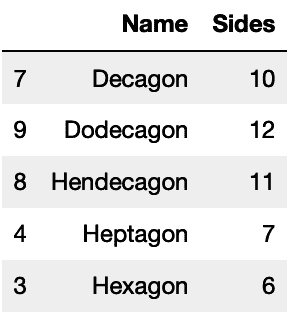
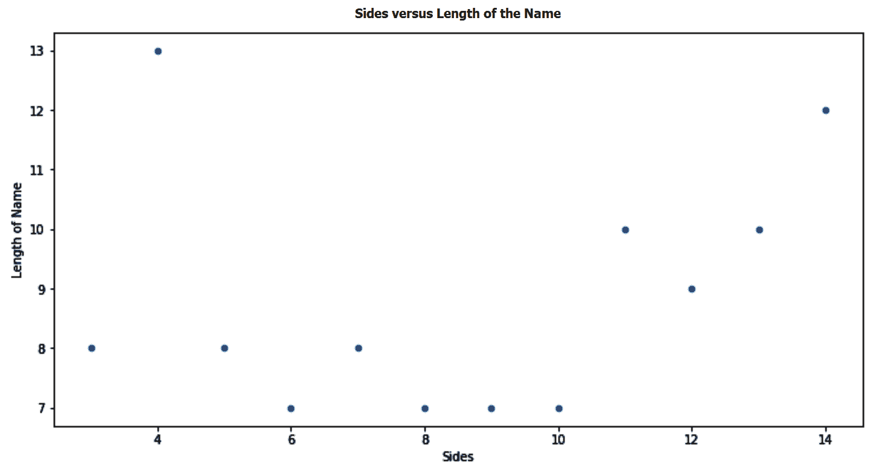

# 机器学习介绍

机器学习无处不在。当您预订航班机票时，算法决定您将支付的价格。当您申请贷款时，机器学习可能决定您是否能获得贷款。当您滚动查看 Facebook 的时间线时，它会选择向您展示哪些广告。机器学习还在您的 Google 搜索结果中起着重要作用。它整理您的电子邮件收件箱并过滤垃圾邮件，在您申请工作时，招聘人员查看您的简历之前，它也会进行审阅，而且最近它还开始在 Siri 等虚拟助手形式中扮演您的个人助理的角色。

在这本书中，我们将学习机器学习的理论和实践。我们将了解何时以及如何应用它。首先，我们将高层次介绍机器学习的工作原理。然后，您将能够区分不同的机器学习范式，并知道何时使用每种范式。接下来，您将了解模型开发生命周期以及从业者解决问题所采取的不同步骤。最后，我们将向您介绍 scikit-learn，并了解为什么它是许多从业者的*事实标准*工具。

这是本书第一章将涵盖的主题列表：

+   理解机器学习

+   模型开发生命周期

+   scikit-learn 简介

+   安装您需要的软件包

# 理解机器学习

您可能想知道机器是如何学习的。为了回答这个问题，让我们来看一个虚构公司的例子。**太空穿梭公司**有几辆太空车可供租赁。他们每天收到来自想要去火星旅行的客户的申请。他们不确定这些客户是否会归还车辆 —— 也许他们会决定继续在火星上生活，永远不会回来。更糟糕的是，一些客户可能是糟糕的飞行员，在途中会坠毁他们的车辆。因此，公司决定聘请穿梭机租赁审批官员，他们的工作是审核申请并决定谁值得搭乘穿梭机。然而，随着业务的扩展，他们需要制定穿梭机审批流程。

一家传统的班车公司会先制定业务规则，并雇佣初级员工执行这些规则。例如，如果你是外星人，那么抱歉，你不能从我们这里租借班车。如果你是人类，并且有孩子在地球上上学，那么你完全可以租借我们的班车。如你所见，这些规则过于宽泛。那么，喜欢住在地球并且只想去火星度假一小会儿的外星人呢？为了制定更好的业务政策，公司开始雇佣分析师。他们的工作是浏览历史数据，尝试制定详细的规则或业务逻辑。这些分析师能制定非常详细的规则。如果你是外星人，其中一位父母来自海王星，年龄在 0.1 到 0.2 海王星年之间，并且你有三到四个孩子，其中一个孩子的 DNA 至少 80%是人类，那么你可以租借班车。为了能够制定合适的规则，分析师还需要一种方法来衡量这些业务逻辑的优劣。例如，如果应用某些规则，班车的回收率是多少？他们使用历史数据来评估这些指标，只有这样，我们才能说这些规则确实是从数据中学习出来的。

机器学习几乎以相同的方式工作。你想要利用历史数据来制定一些业务逻辑（一个算法），以优化某种衡量逻辑好坏的指标（目标函数或损失函数）。在本书中，我们将学习许多机器学习算法；它们在表示业务逻辑的方式、使用的目标函数以及利用的优化技术上各不相同，目标是达到一个最大化（或有时最小化）目标函数的模型。就像前面示例中的分析师一样，你应该选择一个尽可能接近你的业务目标的目标函数。每当你听到有人说数据科学家应该对他们的业务有很好的理解时，重要的一部分就是他们选择一个好的目标函数以及评估他们所建立模型的方法。在我的例子中，我迅速选择了“退还的班车百分比”作为我的目标。

但是如果你仔细想想，这真的是班车公司收入的准确一对一映射吗？通过允许一次旅行获得的收入是否等于失去一辆班车的成本？此外，拒绝一次旅行可能还会让公司接到愤怒的客户服务电话，并导致负面口碑传播。在选择目标函数之前，你必须对这些情况有足够的了解。

最后，使用机器学习的一个关键好处是，它能够在大量的业务逻辑案例中进行迭代，直到达到最佳目标函数，而不像我们太空飞行器公司中的分析师那样，受限于规则的局限，无法深入。机器学习方法也是自动化的，意味着它在每次新数据到来时都会更新业务逻辑。这两个方面使得它具有可扩展性、更加精准，并且能够适应变化。

## 机器学习算法的类型

“社会在变化，每次都通过一个学习算法。”

– Pedro Domingos

在本书中，我们将介绍机器学习的两大主流范式——监督学习和无监督学习。这两种范式各自有一些子分支，我们将在下一节讨论。虽然本书中不涉及，但强化学习也将在下一节简单介绍：


让我们再次使用我们的虚构太空飞行器公司来解释不同机器学习范式之间的差异。

### 监督学习

还记得学校里那些美好的时光吗？老师给你提供了练习题，并在最后给出正确答案来验证你是否做得好？然后，在考试时，你就得独立完成。这基本上就是监督学习的原理。假设我们的虚构太空飞行器公司想要预测旅行者是否会归还他们的太空飞行器。幸运的是，公司以前与许多旅行者合作过，他们已经知道哪些旅行者归还了飞行器，哪些没有。可以把这些数据想象成一个电子表格，其中每一列都包含一些关于旅行者的信息——他们的财务状况、孩子的数量、是否是人类或外星人，甚至可能包括他们的年龄（当然是以海王星年为单位）。机器学习专家称这些列为**特征**。除此之外，还有一列用于记录旅行者是否归还了飞行器的历史数据，我们称这列为**标签**或**目标**列。在学习阶段，我们使用特征和目标来构建一个模型。算法在学习的目标是最小化其预测值与实际目标之间的差异，这种差异被称为误差。一旦模型构建完成并且误差最小化，我们就可以用它来对新的数据点进行预测。对于新旅行者，我们只知道他们的特征，但我们会使用刚构建的模型来预测他们对应的目标。简而言之，目标数据在我们历史数据中的存在，使得这个过程是监督学习。

#### 分类与回归

有监督学习进一步细分为分类和回归。在只有少数预定义标签需要预测的情况下，我们使用分类器——例如，*回报*与*不回报*，或者*人类*与*火星人*与*金星人*。如果我们要预测的是一个广泛范围的数值——比如说，一个旅行者返回需要多少年——那么这就是一个回归问题，因为这些数值可以是从 1 年或 2 年到 3 年、5 个月、7 天等任意值。

#### 有监督学习评估

由于它们的差异，我们用来评估这些分类器的度量通常与我们在回归中使用的度量不同：

+   **分类器评估度量**：假设我们使用分类器来判断一个旅行者是否会返回。那么，对于那些分类器预测会返回的旅行者，我们希望衡量其中有多少实际返回。我们称这个度量为**精度**。另外，对于所有实际返回的旅行者，我们希望衡量其中有多少被分类器正确预测为返回。我们称这个度量为**召回率**。精度和召回率可以针对每个类别进行计算——也就是说，我们还可以计算未返回旅行者的精度和召回率。

**准确率**是另一个常用的、有时被滥用的度量标准。对于我们历史数据中的每一个案例，我们都知道旅行者是否实际返回（**实际值**），并且我们还可以生成**预测**他们是否会返回的结果。准确率计算预测与实际值匹配的百分比。正如你所看到的，它被称为**不考虑类别**，因此当类别高度不平衡时，它有时可能会产生误导。在我们的业务示例中，假设 99%的旅行者实际返回。我们可以构建一个虚拟分类器，预测每个旅行者都会返回；它 99%的时间是准确的。然而，这个 99%的准确率并不能告诉我们太多，特别是当你知道在这些案例中，未返回旅行者的召回率是 0%时。正如我们将在本书后面看到的，每个度量标准都有其优缺点，且一个度量标准的好坏取决于它与我们的业务目标的接近程度。我们还将学习其他度量标准，例如**F[1] 分数**、**AUC**和**对数损失**。

+   **回归模型评估度量**：如果我们使用回归模型来预测旅行者将停留多久，那么我们需要确定回归模型预测的数字与现实之间的差距。假设对于三个用户，回归模型预期他们分别停留 6 年、9 年和 20 年，而他们实际分别停留了 5 年、10 年和 26 年。一个解决方案是计算预测与现实之间差异的平均值——即 6-5、9-10 和 20-25 的平均值，所以 1、-1 和-6 的平均值为-2。这个计算的一个问题是 1 和-1 相互抵消。如果你仔细想想，1 和-1 都是模型所犯的错误，符号在这里可能并不重要。

所以，我们需要使用**平均绝对误差**（**MAE**）来代替。这计算的是差异的绝对值的平均数——例如，1、1 和 6 的平均值是 2.67。现在这更有意义了，但如果我们能容忍 1 年的差异，而不是 6 年的差异呢？那么，我们可以使用**均方误差**（**MSE**）来计算差异平方的平均数——例如，1、1 和 36 的平均值是 12.67。显然，每个度量方法也有其优缺点。此外，我们还可以使用这些指标的不同变体，如中位数绝对误差或最大误差。此外，有时你的业务目标可能决定了其他的度量标准。比如，我们希望在模型预测一个旅行者会比预测他早 1 年到达时，预测他晚 1 年到达的频率是前者的两倍——那么，你能想到什么度量标准来衡量这个呢？

在实践中，分类问题和回归问题的界限有时会变得模糊。以旅行者返回的年数为例，你仍然可以选择将范围分成 1-5 年、5-10 年和 10 年以上。然后，你就变成了一个分类问题需要解决。相反，分类器会返回概率和它们预测的目标。在一个用户是否会返回的问题中，从二分类器的角度来看，预测值 60% 和 95% 是一样的，但分类器对于第二种情况比第一种情况更有信心。虽然这依然是一个分类问题，但我们可以使用**Brier 分数**来评估我们的分类器，这实际上是**MSE**的伪装。关于 Brier 分数的更多内容将在[第九章](https://cdp.packtpub.com/hands_on_machine_learning_with_scikit_learn/wp-admin/post.php?post=31&action=edit)中讲解，*Y 和 X 一样重要*。大多数时候，是否是分类问题或回归问题是明确的，但始终保持警觉，如果需要的话，随时可以重新定义你的问题。

### 无监督学习

生活并不总是像我们在学校时那样提供正确答案。我们曾被告知，太空旅行者喜欢和志同道合的乘客一起旅行。我们已经了解了很多关于旅行者的信息，但当然没有旅行者会说*顺便提一下，我是 A 型、B 型或 C 型旅行者*。因此，为了对客户进行分组，我们使用了一种叫做**聚类**的无监督学习方法。聚类算法试图形成组，并将我们的旅行者分配到这些组中，而我们并未告诉它们可能存在哪些组。无监督学习没有明确的目标，但这并不意味着我们无法评估我们的聚类算法。我们希望同一聚类的成员相似，但也希望它们与相邻聚类的成员有所不同。**轮廓系数**基本上衡量的就是这一点。在本书后面，我们还会遇到其他用于聚类的评估指标，如**Davies-Bouldin 指数**和**Calinski-Harabasz 指数**。

### 强化学习

强化学习超出了本书的范围，并且在`scikit-learn`中并未实现。不过，我会在这里简要介绍一下它。在我们看过的监督学习示例中，我们将每个旅行者视为独立个体。如果我们想知道哪些旅行者最早归还他们的航天器，那么我们的目标就是挑选出最适合的旅行者。但如果仔细想想，一个旅行者的行为也会影响其他旅行者的体验。我们只允许航天器在太空中停留最长 20 年。然而，我们并未探索允许某些旅行者停留更久，或者对其他旅行者实施更严格租期的影响。强化学习就是解决这一问题的答案，其关键在于探索与利用。

与其单独处理每个动作，我们可能希望探索次优动作，以便达到整体最优的行动集合。强化学习被应用于机器人学，其中机器人有一个目标，且只能通过一系列步骤来实现——2 步向右，5 步向前，依此类推。我们不能单独判断右步或左步哪一个更好；必须找到完整的序列才能达到最佳结果。强化学习也被广泛应用于游戏和推荐引擎中。如果 Netflix 仅仅向用户推荐最符合他们口味的内容，用户的主页上可能只会显示《星际大战》系列电影。此时，强化学习需要探索次优匹配，以丰富用户的整体体验。

# 模型开发生命周期

当被要求用机器学习解决问题时，数据科学家通常通过一系列步骤来实现目标。在本节中，我们将讨论这些迭代步骤。

## 理解问题

“所有模型都是错误的，但有些模型是有用的。”

——乔治·博克斯

开发模型时，首先要做的是深入理解你要解决的问题。这不仅仅涉及理解你在解决什么问题，还包括为什么要解决它、你期望产生什么影响，以及你要与之比较的新解决方案目前已有的解决方案是什么。我理解 Box 所说的“所有模型都是错误的”这句话的意思是，模型只是通过建模现实的一个或多个角度来近似现实。通过理解你要解决的问题，你可以决定需要建模哪些现实角度，以及哪些角度可以忽略。

你还需要充分理解问题，以决定如何拆分数据进行训练和评估（关于这一点会在下一节中详细讨论）。然后，你可以决定使用什么样的模型。这个问题适合使用监督学习还是无监督学习？我们是否更适合使用分类算法还是回归算法？什么样的分类算法最适合我们？线性模型是否足以近似我们的现实？我们是需要最精确的模型，还是一个能够轻松向用户和业务相关者解释的模型？

这里可以进行最小化的探索性数据分析，检查是否有标签，并检查标签的基数（如果有的话），以决定你是否在处理分类问题或回归问题。任何进一步的数据分析最好等到数据集拆分为训练集和测试集后再进行。限制高级数据分析只在训练集上进行非常重要，以确保你的模型的泛化能力。

最后，我们需要理解我们将模型与什么进行比较。我们需要改进的当前基准是什么？如果已经有了业务规则，那么我们的模型在解决当前问题时必须优于这些规则。为了能够决定模型在解决问题上的优越性，我们需要使用评估指标——这些指标必须适合我们的模型，并且尽可能符合我们的业务需求。如果我们的目标是增加收入，那么我们的指标应该能有效估算模型使用后的收入增长，相对于当前的状况。如果我们的目标是增加重复购买，而不管收入如何，那么其他指标可能更合适。

## 拆分我们的数据

正如我们在监督学习中所看到的那样，我们在一组数据上训练模型，其中给出了正确的答案（标签）。然而，学习仅仅是问题的一半。我们还希望能够判断我们构建的模型在未来的数据上是否能做得很好。我们无法预测未来，但我们可以利用我们已有的数据来评估我们的模型。

我们通过将数据分成不同部分来实现这一目标。我们使用其中一部分数据来训练模型（训练集），然后使用另一部分来评估模型（测试集）。由于我们希望测试集尽可能接近未来的数据，因此在划分数据时，需要注意以下两个关键点：

+   找到最佳的数据划分方式

+   确保训练集和测试集是分开的

### 找到最佳的数据划分方式

假设你的用户数据是按国家字母顺序排序的。如果你仅选择前*N*条记录用于训练，剩下的用于测试，那么你最终将会训练一个只包含某些国家用户的数据模型，而无法让它学习来自其他国家（比如赞比亚和津巴布韦）的用户数据。因此，一个常见的解决方案是先对数据进行随机化再进行划分。然而，随机划分并不总是最佳选择。例如，假设我们想要建立一个模型，预测未来几年的股票价格或气候变化现象。为了确保我们的系统能够捕捉到诸如全球变暖等时间趋势，我们需要根据时间划分数据。我们可以在早期的数据上进行训练，看看模型是否能在预测更近期数据时表现良好。

有时，我们只是预测稀有事件。例如，支付系统中欺诈案件的发生率可能只有 0.1%。如果你随机划分数据，可能会遇到运气不佳的情况，导致训练集中大部分欺诈案件，而测试集中几乎没有，反之亦然。因此，对于高度不平衡的数据，建议使用分层抽样。分层抽样确保你的目标变量在训练集和测试集中的分布大致相同。

分层抽样策略用于确保我们的人群中不同子群体在样本中都有体现。如果我的数据集由 99%的男性和 1%的女性组成，随机抽样可能会导致样本中全是男性。因此，你应该先将男性和女性人群分开，然后从每个群体中抽取样本，最后将它们合并，确保最终样本中男性和女性都有代表。为了确保训练集和测试集中的所有类别标签都能被代表，我们在这里也应用了相同的概念。在本书的后续章节中，我们将使用`train_test_split()`函数来划分数据。该函数默认使用类别标签对样本进行分层。

### 确保训练集和测试集是分开的

新的数据科学家常犯的一个常见错误是前瞻性偏差（look-ahead bias）。我们使用测试数据集来模拟我们未来将看到的数据，但通常，测试数据集包含的是我们只能在时间过去之后才知道的信息。以我们的太空飞行器例子为例；我们可能有两列数据——一列表示飞行器是否会返回，另一列表示飞行器将花多长时间返回。如果我们要构建一个分类器来预测飞行器是否会返回，我们将使用前一列作为目标，但绝不会将后一列用作特征。我们只能在飞行器实际返回后才知道它在太空中停留了多久。这个例子看起来很简单，但相信我，前瞻性偏差是一个非常常见的错误，尤其是在处理不如这个例子明显的情况时。

除了训练，你还需要从数据中学习以便对其进行预处理。例如，假设你希望不是以厘米为单位的用户身高，而是希望有一个特征来表示用户的身高是高于还是低于中位数。为了做到这一点，你需要遍历数据并计算中位数。现在，由于我们所学的任何东西必须来自于训练集本身，因此我们还需要从训练集中学习这个中位数，而不是从整个数据集中学习。幸运的是，在 scikit-learn 的所有数据预处理函数中，`fit()`、`predict()` 和 `transform()` 函数都有单独的方法。这确保了从数据中学到的任何东西（通过 `fit()` 方法）只会从训练数据集中学到，然后可以通过 `predict()` 和/或 `transform()` 方法应用到测试集上。

### 开发集

在开发模型时，我们需要尝试模型的多种配置，以决定哪种配置能够提供最佳结果。为了做到这一点，我们通常会进一步将训练数据集拆分成训练集和开发集。拥有这两个新的子集可以让我们在对其中一个子集进行训练时尝试不同的配置，并评估这些配置变化对另一个子集的影响。一旦我们找到最佳配置，我们就会在测试集上使用最终配置来评估模型。在[第二章](https://cdp.packtpub.com/hands_on_machine_learning_with_scikit_learn/wp-admin/post.php?post=25&action=edit)《使用树做决策》中，我们将实际操作这一过程。请注意，我将交替使用 *模型配置* 和 *超参数* 这两个术语。

## 评估我们的模型

评估模型的性能对于选择最适合的算法以及估计模型在现实生活中的表现至关重要。正如 Box 所说，一个错误的模型仍然可以有用。以一个网络初创公司为例。它们进行了一次广告活动，每次展示广告获得 1 美元的收入，而他们知道每 100 个观看者中，只有一个人注册并购买价值 50 美元的商品。换句话说，他们必须花费 100 美元才能赚取 50 美元。显然，这对他们的业务来说是一个糟糕的**投资回报率** (**ROI**) 。现在，假设你为他们创建了一个可以帮助他们挑选目标用户的模型，但你新建的模型只有 10% 的正确率。在这种情况下，10% 的准确率是好是坏呢？当然，这个模型 90% 的时间都是错误的，听起来好像是一个很糟糕的模型，但如果我们现在计算 ROI，那么他们每花费 100 美元，就能赚取 500 美元。嗯，我一定会付钱给你，来为我构建这个虽然很错误，但却非常有用的模型！

scikit-learn 提供了大量评估指标，我们将在本书中使用这些指标来评估我们构建的模型。但请记住，只有在你真正理解你解决的问题及其商业影响的情况下，评估指标才有用。

## 在生产环境中部署并进行监控

许多数据科学家选择使用 Python 而不是 R 来进行机器学习的主要原因之一，是 Python 使得将代码投入生产变得更加容易。Python 有许多 Web 框架可以用来构建 API，并将机器学习模型部署到后台。它也得到了所有云服务提供商的支持。我认为，开发模型的团队也应该负责将其部署到生产环境中。用一种语言构建模型，然后让另一个团队将其转换为另一种语言，这种做法容易出错。当然，在大型公司或由于其他实现限制的情况下，由一个人或团队负责构建和部署模型可能并不可行。

然而，让两个团队保持紧密联系，并确保开发模型的团队仍然能够理解生产代码至关重要，这有助于最小化由于开发代码和生产代码不一致而导致的错误。

我们尽量避免在训练模型时出现前瞻性偏差。我们希望数据在模型训练完成后不会发生变化，并且我们希望代码是无错误的。然而，我们无法保证这一切。我们可能忽视了这样一个事实，即用户的信用评分是在他们进行首次购买后才添加到数据库中的。我们可能不知道，开发人员决定在保存时将库存重量从英镑改为使用公制系统，而在训练模型时，它是以英镑为单位的。因此，记录模型所做的所有预测非常重要，以便能够在实际环境中监控模型的表现，并将其与测试集的表现进行比较。你还可以每次重新训练模型时记录测试集的表现，或跟踪目标分布的变化。

## 迭代

通常，当你部署一个模型时，你最终会得到更多的数据。此外，当你的模型部署到生产环境中时，其性能并不一定能够保持不变。这可能是由于某些实现问题或评估过程中的错误。这两点意味着你解决方案的第一个版本总是可以改进的。从简单的解决方案开始（可以通过迭代来改进）是敏捷编程的一个重要概念，也是机器学习中的核心概念。

这一整个过程，从理解问题到监控解决方案的持续改进，需要那些能够帮助我们快速、高效迭代的工具。在接下来的部分中，我们将介绍 scikit-learn，并解释为什么许多机器学习从业者认为它是处理该任务的正确工具。

## 何时使用机器学习

“几乎任何正常人可以在不到 1 秒钟内完成的事情，我们现在都可以通过 AI 来自动化。”

– Andrew Ng

在进入下一部分之前有一个额外的说明，当你面对一个问题时，必须决定是否适合使用机器学习。Andrew Ng 的 1 秒规则是一个很好的启发式方法，帮助你评估基于机器学习的解决方案是否可行。背后的主要原因是计算机擅长发现模式。它们在识别重复模式并根据这些模式进行操作方面，远胜于人类。

一旦它们一次又一次地识别出相同的模式，就很容易将这些模式编码成每次都作出相同的决策。以同样的方式，计算机也擅长战术。1908 年，Richard Teichmann 曾指出，一局棋的 99%是基于战术的。也许这就是为什么自 1997 年以来计算机一直战胜人类下棋的原因。如果我们相信 Teichmann 的说法，那么剩下的 1%就是战略。与战术不同，战略是人类战胜机器的领域。如果你要解决的问题可以表述为一组战术，那就用机器学习，让人类来做战略决策。最终，我们大多数日常决策都是战术性的。此外，一个人的战略往往是另一个人的战术。

# scikit-learn 简介

既然你已经拿起了这本书，你大概不需要我来说服你为什么机器学习很重要。然而，你可能仍然对为什么特别使用 scikit-learn 有所疑虑。你可能在日常新闻中更常遇到像 TensorFlow、PyTorch 和 Spark 这样的名字，而不是 scikit-learn。那么，让我来说服你为什么我更偏爱后者。

## 它与 Python 数据生态系统兼容性好

scikit-learn 是一个构建在 NumPy、SciPy 和 Matplotlib 之上的 Python 工具包。这些选择意味着它很好地融入了你日常的数据处理流程。作为一名数据科学家，Python 很可能是你首选的编程语言，因为它既适合离线分析，也适合实时实现。你还会使用像 `pandas` 这样的工具从数据库中加载数据，它允许你对数据进行大量转换。由于 `pandas` 和 scikit-learn 都是基于 NumPy 构建的，因此它们相互兼容得很好。Matplotlib 是 Python 的 *事实标准* 数据可视化工具，这意味着你可以利用其强大的数据可视化功能来探索数据并揭示模型的细节。

由于它是一个开源工具，并且在社区中被广泛使用，许多其他数据工具采用了与 scikit-learn 几乎相同的接口。许多这样的工具建立在相同的科学 Python 库之上，它们统称为 **SciKits**（即 **SciPy****Toolkits** 的缩写）——因此，scikit-learn 中的 *scikit* 前缀就来源于此。例如，`scikit-image` 是一个用于图像处理的库，而 `categorical-encoding` 和 `imbalanced-learn` 是两个单独的数据预处理库，它们作为 scikit-learn 的附加组件构建。

在本书中，我们将使用这些工具，你会发现当使用 scikit-learn 时，将这些不同的工具集成到工作流程中是多么容易。

成为 Python 数据生态系统中的关键角色，是 scikit-learn 成为 *事实标准* 机器学习工具集的原因。这就是你最有可能用来完成工作申请任务的工具，也是你参加 Kaggle 竞赛并解决大多数专业日常机器学习问题时使用的工具。

## 实践级别的抽象

scikit-learn 实现了大量的机器学习、数据处理和模型选择算法。这些实现足够抽象，因此你在切换算法时只需进行少量更改。这是一个关键特性，因为在开发模型时，你需要快速地在不同算法之间进行迭代，以选择最适合你问题的算法。话虽如此，这种抽象并不会使你对算法的配置失去控制。换句话说，你仍然完全掌握你的超参数和设置。

## 何时不使用 scikit-learn

很可能，不使用 scikit-learn 的原因将包括深度学习或规模的组合。scikit-learn 对神经网络的实现有限。与 scikit-learn 不同，TensorFlow 和 PyTorch 允许你使用自定义架构，并支持 GPU 以应对大规模训练。scikit-learn 的所有实现都在内存中运行，并且仅限于单台机器。我认为超过 90%的企业规模符合这些限制。数据科学家仍然能够在足够大的机器上将数据加载到内存中，这得益于云计算选项。他们可以巧妙地设计解决方法来应对扩展问题，但如果这些限制变得无法应对，他们将需要其他工具来解决问题。

目前正在开发一些解决方案，使 scikit-learn 能够扩展到多台机器，如 Dask。许多 scikit-learn 算法允许使用`joblib`进行并行执行，`joblib`本身提供了基于线程和进程的并行性。Dask 通过提供一个替代的`joblib`后端，可以将这些基于`joblib`的算法扩展到集群中。

# 安装所需的包

现在是安装我们在本书中需要的包的时候了，但首先，确保你的计算机上安装了 Python。在本书中，我们将使用 Python 3.6 版本。如果你的计算机安装的是 Python 2.x 版本，你应该将 Python 升级到 3.6 或更高版本。我将向你展示如何使用`pip`安装所需的包，`pip`是 Python 的*事实上的*包管理系统。如果你使用其他包管理系统，比如 Anaconda，你可以在线轻松找到每个包的等效安装命令。

要安装`scikit-learn`，请运行以下命令：

```py
          $ pip install --upgrade scikit-learn==0.22

```

我将在这里使用`0.22`版本的`scikit-learn`。你可以在`pip`命令中添加`--user`开关，将安装限制在自己的目录中。如果你没有管理员权限，或者不想全局安装这些库，这一点非常重要。此外，我更倾向于为每个项目创建一个虚拟环境，并将该项目所需的所有库安装到该环境中。你可以查看 Anaconda 的文档或 Python 的`venv`模块，了解如何创建虚拟环境。

除了 scikit-learn，我们还需要安装`pandas`。我将在下一节中简要介绍`pandas`，但现在，你可以使用以下命令来安装它：

```py
          $ pip install --upgrade pandas==0.25.3

```

可选地，你可能需要安装**Jupyter**。Jupyter 笔记本允许你在浏览器中编写代码，并按照你希望的顺序运行部分代码。这使得它非常适合实验和尝试不同的参数，而无需每次都重新运行整个代码。你还可以借助 Matplotlib 在笔记本中绘制图表。使用以下命令来安装 Jupyter 和 Matplotlib：

```py
          $ pip install jupyter

          $ pip install matplotlib

```

要启动您的 Jupyter 服务器，可以在终端中运行`jupyter notebook`，然后在浏览器中访问`http://localhost:8888/`。

我们将在本书后面使用其他库。我宁愿在需要时向您介绍它们，并向您展示如何安装每一个。

## pandas 介绍

`pandas`是一个开源库，为 Python 编程语言提供数据分析工具。如果这个定义对您来说不是很清楚，那么您可以将`pandas`视为 Python 对电子表格的响应。我决定专门介绍`pandas`，因为您将使用它来创建和加载本书中要使用的数据。您还将使用`pandas`来分析和可视化数据，并在应用机器学习算法之前修改其列的值。

在`pandas`中，表被称为 DataFrame。如果您是 R 程序员，那么这个名字对您来说应该很熟悉。现在，让我们从创建一些多边形名称和每个多边形边数的 DataFrame 开始：

```py
# It's customary to call pandas pd when importing it
import pandas as pd

polygons_data_frame = pd.DataFrame(
    {
         'Name': ['Triangle', 'Quadrilateral', 'Pentagon', 'Hexagon'],
         'Sides': [3, 4, 5, 6],
     }
)
```

您可以使用`head`方法打印您新创建的 DataFrame 的前*N*行：

```py
polygons_data_frame.head(3)
```

在这里，您可以看到 DataFrame 的前三行。除了我们指定的列之外，`pandas`还添加了一个默认索引：


由于我们在 Python 中编程，因此在创建 DataFrame 时，我们还可以使用语言的内置函数或甚至使用我们的自定义函数。在这里，我们将使用`range`生成器，而不是手动输入所有可能的边数：

```py
polygons = {
    'Name': [
        'Triangle', 'Quadrilateral', 'Pentagon', 'Hexagon', 'Heptagon', 'Octagon', 'Nonagon', 'Decagon', 'Hendecagon', 'Dodecagon', 'Tridecagon', 'Tetradecagon'
     ],
     # Range parameters are the start, the end of the range and the step
     'Sides': range(3, 15, 1), 
}
polygons_data_frame = pd.DataFrame(polygons)
```

您还可以按列对 DataFrame 进行排序。在这里，我们将按字母顺序按多边形名称对其进行排序，然后打印前五个多边形：

```py
polygons_data_frame.sort_values('Name').head(5)
```

这一次，我们可以看到 DataFrame 按多边形名称按字母顺序排序后的前五行：



特征工程是通过操作现有数据来派生新特征的艺术。这是`pandas`擅长的事情。在下面的例子中，我们正在创建一个新列`Name 长度`，并添加每个多边形名称的字符长度：

```py
polygons_data_frame[
   'Length of Name'
] = polygons_data_frame['Name'].str.len()
```

我们使用`str`来访问字符串函数，以便将它们应用到`Name`列的值上。然后，我们使用字符串的`len`方法。实现相同结果的另一种方法是使用`apply()`函数。如果在列上调用`apply()`，您可以访问列中的值。然后，您可以在那里应用任何 Python 内置或自定义函数。以下是如何使用`apply()`函数的两个示例。

示例 1 如下所示：

```py
polygons_data_frame[
   'Length of Name'
] = polygons_data_frame['Name'].apply(len)
```

示例 2 如下所示：

```py
polygons_data_frame[
   'Length of Name'
] = polygons_data_frame['Name'].apply(lambda n: len(n))
```

`apply()` 方法的好处在于它允许你在任何地方运行自定义代码，这是在进行复杂特征工程时经常需要使用的功能。尽管如此，使用 `apply()` 方法运行的代码并不像第一个示例中的代码那样经过优化。这是灵活性与性能之间明显的权衡案例，你应该注意到这一点。

最后，我们可以使用 `pandas` 和 Matplotlib 提供的绘图功能来查看多边形边数与其名称长度之间是否存在任何相关性：

```py
# We use the DataFrame's plot method here, 
# where we specify that this is a scatter plot
# and also specify which columns to use for x and y
polygons_data_frame.plot(
    title='Sides vs Length of Name',
    kind='scatter',
    x='Sides',
    y='Length of Name',
)
```

运行上述代码后，将显示以下散点图：



散点图通常用于查看两个特征之间的相关性。在以下图中，没有明显的相关性可见。

### Python 的科学计算生态系统惯例

在本书中，我将使用 `pandas`、NumPy、SciPy、Matplotlib 和 Seaborn。每当你看到 `np`、`sp`、`pd`、`sns` 和 `plt` 前缀时，你应该假设我在代码之前运行了以下导入语句：

```py
import numpy as np
import scipy as sp
import pandas as pd
import seaborn as sns
import matplotlib.pyplot as plt
```

这是将科学计算生态系统导入 Python 的*事实上*方式。如果你的电脑上缺少其中任何库，以下是如何使用 `pip` 安装它们的方法：

```py
          $ pip install --upgrade numpy==1.17.3

          $ pip install --upgrade scipy==1.3.1

          $ pip install --upgrade pandas==0.25.3

          $ pip install --upgrade scikit-learn==0.22

          $ pip install --upgrade matplotlib==3.1.2

          $ pip install --upgrade seaborn==0.9.0

```

通常情况下，你不需要为每个库指定版本；运行 `pip install numpy` 将只安装库的最新稳定版本。尽管如此，锁定版本对于可复现性是个好习惯。当在不同机器上运行相同代码时，它确保相同的结果。

本书中使用的代码是在 Jupyter 笔记本中编写的。我建议你在你的机器上也这样做。总体而言，在任何其他环境中，代码应该在打印和显示结果时以很少的更改顺利运行。如果在你的 Jupyter 笔记本中未显示图形，你可能需要在任何一个单元格的开头运行以下行至少一次：

```py
          %matplotlib inline

```

此外，在许多机器学习任务中，随机性是非常常见的。我们可能需要创建随机数据来与我们的算法一起使用。我们还可能会随机将这些数据分割为训练集和测试集。算法本身可能会使用随机值进行初始化。有一些技巧可以通过使用伪随机数确保我们所有人都得到完全相同的结果。有时候需要使用这些技巧，但其他时候，确保我们得到稍有不同的结果会更好，以便让你了解事情并非总是确定性的，以及如何找到处理潜在不确定性的方法。稍后详述。

# 总结

掌握机器学习是一种现今广泛应用的理想技能，无论是在商业还是学术领域。然而，仅仅理解其理论只能带你走得那么远，因为从业者还需要理解他们的工具，以自给自足并有能力。

在这一章中，我们首先进行了机器学习的高层次介绍，并学习了何时使用每种类型的机器学习；从分类和回归到聚类和强化学习。然后，我们了解了 scikit-learn，以及为什么实践者在解决监督和无监督学习问题时推荐使用它。为了使本书自给自足，我们还涵盖了数据操作的基础知识，特别是为那些之前没有使用过 `pandas` 和 Matplotlib 的读者准备的。在接下来的章节中，我们将继续将对机器学习基本理论的理解与使用 scikit-learn 的更多实际示例相结合。

本书的前两部分将涉及监督学习算法。第一部分将涵盖基础算法以及一些机器学习的基础知识，如数据拆分和预处理。然后，我们将进入第二部分，讨论更高级的话题。第三部分也是最后一部分，将涵盖无监督学习以及如异常检测和推荐引擎等主题。

为了确保本书是一本实用的指南，我确保在每一章中都提供了示例。我也不想将数据准备与模型创建分开。虽然像数据拆分、特征选择、数据缩放和模型评估这样的主题是必须了解的关键概念，但我们通常将它们作为整体解决方案的一部分来处理。我还认为这些概念最好在正确的上下文中理解。这就是为什么在每一章中，我会覆盖一个主要的算法，并通过一些示例来阐明其他相关概念。

这意味着，你可以决定是从头到尾阅读本书，还是将其作为参考书，在需要时直接跳到你想了解的算法。然而，我建议你浏览所有章节，即使你已经了解其中涵盖的算法，或者目前不需要了解它们。

我希望你现在已经准备好进入下一章，我们将从决策树开始，学习如何使用它们解决不同的分类和回归问题。

# 进一步阅读

如需了解本章相关的更多信息，请参考以下链接：

+   *学习 Python 编程 – 第二版*，作者 *法布里齐奥·罗马诺*：[`www.packtpub.com/application-development/learn-python-programming-second-edition`](https://www.packtpub.com/application-development/learn-python-programming-second-edition)

+   *动手实践 Pandas 数据分析*，作者 *斯特法妮·莫林*：[`www.packtpub.com/big-data-and-business-intelligence/hands-data-analysis-pandas`](https://www.packtpub.com/big-data-and-business-intelligence/hands-data-analysis-pandas)
