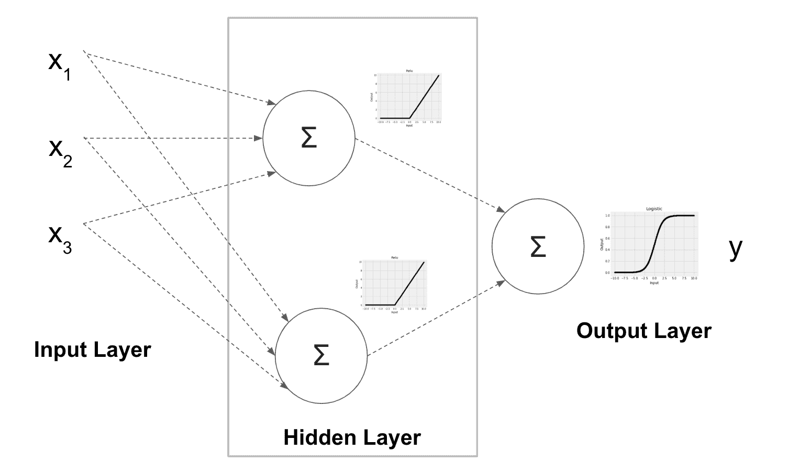
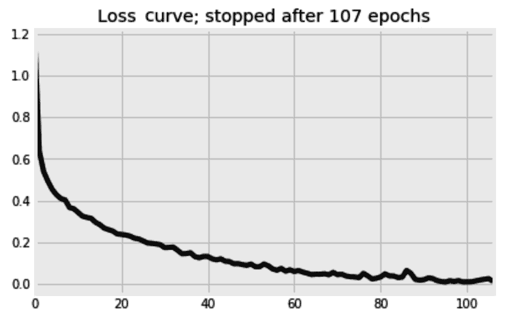
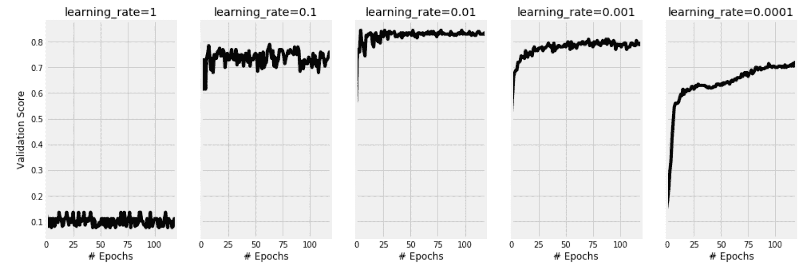
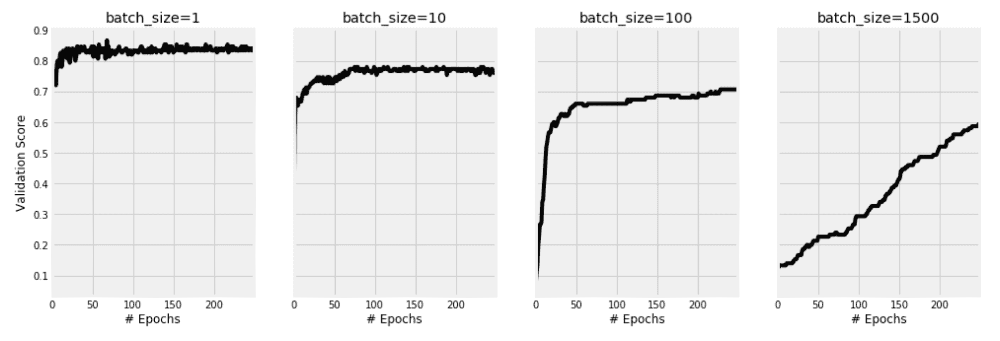
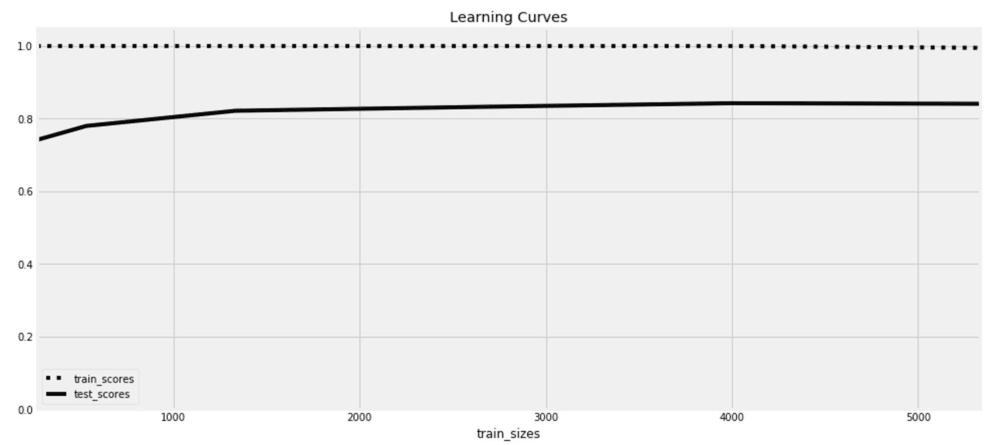
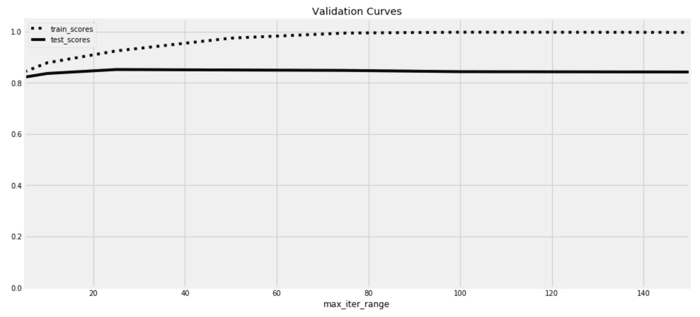
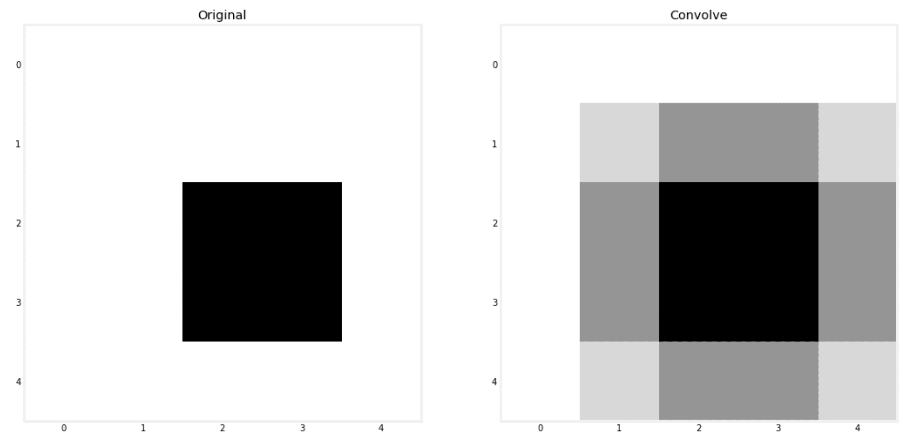
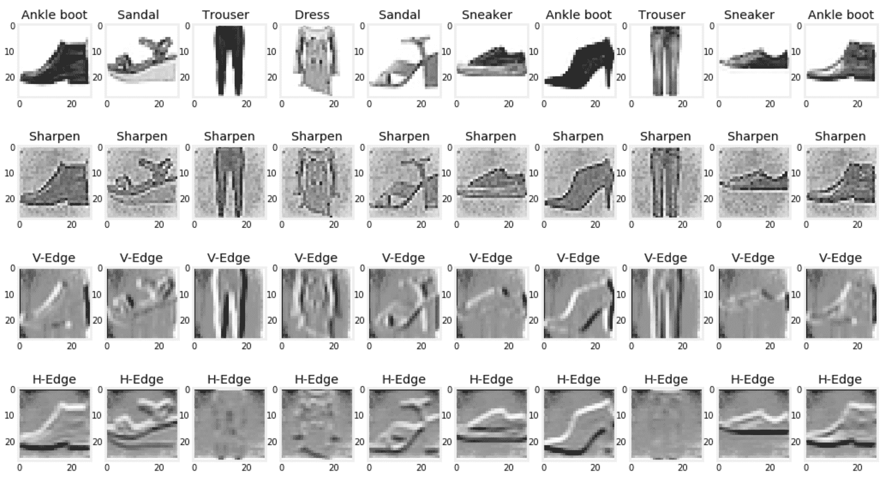

# 神经网络 – 深度学习的到来

阅读新闻文章或遇到一些误用*深度学习*这一术语来代替*机器学习*的情况并不罕见。这是因为深度学习作为机器学习的一个子领域，已经在解决许多以前无法解决的图像处理和自然语言处理问题上取得了巨大的成功。这种成功使得许多人将这个子领域与其父领域混淆。

*深度学习*这一术语指的是深度**人工神经网络**（**ANNs**）。后者的概念有多种形式和形态。在本章中，我们将讨论一种**前馈神经网络**的子集，称为**多层感知器**（**MLP**）。它是最常用的类型之一，并由 scikit-learn 实现。顾名思义，它由多层组成，且它是一个前馈网络，因为其层之间没有循环连接。层数越多，网络就越深。这些深度网络可以有多种形式，如**MLP**、**卷积神经网络**（**CNNs**）或**长短期记忆网络**（**LSTM**）。后两者并未由 scikit-learn 实现，但这并不会妨碍我们讨论 CNN 的基本概念，并使用科学 Python 生态系统中的工具手动模拟它们。

在本章中，我们将讨论以下主题：

+   了解 MLP

+   分类衣物

+   解开卷积的谜团

+   MLP 回归器

# 了解 MLP

当学习一种新的算法时，你可能会因为超参数的数量而感到灰心，并且发现很难决定从哪里开始。因此，我建议我们从回答以下两个问题开始：

+   该算法的架构是如何设计的？

+   该算法是如何训练的？

在接下来的章节中，我们将逐一回答这两个问题，并了解相应的超参数。

## 理解算法的架构

幸运的是，我们在第三章中获得的关于线性模型的知识，*利用线性方程做决策*，将在这里给我们一个良好的开端。简而言之，线性模型可以在以下图示中概述：


每个输入特征（x[i]）都会乘以一个权重（w[i]），这些乘积的总和就是模型的输出（y）。此外，我们有时还会添加一个额外的偏置（阈值）及其权重。然而，线性模型的一个主要问题是它们本质上是线性的（显然！）。此外，每个特征都有自己的权重，而不考虑它的邻居。这种简单的架构使得模型无法捕捉到特征之间的任何交互。因此，你可以将更多的层堆叠在一起，如下所示：


这听起来像是一个潜在的解决方案；然而，根据简单的数学推导，这些乘法和加法组合仍然可以简化为一个线性方程。就好像所有这些层根本没有任何效果一样。因此，为了达到预期效果，我们希望在每次加法后应用非线性变换。这些非线性变换被称为激活函数，它们将模型转化为非线性模型。让我们看看它们如何融入模型中，然后我会进一步解释：



该模型有一个包含两个隐藏节点的单一隐藏层，如框内所示。在实际应用中，你可能会有多个隐藏层和多个节点。前述的激活函数应用于隐藏节点的输出。这里，我们使用了**修正线性单元**（**ReLU**）作为激活函数；对于负值，它返回`0`，而对正值则保持不变。除了`relu`函数，`identity`、`logistic`和`tanh`激活函数也支持用于隐藏层，并且可以通过`activation`超参数进行设置。以下是这四种激活函数的表现形式：


如前所述，由于`identity`函数不会对其输入进行任何非线性变换，因此很少使用，因为它最终会将模型简化为一个线性模型。它还存在着梯度恒定的问题，这对用于训练的梯度下降算法帮助不大。因此，`relu`函数通常是一个不错的非线性替代方案。它是当前的默认设置，也是一个不错的首选；`logistic`或`tanh`激活函数则是下一个可选方案。

输出层也有其自己的激活函数，但它起着不同的作用。如果你还记得第三章，《使用线性方程做决策》，我们使用`logistic`函数将线性回归转变为分类器——也就是逻辑回归。输出的激活函数在这里起着完全相同的作用。下面列出了可能的输出激活函数及其对应的应用场景：

+   **Identity 函数**：在使用`MLPRegressor`进行回归时设置

+   **Logistic 函数**：在使用`MLPClassifier`进行二分类时设置

+   **Softmax 函数**：**在使用`MLPClassifier`区分三类或更多类别时设置**

**我们不手动设置输出激活函数；它们会根据是否使用`MLPRegressor`或`MLPClassifier`以及后者用于分类的类别数自动选择。**

*如果我们看一下网络架构，很明显，另一个需要设置的重要超参数是隐藏层的数量以及每层的节点数。这个设置通过`hidden_layer_sizes`超参数来完成，它接受元组类型的值。为了实现前面图中的架构——也就是一个隐藏层，包含两个节点——我们将`hidden_layer_sizes`设置为`2`。将其设置为`(10, 10, 5)`则表示有三个隐藏层，前两个层每层包含 10 个节点，而第三层包含 5 个节点。*

*## 训练神经网络

"心理学家告诉我们，要从经验中学习，必须具备两个要素：频繁的练习和即时的反馈。"

– 理查德·塞勒

大量研究人员的时间花费在改进他们神经网络的训练上。这也反映在与训练算法相关的超参数数量上。为了更好地理解这些超参数，我们需要研究以下的训练工作流程：

1.  获取训练样本的子集。

1.  将数据通过网络，进行预测。

1.  通过比较实际值和预测值来计算训练损失。

1.  使用计算出的损失来更新网络权重。

1.  返回到*步骤 1*获取更多样本，如果所有样本都已使用完，则反复遍历训练数据，直到训练过程收敛。

逐步执行这些步骤，你可以看到在第一阶段需要设置训练子集的大小。这就是`batch_size`参数所设置的内容。正如我们稍后会看到的，你可以从一次使用一个样本，到一次使用整个训练集，再到介于两者之间的任何方式。第一步和第二步是直接的，但第三步要求我们知道应该使用哪种损失函数。至于可用的损失函数，当使用 scikit-learn 时，我们没有太多选择。在进行分类时，**对数损失函数**会自动为我们选择，而**均方误差**则是回归任务的默认选择。第四步是最棘手的部分，需要设置最多的超参数。我们计算损失函数相对于网络权重的梯度。

这个梯度告诉我们应该朝哪个方向移动，以减少损失函数。换句话说，我们利用梯度更新权重，希望通过迭代降低损失函数至最小值。负责这一操作的逻辑被称为求解器（solver）。不过，求解器值得单独一节，稍后会详细介绍。最后，我们多次遍历训练数据的次数被称为“迭代次数”（epochs），它通过`max_iter`超参数来设置。如果模型停止学习，我们也可以决定提前停止（`early_stopping`）。`validation_fraction`、`n_iter_no_change`和`tol`这些超参数帮助我们决定何时停止训练。更多关于它们如何工作的内容将在下一节讨论。

### 配置求解器。

计算损失函数（也称为成本函数或目标函数）后，我们需要找到能够最小化损失函数的最优网络权重。在第三章的线性模型中，*使用线性方程做决策*，损失函数被选择为凸函数。正如下面的图形所示，凸函数有一个最小值，这个最小值既是全局最小值也是局部最小值。这使得在优化该函数时，求解器的工作变得简单。对于非线性神经网络，损失函数通常是非凸的，这就需要在训练过程中更加小心，因此在这里给予求解器更多的关注：


MLP 的支持求解器可以分为**有限记忆**Broyden–Fletcher–Goldfarb–Shanno（**LBFGS**）和**梯度下降**（**随机梯度下降**（**SGD**）和**Adam**）。在这两种变体中，我们希望从损失函数中随机选择一个点，计算其斜率（梯度），并使用它来确定下一步应该朝哪个方向移动。请记住，在实际情况中，我们处理的维度远远超过这里展示的二维图形。此外，我们通常无法像现在这样看到整个图形：

***   **LBFGS**算法同时使用斜率（一阶导数）和斜率变化率（二阶导数），这有助于提供更好的覆盖；然而，它在训练数据规模较大时表现不佳。训练可能非常缓慢，因此推荐在数据集较小的情况下使用该算法，除非有更强大的并行计算机来帮助解决。

+   **梯度下降**算法仅依赖于一阶导数。因此，需要更多的努力来帮助它有效地移动。计算出的梯度与`learning_rate`结合。这控制了每次计算梯度后，它的移动步长。移动过快可能会导致超过最小值并错过局部最小值，而移动过慢可能导致算法无法及时收敛。我们从由`learning_rate_init`定义的速率开始。如果我们设置`learning_rate='constant'`，初始速率将在整个训练过程中保持不变。否则，我们可以设置速率在每一步中减少（按比例缩放），或者仅在模型无法再继续学习时才减少（自适应）。

***   **梯度下降**可以使用整个训练数据集计算梯度，使用每次一个样本（`sgd`），或者以小批量的方式消耗数据（小批量梯度下降）。这些选择由`batch_size`控制。如果数据集无法完全加载到内存中，可能会阻止我们一次性使用整个数据集，而使用小批量可能会导致损失函数波动。我们将在接下来的部分中实际看到这种效果。*   学习率的问题在于它不能适应曲线的形状，特别是我们这里只使用了一阶导数。我们希望根据当前曲线的陡峭程度来控制学习速度。使学习过程更智能的一个显著调整是`动量`的概念。它根据当前和以前的更新来调整学习过程。`sgd`求解器默认启用`动量`，并且其大小可以通过`momentum`超参数进行设置。`adam`求解器将这一概念结合，并与为每个网络权重计算独立学习率的能力结合在一起。它通过`beta_1`和`beta_2`来参数化。通常它们的默认值分别为`0.9`和`0.999`。由于`adam`求解器相比`sgd`求解器需要更少的调整工作，因此它是默认的求解器。然而，如果正确调整，`sgd`求解器也可以收敛到更好的解。*   最后，决定何时停止训练过程是另一个重要的决策。我们会多次遍历数据，直到达到`max_iter`设置的上限。然而，如果我们认为学习进展不足，可以提前停止。我们通过`tol`定义多少学习是足够的，然后可以立即停止训练过程，或者再给它一些机会（`n_iter_no_change`），然后决定是否停止。此外，我们可以将训练集的一部分单独留出（`validation_fraction`），用来更好地评估我们的学习过程。然后，如果我们设置`early_stopping = True`，训练过程将在验证集的改进未达到`tol`阈值并且已达到`n_iter_no_change`个周期时停止。****

****现在我们对事情如何运作有了一个高层次的了解，我认为最好的前进方式是将所有这些超参数付诸实践，并观察它们在真实数据上的效果。在接下来的部分中，我们将加载一个图像数据集，并利用它来进一步了解前述的超参数。

# 分类服装项

在本节中，我们将根据衣物图像对服装项进行分类。我们将使用 Zalando 发布的一个数据集。Zalando 是一家总部位于柏林的电子商务网站。他们发布了一个包含 70,000 张服装图片的数据集，并附有相应标签。每个服装项都属于以下 10 个标签之一：

```py
{ 0: 'T-shirt/top ', 1: 'Trouser  ', 2: 'Pullover  ', 3: 'Dress  ', 4: 'Coat  ', 5: 'Sandal  ', 6: 'Shirt  ', 7: 'Sneaker  ', 8: 'Bag  ', 9: 'Ankle boot' }
```

该数据已发布在 OpenML 平台上，因此我们可以通过 scikit-learn 中的内置下载器轻松下载它。

## 下载 Fashion-MNIST 数据集

OpenML 平台上的每个数据集都有一个特定的 ID。我们可以将这个 ID 传递给`fetch_openml()`来下载所需的数据集，代码如下：

```py
from sklearn.datasets import fetch_openml
fashion_mnist = fetch_openml(data_id=40996) 
```

类别标签以数字形式给出。为了提取它们的名称，我们可以从描述中解析出以下内容：

```py
labels_s = '0 T-shirt/top \n1 Trouser \n2 Pullover \n3 Dress \n4 Coat \n5 Sandal \n6 Shirt \n7 Sneaker \n8 Bag \n9 Ankle boot'

fashion_label_translation = {
    int(k): v for k, v in [
        item.split(maxsplit=1) for item in labels_s.split('\n')
    ]
}

def translate_label(y, translation=fashion_label_translation):
    return pd.Series(y).apply(lambda y: translation[int(y)]).values
```

我们还可以创建一个类似于我们在第五章中创建的函数，*使用最近邻的图像处理*，来显示数据集中的图片：

```py
def display_fashion(img, target, ax):

    if len(img.shape):
        w = int(np.sqrt(img.shape[0]))
        img = img.reshape((w, w))

    ax.imshow(img, cmap='Greys')
    ax.set_title(f'{target}')
    ax.grid(False)

```

上述函数除了`matplotlib`坐标轴外，还期望接收一张图片和一个目标标签来显示该图片。我们将在接下来的章节中看到如何使用它。

## 准备分类数据

在开发模型并优化其超参数时，你需要多次运行模型。因此，建议你先使用较小的数据集以减少训练时间。一旦达到可接受的模型效果，就可以添加更多数据并进行最终的超参数调优。稍后，我们将看到如何判断手头的数据是否足够，以及是否需要更多样本；但现在，让我们先使用一个包含 10,000 张图片的子集。

我故意避免在从原始数据集进行采样时以及将采样数据拆分为训练集和测试集时设置任何随机状态。由于没有设置随机状态，你应该期望最终结果在每次运行中有所不同。我做出这个选择是因为我的主要目标是专注于底层概念，而不希望你过于纠结最终结果。最终，你在现实场景中处理的数据会因问题的不同而有所不同，我们在前面的章节中已经学会了如何通过交叉验证更好地理解模型性能的边界。所以，在这一章中，和本书中的许多其他章节一样，不必太担心提到的模型的准确率、系数或学习行为与你的结果有所不同。

我们将使用`train_test_split()`函数两次。最初，我们将用它进行采样。之后，我们将再次使用它来执行将数据拆分为训练集和测试集的任务：

```py
from sklearn.model_selection import train_test_split

fashion_mnist_sample = {}

fashion_mnist_sample['data'], _, fashion_mnist_sample['target'], _ = train_test_split(
    fashion_mnist['data'], fashion_mnist['target'], train_size=10000
)

x, y = fashion_mnist_sample['data'], fashion_mnist_sample['target']
x_train, x_test, y_train, y_test = train_test_split(x, y, test_size=0.2)
```

这里的像素值在`0`和`255`之间。通常，这样是可以的；然而，我们将要使用的求解器在数据落在更紧凑的范围内时收敛得更好。`MinMaxScaler`将帮助我们实现这一点，如下所示，而`StandardScaler`也是一个选择：

```py
from sklearn.preprocessing import MinMaxScaler

scaler = MinMaxScaler()

x_train = scaler.fit_transform(x_train)
x_test = scaler.transform(x_test)
```

我们现在可以使用我们在上一节中创建的函数，将数字标签转换为名称：

```py
translation = fashion_label_translation
y_train_translated = translate_label(y_train, translation=translation)
y_test_translated = translate_label(y_test, translation=translation)
```

如果你的原始标签是字符串格式，可以使用`LabelEncoder`将其转换为数值：

```py
from sklearn.preprocessing import LabelEncoder

le = LabelEncoder()
y_train_encoded = le.fit_transform(y_train_translated)
y_test_encoded = le.transform(y_test_translated)
```

最后，让我们使用以下代码查看这些图片的样子：

```py
import random 

fig, axs = plt.subplots(1, 10, figsize=(16, 12))

for i in range(10):
    rand = random.choice(range(x_train.shape[0]))
    display_fashion(x_train[rand], y_train_translated[rand], axs[i])

fig.show()
```

在这里，我们看到 10 张随机图片及其标签。我们循环显示 10 张随机图片，并使用我们之前创建的显示函数将它们并排展示：


现在数据已经准备好，接下来是时候看看超参数在实践中的效果了。

## 体验超参数的效果

在神经网络训练完成后，你可以检查它的权重（`coefs_`）、截距（`intercepts_`）以及损失函数的最终值（`loss_`）。另外一个有用的信息是每次迭代后的计算损失（`loss_curve_`）。这一损失曲线对于学习过程非常有帮助。

在这里，我们训练了一个神经网络，包含两个隐藏层，每个层有 100 个节点，并将最大迭代次数设置为`500`。目前，我们将其他所有超参数保持默认值：

```py
from sklearn.neural_network import MLPClassifier
clf = MLPClassifier(hidden_layer_sizes=(100, 100), max_iter=500)
clf.fit(x_train, y_train_encoded)
y_test_pred = clf.predict(x_test)
```

网络训练完成后，我们可以使用以下代码绘制损失曲线：

```py
pd.Series(clf.loss_curve_).plot(
    title=f'Loss Curve; stopped after {clf.n_iter_} epochs'
)
```

这将给我们如下图：



尽管算法被告知最多继续学习`500`个周期，但它在第 107^(次)周期后停止了。`n_iter_no_change`的默认值是`10`个周期。这意味着，自第 97^(次)周期以来，学习率没有足够改善，因此网络在 10 个周期后停了下来。请记住，默认情况下`early_stopping`是`False`，这意味着这个决策是在不考虑默认设置的`10%`验证集的情况下做出的。如果我们希望使用验证集来决定是否提前停止，我们应该将`early_stopping`设置为`True`。

### 学习得不太快也不太慢

如前所述，损失函数（*J*）相对于权重（*w*）的梯度被用来更新网络的权重。更新是按照以下方程进行的，其中*lr*是学习率：


你可能会想，为什么需要学习率？为什么不直接通过设置*lr = 1*来使用梯度呢？在这一节中，我们将通过观察学习率对训练过程的影响来回答这个问题。

MLP 估算器中的另一个隐藏的宝藏是`validation_scores_`。像`loss_curve_`一样，这个参数也没有文档说明，并且其接口可能在未来的版本中发生变化。在`MLPClassifier`中，`validation_scores_`跟踪分类器在验证集上的准确度，而在`MLPRegressor`中，它跟踪回归器的 R²得分。

我们将使用验证得分（`validation_scores_`）来查看不同学习率的效果。由于这些得分只有在`early_stopping`设置为`True`时才会存储，而且我们不想提前停止，所以我们还将`n_iter_no_change`设置为与`max_iter`相同的值，以取消提前停止的效果。

默认的学习率是`0.001`，并且在训练过程中默认保持不变。在这里，我们将选择一个更小的训练数据子集——1,000 个样本——并尝试从`0.0001`到`1`的不同学习率：

```py
from sklearn.neural_network import MLPClassifier

learning_rate_init_options = [1, 0.1, 0.01, 0.001, 0.0001]

fig, axs = plt.subplots(1, len(learning_rate_init_options), figsize=(15, 5), sharex=True, sharey=True)

for i, learning_rate_init in enumerate(learning_rate_init_options):

    print(f'{learning_rate_init} ', end='')

    clf = MLPClassifier(
        hidden_layer_sizes=(500, ), 
        learning_rate='constant',
        learning_rate_init=learning_rate_init,
        validation_fraction=0.2,
        early_stopping=True, 
        n_iter_no_change=120,
        max_iter=120, 
        solver='sgd',
        batch_size=25,
        verbose=0,
    )

    clf.fit(x_train[:1000,:], y_train_encoded[:1000])

    pd.Series(clf.validation_scores_).plot(
        title=f'learning_rate={learning_rate_init}', 
        kind='line', 
        color='k',
        ax=axs[i]
    )

fig.show()
```

以下图表比较了不同学习率下验证得分的进展。为了简洁起见，格式化坐标轴的代码被省略：



正如我们所看到的，当将学习率设置为`1`时，网络无法学习，准确度停留在约 10%。这是因为较大的步伐更新权重导致梯度下降过度，错过了局部最小值。理想情况下，我们希望梯度下降能够在曲线上智慧地移动；它不应该急于求成，错过最优解。另一方面，我们可以看到，学习率非常低的`0.0001`导致网络训练时间过长。显然，`120`轮训练不够，因此需要更多的轮次。在这个例子中，学习率为`0.01`看起来是一个不错的平衡。

学习率的概念通常在迭代方法中使用，以防止过度跳跃。它可能有不同的名称和不同的解释，但本质上它起到相同的作用。例如，在**强化学习**领域，**贝尔曼方程**中的**折扣因子**可能类似于这里的学习率。

### 选择合适的批量大小

在处理大量训练数据时，你不希望在计算梯度时一次性使用所有数据，尤其是当无法将这些数据完全加载到内存时。使用数据的小子集是我们可以配置的选项。在这里，我们将尝试不同的批量大小，同时保持其他设置不变。请记住，当`batch_size`设置为`1`时，模型会非常慢，因为它在每个训练实例后都更新一次权重：

```py
from sklearn.neural_network import MLPClassifier

batch_sizes = [1, 10, 100, 1500]

fig, axs = plt.subplots(1, len(batch_sizes), figsize=(15, 5), sharex=True, sharey=True)

for i, batch_size in enumerate(batch_sizes):

    print(f'{batch_size} ', end='')

    clf = MLPClassifier(
        hidden_layer_sizes=(500, ), 
        learning_rate='constant',
        learning_rate_init=0.001, 
        momentum=0,
        max_iter=250, 
        early_stopping=True,
        n_iter_no_change=250,
        solver='sgd',
        batch_size=batch_size,
        verbose=0,
    )

    clf.fit(x_train[:1500,:], y_train_encoded[:1500])

    pd.Series(clf.validation_scores_).plot( 
        title=f'batch_size={batch_size}',
        color='k',
        kind='line', 
        ax=axs[i]
    )

fig.show()
```

这张图给我们提供了四种批量大小设置及其效果的可视化比较。为了简洁起见，部分格式化代码被省略：



你可以看到，为什么小批量梯度下降在实践中成为了常态，不仅是因为内存限制，还因为较小的批次帮助我们的模型在此处更好地学习。尽管小批次大小下验证得分的波动较大，最终的结果还是达到了预期。另一方面，将`batch_size`设置为`1`会减慢学习过程。

到目前为止，我们已经调整了多个超参数，并见证了它们对训练过程的影响。除了这些超参数，还有两个问题仍然需要回答：

+   多少训练样本足够？

+   多少轮训练足够？

### 检查是否需要更多的训练样本

我们希望比较当使用整个训练样本（100%）时，使用 75%、50%、25%、10%和 5%的效果。`learning_curve`函数在这种比较中很有用。它使用交叉验证来计算不同样本量下的平均训练和测试分数。在这里，我们将定义不同的采样比例，并指定需要三折交叉验证：

```py
from sklearn.model_selection import learning_curve

train_sizes = [1, 0.75, 0.5, 0.25, 0.1, 0.05]

train_sizes, train_scores, test_scores = learning_curve(
    MLPClassifier(
        hidden_layer_sizes=(100, 100), 
        solver='adam',
        early_stopping=False
    ), 
    x_train, y_train_encoded,
    train_sizes=train_sizes,
    scoring="precision_macro",
    cv=3,
    verbose=2,
    n_jobs=-1
)
```

完成后，我们可以使用以下代码绘制训练和测试分数随着样本量增加的进展：

```py
df_learning_curve = pd.DataFrame(
    {
        'train_sizes': train_sizes,
        'train_scores': train_scores.mean(axis=1),
        'test_scores': test_scores.mean(axis=1)
    }
).set_index('train_sizes')

df_learning_curve['train_scores'].plot(
    title='Learning Curves', ls=':',
)

df_learning_curve['test_scores'].plot(
    title='Learning Curves', ls='-',
)
```

结果图表显示了随着更多训练数据的增加，分类器准确度的提升。注意到训练分数保持不变，而测试分数才是我们真正关心的，它在一定数据量后似乎趋于饱和：



在本章早些时候，我们从原始的 70,000 张图片中抽取了 10,000 张样本。然后将其拆分为 8,000 张用于训练，2,000 张用于测试。从学习曲线图中我们可以看到，实际上可以选择一个更小的训练集。在 2,000 张样本之后，额外的样本并没有带来太大的价值。

通常，我们希望使用尽可能多的数据样本来训练我们的模型。然而，在调整模型超参数时，我们需要做出妥协，使用较小的样本来加速开发过程。一旦完成这些步骤，就建议在整个数据集上训练最终模型。

### 检查是否需要更多的训练轮次

这一次，我们将使用`validation_curve`函数。它的工作原理类似于`learning_curve`函数，但它比较的是不同的超参数设置，而不是不同的训练样本量。在这里，我们将看到使用不同`max_iter`值的效果：

```py
from sklearn.model_selection import validation_curve

max_iter_range = [5, 10, 25, 50, 75, 100, 150]

train_scores, test_scores = validation_curve(
    MLPClassifier(
        hidden_layer_sizes=(100, 100), 
        solver='adam',
        early_stopping=False
    ), 
    x_train, y_train_encoded,
    param_name="max_iter", param_range=max_iter_range,
    scoring="precision_macro",
    cv=3,
    verbose=2,
    n_jobs=-1
)
```

通过训练和测试分数，我们可以像在上一节中一样绘制它们，从而得到以下图表：



在这个示例中，我们可以看到，测试分数大约在`25`轮后停止提高。训练分数在此之后继续提升，直到达到 100%，这是过拟合的表现。实际上，我们可能不需要这个图表，因为我们使用`early_stopping`、`tol`和`n_iter_no_change`超参数来停止训练过程，一旦学习足够并且避免过拟合。

## 选择最佳的架构和超参数

到目前为止，我们还没有讨论网络架构。我们应该有多少层，每层应该有多少节点？我们也没有比较不同的激活函数。正如你所看到的，有许多超参数可以选择。在本书之前的部分，我们提到过一些工具，如`GridSearchCV`和`RandomizedSearchCV`，它们帮助你选择最佳超参数。这些仍然是很好的工具，但如果我们决定使用它们来调节每个参数的所有可能值，它们可能会太慢。如果我们在使用过多的训练样本或进行太多的训练轮次时，它们也可能变得过于缓慢。

我们在前面部分看到的工具应该能帮助我们通过排除一些超参数范围，在一个稍微小一点的“大堆”中找到我们的“针”。它们还将允许我们坚持使用更小的数据集并缩短训练时间。然后，我们可以有效地使用`GridSearchCV`和`RandomizedSearchCV`来微调我们的神经网络。

在可能的情况下，建议使用并行化。`GridSearchCV`和**`RandomizedSearchCV`允许我们利用机器上的不同处理器同时训练多个模型。我们可以通过`n_jobs`设置来实现这一点。这意味着，通过使用处理器数量较多的机器，你可以显著加速超参数调优过程。至于数据量，考虑到我们将执行 k 折交叉验证，并且训练数据会被进一步划分，我们应该增加比前一部分估算的数据量更多的数据。现在，话不多说，让我们使用`GridSearchCV`来调优我们的网络：

**```py
from sklearn.model_selection import GridSearchCV

param_grid = {
    'hidden_layer_sizes': [(50,), (50, 50), (100, 50), (100, 100), (500, 100), (500, 100, 100)],
    'activation': ['logistic', 'tanh', 'relu'],
    'learning_rate_init': [0.01, 0.001],
    'solver': ['sgd', 'adam'],
}

gs = GridSearchCV(
    estimator=MLPClassifier(
        max_iter=50,
        batch_size=50,
        early_stopping=True,
    ), 
    param_grid=param_grid,
    cv=4,
    verbose=2,
    n_jobs=-1
)

gs.fit(x_train[:2500,:], y_train_encoded[:2500])
```**

它在四个 CPU 上运行了 14 分钟，选择了以下超参数：

+   **激活函数**：`relu`

+   **隐藏层大小**：`(500, 100)`

+   **初始学习率**：`0.01`

+   **优化器**：`adam`

所选模型在测试集上达到了**85.6%**的**微 F 得分**。通过使用`precision_recall_fscore_support`函数，你可以更详细地看到哪些类别比其他类别更容易预测：


理想情况下，我们应该使用整个训练集重新训练，但我现在先跳过这一部分。最终，开发一个最佳的神经网络通常被看作是艺术与科学的结合。然而，了解你的超参数及其效果的衡量方式应该让这一过程变得简单明了。然后，像`GridSearchCV`和`RandomizedSearchCV`这样的工具可以帮助你自动化部分过程。自动化在很多情况下优于技巧。

在进入下一个话题之前，我想稍微离题一下，给你展示如何构建自己的激活函数。

## 添加你自己的激活函数

许多激活函数的一个常见问题是梯度消失问题。如果你观察 `logistic` 和 `tanh` 激活函数的曲线，你会发现对于高正值和负值，曲线几乎是水平的。这意味着在这些高值下，曲线的梯度几乎是常数。这会阻碍学习过程。`relu` 激活函数尝试解决这个问题，但它仅解决了正值部分的问题，未能处理负值部分。这促使研究人员不断提出不同的激活函数。在这里，我们将把**ReLU**激活函数与其修改版**Leaky ReLU**进行对比：


正如你在**Leaky ReLU**的示例中看到的，负值部分的线条不再是常数，而是以一个小的速率递减。为了添加**Leaky ReLU**，我需要查找 scikit-learn 中 `relu` 函数的构建方式，并毫不犹豫地修改代码以满足我的需求。基本上有两种方法可以构建。第一种方法用于前向传播路径，并仅将激活函数应用于其输入；第二种方法则将激活函数的导数应用于计算得到的误差。以下是我稍作修改以便简洁的 `relu` 的两个现有方法：

```py
def relu(X):
    return np.clip(X, 0, np.finfo(X.dtype).max)

definplace_relu_derivative(Z, delta):
    delta[Z==0] =0
```

在第一种方法中，使用了 NumPy 的 `clip()` 方法将负值设置为 `0`。由于 `clip` 方法需要设置上下界，因此代码中的难懂部分是获取该数据类型的最大值，将其作为上界。第二种方法获取激活函数的输出（`Z`）以及计算得到的误差（`delta`）。它应该将误差乘以激活输出的梯度。然而，对于这种特定的激活函数，正值的梯度为 `1`，负值的梯度为 `0`。因此，对于负值，误差被设置为 `0`，即当 `relu` 返回 `0` 时，误差就被设置为 `0`。

`leaky_relu` 保持正值不变，并将负值乘以一个小的值 `0.01`。现在，我们只需使用这些信息来构建新的方法：

```py
leaky_relu_slope = 0.01

def leaky_relu(X):
    X_min = leaky_relu_slope * np.array(X)
    return np.clip(X, X_min, np.finfo(X.dtype).max)

def inplace_leaky_relu_derivative(Z, delta):
    delta[Z < 0] = leaky_relu_slope * delta[Z < 0]
```

回顾一下，`leaky_relu` 在正值时的斜率为 `1`，而在负值时的斜率为 `leaky_relu_slope` 常量。因此，我们将 `Z` 为负值的部分的增量乘以 `leaky_relu_slope`。现在，在使用我们新的方法之前，我们需要将它们注入到 scikit-learn 的代码库中，具体如下：

```py
from sklearn.neural_network._base import ACTIVATIONS, DERIVATIVES

ACTIVATIONS['leaky_relu'] = leaky_relu
DERIVATIVES['leaky_relu'] = inplace_leaky_relu_derivative
```

然后，你可以像最初就有 `MLPClassifier` 一样直接使用它：

```py
clf = MLPClassifier(activation='leaky_relu')
```

像这样黑客攻击库迫使我们去阅读其源代码，并更好地理解它。它也展示了开源的价值，让你不再受限于现有的代码。接下来的部分，我们将继续进行黑客攻击，构建我们自己的卷积层。

# 解开卷积的复杂性

"深入观察大自然，你将更好地理解一切"

– 阿尔伯特·爱因斯坦

关于使用神经网络进行图像分类的章节，不能不提到卷积神经网络（CNN）。尽管 scikit-learn 并未实现卷积层，但我们仍然可以理解这一概念，并了解它是如何工作的。

让我们从以下的*5* x *5* 图像开始，看看如何将卷积层应用于它：

```py
x_example = array(
    [[0, 0, 0, 0, 0],
     [0, 0, 0, 0, 0],
     [0, 0, 1, 1, 0],
     [0, 0, 1, 1, 0],
     [0, 0, 0, 0, 0]]
)
```

在自然语言处理领域，词语通常作为字符与整个句子之间的中介来进行特征提取。在这张图中，也许较小的块比单独的像素更适合作为信息单元。本节的目标是寻找表示这些小的*2 x 2*、*3 x 3* 或 *N x N* 块的方法。我们可以从平均值作为总结开始。我们基本上可以通过将每个像素乘以 1，然后将总和除以 9，来计算每个*3 x 3* 块的平均值；这个块中有 9 个像素。对于边缘上的像素，因为它们在所有方向上没有邻居，我们可以假装在图像周围有一个额外的 1 像素边框，所有像素都设置为 0。通过这样做，我们得到另一个*5 x 5* 的数组。

这种操作被称为**卷积**，而**SciPy**提供了一种实现卷积的方法。*3 x 3* 的全 1 矩阵也被称为卷积核或权重。在这里，我们指定全 1 的卷积核，并在后面进行 9 的除法。我们还指定需要一个全零的边框，通过将`mode`设置为`constant`，`cval`设置为`0`，正如您在以下代码中所看到的那样：

```py
from scipy import ndimage

kernel = [[1,1,1],[1,1,1],[1,1,1]] 
x_example_convolve = ndimage.convolve(x_example, kernel, mode='constant', cval=0)
x_example_convolve = x_example_convolve / 9 
```

这是原始图像与卷积输出之间的对比：



计算平均值给我们带来了模糊的原始图像版本，所以下次当你需要模糊图像时，你知道该怎么做。将每个像素乘以某个权重并计算这些乘积的总和听起来像是一个线性模型。此外，我们可以将平均值看作是线性模型，其中所有权重都设置为 。因此，你可以说我们正在为图像的每个块构建迷你线性模型。记住这个类比，但现在，我们必须手动设置模型的权重。

虽然每个块使用的线性模型与其他块完全相同，但没有什么可以阻止每个块内的像素被不同的权重相乘。事实上，不同的卷积核和不同的权重会产生不同的效果。在下一节中，我们将看到不同卷积核对我们**Fashion-MNIST**数据集的影响。

## 通过卷积提取特征

与其逐个处理图像，我们可以调整代码一次性对多张图像进行卷积。我们的 Fashion-MNIST 数据集中的图像是平铺的，因此我们需要将它们重新调整为*28* x *28* 像素的格式。然后，我们使用给定的卷积核进行卷积，最后，确保所有像素值都在`0`和`1`之间，使用我们最喜爱的`MinMaxScaler`参数：

```py
from scipy import ndimage
from sklearn.preprocessing import MinMaxScaler

def convolve(x, kernel=[[1,1,1],[1,1,1],[1,1,1]]):
    w = int(np.sqrt(x.shape[1]))
    x = ndimage.convolve(
        x.reshape((x.shape[0], w, w)), [kernel], 
        mode='constant', cval=0.0
    ) 
    x = x.reshape(x.shape[0], x.shape[1]*x.shape[2]) 
    return MinMaxScaler().fit_transform(x)
```

接下来，我们可以将其作为我们的训练和测试数据，如下所示：

```py
sharpen_kernel = [[0,-1,0], [-1,5,-1], [0,-1,0]]
x_train_conv = convolve(x_train, sharpen_kernel)
x_test_conv = convolve(x_test, sharpen_kernel)
```

这里有几个卷积核：第一个用于锐化图像，接着是一个用于强调垂直边缘的卷积核，而最后一个则强调水平边缘：

+   **锐化**：`[[0,-1,0], [-1,5,-1], [0,-1,0]]`

+   **垂直边缘**： `[[-1,0,1], [-2,0,2], [-1,0,1]]`

+   **水平边缘**： `[[-1,-2,-1], [0,0,0], [1,2,1]]`

将这些卷积核传给我们刚刚创建的卷积函数将得到以下效果：



你可以在互联网上找到更多的卷积核，或者你也可以尝试自己定义，看看它们的效果。卷积核也是直观的；锐化卷积核显然更重视中央像素而非其周围的像素。

每个不同的卷积变换从我们的图像中捕获了特定的信息。因此，我们可以将它们看作一个特征工程层，从中提取特征供分类器使用。然而，随着我们将更多的卷积变换添加到数据中，数据的大小会不断增长。在下一部分，我们将讨论如何处理这个问题。

## 通过最大池化来减少数据的维度

理想情况下，我们希望将前几个卷积变换的输出输入到我们的神经网络中。然而，如果我们的图像由 784 个像素构成，那么仅仅连接三个卷积函数的输出将会产生 2,352 个特征，*784 x 3*。这将会减慢我们的训练过程，而且正如我们在本书前面所学到的，特征越多并不总是越好。

要将图像缩小为原来大小的四分之一——即宽度和高度各缩小一半——你可以将图像划分为多个*2 x 2*的补丁，然后在每个补丁中取最大值来表示整个补丁。这正是**最大池化**的作用。为了实现它，我们需要在计算机终端通过`pip`安装另一个名为`scikit-image`的库：

```py
pipinstallscikit-image
```

然后，我们可以创建我们的最大池化函数，如下所示：

```py

from skimage.measure import block_reduce
from sklearn.preprocessing import MinMaxScaler

def maxpool(x, size=(2,2)):
    w = int(np.sqrt(x.shape[1]))
    x = np.array([block_reduce(img.reshape((w, w)), block_size=(size[0], size[1]), func=np.max) for img in x])
    x = x.reshape(x.shape[0], x.shape[1]*x.shape[2]) 
    return MinMaxScaler().fit_transform(x)
```

然后，我们可以将它应用到其中一个卷积的输出上，具体如下：

```py
x_train_maxpool = maxpool(x_train_conv, size=(5,5))
x_test_maxpool = maxpool(x_test_conv, size=(5,5))
```

在*5 x 5*的补丁上应用最大池化将把数据的大小从*28 x 28*缩小到*6 x 6*，即原始大小的不到 5%。

## 将一切整合在一起

`FeatureUnion`管道可以在 scikit-learn 中将多个转换器的输出组合起来。换句话说，如果 scikit-learn 有可以对图像进行卷积并对这些卷积输出进行最大池化的转换器，那么你就可以将多个转换器的输出结合起来，每个转换器都使用不同的卷积核。幸运的是，我们可以自己构建这个转换器，并通过`FeatureUnion`将它们的输出结合起来。我们只需要让它们提供 fit、transform 和 fit_transform 方法，如下所示：

```py
class ConvolutionTransformer:

    def __init__(self, kernel=[], max_pool=False, max_pool_size=(2,2)):
        self.kernel = kernel
        self.max_pool = max_pool
        self.max_pool_size = max_pool_size

    def fit(self, x):
        return x

    def transform(self, x, y=None):
        x = convolve(x, self.kernel)
        if self.max_pool:
            x = maxpool(x, self.max_pool_size)
        return x

    def fit_transform(self, x, y=None):
        x = self.fit(x)
        return self.transform(x)
```

你可以在初始化步骤中指定使用的卷积核。你还可以通过将`max_pool`设置为`False`来跳过最大池化部分。这里，我们定义了三个卷积核，并在对每个*4 x 4*图像块进行池化时，组合它们的输出：

```py
kernels = [
    ('Sharpen', [[0,-1,0], [-1,5,-1], [0,-1,0]]),
    ('V-Edge', [[-1,0,1], [-2,0,2], [-1,0,1]]),
    ('H-Edge', [[-1,-2,-1], [0,0,0], [1,2,1]]),
]

from sklearn.pipeline import FeatureUnion

funion = FeatureUnion(
    [
        (kernel[0], ConvolutionTransformer(kernel=kernel[1], max_pool=True, max_pool_size=(4,4)))
        for kernel in kernels
    ]
)

x_train_convs = funion.fit_transform(x_train)
x_test_convs = funion.fit_transform(x_test)
```

然后，我们可以将`FeatureUnion`管道的输出传递到我们的神经网络中，如下所示：

```py
from sklearn.neural_network import MLPClassifier

mlp = MLPClassifier(
    hidden_layer_sizes=(500, 300),
    activation='relu',
    learning_rate_init=0.01,
    solver='adam',
    max_iter=80,
    batch_size=50,
    early_stopping=True,
)

mlp.fit(x_train_convs, y_train)
y_test_predict = mlp.predict(x_test_convs)
```

该网络达到了**微 F 值**为**79%**。你可以尝试添加更多的卷积核并调整网络的超参数，看看我们是否能比没有卷积层时获得更好的得分。

我们必须手动设置卷积层的核权重。然后，我们显示它们的输出，以查看它们是否直观合理，并希望它们在使用时能提高我们模型的表现。这听起来不像是一个真正的数据驱动方法。理想情况下，你希望权重能够从数据中学习。这正是实际的卷积神经网络（CNN）所做的。我建议你了解 TensorFlow 和 PyTorch，它们提供了 CNN 的实现。如果你能将它们的准确度与我们这里构建的模型进行比较，那将非常好。

# MLP 回归器

除了`MLPClassifier`，还有它的回归兄弟`MLPRegressor`。这两者共享几乎相同的接口。它们之间的主要区别在于每个使用的损失函数和输出层的激活函数。回归器优化平方损失，最后一层由恒等函数激活。所有其他超参数相同，包括隐藏层的四种激活选项。

两个估算器都有一个`partial_fit()`方法。你可以在估算器已经拟合后，获取额外的训练数据时，使用它来更新模型。在`MLPRegressor`中，`score()`计算的是回归器的**R*²**，而分类器的准确度则由`MLPClassifier`计算。

****# 总结

我们现在已经对人工神经网络（ANNs）及其底层技术有了很好的理解。我推荐使用像 TensorFlow 和 PyTorch 这样的库来实现更复杂的架构，并且可以在 GPU 上扩展训练过程。不过，你已经有了很好的起步。这里讨论的大部分概念可以转移到任何其他库上。你将使用相似的激活函数和求解器，以及这里讨论的大部分其他超参数。scikit-learn 的实现仍然适用于原型开发以及我们想要超越线性模型的情况，且不需要太多隐藏层。

此外，像梯度下降这样的求解器在机器学习领域是如此普遍，理解它们的概念对于理解其他不是神经网络的算法也很有帮助。我们之前看到梯度下降如何用于训练线性回归器、逻辑回归器以及支持向量机。我们还将在下一章中使用它们与梯度提升算法。

无论你使用什么算法，像学习率以及如何估计所需训练数据量等概念都是非常有用的。得益于 scikit-learn 提供的有用工具，这些概念得以轻松应用。即使在我并非在构建机器学习解决方案时，我有时也会使用 scikit-learn 的工具。

如果人工神经网络（ANNs）和深度学习是媒体的鸦片，那么集成算法就是大多数从业者在解决任何商业问题或在 Kaggle 上争夺$10,000 奖金时的“面包和黄油”。

在下一章中，我们将学习不同的集成方法及其理论背景，然后亲自动手调优它们的超参数。****************
