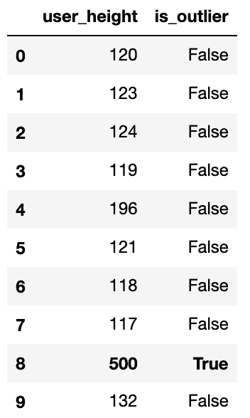
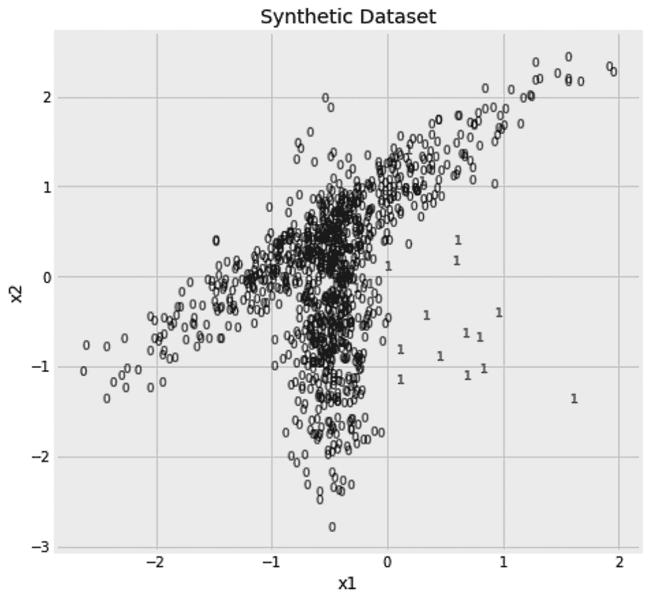

异常检测 – 找出数据中的异常值

检测数据中的异常是机器学习中的一个重复性主题。在[第十章](https://cdp.packtpub.com/hands_on_machine_learning_with_scikit_learn/wp-admin/post.php?post=32&action=edit)[,](https://cdp.packtpub.com/hands_on_machine_learning_with_scikit_learn/wp-admin/post.php?post=32&action=edit)*Imbalanced Learning – Not Even 1% Win the Lottery*，我们学习了如何在数据中发现这些有趣的少数群体。那时，数据是有标签的，并且之前章节中的分类算法适用于该问题。除了**有标签异常检测**问题外，还有一些情况下数据是无标签的。

在本章中，我们将学习如何在没有标签的情况下识别数据中的异常值。我们将使用三种不同的算法，并学习**无标签异常检测**的两个分支。本章将涵盖以下主题：

+   无标签异常检测

+   使用基本统计方法检测异常

+   使用`EllipticEnvelope`检测异常值

+   使用**局部异常因子**（**LOF**）进行异常值和新颖性检测

+   使用隔离森林检测异常值

# 无标签异常检测

在本章中，我们将从一些无标签数据开始，我们需要在其中找到异常样本。我们可能只会得到正常数据（inliers），并希望从中学习正常数据的特征。然后，在我们对正常数据拟合一个模型后，给定新的数据，我们需要找出与已知数据不符的异常值（outliers）。这类问题被称为**新颖性检测**。另一方面，如果我们在一个包含正常数据和异常值的数据集上拟合我们的模型，那么这个问题被称为**异常值检测**问题。

与其他无标签算法一样，`fit`方法会忽略任何给定的标签。该方法的接口允许你传入* x * 和 * y *，为了保持一致性，但 * y * 会被简单忽略。在新颖性检测的情况下，首先在没有异常值的数据集上使用`fit`方法，然后在包含正常数据和异常值的数据上使用算法的`predict`方法是合乎逻辑的。相反，对于异常值检测问题，通常会同时使用`fit`方法进行拟合，并通过`fit_predict`方法进行预测。

在使用任何算法之前，我们需要创建一个样本数据集，以便在本章中使用。我们的数据将包括 1,000 个样本，其中 98%的样本来自特定分布，剩余的 2%来自不同的分布。在下一节中，我们将详细介绍如何创建这个样本数据。

## 生成样本数据

`make_classification`函数允许我们指定样本数量和特征数量。我们可以限制信息性特征的数量，并使一些特征冗余——即依赖于信息性特征。我们也可以将一些特征设置为任何信息性或冗余特征的副本。在我们当前的使用案例中，我们将确保所有特征都是信息性的，因为我们将仅限于使用两个特征。由于`make_classification`函数是用于生成分类问题的数据，它同时返回*x*和*y*。

在构建模型时，我们将忽略*y*，并只在后续评估中使用它。我们将确保每个类别来自两个不同的分布，通过将`n_clusters_per_class`设置为`2`。我们将通过将`scale`设置为一个单一值，确保两个特征保持相同的尺度。我们还将确保数据是随机洗牌的（`shuffle=True`），并且没有任何一个类别的样本被标记为另一个类别的成员（`flip_y=0`）。最后，我们将`random_state`设置为`0`，确保在我们的计算机上运行以下代码时获得完全相同的随机数据：

```py
from sklearn.datasets import make_classification

x, y = make_classification(
    n_samples=1000, n_features=2, n_informative=2, n_redundant=0, n_repeated=0, 
    n_classes=2, n_clusters_per_class=2, weights=[0.98, ], class_sep=0.5, 
    scale=1.0, shuffle=True, flip_y=0, random_state=0
)
```

现在样本数据已经准备好，是时候考虑如何检测其中的离群点了。

# 使用基本统计学检测异常值

在直接进入 scikit-learn 中现有的算法之前，让我们先思考一些方法来检测异常样本。假设每小时测量你网站的流量，这样你会得到以下数字：

```py
hourly_traffic = [
    120, 123, 124, 119, 196, 
    121, 118, 117, 500, 132
]
```

看这些数字，`500`相比其他数值看起来相当高。正式来说，如果假设每小时的流量数据符合正态分布，那么`500`就更远离其均值或期望值。我们可以通过计算这些数字的均值，并检查那些距离均值超过 2 或 3 个标准差的数值来衡量这一点。类似地，我们也可以计算一个高分位数，并检查哪些数值超过了这个分位数。这里，我们找到了高于 95^(th)百分位数的值：

```py
pd.Series(hourly_traffic) > pd.Series(hourly_traffic).quantile(0.95)
```

这段代码将给出一个`False`值的数组，除了倒数第二个值，它对应于`500`。在打印结果之前，让我们将前面的代码转化为一个估算器，并包含它的`fit`和`predict`方法。`fit`方法计算阈值并保存，而`predict`方法将新数据与保存的阈值进行比较。我还添加了一个`fit_predict`方法，它按顺序执行这两个操作。以下是估算器的代码：

```py
class PercentileDetection:

    def __init__(self, percentile=0.9):
        self.percentile = percentile

    def fit(self, x, y=None):
        self.threshold = pd.Series(x).quantile(self.percentile)

    def predict(self, x, y=None):
        return (pd.Series(x) > self.threshold).values

    def fit_predict(self, x, y=None):
        self.fit(x)
        return self.predict(x) 
```

我们现在可以使用我们新创建的估算器。在以下代码片段中，我们使用 95^(th)百分位数作为我们的估算器。然后，我们将得到的预测结果与原始数据一起放入数据框中。最后，我添加了一些样式逻辑，将离群点所在的行标记为粗体：

```py
outlierd = PercentileDetection(percentile=0.95)
pd.DataFrame(
    {
        'hourly_traffic': hourly_traffic,
        'is_outlier': outlierd.fit_predict(hourly_traffic)
    }
).style.apply(
    lambda row: ['font-weight: bold'] * len(row) 
        if row['is_outlier'] == True 
        else ['font-weight: normal'] * len(row),
    axis=1
)
```

这是得到的数据框：



我们能将相同的逻辑应用于前一部分的 dataset 吗？当然可以，但我们首先需要弄清楚如何将其应用于多维数据。

## 使用百分位数处理多维数据

与`hourly_traffic`数据不同，我们使用`make_classification`函数生成的数据是多维的。这次我们有多个特征需要检查。显然，我们可以分别检查每个特征。以下是检查第一个特征的离群点的代码：

```py
outlierd = PercentileDetection(percentile=0.98)
y_pred = outlierd.fit_predict(x[:,0])
```

我们也可以对其他特征做同样的事情：

```py
outlierd = PercentileDetection(percentile=0.98)
y_pred = outlierd.fit_predict(x[:,1])
```

现在，我们得出了两个预测结果。我们可以以一种方式将它们结合起来，如果某个样本相对于任何一个特征是离群点，那么它就被标记为离群点。在下面的代码片段中，我们将调整`PercentileDetection`**估算器来实现这一点：**

**```py
class PercentileDetection:

    def __init__(self, percentile=0.9):
        self.percentile = percentile

    def fit(self, x, y=None):
        self.thresholds = [
            pd.Series(x[:,i]).quantile(self.percentile)
            for i in range(x.shape[1])
        ]

    def predict(self, x, y=None):
        return (x > self.thresholds).max(axis=1)

    def fit_predict(self, x, y=None):
        self.fit(x)
        return self.predict(x)
```

现在，我们可以按如下方式使用调整后的估算器：

```py
outlierd = PercentileDetection(percentile=0.98)
y_pred = outlierd.fit_predict(x) 
```

我们还可以使用之前忽略的标签来计算我们新估算器的精度和召回率。因为我们关心的是标签为`1`的少数类，所以在以下代码片段中，我们将`pos_label`设置为`1`：

```py
from sklearn.metrics import precision_score, recall_score

print(
    'Precision: {:.02%}, Recall: {:.02%} [Percentile Detection]'.format(
        precision_score(y, y_pred, pos_label=1),
        recall_score(y, y_pred, pos_label=1),
    )
)
```

这给出了`4%`的精度和`5%`的召回率。你期望更好的结果吗？我也希望如此。也许我们需要绘制数据来理解我们的方法可能存在哪些问题。以下是数据集，其中每个样本根据其标签进行标记：



我们的方法检查每个点，看看它是否在两个轴中的一个上极端。尽管离群点距离内点较远，但仍然有一些内点与离群点的每个点共享相同的水平或垂直位置。换句话说，如果你将点投影到任意一个轴上，你将无法再将离群点与内点区分开来。因此，我们需要一种方法来同时考虑这两个轴。如果我们找到这两个轴的平均点——即我们的数据的中心，然后围绕它绘制一个圆或椭圆？然后，我们可以将任何位于椭圆外的点视为离群点。这个新策略会有效吗？幸运的是，这正是`EllipticEnvelope`算法的作用。

# 使用 EllipticEnvelope 检测离群点

“我害怕变得平庸。”

– 泰勒·斯威夫特

`EllipticEnvelope`算法通过找到数据样本的中心，然后在该中心周围绘制一个椭圆体。椭圆体在每个轴上的半径是通过**马哈拉诺比斯**距离来衡量的。你可以将马哈拉诺比斯距离视为一种欧氏距离，其单位是每个方向上标准差的数量。绘制椭圆体后，位于椭圆体外的点可以被视为离群点。

**多元高斯分布**是`EllipticEnvelope`算法的一个关键概念。它是单维高斯分布的推广。如果高斯分布通过单一的均值和方差来定义，那么多元高斯分布则通过均值和协方差的矩阵来定义。然后，多元高斯分布用于绘制一个椭球体，定义什么是正常的，什么是异常值。

下面是我们如何使用`EllipticEnvelope`算法来检测数据中的异常值，使用该算法的默认设置。请记住，本章所有异常值检测算法的`predict`方法会返回`-1`表示异常值，返回`1`表示内点：

```py
from sklearn.covariance import EllipticEnvelope

ee = EllipticEnvelope(random_state=0)
y_pred = ee.fit_predict(x) == -1
```

我们可以使用前一节中的完全相同代码来计算预测的精确度和召回率：

```py
from sklearn.metrics import precision_score, recall_score

print(
    'Precision: {:.02%}, Recall: {:.02%} [EllipticEnvelope]'.format(
        precision_score(y, y_pred, pos_label=1),
 recall_score(y, y_pred, pos_label=1),
    )
)
```

这一次，我们得到了`9%`的精确度和`45%`的召回率。这已经比之前的分数更好了，但我们能做得更好吗？嗯，如果你再看一下数据，你会注意到它是非凸的。我们已经知道每个类别中的样本来自多个分布，因此这些点的形状似乎无法完美地拟合一个椭圆。这意味着我们应该使用一种基于局部距离和密度的算法，而不是将所有东西与一个固定的中心点进行比较。**局部异常因子**（**LOF**）为我们提供了这种特性。如果上一章的**k 均值聚类**算法属于椭圆包络算法的同一类，那么 LOF 就是 **DBSCAN** 算法的对应物。

# 使用 LOF 进行异常值和新颖性检测

“疯狂在个体中是罕见的——但在群体、党派、国家和时代中，它是常态。”

– 弗里德里希·尼采

LOF 与尼采的方式正好相反——它将样本的密度与其邻居的局部密度进行比较。与邻居相比，处于低密度区域的样本被视为异常值。像其他基于邻居的算法一样，我们可以设置参数来指定要考虑的邻居数量（`n_neighbors`）以及用于查找邻居的距离度量（`metric` 和 `p`）。默认情况下，使用的是欧几里得距离——即，`metric='minkowski'` 和 `p=2`。有关可用距离度量的更多信息，您可以参考[第五章](https://cdp.packtpub.com/hands_on_machine_learning_with_scikit_learn/wp-admin/post.php?post=28&action=edit)，*最近邻图像处理*。下面是我们如何使用`LocalOutlierFactor`进行异常值检测，使用 50 个邻居及其默认的距离度量：

```py
from sklearn.neighbors import LocalOutlierFactor

lof = LocalOutlierFactor(n_neighbors=50)
y_pred = lof.fit_predict(x) == -1
```

精确度和召回率得分现在已经进一步改善了结果。我们得到了`26%`的精确度和`65%`的召回率。

就像分类器拥有`predict`方法以及`predict_proba`方法一样，离群点检测算法不仅会给出二分类预测，还可以告诉我们它们对于某个样本是否为离群点的置信度。一旦 LOF 算法被拟合，它会将其离群点因子分数存储在`negative_outlier_factor_`中。如果分数接近`-1`，则该样本更有可能是离群点。因此，我们可以使用这个分数，将最低的 1%、2%或 10%作为离群点，其余部分视为正常点。以下是不同阈值下的性能指标比较：

```py
from sklearn.metrics import precision_score, recall_score

lof = LocalOutlierFactor(n_neighbors=50)
lof.fit(x)

for quantile in [0.01, 0.02, 0.1]:

    y_pred = lof.negative_outlier_factor_ < np.quantile(
        lof.negative_outlier_factor_, quantile
    ) 

    print(
        'LOF: Precision: {:.02%}, Recall: {:.02%} [Quantile={:.0%}]'.format(
            precision_score(y, y_pred, pos_label=1),
            recall_score(y, y_pred, pos_label=1),
            quantile
        )
    )
```

以下是不同的精确度和召回率分数：

```py
# LOF: Precision: 80.00%, Recall: 40.00% [Quantile=1%]
# LOF: Precision: 50.00%, Recall: 50.00% [Quantile=2%]
# LOF: Precision: 14.00%, Recall: 70.00% [Quantile=10%]
```

就像分类器的概率一样，在不同阈值下，精确度和召回率之间存在权衡。这就是你如何微调预测结果以满足需求的方法。如果已知真实标签，你还可以使用`negative_outlier_factor_`绘制**接收器操作特性**（**ROC**）曲线或**精确度-召回率**（**PR**）曲线。

除了用于离群点检测，LOF 算法还可以用于新颖性检测。

**## 使用 LOF 进行新颖性检测

当用于离群点检测时，算法必须在包含正常点和离群点的数据集上进行拟合。而在新颖性检测的情况下，我们需要只在正常点（inliers）上拟合该算法，然后在后续预测中使用被污染的数据集。此外，为了用于新颖性检测，在算法初始化时需要将`novelty=True`。在这里，我们从数据中去除离群点，并使用得到的子样本`x_inliers`与`fit`函数进行拟合。然后，我们按照正常流程对原始数据集进行预测：

```py
from sklearn.neighbors import LocalOutlierFactor

x_inliers = x[y==0]

lof = LocalOutlierFactor(n_neighbors=50, novelty=True)
lof.fit(x_inliers)
y_pred = lof.predict(x) == -1
```

得到的精确度（`26.53%`）和召回率（`65.00%`）与我们使用该算法进行离群点检测时差异不大。最终，关于新颖性检测和离群点检测方法的选择是一个策略性的问题。它取决于模型建立时可用的数据，以及这些数据是否包含离群点。

你可能已经知道，我喜欢使用集成方法，所以我很难在没有介绍一个集成算法来进行离群点检测的情况下结束这一章。在下一节中，我们将讨论**隔离森林**（**isolation forest**）算法。

# 使用隔离森林检测离群点

在之前的方法中，我们首先定义什么是正常的，然后将任何不符合此标准的样本视为离群点。隔离森林算法采用了不同的方法。由于离群点数量较少且与其他样本差异较大，因此它们更容易从其余样本中隔离出来。因此，当构建随机树森林时，在树的叶节点较早结束的样本——也就是说，它不需要太多分支就能被隔离——更可能是离群点。

作为一种基于树的集成算法，这个算法与其对手共享许多超参数，比如构建随机树的数量（`n_estimators`）、构建每棵树时使用的样本比例（`max_samples`）、构建每棵树时考虑的特征比例（`max_features`）以及是否进行有放回抽样（`bootstrap`）。你还可以通过将 `n_jobs` 设置为 `-1`，利用机器上所有可用的 CPU 并行构建树。在这里，我们将构建一个包含 200 棵树的隔离森林算法，然后用它来预测数据集中的异常值。像本章中的所有其他算法一样，`-1` 的预测结果表示该样本被视为异常值：

```py
from sklearn.ensemble import IsolationForest

iforest = IsolationForest(n_estimators=200, n_jobs=-1, random_state=10)
y_pred = iforest.fit_predict(x) == -1
```

得到的精度（`6.5%`）和召回率（`60.0%`）值不如之前的方法。显然，LOF 是最适合我们手头数据的算法。由于原始标签可用，我们能够对比这三种算法。实际上，标签通常是不可用的，决定使用哪种算法也变得困难。无标签异常检测评估的领域正在积极研究中，我希望在未来能够看到 scikit-learn 实现可靠的评估指标。

在监督学习的情况下，你可以使用真实标签通过 PR 曲线来评估模型。对于无标签数据，最近的研究者们正在尝试量身定制评估标准，比如**超质量**（**Excess-Mass**，**EM**）和**质量体积**（**Mass-Volume**，**MV**）曲线。

# 总结

到目前为止，在本书中我们使用了监督学习算法来识别异常样本。本章提供了当没有标签时的额外解决方案。这里解释的解决方案源自机器学习的不同领域，如统计学习、最近邻和基于树的集成方法。每种方法都可以表现出色，但也有缺点。我们还学到了，当没有标签时，评估机器学习算法是很棘手的。

本章将处理无标签数据。在上一章中，我们学习了如何聚类数据，接着在这一章我们学习了如何检测其中的异常值。然而，这本书里我们还有一个无监督学习的话题要讨论。下一章我们将讨论与电子商务相关的重要话题——推荐引擎。因为这是本书的最后一章，我还想讨论机器学习模型部署的可能方法。我们将学习如何保存和加载我们的模型，并如何将其部署到**应用程序接口**（**APIs**）上。
