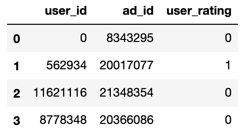
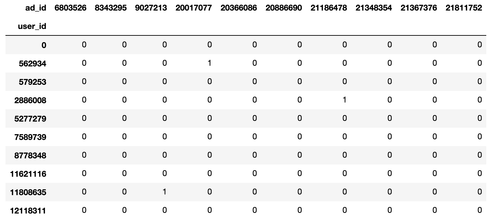
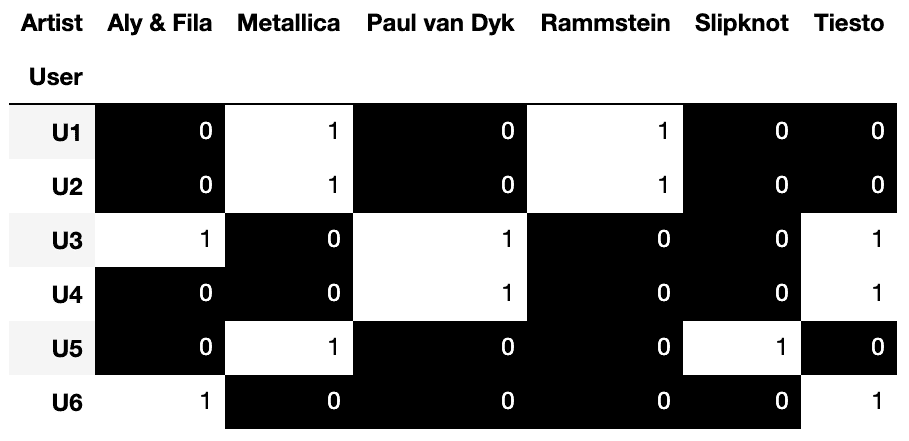
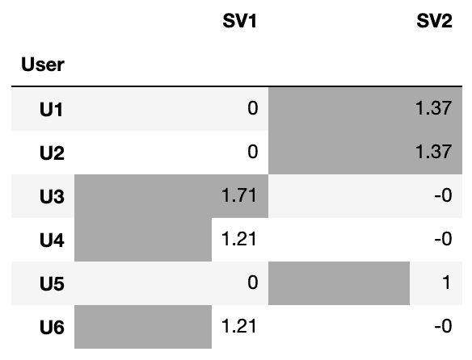

推荐系统 – 了解用户的口味

一个外行可能不知道那些控制股票交易所高频交易的复杂机器学习算法。他们也许不了解那些检测在线犯罪和控制外太空任务的算法。然而，他们每天都会与推荐引擎互动。他们是推荐引擎每天为他们挑选亚马逊上的书籍、在 Netflix 上选择他们下一部应该观看的电影、以及影响他们每天阅读新闻文章的见证者。推荐引擎在许多行业中的普及要求采用不同版本的推荐算法。

在本章中，我们将学习推荐系统使用的不同方法。我们将主要使用一个与 scikit-learn 相关的库——Surprise。Surprise 是一个实现不同协同过滤算法的工具包。因此，我们将从学习*协同过滤*算法和*基于内容的过滤*算法在推荐引擎中的区别开始。我们还将学习如何将训练好的模型打包，以便其他软件使用而无需重新训练。以下是本章将讨论的主题：

+   不同的推荐范式

+   下载 Surprise 和数据集

+   使用基于 KNN 的算法

+   使用基准算法

+   使用奇异值分解

+   在生产环境中部署机器学习模型

# 第十七章：不同的推荐范式

在推荐任务中，你有一组用户与一组物品互动，你的任务是弄清楚哪些物品适合哪些用户。你可能了解每个用户的一些信息：他们住在哪里、他们赚多少钱、他们是通过手机还是平板登录的，等等。类似地，对于一个物品——比如说一部电影——你知道它的类型、制作年份以及它获得了多少项奥斯卡奖。显然，这看起来像一个分类问题。你可以将用户特征与物品特征结合起来，为每个用户-物品对构建一个分类器，然后尝试预测用户是否会喜欢该物品。这种方法被称为**基于内容的过滤**。顾名思义，它的效果取决于从每个用户和每个物品中提取的内容或特征。在实践中，你可能只知道每个用户的一些基本信息。用户的位置信息或性别可能足以揭示他们的口味。这种方法也很难推广。例如，如果我们决定扩展推荐引擎，推荐电视连续剧。那时奥斯卡奖的数量可能就不相关了，我们可能需要将此特征替换为金球奖提名的数量。如果我们后来将其扩展到音乐呢？因此，考虑采用一种与内容无关的不同方法似乎更为合理。

**协同过滤**则不太关注用户或物品特征。相反，它假设那些已经对某些物品感兴趣的用户，将来可能对相同的物品也有兴趣。为了给您推荐物品，它基本上是通过招募与您相似的其他用户，并利用他们的决策来向您推荐物品。这里一个明显的问题是冷启动问题。当新用户加入时，很难立刻知道哪些用户与他们相似。此外，对于一个新物品，可能需要一段时间，直到某些用户发现它，系统才有可能将其推荐给其他用户。

由于每种方法都有其局限性，因此可以使用两者的混合方法。在最简单的形式中，我们可以向新用户推荐平台上最受欢迎的物品。一旦这些新用户消费了足够的物品，以便我们了解他们的兴趣，我们就可以开始结合更具协同过滤的方法，为他们量身定制推荐。

在本章中，我们将重点关注*协同过滤*范式。它是更常见的方法，我们在前面的章节中已经学会了如何构建为*基于内容的过滤*方法所需的分类器。我们将使用一个名为 Surprise 的库来演示不同的协同过滤算法。在接下来的部分，我们将安装 Surprise 并下载本章其余部分所需的数据。

# 下载 surprise 库和数据集

Nicolas Hug 创建了 Surprise [[`surpriselib.com`](http://surpriselib.com)]，它实现了我们在这里将使用的一些*协同过滤算法*。我正在使用该库的 1.1.0 版本。要通过 `pip` 下载相同版本的库，您可以在终端中运行以下命令：

*```py
          pip install -U scikit-surprise==1.1.0

```

在使用该库之前，我们还需要下载本章使用的数据集。

## 下载 KDD Cup 2012 数据集

我们将使用与[第十章](https://cdp.packtpub.com/hands_on_machine_learning_with_scikit_learn/wp-admin/post.php?post=32&action=edit)*不平衡学习 – 甚至不到 1%的人赢得彩票*中使用的相同数据集。数据发布在 **OpenML** 平台上。它包含了一系列记录。在每条记录中，一个用户看到了在线广告，并且有一列额外的信息说明该用户是否点击了广告。在前面提到的章节中，我们构建了一个分类器来预测用户是否会点击广告。我们在分类器中使用了广告和访问用户提供的特征。在本章中，我们将把这个问题框架化为协同过滤问题。因此，我们将只使用用户和广告的 ID，其他所有特征将被忽略，这次的目标标签将是用户评分。在这里，我们将下载数据并将其放入数据框中：

```py
from sklearn.datasets import fetch_openml

data = fetch_openml(data_id=1220)

df = pd.DataFrame(
    data['data'],
    columns=data['feature_names']
)[['user_id', 'ad_id']].astype(int)

df['user_rating'] = pd.Series(data['target']).astype(int)
```

我们将所有的列转换为整数。评级列采用二进制值，`1`表示点击或正向评分。我们可以看到，只有`16.8%`的记录导致了正向评分。我们可以通过打印`user_rating`列的均值来验证这一点，如下所示：

```py
df['user_rating'].mean()
```

我们还可以显示数据集的前四行。在这里，您可以看到用户和广告的 ID 以及给出的评分：



Surprise 库期望数据列的顺序完全按照这个格式。所以，目前不需要进行更多的数据处理。在接下来的章节中，我们将看到如何将这个数据框加载到库中，并将其分割成训练集和测试集。

## 处理和拆分数据集

从协同过滤的角度来看，两个用户如果对相同的物品给出相同的评分，则认为他们是相似的。在当前的数据格式中很难看到这一点。将数据转换为用户-物品评分矩阵会更好。这个矩阵的每一行表示一个用户，每一列表示一个物品，每个单元格中的值表示该用户给对应物品的评分。我们可以使用 `pandas` 的 `pivot` 方法来创建这个矩阵。在这里，我为数据集的前 10 条记录创建了矩阵：

```py
df.head(10).groupby(
    ['user_id', 'ad_id']
).max().reset_index().pivot(
    'user_id', 'ad_id', 'user_rating'
).fillna(0).astype(int)
```

这是得到的 `10` 个用户与 `10` 个物品的矩阵：



使用数据框自己实现这一点并不是最高效的做法。Surprise 库以更高效的方式存储数据。所以，我们将改用该库的 `Dataset` 模块。在加载数据之前，我们需要指定评分的尺度。在这里，我们将使用 `Reader` 模块来指定我们的评分是二进制值。然后，我们将使用数据集的 `load_from_df` 方法加载数据框。该方法需要我们的数据框以及前述的读取器实例：

```py
from surprise.dataset import Dataset
from surprise import Reader

reader = Reader(rating_scale=(0, 1))
dataset = Dataset.load_from_df(df, reader)
```

协同过滤算法不被认为是监督学习算法，因为缺乏特征和目标等概念。尽管如此，用户会对物品进行评分，我们尝试预测这些评分。这意味着我们仍然可以通过比较实际评分和预测评分来评估我们的算法。这就是为什么通常将数据分割为训练集和测试集，并使用评估指标来检验我们的预测。Surprise 提供了一个类似于 scikit-learn 中 `train_test_split` 函数的功能。我们将在这里使用它，将数据分割为 75% 的训练集和 25% 的测试集：

```py
from surprise.model_selection import train_test_split
trainset, testset = train_test_split(dataset, test_size=0.25)
```

除了训练-测试划分外，我们还可以进行**K 折交叉验证**。我们将使用**平均绝对误差**（**MAE**）和**均方根误差**（**RMSE**）来比较预测评分和实际评分。以下代码使用 4 折交叉验证，并打印四个折叠的平均 MAE 和 RMSE。为了方便不同算法的应用，我创建了一个`predict_evaluate`函数，它接受我们想使用的算法的实例。它还接受整个数据集，并且算法的名称会与结果一起打印出来。然后它使用`surprise`的`cross_validate`模块来计算期望误差并打印它们的平均值：

**```py
from surprise.model_selection import cross_validate

def predict_evaluate(recsys, dataset, name='Algorithm'):
    scores = cross_validate(
        recsys, dataset, measures=['RMSE', 'MAE'], cv=4
    )
    print(
        'Testset Avg. MAE: {:.2f} & Avg. RMSE: {:.2f} [{}]'.format(
            scores['test_mae'].mean(),
            scores['test_rmse'].mean(),
            name
        )
    )
```**

我们将在接下来的章节中使用这个函数。在了解不同算法之前，我们需要创建一个参考算法—一条用来与其他算法进行比较的标准。在下一节中，我们将创建一个给出随机结果的推荐系统。这个系统将是我们之后的参考算法。

## 创建一个随机推荐系统

我们知道 16.8%的记录会导致正向评分。因此，一个随机给 16.8%情况赋予正向评分的推荐系统，似乎是一个很好的参考，能够用来与其他算法进行比较。顺便说一句，我特意避免在这里使用*基准*这个术语，而是使用*参考*这样的词汇，因为这里使用的算法之一被称为*基准*。无论如何，我们可以通过创建一个继承自 Surprise 库中`AlgoBase`类的`RandomRating`类来创建我们的参考算法。库中的所有算法都继承自`AlgoBase`基础类，预计它们都需要实现一个估算方法。

这个方法会针对每一对用户-项目对进行调用，并期望返回该特定用户-项目对的预测评分。由于我们这里返回的是随机评分，我们将使用 NumPy 的`random`模块。在这里，我们将二项分布方法中的`n`设置为 1，这使得它变成了伯努利分布。在类初始化时，赋值给`p`的值指定了返回 1 的概率。默认情况下，50%的用户-项目对会得到`1`的评分，而 50%的用户-项目对会得到`0`的评分。我们将覆盖这个默认值，并在稍后的使用中将其设置为 16.8%。以下是新创建方法的代码：

```py
from surprise import AlgoBase

class RandomRating(AlgoBase):

    def __init__(self, p=0.5):
        self.p = p
        AlgoBase.__init__(self)

    def estimate(self, u, i):
        return np.random.binomial(n=1, p=self.p, size=1)[0]
```

我们需要将`p`的默认值更改为`16.8%`。然后，我们可以将`RandomRating`实例传递给`predict_evaluate`，以获得预测误差：

```py
recsys = RandomRating(p=0.168)
predict_evaluate(recsys, dataset, 'RandomRating')
```

上述代码给出了`0.28`的平均 MAE 和`0.53`的平均 RMSE。请记住，我们使用的是 K 折交叉验证。因此，我们计算每一折返回的平均误差的平均值。记住这些误差数字，因为我们预计更先进的算法会给出更低的误差。在接下来的章节中，我们将介绍最基础的协同过滤算法系列，其灵感来源于**K-近邻**（**KNN**）算法。

# 使用基于 KNN 的算法

我们已经遇到过足够多的 KNN**算法变种，因此它是我们解决推荐问题时的首选算法。在上一节中的用户-项评分矩阵中，每一行代表一个用户，每一列代表一个项。因此，相似的行代表口味相似的用户，相同的列代表喜欢相同项的用户。因此，如果我们想估算用户（*u*）对项（*i*）的评分（*r[u,i]*），我们可以获取与用户（*u*）最相似的 KNN，找到他们对项（*i*）的评分，然后计算他们评分的平均值，作为对（*r[u,i]*）的估算。然而，由于某些邻居比其他邻居与用户（*u*）更相似，我们可能需要使用加权平均值。与用户（*u*）更相似的邻居给出的评分应该比其他邻居的评分权重大。以下是一个公式，其中相似度得分用于加权用户邻居给出的评分：**

****

我们用术语*v*来表示*u*的邻居。因此，*r[v,i]*是每个邻居给项（*i*）的评分。相反，我们也可以根据*项相似度*而不是*用户相似度*来进行估算。然后，预期的评分（*r[u,i]*）将是用户（*u*）对其最相似项（*i*）评分的加权平均值。

你可能在想，我们现在是否可以设置邻居的数量，是否有多个相似度度量可以选择。两个问题的答案都是肯定的。我们稍后会深入探讨算法的超参数，但现在先使用它的默认值。一旦`KNNBasic`初始化完成，我们可以像在上一节中将`RandomRating`估算器传递给`predict_evaluate`函数那样，将其传递给`predict_evaluate`函数。运行以下代码之前，请确保计算机有足够的内存。

```py
from surprise.prediction_algorithms.knns import KNNBasic
recsys = KNNBasic()
predict_evaluate(recsys, dataset, 'KNNBasic')
```

这一次我们得到了`0.28`的平均 MAE 和`0.38`的平均 RMSE。考虑到`RandomRating`估算器是在盲目地做随机预测，而`KNNBasic`是基于用户相似性做决策的，平方误差的改善是预期之中的。

此处使用的数据集中的评分是二进制值。在其他一些场景中，用户可能允许给出 5 星评分，甚至给出从 0 到 100 的分数。在这些场景中，一个用户可能比另一个用户更慷慨地给出分数。我们两个人可能有相同的口味，但对我来说，5 星评分意味着电影非常好，而你自己从不给 5 星评分，你最喜欢的电影顶多获得 4 星评分。`KNNWithMeans`算法解决了这个问题。它是与`KNNBasic`几乎相同的算法，不同之处在于它最初会对每个用户给出的评分进行归一化，使得评分可以进行比较。

如前所述，我们可以选择`K`的数值以及使用的相似度得分。此外，我们还可以决定是否基于用户相似性或物品相似性来进行估计。在这里，我们将邻居数量设置为`20`，使用余弦相似度，并基于物品相似性来进行估计：

```py
from surprise.prediction_algorithms.knns import KNNBasic

sim_options = {
    'name': 'cosine', 'user_based': False
}
recsys = KNNBasic(k=20, sim_options=sim_options, verbose=False)
predict_evaluate(recsys, dataset, 'KNNBasic')
```

结果错误比之前更严重。我们得到的平均 MAE 为`0.29`，平均 RMSE 为`0.39`。显然，我们需要尝试不同的超参数，直到得到最佳结果。幸运的是，Surprise 提供了一个`GridSearchCV`助手来调节算法的超参数。我们基本上提供一个超参数值的列表，并指定我们需要用来评估算法的衡量标准。在下面的代码片段中，我们将衡量标准设置为`rmse`和`mae`。我们使用 4 折交叉验证，并在运行网格搜索时使用机器上的所有可用处理器。你现在可能已经知道，KNN 算法的预测时间较慢。因此，为了加速这一过程，我只在我们的数据集的一个子集上运行了搜索，如下所示：

```py
from surprise.model_selection import GridSearchCV
from surprise.prediction_algorithms.knns import KNNBasic

param_grid = {
    'sim_options': {
        'name':['cosine', 'pearson'],
    },
    'k': [5, 10, 20, 40],
    'verbose': [True],
}

dataset_subset = Dataset.load_from_df(
    df.sample(frac=0.25, random_state=0), reader
)
gscv = GridSearchCV(
    KNNBasic, param_grid, measures=['rmse', 'mae'], 
    cv=4, n_jobs=-1
)
gscv.fit(dataset_subset)

print('Best MAE:', gscv.best_score['mae'].round(2))
print('Best RMSE:', gscv.best_score['rmse'].round(2))
print('Best Params', gscv.best_params['rmse'])
```

我们得到的平均 MAE 为`0.28`，平均 RMSE 为`0.38`。这些结果与使用默认超参数时相同。然而，`GridSearchCV`选择了`K`值为`20`，而默认值为`40`。它还选择了**皮尔逊相关系数**作为相似度衡量标准。

KNN 算法较慢，并没有为我们的数据集提供最佳的性能。因此，在下一部分中，我们将尝试使用非实例基础的学习器。

# 使用基准算法

最近邻算法的简单性是一把双刃剑。一方面，它更容易掌握，但另一方面，它缺乏一个可以在训练过程中优化的目标函数。这也意味着它的大部分计算是在预测时进行的。为了解决这些问题，Yehuda Koren 将推荐问题表述为一个优化任务。然而，对于每个用户-物品对，我们仍然需要估计一个评分（*r[u,i]*）。这次期望的评分是以下三元组的总和：

+   ：所有用户对所有物品的总体平均评分

+   *b[u]*：表示用户(*u*)与总体平均评分的偏差

+   *b[i]*：表示项目(*i*)偏离平均评分的术语

这是期望评分的公式：


对于训练集中的每一对用户-项目，我们知道其实际评分(*r[u,i]*)，现在我们要做的就是找出最优的*b[u]*和*b[i]*值。我们的目标是最小化实际评分(*r[u,i]*)与上述公式中*期望评分*(*r[u,i]*)之间的差异。换句话说，我们需要一个求解器在给定训练数据时学习这些项的值。实际上，基准算法尝试最小化实际评分与期望评分之间的平均平方差。它还添加了一个正则化项，用来惩罚(*b[u]*)和(*b[i]*)，以避免过拟合。更多关于正则化概念的理解，请参见[第三章](https://cdp.packtpub.com/hands_on_machine_learning_with_scikit_learn/wp-admin/post.php?post=26&action=edit)*，用线性方程做决策*。

学到的系数(*b[u]*和*b[i]*)是描述每个用户和每个项目的向量。在预测时，如果遇到新用户，*b[u]*将设置为`0`。类似地，如果遇到在训练集中未出现过的新项目，*b[i]*将设置为`0`。

有两个求解器可用于解决此优化问题：**随机梯度下降** (**SGD**) 和 **交替最小二乘法** (**ALS**)。默认使用 ALS。每个求解器都有自己的设置，如最大迭代次数和学习率。此外，您还可以调整正则化参数。

这是使用其默认超参数的模型：

```py
from surprise.prediction_algorithms.baseline_only import BaselineOnly
recsys = BaselineOnly(verbose=False)
predict_evaluate(recsys, dataset, 'BaselineOnly')
```

这次，我们得到了平均 MAE 为`0.27`，平均 RMSE 为`0.37`。同样，`GridSearchCV`可以用来调整模型的超参数。参数调优部分留给你去尝试。现在，我们进入第三个算法：**奇异值分解** (**SVD**)。

# 使用奇异值分解

用户-项目评分矩阵通常是一个巨大的矩阵。我们从数据集中得到的矩阵包含 30,114 行和 19,228 列，其中大多数值（99.999%）都是零。这是预期中的情况。假设你拥有一个包含数千部电影的流媒体服务库。用户观看的电影数量很少，因此矩阵中的零值非常多。这种稀疏性带来了另一个问题。如果一个用户观看了电影*宿醉：第一部*，而另一个用户观看了*宿醉：第二部*，从矩阵的角度来看，他们看的是两部不同的电影。我们已经知道，协同过滤算法不会使用用户或项目的特征。因此，它无法意识到*宿醉*的两部作品属于同一系列，更不用说它们都是喜剧片了。为了解决这个问题，我们需要转换我们的用户-项目评分矩阵。我们希望新的矩阵，或者多个矩阵，能够更小并更好地捕捉用户和项目之间的相似性。

**SVD**是一种用于降维的矩阵分解算法，它与我们在[第五章](https://cdp.packtpub.com/hands_on_machine_learning_with_scikit_learn/wp-admin/post.php?post=28&action=edit)*《使用最近邻的图像处理》*中讨论的**主成分分析**（**PCA**）非常相似。与 PCA 中的主成分不同，得到的奇异值捕捉了用户-项目评分矩阵中用户和项目的潜在信息。如果之前的句子不太清楚也不用担心。在接下来的章节中，我们将通过一个例子更好地理解这个算法。

## 通过 SVD 提取潜在信息

没有什么能比音乐更能体现品味了。让我们来看一下下面这个数据集。在这里，我们有六个用户，每个用户都投票选出了自己喜欢的音乐人：

```py
music_ratings = [('U1', 'Metallica'), ('U1', 'Rammstein'), ('U2', 'Rammstein'), ('U3', 'Tiesto'), ('U3', 'Paul van Dyk'), ('U2', 'Metallica'), ('U4', 'Tiesto'), ('U4', 'Paul van Dyk'), ('U5', 'Metallica'), ('U5', 'Slipknot'), ('U6', 'Tiesto'), ('U6', 'Aly & Fila'), ('U3', 'Aly & Fila')]
```

我们可以将这些评分放入数据框，并使用数据框的`pivot`方法将其转换为用户-项目评分矩阵，具体方法如下：

```py
df_music_ratings = pd.DataFrame(music_ratings, columns=['User', 'Artist'])
df_music_ratings['Rating'] = 1

df_music_ratings_pivoted = df_music_ratings.pivot(
    'User', 'Artist', 'Rating'
).fillna(0)
```

这是得到的矩阵。我使用了`pandas`样式，将不同的评分用不同的颜色表示，以便清晰区分：



很明显，用户 1、2 和 5 喜欢金属音乐，而用户 3、4 和 6 喜欢迷幻音乐。尽管用户 5 只与用户 1 和 2 共享一个乐队，但我们仍然可以看出这一点。也许我们之所以能够看到这一点，是因为我们了解这些音乐人，并且我们从整体的角度来看待矩阵，而不是专注于单独的用户对。我们可以使用 scikit-learn 的`TruncatedSVD`函数来降低矩阵的维度，并通过*N*个组件（单一向量）来表示每个用户和音乐人。以下代码片段计算了带有两个*单一向量*的`TruncatedSVD`。然后，`transform`函数返回一个新的矩阵，其中每一行代表六个用户中的一个，每一列对应两个单一向量之一：

```py
from sklearn.decomposition import TruncatedSVD
svd = TruncatedSVD(n_components=2)
svd.fit_transform(df_music_ratings_pivoted).round(2)
```

再次，我将结果矩阵放入数据框，并使用其样式根据值给单元格上色。以下是实现这一点的代码：

```py
pd.DataFrame(
    svd.fit_transform(df_music_ratings_pivoted),
    index=df_music_ratings_pivoted.index,
    columns=['SV1', 'SV2'], 
).round(2).style.bar(
    subset=['SV1', 'SV2'], align='mid', color='#AAA'
)
```

这是结果数据框：



你可以将这两个组件视为一种音乐风格。很明显，较小的矩阵能够捕捉到用户在风格上的偏好。用户 1、2 和 5 现在更加接近彼此，用户 3、4 和 6 也是如此，他们彼此之间比原始矩阵中的更为接近。我们将在下一节中使用余弦相似度得分来更清楚地展示这一点。

这里使用的概念也适用于文本数据。诸如`search`、`find`和`forage`等词汇具有相似的意义。因此，`TruncatedSVD`变换器可以用来将**向量空间模型**（**VSM**）压缩到一个较低的空间，然后再将其用于有监督或无监督的学习算法。在这种背景下，它被称为**潜在语义分析**（**LSA**）。

*这种压缩不仅捕捉到了较大矩阵中不明显的潜在信息，还帮助了距离计算。我们已经知道，像 KNN 这样的算法在低维度下效果最好。不要仅仅相信我的话，在下一节中，我们将比较基于原始用户-物品评分矩阵与二维矩阵计算的余弦距离。

### 比较两个矩阵的相似度度量

我们可以计算所有用户之间的余弦相似度。我们将从原始的用户-物品评分矩阵开始。在计算用户 1、2、3 和 5 的配对余弦相似度后，我们将结果放入数据框并应用一些样式以便于查看：

```py
from sklearn.metrics.pairwise import cosine_similarity

user_ids = ['U1', 'U2', 'U3', 'U5']

pd.DataFrame(
    cosine_similarity(
        df_music_ratings_pivoted.loc[user_ids, :].values
    ),
    index=user_ids,
    columns=user_ids
).round(2).style.bar(
    subset=user_ids, align='mid', color='#AAA'
)
```

以下是四个用户之间的配对相似度结果：


的确，用户 5 比用户 3 更像用户 1 和用户 2。然而，他们之间的相似度并没有我们预期的那么高。现在我们来通过使用`TruncatedSVD`来计算相同的相似度：

```py
from sklearn.metrics.pairwise import cosine_similarity
from sklearn.decomposition import TruncatedSVD

user_ids = ['U1', 'U2', 'U3', 'U5']

svd = TruncatedSVD(n_components=2)
df_user_svd = pd.DataFrame(
    svd.fit_transform(df_music_ratings_pivoted),
    index=df_music_ratings_pivoted.index,
    columns=['SV1', 'SV2'], 
)

pd.DataFrame(
    cosine_similarity(
        df_user_svd.loc[user_ids, :].values
    ),
    index=user_ids,
    columns=user_ids
).round(2).style.bar(
    subset=user_ids, align='mid', color='#AAA'
)
```

新的计算方法这次捕捉了音乐家之间的潜在相似性，并在比较用户时考虑了这一点。以下是新的相似度矩阵：


显然，用户 5 比以前更像用户 1 和用户 2。忽略这里某些零前的负号，这是因为 Python 实现了**IEEE**（**电气和电子工程师协会**）标准的浮点运算。

自然，我们也可以根据音乐家的风格（单一向量）来表示他们。这种矩阵可以通过`svd.components_`检索。然后，我们可以计算不同音乐家之间的相似度。这种转换也建议作为稀疏数据聚类的初步步骤。

现在，这个版本的`SVD`已经清晰了，在实践中，当处理大数据集时，通常会使用更具可扩展性的矩阵分解算法。**概率矩阵分解** (**P****MF***)*与观测数量成线性比例，并且在稀疏和不平衡数据集上表现良好。在下一节中，我们将使用 Surprise 的 PMF 实现。

## 使用 SVD 进行点击预测

我们现在可以使用 Surprise 的`SVD`算法来预测我们数据集中的点击。让我们从算法的默认参数开始，然后稍后再解释：

```py
from surprise.prediction_algorithms.matrix_factorization import SVD
recsys = SVD()
predict_evaluate(recsys, dataset, 'SVD')
```

这次，我们得到的平均 MAE 为`0.27`，平均 RMSE 为`0.37`。这些结果与之前使用的基准算法类似。事实上，Surprise 的`SVD`实现是基准算法和`SVD`的结合。它使用以下公式表示用户-项目评分：


方程的前三项（(，*b[u]* 和 *b[i]*）与基准算法相同。第四项表示两个相似矩阵的乘积，这些矩阵与我们从`TruncatedSVD`得到的矩阵类似。*q[i]*矩阵将每个项目表示为多个单一向量。类似地，*p[u]*矩阵将每个用户表示为多个单一向量。项目矩阵被转置，因此上面有一个*T*字母。然后，算法使用**SGD**来最小化预期评分与实际评分之间的平方差。与基准模型类似，它还对预期评分的系数（*b[u], b[i], q[i],* 和 *p[u]*）进行正则化，以避免过拟合。

我们可以忽略方程的基准部分——即通过设置`biased=False`来移除前面三个系数（(，*b[u]* 和 *b[i]*）。使用的单一向量数量由`n_factors`超参数设置。我们还可以通过`n_epochs`控制`SGD`的迭代次数。此外，还有其他超参数用于设置算法的学习率、正则化以及系数的初始值。你可以使用`surprise`提供的参数调优助手来找到这些参数的最佳组合——即`GridSearchCV`或`RandomizedSearchCV`。

我们对推荐系统及其各种算法的讨论标志着本书中机器学习话题的结束。与这里讨论的其他所有算法一样，只有在将其投入生产环境并供他人使用时，它们才有意义。在下一节中，我们将看到如何部署一个训练好的算法并让其他人使用它。

# 在生产环境中部署机器学习模型

使用机器学习模型有两种主要模式：

+   **批量预测**：在这种模式下，你在一段时间后加载一批数据记录——例如，每晚或每月一次。然后，你对这些数据进行预测。通常，在这里延迟不是问题，你可以将训练和预测代码放入单个批处理作业中。一个例外情况是，如果你需要过于频繁地运行作业，以至于每次作业运行时都没有足够的时间重新训练模型。那么，训练一次模型，将其存储在某处，并在每次进行新的批量预测时加载它是有意义的。

+   **在线** **预测**：在这个模型中，你的模型通常被部署在**应用程序编程接口**（**API**）后面。每次调用 API 时，通常会传入一条数据记录，API 需要为这条记录做出预测并返回结果。这里低延迟是至关重要的，通常建议训练模型一次，将其存储在某处，并在每次新的 API 调用时使用预训练模型。

如你所见，在这两种情况下，我们可能需要将模型训练过程中使用的代码与预测时使用的代码分开。无论是监督学习算法还是无监督学习算法，除了编写代码的行数外，拟合的模型还依赖于从数据中学习到的系数和参数。因此，我们需要一种方法来将代码和学习到的参数作为一个单元存储。这个单元可以在训练后保存，并在预测时使用。为了能够将函数或对象存储在文件中或通过互联网共享，我们需要将它们转换为标准格式或协议。这个过程被称为序列化。`pickle`是 Python 中最常用的序列化协议之一。Python 标准库提供了序列化对象的工具；然而，`joblib`在处理 NumPy 数组时是一个更高效的选择。为了能够使用这个库，你需要通过`pip`在终端中运行以下命令来安装它：

```py
          pip
          install
          joblib

```

安装完成后，你可以使用`joblib`将任何东西保存到磁盘文件中。例如，在拟合基线算法后，我们可以使用`joblib`函数的`dump`方法来存储拟合的对象。该方法除了模型的对象外，还需要提供一个保存对象的文件名。我们通常使用`.pkl`扩展名来表示`pickle`文件：

```py
import joblib
from surprise.prediction_algorithms.baseline_only import BaselineOnly

recsys = BaselineOnly()
recsys.fit(trainset)
joblib.dump(recsys, 'recsys.pkl') 
```

一旦保存到磁盘，任何其他 Python 代码都可以再次加载相同的模型，并立即使用它，而无需重新拟合。在这里，我们加载已序列化的算法，并使用它对测试集进行预测：

```py
from surprise import accuracy
recsys = joblib.load('recsys.pkl') 
predictions = recsys.test(testset)
```

这里使用了一个`surprise`估算器，因为这是我们在本章中一直使用的库。然而，任何 Python 对象都可以以相同的方式被序列化并加载。前几章中使用的任何估算器也可以以相同的方式使用。此外，你还可以编写自己的类，实例化它们，并序列化生成的对象。

若要将你的模型部署为 API，你可能需要使用如**Flask**或**CherryPy**之类的 Web 框架。开发 Web 应用超出了本书的范围，但一旦你学会如何构建它们，加载已保存的模型应该会很简单。建议在 Web 应用启动时加载已保存的对象。这样，如果每次收到新请求时都重新加载对象，你就不会引入额外的延迟。

# 摘要

本章标志着本书的结束。我希望到现在为止，这里讨论的所有概念都已经清晰明了。我也希望每个算法的理论背景与实际应用的结合，能够为你提供解决实际生活中不同问题的途径。显然，没有任何一本书能够得出最终结论，未来你会接触到新的算法和工具。不过，Pedro Domingos 将机器学习算法分为五个类别。除了进化算法外，我们已经学习了属于 Domingos 五个类别中的四个类别的算法。因此，我希望这里讨论的各种算法，每种都有其独特的方法，在未来处理任何新的机器学习问题时，能够为你提供坚实的基础。

所有的书籍都是一个不断完善的过程。它们的价值不仅体现在内容上，还包括它们激发的未来讨论所带来的价值。每次你分享基于书籍中获得的知识所构建的内容时，作者都会感到高兴。每次你引用他们的观点，分享更好、更清晰的解释方式，甚至纠正他们的错误时，他们也会同样高兴。我也期待着你为此做出的宝贵贡献。******
