# 第六章 数值数据预测——回归方法

数学关系帮助我们理解日常生活中的许多方面。例如，体重是摄入卡路里的函数，收入通常与教育和工作经验有关，民意调查数据帮助我们估计总统候选人连任的几率。

当这些关系用精确的数字表示时，我们获得了更多的清晰度。例如，每天额外摄入 250 千卡的热量可能导致每月增加近 1 公斤体重；每增加一年的工作经验，年薪可能增加$1,000；而在经济强劲时，总统连任的可能性更大。显然，这些方程式并不完美适用于每种情况，但我们可以预期它们在平均情况下是相对正确的。

本章通过超越前面所述的分类方法，引入了估计数值数据之间关系的技术，从而扩展了我们的机器学习工具包。在研究几个现实世界的数值预测任务时，您将学习到：

+   回归中使用的基本统计原理，一种模拟数值关系的大小和强度的技术

+   如何准备回归分析的数据，并估算和解读回归模型

+   一对混合技术，称为回归树和模型树，它们将决策树分类器适应于数值预测任务

基于统计学领域的大量研究，本章所用的方法在数学方面略重于之前所讲的内容，但别担心！即使你的代数技能有些生疏，R 语言会帮你完成繁重的计算。

# 理解回归

回归分析关注的是指定单一数值**因变量**（即要预测的值）与一个或多个数值**自变量**（即预测变量）之间的关系。顾名思义，因变量取决于自变量的值。回归的最简单形式假设自变量与因变量之间的关系呈直线。

### 注意

“回归”一词用于描述将线条拟合到数据的过程，源自 19 世纪末弗朗西斯·高尔顿爵士在遗传学研究中的发现。他发现，极端矮小或极端高大的父亲，往往有身高更接近平均值的儿子。他将这一现象称为“回归到均值”。

你可能还记得从基础代数中，直线可以用**斜率-截距形式**来定义，类似于 *y = a + bx*。在这种形式中，字母*y*表示因变量，*x*表示自变量。**斜率**项*b*指定了直线在*x*每增加一个单位时上升的量。正值定义了向上倾斜的直线，而负值则定义了向下倾斜的直线。项*a*被称为**截距**，因为它指定了直线交叉或截取垂直*y*轴的点。它表示当*x = 0*时*y*的值。


回归方程使用类似于斜率-截距形式的数据模型。机器的任务是确定* a *和* b *的值，使得指定的直线能最好地将提供的*x*值与*y*值关联起来。可能并不总是存在一个完美关联这些值的单一函数，因此机器还必须有某种方式来量化误差范围。我们稍后会深入讨论这一点。

回归分析通常用于建模数据元素之间的复杂关系，估计处理对结果的影响，并进行未来的外推。尽管它可以应用于几乎任何任务，但一些特定的应用案例包括：

+   检验群体和个体在其测量特征上的变异性，广泛应用于经济学、社会学、心理学、物理学和生态学等多个学科的科学研究。

+   定量分析事件与响应之间的因果关系，例如临床药物试验、工程安全测试或市场调研中的因果关系。

+   识别可以用来根据已知标准预测未来行为的模式，如预测保险理赔、自然灾害损失、选举结果和犯罪率等。

回归方法也用于**统计假设检验**，该方法通过观察到的数据来判断一个前提是否可能为真或为假。回归模型对关系的强度和一致性的估计提供了可以用来评估观察结果是否仅仅由偶然因素造成的信息。

### 注意

假设检验是极其复杂的，超出了机器学习的范畴。如果你对这个话题感兴趣，入门级统计学教材是一个很好的起点。

回归分析并不等同于单一算法。相反，它是一个涵盖大量方法的总称，这些方法可以适应几乎任何机器学习任务。如果你只能选择一种方法，回归方法是一个不错的选择。有人可以将一生献给这一领域，或许仍然有许多要学习的内容。

本章将仅关注最基本的**线性回归**模型——那些使用直线的模型。当只有一个自变量时，称为**简单线性回归**。当有两个或更多自变量时，称为**多元线性回归**，或简称为“多元回归”。这两种技术都假设因变量是连续量度的。

回归还可以用于其他类型的因变量，甚至一些分类任务。例如，**逻辑回归**用于建模二元分类结果，而**泊松回归**——以法国数学家西门·泊松命名——用于建模整数计数数据。被称为**多项式逻辑回归**的方法则用于建模分类结果，因此它可以用于分类。所有回归方法遵循相同的基本原理，因此在理解了线性回归后，学习其他方法相对简单。

### 提示

许多专业的回归方法属于**广义线性模型**（**GLM**）类。使用 GLM 时，线性模型可以通过使用**链接函数**来推广到其他模式，这些函数为*x*和*y*之间的关系指定了更复杂的形式。这样，回归就可以应用于几乎任何类型的数据。

我们将从简单线性回归的基本情况开始。尽管名字中有“简单”二字，这种方法并不简单，仍能解决复杂问题。在下一节中，我们将看到如何通过使用简单线性回归模型来避免一次悲剧性的工程灾难。

## 简单线性回归

1986 年 1 月 28 日，美国航天飞机*挑战者号*的七名机组成员在火箭助推器发生故障后丧生，导致灾难性的解体。在事后，专家们将发射温度视为潜在的罪魁祸首。负责密封火箭接头的橡胶 O 型环从未在 40ºF（4ºC）以下的温度下进行过测试，而发射当天的天气异常寒冷，气温低于冰点。

从后见之明来看，这起事故成为了数据分析和可视化重要性的案例研究。尽管目前不清楚火箭工程师和决策者在发射前掌握了哪些信息，但不可否认的是，如果有更好的数据并加以谨慎使用，很可能能够避免这场灾难。

### 注意

本节分析基于 Dalal SR, Fowlkes EB, Hoadley B. *航天飞机的风险分析：挑战者号发射前的故障预测*。美国统计学会学报，1989 年；84：945-957。有关数据如何改变结果的一个视角，参见 Tufte ER. *视觉解释：图像与数量、证据与叙述*。Graphics Press，1997 年。一个反观点请参见 Robison W, Boisioly R, Hoeker D, Young, S. *代表与误代表：Tufte 与 Morton Thiokol 工程师对挑战者号的看法*。科学与工程伦理，2002 年；8：59-81。

火箭工程师几乎肯定知道，低温可能使部件变脆，无法正确密封，从而导致更高的危险燃料泄漏的可能性。然而，考虑到继续发射的政治压力，他们需要数据来支持这一假设。一个能够展示温度与 O 型环故障之间关联的回归模型，并能够根据预期的发射温度预测故障的可能性，可能会非常有帮助。

为了构建回归模型，科学家们可能使用了来自 23 次成功航天飞机发射的数据，包括发射温度和部件故障数据。部件故障表示两种问题之一。第一个问题叫做侵蚀，当过热烧坏 O 型环时就会发生这种情况。第二个问题叫做泄漏，当热气体通过或“冲过”密封不良的 O 型环时，就会发生泄漏。由于航天飞机总共有六个主要 O 型环，因此每次飞行最多可能发生六个故障事件。尽管火箭可以在发生一个或多个故障事件的情况下生还，或者在发生一个故障事件的情况下就失败，但每增加一个故障事件，灾难性失败的概率就会增加。

以下散点图展示了前 23 次发射中检测到的主要 O 型环故障与发射温度的关系：

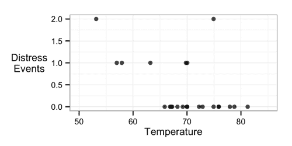

观察图表，可以发现一个明显的趋势。发生在较高温度下的发射，O 型环故障事件较少。

此外，最冷的发射温度（53º F）发生了两次故障事件，这是在另外一次发射中才达到的水平。掌握了这些信息后，可以看出挑战者号计划在比这低 20 多度的温度下发射，这似乎令人担忧。那么我们到底应该多担心呢？为了回答这个问题，我们可以借助简单线性回归。

简单线性回归模型通过使用一个由方程定义的直线，定义了一个因变量与单一自变量之间的关系，方程形式如下：


不要被希腊字符吓到，这个方程仍然可以通过之前描述的斜截式形式来理解。截距，*α*（阿尔法），描述了直线与*y*轴的交点，而斜率，*β*（贝塔），描述了当*x*增加时，*y*的变化。对于航天飞机发射数据，斜率告诉我们每升高 1 度发射温度，O 型环故障的预期减少量。

### 提示

希腊字符常常在统计学领域中用来表示统计函数的参数变量。因此，进行回归分析时，需要找到**参数估计值**，即*α*和*β*的估计值。阿尔法和贝塔的参数估计值通常用*a*和*b*表示，尽管你可能会发现这些术语和符号有时可以互换使用。

假设我们知道航天飞机发射数据的回归方程中估计的回归参数为：*a = 3.70*和*b = -0.048*。

因此，完整的线性方程是*y = 3.70 – 0.048x*。暂时忽略这些数字是如何得出的，我们可以像这样将直线绘制在散点图上：

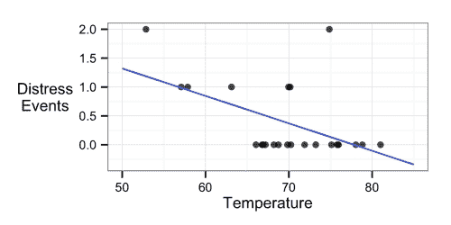

如图所示，在华氏 60 度时，我们预测 O 型环故障略低于 1 个；在华氏 70 度时，我们预计约有 0.3 个故障。如果我们将模型外推到 31 度——挑战者号发射时的预测温度——我们预计将有大约*3.70 - 0.048 * 31 = 2.21*个 O 型环故障事件。假设每个 O 型环故障都有相同的概率导致灾难性的燃料泄漏，那么在 31 度时，挑战者号发射的风险几乎是 60 度典型发射的三倍，是 70 度发射的八倍以上。

注意，直线并不是精确通过每一个数据点的。相反，它大致穿过数据，部分预测值高于直线，部分低于直线。在下一部分中，我们将学习为什么选择了这条特定的直线。

## 普通最小二乘估计

为了确定*α*和*β*的最优估计值，使用了一种叫做**普通最小二乘法**（**OLS**）的估计方法。在 OLS 回归中，选择的斜率和截距是为了最小化平方误差的和，即预测的*y*值与实际的*y*值之间的垂直距离。这些误差被称为**残差**，并在以下图示中为若干点进行了说明：

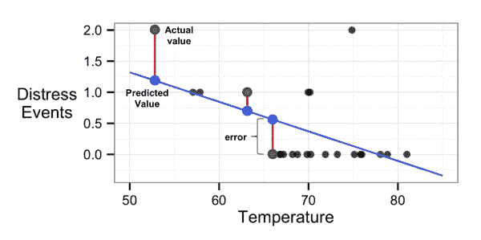

用数学术语表达，OLS 回归的目标可以表示为最小化以下方程：


用通俗的话来说，这个方程将*e*（误差）定义为实际的*y*值与预测的*y*值之间的差异。误差值被平方并在所有数据点上求和。

### 提示

位于* y *项上方的插入符号（`^`）是统计符号中常用的功能。它表示该项是对真实* y *值的估计。这被称为* y *帽，发音就像你头上戴的帽子。

* a *的解依赖于* b *的值。可以使用以下公式来获得：


### 提示

为了理解这些方程式，您需要了解另一个统计符号。出现在* x *和* y *项上方的横杠表示* x *或* y *的平均值。这被称为* x *横杠或* y *横杠，发音就像你去喝酒的地方。

尽管证明超出了本书的范围，但可以使用微积分来证明，导致最小平方误差的* b *值为：


如果我们将这个方程拆解成其组成部分，我们可以稍微简化它。* b *的分母应该看起来很熟悉；它非常类似于* x *的方差，表示为* Var(x)*。正如我们在第二章《管理与理解数据》中学到的，方差涉及找到* x *均值的平均平方偏差。可以表示为：


分子涉及将每个数据点从均值* x *值的偏差与该点从均值* y *值的偏差相乘。这类似于* x *和* y *的**协方差**函数，表示为* Cov(x, y)*。协方差公式为：


如果我们将协方差函数除以方差函数，* n *项将被取消，我们可以将* b *的公式重写为：


给定这个重述，通过使用内置的 R 函数，计算* b *的值变得很容易。让我们将其应用于火箭发射数据，来估算回归线。

### 提示

如果您想跟随这些示例，请从 Packt Publishing 网站下载`challenger.csv`文件，并使用`launch <- read.csv("challenger.csv")`命令加载到数据框中。

假设我们的航天飞机发射数据存储在一个名为`launch`的数据框中，独立变量* x *是温度，依赖变量* y *是`distress_ct`。然后我们可以使用 R 的`cov()`和`var()`函数来估算* b *：

```py
> b <- cov(launch$temperature, launch$distress_ct) /
 var(launch$temperature)
> b
[1] -0.04753968

```

从这里我们可以使用`mean()`函数估算* a *：

```py
> a <- mean(launch$distress_ct) - b * mean(launch$temperature)
> a
[1] 3.698413

```

手动估计回归方程并不理想，因此 R 提供了自动执行此计算的函数。我们将很快使用这些方法。首先，我们将通过学习一种测量线性关系强度的方法来扩展我们对回归的理解，然后我们将看到如何将线性回归应用于包含多个自变量的数据。

## 相关性

**相关性**是两个变量之间的一个数字，表示它们的关系与一条直线的贴合程度。通常，相关性指的是 **Pearson 相关系数**，它由 20 世纪的数学家 Karl Pearson 开发。相关性范围在 -1 到 +1 之间。极端值表示完美的线性关系，而接近零的相关性则表示缺乏线性关系。

以下公式定义了 Pearson 相关性：


### 提示

这里引入了更多的希腊符号。第一个符号（看起来像小写字母 p）是 *rho*，用于表示 Pearson 相关性统计量。那些看起来像横过的 q 字母是希腊字母 *sigma*，它们表示 *x* 或 *y* 的标准差。

使用这个公式，我们可以计算发射温度与 O 环密封件故障事件数量之间的相关性。回顾一下，协方差函数是`cov()`，标准差函数是`sd()`。我们将把结果存储在`r`中，这是一个常用于表示估计相关性的字母：

```py
> r <- cov(launch$temperature, launch$distress_ct) /
 (sd(launch$temperature) * sd(launch$distress_ct))
> r
[1] -0.5111264

```

或者，我们可以使用 R 的相关性函数`cor()`：

```py
> cor(launch$temperature, launch$distress_ct)
[1] -0.5111264

```

温度与受损 O 环数量之间的相关性为 -0.51。负相关意味着温度的升高与 O 环受损数量的减少相关联。对于研究 O 环数据的 NASA 工程师来说，这将是一个非常明显的指标，表明低温发射可能会存在问题。相关性还告诉我们温度与 O 环受损之间关系的相对强度。由于 -0.51 距离最大负相关 -1 还差一半，这意味着它们之间有着适度强的负线性关联。

有各种经验法则用于解释相关性的强度。一种方法是将 0.1 到 0.3 之间的值标为“弱”，0.3 到 0.5 之间的值标为“中等”，大于 0.5 的值标为“强”（这些也适用于负相关的类似范围）。然而，这些阈值对于某些目的来说可能太宽松了。通常，相关性必须结合上下文进行解释。对于涉及人类的数据，0.5 的相关性可能被认为是极高的，而对于由机械过程生成的数据，0.5 的相关性可能较弱。

### 提示

你可能听过“相关性不代表因果关系”这一说法。其根源在于，相关性仅描述了两个变量之间的关联，但可能存在其他未测量的解释。例如，死亡率与每天观看电影的时间之间可能有很强的关联，但在医生开始建议我们都多看电影之前，我们需要排除另一种解释——年轻人看更多的电影，并且死亡的可能性较小。

衡量两个变量之间的相关性为我们提供了一种快速评估独立变量和依赖变量之间关系的方法。随着我们开始使用更多预测变量定义回归模型，这一点将变得愈加重要。

## 多元线性回归

大多数实际分析都有多个独立变量。因此，你很可能会使用**多元线性回归**来进行大多数数值预测任务。多元线性回归的优缺点见下表：

| 优点 | 缺点 |
| --- | --- |

|

+   到目前为止，建模数值数据最常见的方法

+   可以适应几乎任何建模任务

+   提供特征与结果之间关系的强度和大小的估计

|

+   对数据做出了强假设

+   模型的形式必须由用户提前指定

+   不处理缺失数据

+   仅适用于数值特征，因此分类数据需要额外的处理

+   需要一定的统计学知识才能理解该模型

|

我们可以将多元回归理解为简单线性回归的扩展。两者的目标相似——寻找能够最小化线性方程预测误差的β系数值。关键的不同点在于，针对额外的独立变量，有了更多的项。 

多元回归方程通常遵循以下方程的形式。依赖变量 *y* 被指定为截距项 *α* 与估计的 *β* 值与每个 *i* 特征的 *x* 值之积的和。这里加入了一个误差项（用希腊字母 *epsilon* 表示），以提醒我们预测并不完美。这代表了前面提到的**残差**项：


让我们暂时考虑一下估计的回归参数的解释。你会注意到，在前面的方程中，为每个特征提供了一个系数。这使得每个特征对 *y* 值的影响可以单独估计。换句话说，*y* 会因每个 *x[i]* 单位增加而改变 *β[i]* 的数量。截距 *α* 则是当所有独立变量为零时 *y* 的期望值。

由于截距项*α*与其他任何回归参数并无不同，它有时也被表示为*β[0]*（读作 beta 零），如以下公式所示：


就像之前一样，截距与任何自变量*x*并无直接关系。然而，出于很快会变得清晰的原因，帮助理解的方式是将*β[0]*想象成与一个常数项*x[0]*相乘，其中*x[0]*的值为 1：


为了估计回归参数的值，每个观测值的因变量*y*必须通过前述形式的回归方程与观测值的自变量*x*相关联。以下图展示了这种结构：

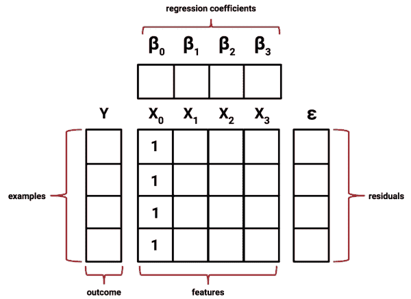

前面图示中展示的大量行列数据，可以用粗体字体的**矩阵符号**来简洁地表示，表明每个术语代表多个值：


现在，因变量是一个向量**Y**，每一行对应一个示例。自变量已经合并成一个矩阵**X**，其中每列对应一个特征，另外还有一列全为'1'的值，代表截距项。每列有一个对应示例的行。回归系数**β**和残差**ε**现在也都是向量。

目标是解出**β**，即回归系数向量，它最小化预测值与实际**Y**值之间的平方误差和。寻找最优解需要使用矩阵代数；因此，推导过程需要比本书所能提供的更为详细的关注。不过，如果你愿意相信他人的研究，**β**向量的最佳估计可以通过以下方式计算：


这个解决方案使用了一对矩阵运算——**T**表示矩阵**X**的**转置**，而负指数表示**矩阵的逆**。使用 R 的内置矩阵运算，我们可以实现一个简单的多元回归学习器。接下来，我们将这个公式应用于挑战者发射数据。

### 提示

如果你对前面的矩阵运算不熟悉，维基百科上关于转置和矩阵逆的页面提供了详细的介绍，即使没有强大的数学背景，也能很好地理解。

使用以下代码，我们可以创建一个名为`reg()`的基本回归函数，它接受一个参数`y`和一个参数`x`，并返回一个估计的 beta 系数向量：

```py
reg <- function(y, x) {
 x <- as.matrix(x)
 x <- cbind(Intercept = 1, x)
 b <- solve(t(x) %*% x) %*% t(x) %*% y
 colnames(b) <- "estimate"
 print(b)
}

```

这里创建的 `reg()` 函数使用了我们之前没有用过的几个 R 命令。首先，由于我们将使用该函数处理数据框中的列集，`as.matrix()` 函数用于将数据框转换为矩阵形式。接下来，`cbind()` 函数用于将一个额外的列绑定到 `x` 矩阵上；命令 `Intercept = 1` 指示 R 将新列命名为 `Intercept` 并用重复的 1 填充该列。然后，对 `x` 和 `y` 对象执行一系列矩阵操作：

+   `solve()` 求解矩阵的逆

+   `t()` 用于转置矩阵

+   `%*%` 用于两个矩阵的乘法

通过将这些组合在一起，我们的函数将返回一个向量 `b`，其中包含线性模型中与 `x` 相关的估计参数。函数中的最后两行给 `b` 向量命名，并将结果打印到屏幕上。

让我们将该函数应用于航天飞机发射数据。如以下代码所示，该数据集包括三个特征和故障计数（`distress_ct`），这是我们关心的结果：

```py
> str(launch)
'data.frame':      23 obs. of  4 variables:
 $ distress_ct         : int  0 1 0 0 0 0 0 0 1 1 ...
 $ temperature         : int  66 70 69 68 67 72 73 70 57 63 ...
 $ field_check_pressure: int  50 50 50 50 50 50 100 100 200 ...
 $ flight_num          : int  1 2 3 4 5 6 7 8 9 10 ...

```

我们可以通过将结果与温度与 O 型环故障之间的简单线性回归模型进行比较来确认我们的函数是否正确。我们之前发现该模型的参数为 *a = 3.70* 和 *b = -0.048*。由于温度在发射数据的第三列中，我们可以按如下方式运行 `reg()` 函数：

```py
> reg(y = launch$distress_ct, x = launch[2])
 estimate
Intercept    3.69841270
temperature -0.04753968

```

这些值与我们之前的结果完全一致，因此我们可以使用该函数来构建一个多元回归模型。我们将像之前一样应用它，不过这次我们指定三列数据，而不仅仅是其中的一列：

```py
> reg(y = launch$distress_ct, x = launch[2:4])
 estimate
Intercept             3.527093383
temperature          -0.051385940
field_check_pressure  0.001757009
flight_num            0.014292843

```

该模型预测了温度、现场检查压力和发射 ID 号与 O 型环故障事件的关系。与简单线性回归模型类似，温度变量的系数为负，表明随着温度升高，预期的 O 型环故障事件数减少。现场检查压力是指发射前对 O 型环施加的压力。虽然检查压力最初是 50 psi，但在某些发射中，它被提高到 100 psi 和 200 psi，这使得一些人认为它可能是 O 型环腐蚀的原因。该系数为正，但较小。飞行编号被包含在内，以考虑航天飞机的使用年限。随着使用年限的增加，其部件可能变得更脆弱或更容易发生故障。飞行编号与故障次数之间的微弱正相关可能反映了这一事实。

到目前为止，我们只触及了线性回归建模的表面。虽然我们的工作有助于我们准确理解回归模型是如何构建的，但 R 的函数还包括一些额外的功能，必要时可用于更复杂的建模任务和诊断输出，这些对于帮助模型解释和评估拟合度是必需的。让我们将回归知识应用于一个更具挑战性的学习任务。

# 示例 – 使用线性回归预测医疗费用

为了使健康保险公司盈利，它需要收取的年度保费高于用于支付受益人医疗费用的支出。因此，保险公司在开发能够准确预测被保险人群体医疗费用的模型上投入了大量的时间和金钱。

医疗费用很难估算，因为最昂贵的疾病较为罕见且看似随机。然而，某些疾病在特定人群中更为常见。例如，吸烟者比非吸烟者更容易患上肺癌，而肥胖者可能更容易患上心脏病。

本次分析的目标是使用患者数据来估算特定人群的平均医疗费用。这些估算结果可以用于创建精算表，根据预期的治疗费用来调整年度保费价格。

## 第 1 步 – 收集数据

本次分析将使用一个模拟数据集，其中包含美国患者的假设医疗费用数据。这些数据是使用美国人口普查局的统计数据为本书创建的，因此大致反映了现实世界的情况。

### 提示

如果你希望互动地跟随本书的内容，可以从 Packt Publishing 网站下载`insurance.csv`文件，并将其保存在 R 的工作文件夹中。

`insurance.csv`文件包括 1,338 个目前已参加保险计划的受益人示例，文件中包含患者的特征以及该年度总医疗费用。特征包括：

+   `age`：一个整数，表示主要受益人的年龄（不包括 64 岁以上的人群，因为他们通常由政府提供保险）。

+   `sex`：保险持有人的性别，可以是男性或女性。

+   `bmi`：身体质量指数（BMI），它表示一个人的体重与身高的关系。BMI 等于体重（以千克为单位）除以身高（以米为单位）的平方。理想的 BMI 范围是 18.5 到 24.9。

+   `children`：一个整数，表示保险计划所涵盖的子女/受抚养人数量。

+   `smoker`：一个是或否的分类变量，表示被保险人是否定期吸烟。

+   `region`：受益人在美国的居住地，分为四个地理区域：东北、东南、西南或西北。

考虑这些变量如何与计费医疗费用相关是非常重要的。例如，我们可能预期，老年人和吸烟者面临较大医疗费用的风险。与许多其他机器学习方法不同，在回归分析中，特征之间的关系通常由用户指定，而不是自动检测。我们将在下一节探讨这些潜在的关系。

## 第 2 步 – 探索和准备数据

如我们之前所做的，我们将使用`read.csv()`函数加载数据进行分析。我们可以安全地使用`stringsAsFactors = TRUE`，因为将这三个名义变量转换为因子是合适的：

```py
> insurance <- read.csv("insurance.csv", stringsAsFactors = TRUE)

```

`str()`函数确认数据格式符合我们的预期：

```py
> str(insurance)
'data.frame':     1338 obs. of  7 variables:
 $ age     : int  19 18 28 33 32 31 46 37 37 60 ...
 $ sex     : Factor w/ 2 levels "female","male": 1 2 2 2 2 1 ...
 $ bmi     : num  27.9 33.8 33 22.7 28.9 25.7 33.4 27.7 ...
 $ children: int  0 1 3 0 0 0 1 3 2 0 ...
 $ smoker  : Factor w/ 2 levels "no","yes": 2 1 1 1 1 1 1 1 ...
 $ region  : Factor w/ 4 levels "northeast","northwest",..: ...
 $ expenses: num  16885 1726 4449 21984 3867 ...

```

我们模型的因变量是`expenses`，它表示每个人在一年内为保险计划支付的医疗费用。在构建回归模型之前，检查数据是否符合正态分布通常是有帮助的。尽管线性回归并不严格要求因变量正态分布，但当这一假设成立时，模型往往拟合得更好。让我们看一下汇总统计信息：

```py
> summary(insurance$expenses)
 Min. 1st Qu.  Median    Mean 3rd Qu.    Max.
 1122    4740    9382   13270   16640   63770

```

因为均值大于中位数，这意味着保险费用的分布是右偏的。我们可以通过直方图来直观确认这一点：

```py
> hist(insurance$expenses)

```

输出结果如下所示：

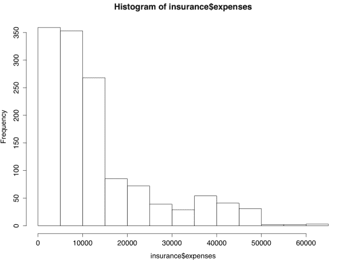

正如预期的那样，图表显示了右偏的分布。它还表明，尽管分布的尾部远超这些峰值，但我们数据中的大多数人年医疗费用在零到$15,000 之间。虽然这个分布并不适合线性回归，但提前了解这一弱点有助于我们设计出更适合的模型。

在我们解决这个问题之前，还有另一个问题需要处理。回归模型要求每个特征都是数值型的，但我们在数据框中有三个因子型特征。例如，性别变量分为男性和女性两个级别，而吸烟者分为是和否。从`summary()`输出中，我们知道`region`变量有四个级别，但我们需要进一步查看它们的分布：

```py
> table(insurance$region)
northeast northwest southeast southwest
 324       325       364       325

```

在这里，我们看到数据几乎均匀地划分到四个地理区域中。稍后我们将看到 R 的线性回归函数如何处理这些因子变量。

### 探索特征之间的关系——相关矩阵

在拟合回归模型之前，确定自变量与因变量及相互之间的关系是很有帮助的。**相关矩阵**提供了这些关系的快速概览。给定一组变量，它为每一对关系提供相关性。

要为保险数据框中的四个数值变量创建相关矩阵，可以使用`cor()`命令：

```py
> cor(insurance[c("age", "bmi", "children", "expenses")])
 age        bmi   children   expenses
age      1.0000000 0.10934101 0.04246900 0.29900819
bmi      0.1093410 1.00000000 0.01264471 0.19857626
children 0.0424690 0.01264471 1.00000000 0.06799823
expenses 0.2990082 0.19857626 0.06799823 1.00000000

```

在每一行和列的交点处，会列出由该行和列所表示的变量的相关性。对角线上的值始终是`1.0000000`，因为一个变量与它自身的相关性总是完美的。对角线上的值上下是对称的，因此相关性是对称的。换句话说，`cor(x, y)`等于`cor(y, x)`。

矩阵中的相关性都不算强，但有一些显著的关联。例如，`age`和`bmi`之间似乎存在弱正相关，意味着随着年龄的增长，体重通常会增加。`age`与`expenses`、`bmi`与`expenses`、以及`children`与`expenses`之间也有中等程度的正相关。这些关联意味着随着年龄、体重和孩子数量的增加，预期的保险费用也会上升。我们将在构建最终回归模型时更清晰地揭示这些关系。

### 可视化特征间的关系 – 散点图矩阵

使用散点图来可视化数值特征之间的关系也很有帮助。尽管我们可以为每一种可能的关系创建散点图，但对于大量特征来说，这样做可能会变得很繁琐。

另一种选择是创建一个**散点图矩阵**（有时简写为**SPLOM**），它仅仅是一个按网格排列的散点图集合。它用于检测三个或更多变量之间的模式。散点图矩阵并不是真正的多维可视化，因为每次仅检查两个特征。但它提供了一个大致的感知，显示数据可能的相互关系。

我们可以使用 R 的图形功能为四个数值特征（`age`、`bmi`、`children`和`expenses`）创建一个散点图矩阵。`pairs()`函数在默认的 R 安装中提供，能够生成基本的散点图矩阵功能。要调用该函数，只需提供要展示的数据框。这里，我们将`insurance`数据框限制为四个感兴趣的数值变量：

```py
> pairs(insurance[c("age", "bmi", "children", "expenses")])

```

这会生成如下图表：

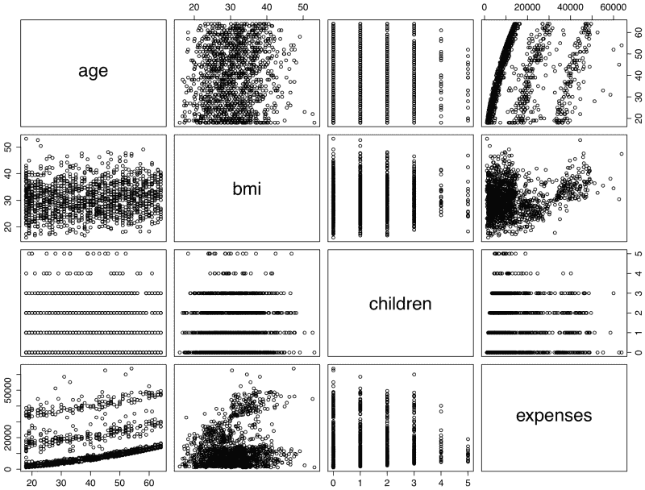

在散点图矩阵中，每一行和每一列的交点处展示的是由行和列所表示的变量的散点图。对角线以上和以下的图表是转置的，因为*x*轴和*y*轴已被交换。

你在这些图表中注意到任何模式吗？尽管有些看起来像是随机的点云，但有些似乎展示了一些趋势。`age`与`expenses`之间的关系显示了几条相对直的线，而`bmi`与`expenses`的图表则有两组明显不同的点。在其他图表中很难发现趋势。

如果我们在图表中添加更多信息，它将变得更加有用。可以使用`psych`包中的`pairs.panels()`函数创建一个增强版的散点图矩阵。如果你没有安装该包，请输入`install.packages("psych")`进行安装，并通过`library(psych)`命令加载它。然后，我们可以像之前那样创建一个散点图矩阵：

```py
> pairs.panels(insurance[c("age", "bmi", "children", "expenses")])

```

这会生成一个稍微更具信息量的散点图矩阵，如下所示：

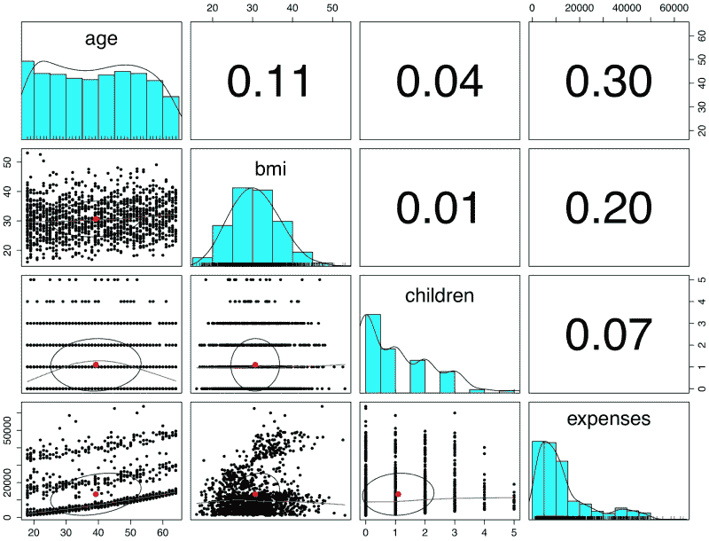

对角线以上的散点图已被相关矩阵替代。对角线上的直方图显示了每个特征值的分布情况。最后，对角线下方的散点图现在呈现了更多的视觉信息。

每个散点图上椭圆形的物体是一个**相关椭圆**。它提供了相关性强度的可视化。椭圆中心的点表示 *x* 和 *y* 轴变量的均值位置。变量之间的相关性通过椭圆的形状来表示；它越被拉伸，相关性越强。几乎完全圆形的椭圆，如 `bmi` 和 `children` 之间的关系，表明相关性非常弱（在这种情况下为 0.01）。

散点图上绘制的曲线称为**局部加权回归曲线（loess curve）**。它表示 *x* 和 *y* 轴变量之间的一般关系。通过示例最容易理解。`age` 和 `children` 的曲线呈倒 U 形，峰值出现在中年左右。这意味着样本中最年长和最年轻的人群在保险计划中有的孩子比中年人少。由于这一趋势是非线性的，仅凭相关性是无法得出这一结论的。另一方面，`age` 和 `bmi` 的 loess 曲线是逐渐向上的直线，表明随着年龄的增长，体重指数也在增加，但我们已经通过相关矩阵推断出这一点。

## 步骤 3 – 在数据上训练模型

要在 R 中拟合线性回归模型，可以使用 `lm()` 函数。该函数包含在 `stats` 包中，默认情况下应该随着 R 安装一起加载。`lm()` 的语法如下：

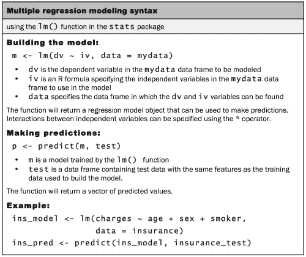

以下命令拟合一个线性回归模型，将六个自变量与总医疗费用相关联。R 的公式语法使用波浪号字符 `~` 来描述模型；因变量 `expenses` 位于波浪号的左侧，而自变量位于右侧，并由 `+` 符号分隔。由于回归模型的截距项默认假定存在，因此无需明确指定：

```py
> ins_model <- lm(expenses ~ age + children + bmi + sex +
 smoker + region, data = insurance)

```

由于 `.` 字符可以用来指定所有特征（排除公式中已指定的特征），因此以下命令等同于之前的命令：

```py
> ins_model <- lm(expenses ~ ., data = insurance)

```

构建模型后，只需输入模型对象的名称即可查看估计的贝塔系数：

```py
> ins_model

Call:
lm(formula = expenses ~ ., data = insurance)

Coefficients:
 (Intercept)              age          sexmale 
 -11941.6            256.8           -131.4 
 bmi         children        smokeryes 
 339.3            475.7          23847.5 
regionnorthwest  regionsoutheast  regionsouthwest 
 -352.8          -1035.6           -959.3

```

理解回归系数是相当简单的。截距是当所有自变量为零时，`expenses`的预测值。正如这里的情况，截距通常单独没有太大意义，因为所有特征不可能都有零值。例如，由于不存在年龄为零且 BMI 为零的人，因此截距没有实际意义。出于这个原因，在实践中，截距通常会被忽略。

贝塔系数表示每增加一个特征值，假设其他所有值保持不变，医疗费用的预估增加。例如，每增加一年年龄，平均预计医疗费用增加$256.80，假设其他条件不变。类似地，每增加一个孩子，平均每年医疗费用增加$475.70，而每增加一个单位的 BMI，平均每年医疗费用增加$339.30，其他条件不变。

你可能会注意到，尽管我们在模型公式中只指定了六个特征，但报告的系数除了截距之外还有八个。这是因为`lm()`函数自动对我们在模型中包含的每个因子类型变量应用了一种称为**虚拟编码**的技术。

虚拟编码通过为特征的每个类别创建一个二元变量，通常称为**虚拟** **变量**，将一个名义特征处理为数值型特征。如果观察值属于指定的类别，则虚拟变量为`1`，否则为`0`。例如，`sex`特征有两个类别：`male`和`female`。这将被拆分为两个二元变量，R 分别命名为`sexmale`和`sexfemale`。对于`sex = male`的观察值，`sexmale = 1`且`sexfemale = 0`；反之，如果`sex = female`，则`sexmale = 0`且`sexfemale = 1`。对于具有三个或更多类别的变量也适用相同的编码方式。例如，R 将四类别特征`region`拆分为四个虚拟变量：`regionnorthwest`、`regionsoutheast`、`regionsouthwest`和`regionnortheast`。

在向回归模型中添加虚拟变量时，始终会有一个类别被排除作为参考类别。然后，系数会相对于该参考类别进行解释。在我们的模型中，R 自动排除了`sexfemale`、`smokerno`和`regionnortheast`变量，将女性非吸烟者所在的东北地区作为参考组。因此，相对于女性，每年男性的医疗费用少$131.40，而吸烟者每年比非吸烟者多花费$23,847.50。模型中每个三大地区的系数都是负数，这意味着参考组——东北地区的平均费用最高。

### 提示

默认情况下，R 使用因子变量的第一个级别作为参考。如果你希望使用其他级别，可以使用`relevel()`函数手动指定参考组。欲了解更多信息，请在 R 中使用`?relevel`命令。

线性回归模型的结果是合乎逻辑的：老年、吸烟和肥胖倾向于与额外的健康问题相关，而额外的家庭成员抚养负担可能导致医生就诊次数和预防性护理（如疫苗接种和年度体检）的增加。然而，我们目前并不清楚模型拟合数据的效果如何。我们将在下一节回答这个问题。

## 步骤 4 – 评估模型性能

我们通过输入`ins_model`获得的参数估计值告诉我们自变量与因变量之间的关系，但它们并没有告诉我们模型与数据的拟合度。为了评估模型性能，我们可以对存储的模型使用`summary()`命令：

```py
> summary(ins_model)

```

这会产生以下输出。请注意，输出已经标注了说明性标签：

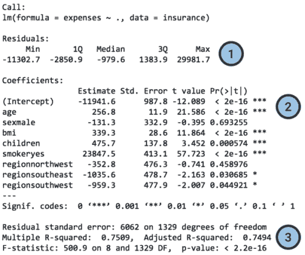

`summary()`输出一开始可能让人感到困惑，但基本概念很容易掌握。如前输出中的编号标签所示，输出提供了评估模型性能或拟合度的三种关键方法：

1.  **残差**部分提供了我们预测中错误的汇总统计信息，其中一些显然相当大。由于残差等于真实值减去预测值，因此最大误差为 29981.7，表明模型在至少一个观测值中低估了近$30,000 的支出。另一方面，50%的误差落在 1Q 和 3Q 值（第一四分位数和第三四分位数）之间，因此大多数预测结果介于真实值之上$2,850.90 和真实值之下$1,383.90 之间。

1.  对于每个估计的回归系数，**p 值**，用`Pr(>|t|)`表示，提供了一个估算值，表示在给定估计值的情况下，真实系数为零的概率。小的 p 值表明真实系数非常不可能为零，这意味着该特征极不可能与因变量没有关系。请注意，某些 p 值有星号（`***`），这些星号对应脚注，表示估计值所达到的**显著性水平**。这个水平是一个阈值，在建立模型之前选择，用来指示“真实”的发现，而不是仅仅由于偶然因素；小于显著性水平的 p 值被视为**统计显著**。如果模型中有很少这样的项，可能需要引起关注，因为这表明所使用的特征对结果的预测能力较弱。这里，我们的模型有多个高度显著的变量，而且它们似乎与结果在逻辑上相关。

1.  **多重 R 方值**（也叫决定系数）提供了衡量我们模型整体解释因变量值的能力。它类似于相关系数，数值越接近 1.0，模型对数据的解释越完美。由于 R 方值为 0.7494，我们知道模型解释了因变量近 75% 的变化。由于具有更多特征的模型总是能解释更多变化，**调整 R 方值**通过对具有大量独立变量的模型进行惩罚来修正 R 方值。它对于比较具有不同数量解释变量的模型表现非常有用。

根据前述的三个性能指标，我们的模型表现得相当不错。回归模型在实际数据中往往会有较低的 R 方值，0.75 的值实际上已经相当不错。一些误差的大小有些令人担忧，但考虑到医疗费用数据的特性，这并不令人惊讶。然而，正如下一节所示，我们可能通过稍微不同的方式指定模型来提高模型的性能。

## 第 5 步 – 提高模型性能

如前所述，回归建模与其他机器学习方法的一个关键区别在于，回归通常将特征选择和模型指定留给用户。因此，如果我们了解某个特征与结果之间的关系，我们可以利用这些信息来指导模型的指定，从而可能提高模型的性能。

### 模型指定 – 添加非线性关系

在线性回归中，自变量与因变量之间的关系假定为线性，但这不一定为真。例如，年龄对医疗支出的影响可能在所有年龄值中并非恒定；对于最年长的群体，治疗可能变得不成比例地昂贵。

如果你记得的话，典型的回归方程通常类似于此：


为了考虑非线性关系，我们可以向回归模型中添加更高阶的项，将模型视为多项式。实际上，我们将模拟这样的关系：


这两个模型之间的区别在于将估计一个额外的贝塔系数，旨在捕捉 *x* 的平方项的影响。这使得年龄的影响可以作为年龄平方的函数来衡量。

要将非线性年龄加入模型，我们只需创建一个新的变量：

```py
> insurance$age2 <- insurance$age²

```

然后，当我们生成我们改进的模型时，我们将使用`expenses ~ age + age2`形式将`age`和`age2`都添加到`lm()`公式中。这将使模型能够分离年龄对医疗支出的线性和非线性影响。

### 转换 - 将数值变量转换为二元指示器

假设我们有一种直觉，即某个特征的影响不是累积的，而是只有在达到特定阈值后才会产生影响。例如，BMI 对于正常体重范围内的个体可能没有医疗支出的影响，但对于肥胖者（即 BMI 达到或超过 30）可能与更高的费用密切相关。

我们可以通过创建一个二元肥胖指示变量来建模这种关系，如果 BMI 至少为 30，则为 1，否则为 0。然后，这个二元特征的估计β值将指示 BMI 达到或超过 30 的个体对医疗支出的平均净影响，相对于 BMI 低于 30 的个体。

要创建该特征，我们可以使用`ifelse()`函数，该函数对向量中的每个元素测试指定的条件，并根据条件是真还是假返回一个值。对于 BMI 大于或等于 30，我们将返回`1`，否则返回`0`：

```py
> insurance$bmi30 <- ifelse(insurance$bmi >= 30, 1, 0)

```

我们接下来可以在我们改进的模型中包含`bmi30`变量，可以替换原来的`bmi`变量或者同时加入，这取决于我们是否认为肥胖的影响会在单独的线性 BMI 效应之外发生。如果没有充分的理由做出改变，我们将在最终模型中都包含它们。

### 提示

如果您在决定是否包含一个变量时遇到困难，一个常见的做法是将其包含在内并检查 P 值。如果变量在统计上不显著，您有理由在将来排除它。

### 模型规范化 - 添加交互效应

到目前为止，我们只考虑了每个特征对结果的个体贡献。如果某些特征共同影响因变量呢？例如，吸烟和肥胖可能分别具有有害效应，但合并效应可能比单独每个因素的总和更糟糕是合理的假设。

当两个特征具有联合效应时，这被称为**交互作用**。如果我们怀疑两个变量之间存在交互作用，我们可以通过将它们的交互项添加到模型中来测试这一假设。交互效应使用 R 公式语法指定。为了让肥胖指示器(`bmi30`)和吸烟指示器(`smoker`)交互，我们会编写如下形式的公式：`expenses ~ bmi30*smoker`。

`*`运算符是一个快捷方式，指示 R 模型为`expenses ~ bmi30 + smokeryes + bmi30:smokeryes`。在扩展形式中，冒号`:`运算符表示`bmi30:smokeryes`是两个变量之间的交互作用。请注意，扩展形式还自动包括了`bmi30`和`smoker`变量以及交互作用。

### 提示

交互项在模型中绝不能单独包含，而不添加每个交互变量。如果你总是使用`*`运算符来创建交互作用，那么这个问题就不会出现，因为 R 会自动添加所需的组件。

### 综合起来——一个改进的回归模型

基于对医学费用可能与患者特征相关的一些主题知识，我们开发了我们认为更准确的回归公式。总结改进的内容，我们：

+   为年龄添加了一个非线性项

+   创建了一个用于肥胖的指标

+   指定了肥胖与吸烟之间的交互作用

我们将像之前一样使用`lm()`函数来训练模型，但这次我们将添加新构建的变量和交互项：

```py
> ins_model2 <- lm(expenses ~ age + age2 + children + bmi + sex +
 bmi30*smoker + region, data = insurance)

```

接下来，我们总结结果：

```py
> summary(ins_model2)

```

输出如下所示：


模型拟合统计量有助于确定我们的修改是否提高了回归模型的性能。与我们的第一个模型相比，R 平方值从 0.75 提高到了大约 0.87。同样，考虑到模型复杂度增加的调整后 R 平方值也从 0.75 提高到了 0.87。我们的模型现在解释了 87%的医疗费用变异。此外，我们关于模型功能形式的理论似乎得到了验证。高阶`age2`项是统计显著的，肥胖指标`bmi30`也是如此。肥胖与吸烟的交互作用表明有巨大的影响；除了吸烟本身导致的超过$13,404 的费用外，肥胖吸烟者每年还要额外花费$19,810。这可能表明吸烟加剧了与肥胖相关的疾病。

### 注意

严格来说，回归建模对数据做出了一些强假设。这些假设对于数值预测来说并不那么重要，因为模型的价值并不依赖于它是否真正捕捉到了潜在的过程——我们关心的是其预测的准确性。然而，如果你希望从回归模型系数中得出明确的推论，就有必要进行诊断测试，确保回归假设没有被违反。关于这一主题的优秀介绍，参见 Allison PD*《多元回归：基础》*，Pine Forge Press，1998 年。

# 理解回归树和模型树

如果你记得第五章，*分而治之 – 使用决策树和规则进行分类*，决策树构建的模型就像一个流程图，其中决策节点、叶节点和分支定义了一系列决策，用于分类示例。这样的树也可以通过对树生长算法进行小的调整，用于数值预测。在本节中，我们只会讨论用于数值预测的树与用于分类的树的不同之处。

用于数值预测的树分为两类。第一类称为**回归树**，它们在 1980 年代作为开创性的**分类与回归树**（**CART**）算法的一部分被引入。尽管名称中有回归二字，回归树并没有使用本章前面描述的线性回归方法，而是基于达到叶节点的示例的平均值来进行预测。

### 注意

CART 算法在 Breiman L, Friedman JH, Stone CJ, Olshen RA 的《*分类与回归树*》一书中有详细描述。Belmont, CA: Chapman and Hall; 1984 年。

第二类用于数值预测的树被称为**模型树**。它们比回归树晚几年引入，虽然不太为人所知，但可能更强大。模型树的生长方式与回归树非常相似，但在每个叶节点上，会基于到达该节点的示例构建一个多元线性回归模型。根据叶节点的数量，模型树可能会构建几十个甚至几百个这样的模型。这可能使得模型树比等效的回归树更难理解，但好处是，它们可能会产生更精确的模型。

### 注意

最早的模型树算法，**M5**，在 Quinlan JR 的《*使用连续类别进行学习*》中有描述。1992 年，澳大利亚第五届联合人工智能会议论文集：343-348。

## 向树中添加回归

可以执行数值预测的树提供了一种引人注目但常被忽视的回归建模替代方案。回归树和模型树相对于更常见的回归方法的优缺点在下表中列出：

| 优点 | 缺点 |
| --- | --- |

|

+   结合了决策树的优点和建模数值数据的能力

+   无需用户提前指定模型

+   使用自动特征选择，允许该方法应用于非常大量的特征

+   可能比线性回归更适合某些类型的数据

+   不需要统计学知识来解释模型

|

+   不像线性回归那样知名

+   需要大量的训练数据

+   难以确定单个特征对结果的整体净影响

+   大型树可能比回归模型更难以解释

|

虽然传统的回归方法通常是数值预测任务的首选，但在某些情况下，数值决策树提供了明显的优势。例如，决策树可能更适合具有许多特征或特征与结果之间存在许多复杂的非线性关系的任务。这些情况对回归造成了挑战。回归建模还对数值数据的分布方式做出了假设，而这些假设在现实世界的数据中经常被违反。而这种情况在树中并非如此。

用于数值预测的树的构建方式与分类中的方式基本相同。从根节点开始，根据能够在拆分后最大增加结果均匀性的特征使用分治策略对数据进行分区。在分类树中，您会记得均匀性是通过熵来衡量的，但对于数值数据，熵是未定义的。相反，对于数值决策树，均匀性是通过方差、标准偏差或与均值的绝对偏差等统计量来衡量的。

一种常见的拆分标准称为**标准偏差减少**（**SDR**）。它由以下公式定义：


在这个公式中，*sd(T)*函数指的是集合*T*中值的标准偏差，而*T[1]*、*T[2]*、...、*T[n]*是由特征拆分产生的值集合。*|T|*项指的是集合*T*中的观测数量。本质上，该公式通过比较拆分前的标准偏差与加权后的标准偏差来衡量标准偏差的减少。

例如，考虑以下情况，树正在决定是否在二进制特征 A 或 B 上执行拆分：


使用提议的拆分结果得到的组，我们可以计算如下的 A 和 B 的 SDR。这里使用的`length()`函数返回向量中的元素数量。请注意，整体组 T 被命名为`tee`，以避免覆盖 R 的内置`T()`和`t()`函数：

```py
> tee <- c(1, 1, 1, 2, 2, 3, 4, 5, 5, 6, 6, 7, 7, 7, 7)
> at1 <- c(1, 1, 1, 2, 2, 3, 4, 5, 5)
> at2 <- c(6, 6, 7, 7, 7, 7)
> bt1 <- c(1, 1, 1, 2, 2, 3, 4)
> bt2 <- c(5, 5, 6, 6, 7, 7, 7, 7)
> sdr_a <- sd(tee) - (length(at1) / length(tee) * sd(at1) +
 length(at2) / length(tee) * sd(at2))
> sdr_b <- sd(tee) - (length(bt1) / length(tee) * sd(bt1) +
 length(bt2) / length(tee) * sd(bt2))

```

让我们比较 A 的 SDR 和 B 的 SDR：

```py
> sdr_a
[1] 1.202815
> sdr_b
[1] 1.392751

```

特征 A 的拆分的 SDR 约为 1.2，而特征 B 的拆分的 SDR 约为 1.4。由于 B 的标准偏差减少更多，决策树将首先使用 B。这导致比 A 更均匀的集合。

假设树在此处停止生长，并仅使用此一次拆分。回归树的工作完成了。它可以根据特征 B 上的示例值将示例预测为属于组*T[1]*或*T[2]*。如果示例位于*T[1]*中，则模型将预测*mean(bt1) = 2*，否则将预测*mean(bt2) = 6.25*。

与此不同，模型树会更进一步。利用落在组* T[1]*中的七个训练示例和落在* T[2]*中的八个训练示例，模型树可以建立一个线性回归模型，将结果与特征 A 进行比较。请注意，特征 B 在建立回归模型时没有帮助，因为所有叶节点中的示例 B 值相同——它们是根据 B 值被分配到* T[1]*或* T[2]*中的。然后，模型树可以使用这两个线性模型中的任何一个为新示例做出预测。

为了进一步说明这两种方法之间的差异，让我们通过一个现实世界的例子来说明。

# 示例 – 使用回归树和模型树估计葡萄酒的质量

酿酒业是一个具有挑战性且竞争激烈的行业，具有巨大的盈利潜力。然而，葡萄酒厂的盈利能力受到多种因素的影响。作为一种农产品，天气和生长环境等变量会影响葡萄酒的质量。瓶装和生产过程也会对味道产生影响，可能是更好也可能是更差。即便是产品的营销方式，从瓶子设计到定价，也会影响消费者对味道的认知。

因此，酿酒行业在数据收集和机器学习方法上的投资非常巨大，这些方法有助于酿酒决策科学。例如，机器学习已经被用于发现不同地区葡萄酒化学成分的关键差异，或者识别导致葡萄酒味道更甜的化学因素。

最近，机器学习已被用来协助葡萄酒质量的评分——这是一项著名的困难任务。著名酒评家的评论往往决定了产品最终是上架还是下架，尽管即使是专家在盲测中评分时也常常表现出不一致性。

在这个案例研究中，我们将使用回归树和模型树创建一个系统，能够模仿专家对葡萄酒的评分。由于树结构生成的模型易于理解，这可以帮助酿酒师识别出对高评分葡萄酒至关重要的因素。或许更重要的是，该系统不受品酒时人类因素的影响，比如评分者的情绪或味觉疲劳。因此，计算机辅助的葡萄酒测试可能会带来更好的产品，并且评分更加客观、一致和公平。

## 步骤 1 – 收集数据

为了开发葡萄酒评级模型，我们将使用 P. Cortez, A. Cerdeira, F. Almeida, T. Matos 和 J. Reis 捐赠给 UCI 机器学习数据库的数据（[`archive.ics.uci.edu/ml`](http://archive.ics.uci.edu/ml)）。这些数据包括来自葡萄牙的红葡萄酒和白葡萄酒样本—葡萄牙是世界领先的葡萄酒生产国之一。由于影响葡萄酒高评分的因素可能在红葡萄酒和白葡萄酒之间有所不同，因此在本次分析中，我们只会考察更受欢迎的白葡萄酒。

### 提示

要跟随本示例，请从 Packt Publishing 网站下载`whitewines.csv`文件，并将其保存到您的 R 工作目录中。如果您希望自行探索数据，`redwines.csv`文件也可以下载。

白葡萄酒数据包括 4,898 个葡萄酒样本的 11 个化学属性信息。每个样本通过实验室分析测量了酸度、糖分、氯化物、硫磺、酒精、pH 值和密度等特性。然后，这些样本通过不低于三名评委的盲品进行质量评分，评分范围从 0（非常差）到 10（优秀）。如果评委们对评分有异议，则使用中位数值。

Cortez 的研究评估了三种机器学习方法在建模葡萄酒数据方面的能力：多元回归、人工神经网络和支持向量机。我们在本章早些时候已经介绍了多元回归，而我们将在第七章中学习神经网络和支持向量机，*黑箱方法 – 神经网络与支持向量机*。研究发现，支持向量机比线性回归模型提供了显著更好的结果。然而，与回归模型不同，支持向量机模型较难解释。通过使用回归树和模型树，我们可能能够在改进回归结果的同时，仍然保持一个易于理解的模型。

### 注意

要了解更多关于这里描述的葡萄酒研究的信息，请参阅 Cortez P, Cerdeira A, Almeida F, Matos T, Reis J. *通过物理化学性质的数据挖掘建模葡萄酒偏好*。决策支持系统*。2009; 47:547-553。

## 第 2 步 – 探索和准备数据

如常，我们将使用`read.csv()`函数将数据加载到 R 中。由于所有特征都是数值型的，因此我们可以安全地忽略`stringsAsFactors`参数：

```py
> wine <- read.csv("whitewines.csv")

```

葡萄酒数据包括 11 个特征和质量结果，如下所示：

```py
> str(wine)
'data.frame':  4898 obs. of  12 variables:
 $ fixed.acidity       : num  6.7 5.7 5.9 5.3 6.4 7 7.9 ...
 $ volatile.acidity    : num  0.62 0.22 0.19 0.47 0.29 0.12 ...
 $ citric.acid         : num  0.24 0.2 0.26 0.1 0.21 0.41 ...
 $ residual.sugar      : num  1.1 16 7.4 1.3 9.65 0.9 ...
 $ chlorides           : num  0.039 0.044 0.034 0.036 0.041 ...
 $ free.sulfur.dioxide : num  6 41 33 11 36 22 33 17 34 40 ...
 $ total.sulfur.dioxide: num  62 113 123 74 119 95 152 ...
 $ density             : num  0.993 0.999 0.995 0.991 0.993 ...
 $ pH                  : num  3.41 3.22 3.49 3.48 2.99 3.25 ...
 $ sulphates           : num  0.32 0.46 0.42 0.54 0.34 0.43 ...
 $ alcohol             : num  10.4 8.9 10.1 11.2 10.9 ...
 $ quality             : int  5 6 6 4 6 6 6 6 6 7 ...

```

与其他类型的机器学习模型相比，树模型的一个优势是能够处理多种类型的数据而无需预处理。这意味着我们不需要对特征进行归一化或标准化。

然而，需要稍微努力检查结果变量的分布，以便更好地评估模型的表现。例如，假设酒的质量变化很小，或者酒的质量呈双峰分布：要么非常好，要么非常差。为了检查这些极端情况，我们可以使用直方图检查质量分布：

```py
> hist(wine$quality)

```

这将生成以下图形：

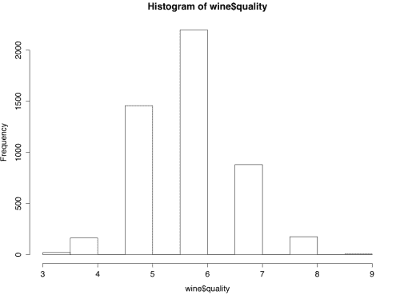

酒的质量值似乎遵循一个相当正常的钟形分布，集中在六的值附近。这是直观合理的，因为大多数酒的质量是中等的；很少有酒特别差或者特别好。尽管这里没有展示结果，但检查 `summary(wine)` 输出中的异常值或其他潜在的数据问题也是很有用的。尽管树模型对杂乱数据相当稳健，但检查严重问题总是明智的。现在，我们假设数据是可靠的。

我们的最后一步是将数据划分为训练集和测试集。由于 `wine` 数据集已经是随机排序的，我们可以按照以下方式将其分成两组连续的行：

```py
> wine_train <- wine[1:3750, ]
> wine_test <- wine[3751:4898, ]

```

为了与 Cortez 使用的条件相符，我们分别使用了 75% 和 25% 的数据集进行训练和测试。我们将评估基于树的模型在测试数据上的表现，以查看我们是否能获得与先前研究相当的结果。

## 第三步 – 在数据上训练模型

我们将首先训练一棵回归树模型。尽管几乎任何决策树的实现都可以用于回归树建模，但 `rpart`（递归分区）包提供了最忠实的回归树实现，正如 CART 团队所描述的那样。作为 CART 的经典 R 实现，`rpart` 包也有很好的文档支持，并提供了可视化和评估 `rpart` 模型的函数。

使用 `install.packages("rpart")` 命令安装 `rpart` 包。然后可以使用 `library(rpart)` 命令将其加载到 R 会话中。以下语法将使用默认设置训练一棵树，这些设置通常工作得相当好。如果需要更精细的设置，请使用 `?rpart.control` 命令查看控制参数的文档。

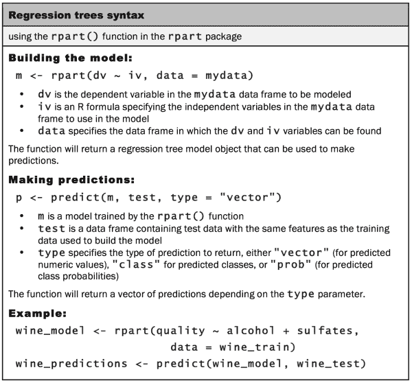

使用 R 公式接口，我们可以指定 `quality` 作为结果变量，并使用点符号使得 `wine_train` 数据框中的所有其他列作为预测变量。生成的回归树模型对象命名为 `m.rpart`，以便与我们稍后训练的模型树区分开来：

```py
> m.rpart <- rpart(quality ~ ., data = wine_train)

```

要获取树的基本信息，只需输入模型对象的名称：

```py
> m.rpart
n= 3750

node), split, n, deviance, yval
 * denotes terminal node

 1) root 3750 2945.53200 5.870933 
 2) alcohol< 10.85 2372 1418.86100 5.604975 
 4) volatile.acidity>=0.2275 1611  821.30730 5.432030 
 8) volatile.acidity>=0.3025 688  278.97670 5.255814 *
 9) volatile.acidity< 0.3025 923  505.04230 5.563380 *
 5) volatile.acidity< 0.2275 761  447.36400 5.971091 *
 3) alcohol>=10.85 1378 1070.08200 6.328737 
 6) free.sulfur.dioxide< 10.5 84   95.55952 5.369048 *
 7) free.sulfur.dioxide>=10.5 1294  892.13600 6.391036 
 14) alcohol< 11.76667 629  430.11130 6.173291 
 28) volatile.acidity>=0.465 11   10.72727 4.545455 *
 29) volatile.acidity< 0.465 618  389.71680 6.202265 *
 15) alcohol>=11.76667 665  403.99400 6.596992 *

```

对于树中的每个节点，都会列出到达该决策点的示例数量。例如，所有 3,750 个示例从根节点开始，其中 2,372 个示例满足`alcohol < 10.85`，1,378 个示例满足`alcohol >= 10.85`。由于酒精在树中首先被使用，它是预测葡萄酒质量的最重要因素。

由`*`指示的节点是终端节点或叶节点，这意味着它们会产生预测结果（在此列为`yval`）。例如，节点 5 的`yval`为 5.971091。当使用该树进行预测时，任何酒精含量`alcohol < 10.85`且挥发性酸度`volatile.acidity < 0.2275`的葡萄酒样本，预测的质量值为 5.97。

可以使用`summary(m.rpart)`命令获取树的拟合结果的更详细摘要，包括每个节点的均方误差和特征重要性的总体度量。

### 可视化决策树

尽管可以仅通过前面的输出理解树的结构，但通常使用可视化会更容易理解。Stephen Milborrow 的`rpart.plot`包提供了一个易于使用的函数，可以生成高质量的决策树图。

### 注意

有关`rpart.plot`的更多信息，包括该函数可以生成的不同类型决策树图的其他示例，请访问作者的网站：[`www.milbo.org/rpart-plot/`](http://www.milbo.org/rpart-plot/)。

在使用`install.packages("rpart.plot")`命令安装该包后，`rpart.plot()`函数可以从任何`rpart`模型对象生成树形图。以下命令绘制了我们之前构建的回归树：

```py
> library(rpart.plot)
> rpart.plot(m.rpart, digits = 3)

```

生成的树形图如下所示：


除了控制图中数字位数的`digits`参数外，许多可视化的其他方面也可以进行调整。以下命令展示了几种有用的选项：`fallen.leaves`参数强制叶节点对齐到图的底部，而`type`和`extra`参数则影响决策和节点的标签方式：

```py
> rpart.plot(m.rpart, digits = 4, fallen.leaves = TRUE,
 type = 3, extra = 101)

```

这些更改的结果是一个外观截然不同的树形图：

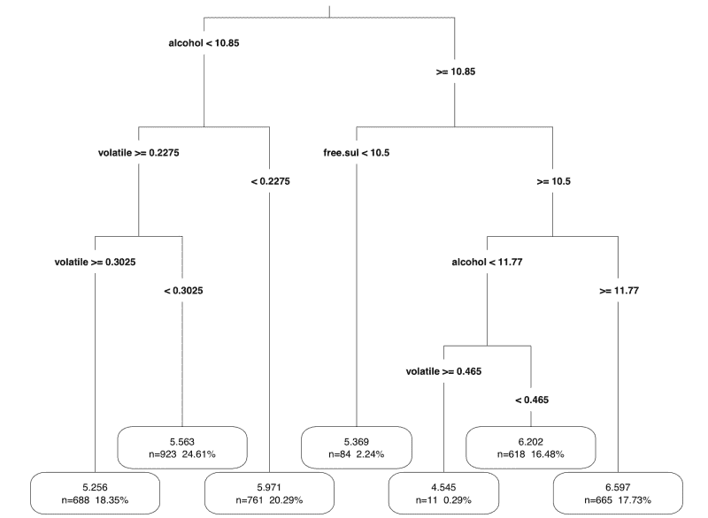

像这样的可视化图可能有助于回归树结果的传播，因为即使没有数学背景的人也能轻松理解。在这两种情况下，叶节点中显示的数字是到达该节点的示例的预测值。因此，将图表展示给葡萄酒生产者，可能有助于确定预测高评分葡萄酒的关键因素。

## 第 4 步 – 评估模型性能

要使用回归树模型对测试数据进行预测，我们使用`predict()`函数。默认情况下，它返回结果变量的估计数值，我们将其保存在名为`p.rpart`的向量中：

```py
> p.rpart <- predict(m.rpart, wine_test)

```

快速查看我们预测的摘要统计数据表明了一个潜在的问题；预测值的范围明显比真实值要窄：

```py
> summary(p.rpart)
 Min. 1st Qu.  Median    Mean 3rd Qu.    Max.
 4.545   5.563   5.971   5.893   6.202   6.597
> summary(wine_test$quality)
 Min. 1st Qu.  Median    Mean 3rd Qu.    Max.
 3.000   5.000   6.000   5.901   6.000   9.000

```

这一发现表明模型未能正确识别极端情况，尤其是最好的和最差的葡萄酒。另一方面，在第一四分位数和第三四分位数之间，我们可能做得很好。

预测值与实际质量值之间的相关性提供了一种简单的方法来衡量模型的表现。请记住，`cor()`函数可用于衡量两个等长向量之间的关系。我们将使用它来比较预测值与真实值的对应情况：

```py
> cor(p.rpart, wine_test$quality)
[1] 0.5369525

```

0.54 的相关性是完全可以接受的。然而，相关性仅仅衡量预测值与真实值之间的关联程度；它并不能衡量预测值与真实值之间的差距。

### 使用平均绝对误差衡量性能

另一种衡量模型表现的方法是考虑其预测与真实值之间的平均偏差。这一度量被称为**平均绝对误差**（**MAE**）。MAE 的计算公式如下，其中*n*表示预测次数，*e[i]*表示第 i 个预测的误差：


正如名字所示，这个方程计算误差的绝对值的平均值。由于误差仅仅是预测值和实际值之间的差异，我们可以创建一个简单的`MAE()`函数，如下所示：

```py
> MAE <- function(actual, predicted) {
 mean(abs(actual - predicted))
}

```

我们的预测的 MAE 为：

```py
> MAE(p.rpart, wine_test$quality)
[1] 0.5872652

```

这意味着，平均而言，我们模型的预测值与真实质量评分之间的差异大约为 0.59。在从零到 10 的质量评分尺度上，这似乎表明我们的模型表现相当不错。

另一方面，请记住，大多数葡萄酒既不特别好也不特别差；典型的质量评分大约在五到六之间。因此，仅仅预测平均值的分类器根据这个标准仍然可能表现得相当好。

训练数据中的平均质量评分如下：

```py
> mean(wine_train$quality)
[1] 5.870933

```

如果我们对每个葡萄酒样本都预测值为 5.87，我们的平均绝对误差将仅约为 0.67：

```py
> MAE(5.87, wine_test$quality)
[1] 0.6722474

```

我们的回归树（*MAE = 0.59*）的平均预测结果比填充平均值（*MAE = 0.67*）更接近真实质量评分，但差距不大。相比之下，Cortez 报告了神经网络模型的 MAE 为 0.58，支持向量机的 MAE 为 0.45。这表明仍有改进的空间。

## 步骤 5 – 改进模型性能

为了提高学习器的性能，我们可以尝试构建一个模型树。回想一下，模型树通过将叶节点替换为回归模型，从而改进了回归树。这通常会比回归树产生更准确的结果，因为回归树在叶节点使用的只是一个单一的预测值。

当前模型树的最新技术是**M5'算法**（**M5-prime**），由 Y. Wang 和 I.H. Witten 提出，它是 J.R. Quinlan 于 1992 年提出的原始 M5 模型树算法的变种。

### 注意

欲了解更多有关 M5'算法的信息，请参阅 Wang Y, Witten IH. *用于预测连续类别的模型树诱导*。欧洲机器学习会议海报论文集，1997 年。

M5 算法可以通过 R 中的`RWeka`包和`M5P()`函数来实现。该函数的语法如下表所示。如果你还没有安装`RWeka`包，请确保先安装。由于它依赖于 Java，安装说明已包含在第一章中，*引入机器学习*。

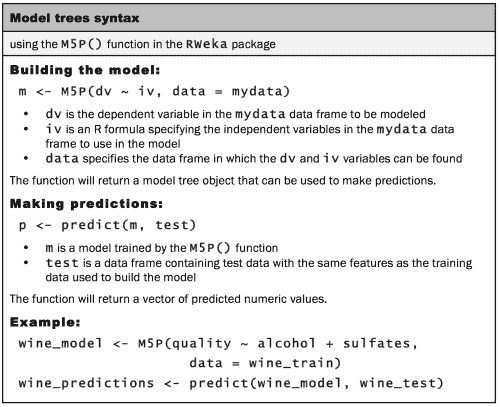

我们将使用与回归树相同的语法来拟合模型树：

```py
> library(RWeka)
> m.m5p <- M5P(quality ~ ., data = wine_train)

```

可以通过输入树的名称来检查树本身。在这种情况下，树非常大，只有前几行输出会显示出来：

```py
> m.m5p
M5 pruned model tree:
(using smoothed linear models)

alcohol <= 10.85 :
|   volatile.acidity <= 0.238 :
|   |   fixed.acidity <= 6.85 : LM1 (406/66.024%)
|   |   fixed.acidity >  6.85 :
|   |   |   free.sulfur.dioxide <= 24.5 : LM2 (113/87.697%)

```

你会注意到，这些分裂与我们之前构建的回归树非常相似。酒精是最重要的变量，其次是挥发性酸度和游离二氧化硫。然而，一个关键的区别是，节点的终止不是数值预测，而是一个线性模型（在此显示为`LM1`和`LM2`）。

线性模型本身会在输出中显示。例如，`LM1`的模型将在接下来的输出中显示。这些值的解释方式与我们在本章前面构建的多重回归模型完全相同。每个数字表示相关特征对预测酒质的净效应。固定酸度的系数为`0.266`，意味着酸度增加 1 单位时，预计酒质将增加`0.266`：

```py
LM num: 1
quality =
 0.266 * fixed.acidity
 - 2.3082 * volatile.acidity
 - 0.012 * citric.acid
 + 0.0421 * residual.sugar
 + 0.1126 * chlorides
 + 0 * free.sulfur.dioxide
 - 0.0015 * total.sulfur.dioxide
 - 109.8813 * density
 + 0.035 * pH
 + 1.4122 * sulphates
 - 0.0046 * alcohol
 + 113.1021

```

需要注意的是，由`LM1`估算的效果仅适用于达到该节点的酒样；在这个模型树中总共构建了 36 个线性模型，每个模型都对固定酸度和其他 10 个特征的影响进行了不同的估算。

若要查看模型拟合训练数据的统计信息，可以对 M5P 模型应用`summary()`函数。然而，请注意，由于这些统计信息是基于训练数据的，因此它们仅应作为粗略的诊断依据：

```py
> summary(m.m5p)

=== Summary ===

Correlation coefficient                  0.6666
Mean absolute error                      0.5151
Root mean squared error                  0.6614
Relative absolute error                 76.4921 %
Root relative squared error             74.6259 %
Total Number of Instances             3750 

```

相反，我们将查看模型在未见过的测试数据上的表现。`predict()`函数为我们提供了一组预测值：

```py
> p.m5p <- predict(m.m5p, wine_test)

```

模型树似乎预测了比回归树更广泛的值范围：

```py
> summary(p.m5p)
 Min. 1st Qu.  Median    Mean 3rd Qu.    Max.
 4.389   5.430   5.863   5.874   6.305   7.437

```

相关性似乎也显著更高：

```py
> cor(p.m5p, wine_test$quality)
[1] 0.6272973

```

此外，该模型略微减少了平均绝对误差：

```py
> MAE(wine_test$quality, p.m5p)
[1] 0.5463023

```

尽管我们在回归树的基础上并没有取得太大进展，但我们超越了 Cortez 发布的神经网络模型的表现，并且我们逐渐接近支持向量机模型发布的平均绝对误差值 0.45，所有这些都是通过使用一种更简单的学习方法实现的。

### 提示

毫不意外，我们确认预测葡萄酒质量是一个困难的问题；毕竟，葡萄酒品鉴本质上是主观的。如果你想要额外练习，可以在阅读第十一章，*提高模型性能*后再次尝试解决这个问题，里面涵盖了一些可能带来更好结果的技术。

# 总结

在本章中，我们研究了两种建模数值数据的方法。第一种方法是线性回归，它涉及将直线拟合到数据上。第二种方法使用决策树进行数值预测。后者有两种形式：回归树，它通过叶节点处示例的平均值来进行数值预测；以及模型树，它在每个叶节点构建一个回归模型，这是一种混合方法，在某些方面是两者的最佳结合。

我们使用线性回归模型来计算不同人口群体的预期医疗费用。由于特征与目标变量之间的关系通过估算的回归模型得到了很好的描述，我们能够识别出某些人群，如吸烟者和肥胖者，可能需要被收取更高的保险费率，以覆盖高于平均水平的医疗费用。

回归树和模型树被用来根据可衡量的特征对葡萄酒的主观质量进行建模。在此过程中，我们了解到回归树提供了一种简单的方法来解释特征与数值结果之间的关系，但更复杂的模型树可能更为准确。在这个过程中，我们学习了几种评估数值模型表现的方法。

与本章涉及的机器学习方法（这些方法能够清晰地理解输入与输出之间的关系）形成鲜明对比的是，下章将介绍一些导致近乎难以理解的模型的方法。其优点是，这些方法是极为强大的技术——是最强大的股票分类器之一——可以应用于分类和数值预测问题。
