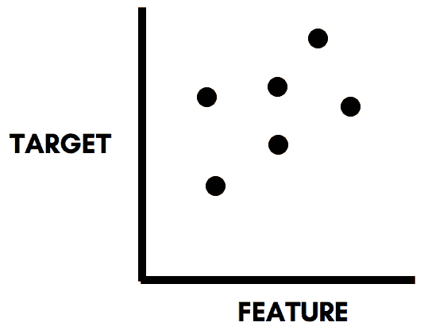
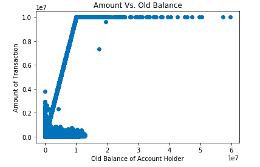
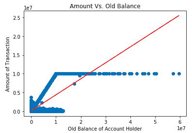
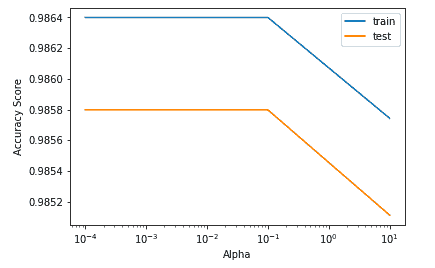
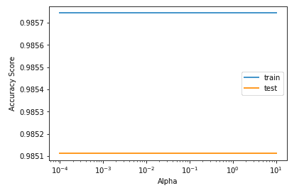

# 使用线性回归预测数值结果

在进行线性回归时，`graph_from_dot_data()`函数用于根据一组输入特征预测一个连续的数值。这一机器学习算法对于统计学家来说至关重要，尤其是在预测数值结果时。尽管像神经网络和深度学习这样的高级算法在现代已取代了线性回归，但这一算法依然是神经网络和深度学习的基础。

使用线性回归算法构建机器学习模型的关键好处，与神经网络和深度学习相比，它具有高度的可解释性。可解释性帮助您作为机器学习从业者理解不同的输入变量在预测输出时的行为。

线性回归算法被应用于金融行业（用于预测股票价格）和房地产行业（用于预测房价）。事实上，线性回归算法可以应用于任何需要根据一组输入特征预测数值的领域。

本章将涵盖以下主题：

+   线性回归算法的内部机制

+   使用 scikit-learn 构建并评估您的第一个线性回归算法

+   对数据进行缩放，以期提高性能

+   优化您的线性回归模型

# 技术要求

您需要在系统上安装 Python 3.6 或更高版本，Pandas ≥ 0.23.4，Scikit-learn ≥ 0.20.0 和 Matplotlib ≥ 3.0.0。

本章的代码文件可以在 GitHub 上找到：

[`github.com/PacktPublishing/Machine-Learning-with-scikit-learn-Quick-Start-Guide/blob/master/Chapter_05.ipynb`](https://github.com/PacktPublishing/Machine-Learning-with-scikit-learn-Quick-Start-Guide/blob/master/Chapter_05.ipynb)

查看以下视频，查看代码的实际运行情况：

[`bit.ly/2Ay95cJ`](http://bit.ly/2Ay95cJ)

# 线性回归算法的内部机制

在线性回归算法的最基本形式中，其表达式可以写成如下：

**

在前述方程中，模型的输出是一个数值结果。为了得到这个数值结果，我们要求每个输入特征与一个名为*参数 1*的参数相乘，并在此结果上加上第二个参数*参数 2*。

换句话说，我们的任务是找到能够尽可能准确预测数值结果的两个参数值。用图形化的方式来表示，考虑以下图示：



目标与输入特征之间的二维图

上述图示展示了一个二维图，其中目标变量（我们希望预测的内容）位于*y*轴上（数值型输出），输入特征位于*x*轴上。线性回归的目标是找到上述方程中提到的两个参数的最优值，从而将一条线拟合到给定的点集。

这条线被称为**最佳拟合线**。最佳拟合线是指能够非常好地拟合给定数据点集的直线，以便可以为我们做出准确的预测。因此，为了找到能够生成最佳拟合线的参数的最优值，我们需要定义一个能够为我们完成此任务的函数。

这个函数被称为**损失函数**。顾名思义，损失函数的目标是尽可能地最小化损失/误差，以便我们能够获得最佳拟合线。为了理解这个过程，请参考以下图示：


最佳拟合线

在上述图示中，线条被拟合到数据点集，特征可以定义如下：

+   每个数据点到拟合线的距离被称为**残差**。

+   损失/误差函数是这些残差的平方和。

+   线性回归算法的目标是最小化这个值。残差的平方和被称为**普通最小二乘法**（**OLS**）。

# 在 scikit-learn 中实现线性回归

在本节中，你将实现第一个线性回归算法，使用 scikit-learn。为了方便理解，本节将分为三个子节，分别讲解以下主题：

+   实现并可视化一个简单的二维线性回归模型

+   实现线性回归以预测手机交易金额

+   对数据进行缩放，以提高可能的性能

# 二维线性回归

在这一子节中，你将学习如何实现第一个线性回归算法，通过使用一个输入特征——账户持有者的旧余额，来预测手机交易的金额。我们将使用在本书的*第二章*《使用 K 最近邻预测类别》中使用的相同欺诈性手机交易数据集。

第一步是读取数据集并定义特征和目标变量。这可以通过以下代码来完成：

```py
import pandas as pd

#Reading in the dataset

df = pd.read_csv('fraud_prediction.csv')

#Define the feature and target arrays

feature = df['oldbalanceOrg'].values
target = df['amount'].values
```

接下来，我们将创建一个简单的散点图，展示手机交易金额在*y*轴上的数据（即线性回归模型的输出），以及账户持有者的旧余额沿*x*轴的数据（即输入特征）。这可以通过以下代码实现：

```py
import matplotlib.pyplot as plt

#Creating a scatter plot

plt.scatter(feature, target)
plt.xlabel('Old Balance of Account Holder')
plt.ylabel('Amount of Transaction')
plt.title('Amount Vs. Old Balance')
plt.show()
```

在前述代码中，我们使用`plt.scatter()`函数创建了特征在* x * 轴上与目标在* y * 轴上之间的散点图。这样得到了以下图示中的散点图：



线性回归模型的二维空间

现在，我们将线性回归模型拟合到前述图表中所示的二维空间中。请注意，在前述图表中，数据并非完全线性。为了实现这一点，我们使用以下代码：

```py
#Initializing a linear regression model 

linear_reg = linear_model.LinearRegression()

#Reshaping the array since we only have a single feature

feature = feature.reshape(-1, 1)
target = target.reshape(-1, 1)

#Fitting the model on the data

linear_reg.fit(feature, target)

#Define the limits of the x axis 

x_lim = np.linspace(min(feature), max(feature)).reshape(-1, 1)

#Creating the scatter plot

plt.scatter(feature, target)
plt.xlabel('Old Balance of Account Holder')
plt.ylabel('Amount of Transaction')
plt.title('Amount Vs. Old Balance')

#Creating the prediction line 

plt.plot(x_lim, linear_reg.predict(x_lim), color = 'red')

#Show the plot

plt.show()
```

这会得到一条最佳拟合线，如下图所示：



最佳拟合线

在前述代码中，首先我们初始化一个线性回归模型，并将训练数据拟合到该模型中。由于我们只有一个特征，我们需要为 scikit-learn 调整特征和目标。接着，我们定义了包含特征变量的* x * 轴的上下限。

最后，我们创建了特征与目标变量之间的散点图，并在前述图表中加入了红色的最佳拟合线。

# 使用线性回归预测移动交易金额

现在我们已经可视化了一个简单的线性回归模型在二维空间中的工作原理，我们可以利用线性回归算法，通过我们移动交易数据集中的所有其他特征来预测移动交易的总金额。

第一步是将我们的欺诈预测数据集导入工作区，并将其分为训练集和测试集。这可以通过以下代码完成：

```py
import pandas as pd
from sklearn.model_selection import train_test_split

# Reading in the dataset 

df = pd.read_csv('fraud_prediction.csv')

#Creating the features 

features = df.drop('isFraud', axis = 1).values
target = df['isFraud'].values

X_train, X_test, y_train, y_test = train_test_split(features, target, test_size = 0.3, random_state = 42, stratify = target)
```

现在，我们可以拟合线性回归模型，并通过以下代码评估模型的初始准确性分数：

```py
from sklearn import linear_model

#Initializing a linear regression model 

linear_reg = linear_model.LinearRegression()

#Fitting the model on the data

linear_reg.fit(X_train, y_train)

#Accuracy of the model

linear_reg.score(X_test, y_test)
```

在前述代码中，首先我们初始化一个线性回归模型，然后通过`.fit()`函数将其拟合到训练数据中。接着，我们通过`.score()`函数评估在测试数据上的准确性分数。最终，我们得到一个 98%的准确性分数，这非常棒！

# 数据标准化

对数据进行标准化处理并提供一定的标准化水平是任何线性回归管道中的关键步骤，因为它可以提高模型的表现。为了缩放数据，我们使用以下代码：

```py
from sklearn.preprocessing import StandardScaler
from sklearn.pipeline import Pipeline

#Setting up the scaling pipeline 

pipeline_order = [('scaler', StandardScaler()), ('linear_reg', linear_model.LinearRegression())]

pipeline = Pipeline(pipeline_order)

#Fitting the classfier to the scaled dataset 

linear_reg_scaled = pipeline.fit(X_train, y_train)

#Extracting the score 

linear_reg_scaled.score(X_test, y_test)
```

我们使用与之前章节相同的标准化管道。在前述代码中，我们将模型名称替换为线性回归模型，并评估在测试数据上的标准化准确性分数。

在这种情况下，数据标准化并未带来准确性分数的提升，但将标准化引入线性回归管道中仍然至关重要，因为在大多数情况下，它会提升准确性分数。

# 模型优化

线性回归算法的基本目标是最小化损失/代价函数。为了实现这一目标，算法尝试优化每个特征的系数值（*Parameter1*），使得损失函数最小化。

有时，这会导致过拟合，因为每个变量的系数是针对其训练数据进行优化的。这意味着你的线性回归模型在训练数据之外的泛化能力较差。

我们通过对超优化的系数进行惩罚，以防止过拟合的过程被称为**正则化**。

正则化方法大致可以分为两类，如下所示：

+   岭回归

+   Lasso 回归

在接下来的小节中，将详细讨论这两种正则化技术，并介绍如何将它们应用到你的模型中。

# 岭回归

岭回归的公式如下：


在前面的公式中，岭回归的损失函数等于普通最小二乘法损失函数，加上每个特征的*Parameter1*的平方与`alpha`的乘积。

`alpha`是一个可以优化的参数，用于控制岭回归损失函数惩罚系数的程度，从而防止过拟合。显然，如果`alpha`等于`0`，则岭回归损失函数等同于普通最小二乘法损失函数，从而对最初的过拟合模型没有任何影响。

因此，优化这个`alpha`值可以提供一个最佳模型，使其能够在训练数据之外进行泛化。

为了将岭回归应用于欺诈预测数据集，我们使用以下代码：

```py
from sklearn.linear_model import Ridge
import pandas as pd
import numpy as np
from sklearn.model_selection import train_test_split
from sklearn.linear_model import Ridge

# Reading in the dataset 

df = pd.read_csv('fraud_prediction.csv')

#Creating the features 

features = df.drop('isFraud', axis = 1).values
target = df['isFraud'].values

X_train, X_test, y_train, y_test = train_test_split(features, target, test_size = 0.3, random_state = 42, stratify = target)

#Initialize a ridge regression model

ridge_reg = Ridge(alpha = 0, normalize = True)

#Fit the model to the training data 

ridge_reg.fit(X_train, y_train)

#Extract the score from the test data

ridge_reg.score(X_test, y_test)

```

在前面的代码中，首先我们读取数据集并将其分为训练集和测试集（如往常一样）。接下来，我们使用`Ridge()`函数初始化一个岭回归模型，并将`alpha`参数设置为`0`，`normalize`参数设置为`True`，以便对数据进行标准化。

接下来，将岭回归模型拟合到训练数据中，并从测试数据中提取准确率分数。这个模型的准确率与我们在没有使用岭回归作为优化模型的参数时构建的模型的准确率完全相同；`alpha`被设置为`0`。

为了使用`GridSearchCV`算法获得最佳的`alpha`值，我们使用以下代码：

```py
from sklearn.model_selection import GridSearchCV

#Building the model 

ridge_regression = Ridge()

#Using GridSearchCV to search for the best parameter

grid = GridSearchCV(ridge_regression, {'alpha':[0.0001, 0.001, 0.01, 0.1, 10]})
grid.fit(X_train, y_train)

# Print out the best parameter

print("The most optimal value of alpha is:", grid.best_params_)

#Initializing an ridge regression object

ridge_regression = Ridge(alpha = 0.01)

#Fitting the model to the training and test sets

ridge_regression.fit(X_train, y_train)

#Accuracy score of the ridge regression model

ridge_regression.score(X_test, y_test)
```

在前面的代码中，以下内容适用：

1.  首先，我们初始化一个岭回归模型，然后使用`GridSearchCV`算法从一系列值中搜索最佳的`alpha`值。

1.  在获得最佳的`alpha`值后，我们使用这个最佳值构建一个新的岭回归模型，并在训练数据中进行训练，然后评估测试数据上的准确率。

由于我们的初始模型已经得到了很好的优化，因此准确率分数没有明显增加。然而，在具有更大维度/特征的数据集上，岭回归对于提供一个不会过拟合且泛化良好的模型具有巨大的价值。

为了验证`GridSearchCV`算法为我们提供的结果，我们将构建一个图表，y 轴为准确率分数，x 轴为不同的`alpha`值，分别针对训练数据和测试数据。为此，我们使用以下代码：

```py
import matplotlib.pyplot as plt 

train_errors = []
test_errors = []

alpha_list = [0.0001, 0.001, 0.01, 0.1, 10]

# Evaluate the training and test classification errors for each value of alpha

for value in alpha_list:

    # Create Ridge object and fit
    ridge_regression = Ridge(alpha= value)
    ridge_regression.fit(X_train, y_train)

    # Evaluate error rates and append to lists
    train_errors.append(ridge_regression.score(X_train, y_train) )
    test_errors.append(ridge_regression.score(X_test, y_test))

# Plot results
plt.semilogx(alpha_list, train_errors, alpha_list, test_errors)
plt.legend(("train", "test"))
plt.ylabel('Accuracy Score')
plt.xlabel('Alpha')
plt.show()
```

这将产生以下输出：



准确率与`alpha`的关系

在前面的图中，可以明显看出，0.01 或更低的值为训练数据和测试数据提供了最高的准确率，因此，`GridSearchCV`算法的结果是合乎逻辑的。

在上述代码中，首先我们初始化两个空列表，用来存储训练数据和测试数据的准确率分数。然后，我们评估不同`alpha`值下的训练集和测试集准确率分数，并创建前面的图表。

# 套索回归

套索回归的方程如下：


在上述方程中，套索损失函数等于普通最小二乘损失函数加上每个特征系数的绝对值与`alpha`的乘积。

`alpha`是一个我们可以优化的参数，用来控制套索损失函数对系数的惩罚程度，从而防止过拟合。再次说明，如果`alpha`等于`0`，套索损失函数就等于普通最小二乘损失函数，从而与最初的过拟合模型没有任何区别。

因此，优化`alpha`值提供了一个最佳模型，使其能够很好地泛化到训练数据之外的数据。

为了将套索回归应用于欺诈预测数据集，我们使用以下代码：

```py
import pandas as pd
import numpy as np
from sklearn.model_selection import train_test_split
from sklearn.linear_model import Lasso
import warnings

# Reading in the dataset 

df = pd.read_csv('fraud_prediction.csv')

#Creating the features 

features = df.drop('isFraud', axis = 1).values
target = df['isFraud'].values

X_train, X_test, y_train, y_test = train_test_split(features, target, test_size = 0.3, random_state = 42, stratify = target)

#Initialize a lasso regression model

lasso_reg = Lasso(alpha = 0, normalize = True)

#Fit the model to the training data 

lasso_reg.fit(X_train, y_train)

warnings.filterwarnings('ignore')

#Extract the score from the test data

lasso_reg.score(X_test, y_test)
```

上述代码与我们用来构建岭回归模型的代码非常相似，唯一的不同是我们使用`Lasso()`函数来初始化套索回归模型。此外，使用了`warnings`包，以便在我们将`alpha`值设为`0`时抑制生成的警告。

为了优化`alpha`值，我们使用`GridSearchCV`算法。这是通过使用以下代码实现的：

```py
from sklearn.model_selection import GridSearchCV

#Building the model 

lasso_regression = Lasso()

#Using GridSearchCV to search for the best parameter

grid = GridSearchCV(lasso_regression, {'alpha':[0.0001, 0.001, 0.01, 0.1, 10]})
grid.fit(X_train, y_train)

# Print out the best parameter

print("The most optimal value of alpha is:", grid.best_params_)

#Initializing an lasso regression object

lasso_regression = Lasso(alpha = 0.0001)

#Fitting the model to the training and test sets

lasso_regression.fit(X_train, y_train)

#Accuracy score of the lasso regression model

lasso_regression.score(X_test, y_test)
```

上述代码与我们为岭回归实现的`alpha`优化类似。在这里，我们使用套索回归模型，而不是岭回归模型。

为了验证`GridSearchCV`算法的结果，我们构建了一个图表，其中显示了训练集和测试集的准确率分数与`alpha`值的关系。具体代码如下：

```py
train_errors = []
test_errors = []

alpha_list = [0.0001, 0.001, 0.01, 0.1, 10]

# Evaluate the training and test classification errors for each value of alpha

for value in alpha_list:

    # Create Lasso object and fit
    lasso_regression = Lasso(alpha= value)
    lasso_regression.fit(X_train, y_train)

    # Evaluate error rates and append to lists
    train_errors.append(ridge_regression.score(X_train, y_train) )
    test_errors.append(ridge_regression.score(X_test, y_test))

# Plot results
plt.semilogx(alpha_list, train_errors, alpha_list, test_errors)
plt.legend(("train", "test"))
plt.ylabel('Accuracy Score')
plt.xlabel('Alpha')
plt.show()
```

这将产生以下输出：



准确性与 alpha 的关系

所有的`alpha`值都提供相同的准确度分数，因此我们可以选择由`GridSearchCV`算法提供的值。

# 总结

在本章中，你了解了线性回归算法的内部工作原理，通过残差和普通最小二乘等关键概念。你还学会了如何在二维空间中可视化简单的线性回归模型。

我们还介绍了如何实现线性回归模型来预测移动交易的金额，并在有效的管道中对数据进行缩放，以带来潜在的性能提升。

最后，你学会了如何通过使用正则化概念来优化你的模型，正则化形式为岭回归和套索回归。
