# 第六章 K-Means 聚类

在前几章中，我们讨论了监督学习任务；我们研究了从标注训练数据中学习的回归和分类算法。在本章中，我们将讨论一种无监督学习任务——聚类。聚类用于在未标注的数据集中寻找相似观测值的群组。我们将讨论 K-Means 聚类算法，并将其应用于图像压缩问题，学习如何评估其性能。最后，我们将探讨一个结合聚类和分类的半监督学习问题。

请回想一下第一章，*机器学习基础*中提到的，无监督学习的目标是发现未标注训练数据中隐藏的结构或模式。**聚类**，或称为**聚类分析**，是将观测结果分组的任务，使得同一组或簇内的成员在给定的度量标准下比其他簇的成员更相似。与监督学习一样，我们将观测值表示为*n*维向量。例如，假设你的训练数据由下图中的样本组成：

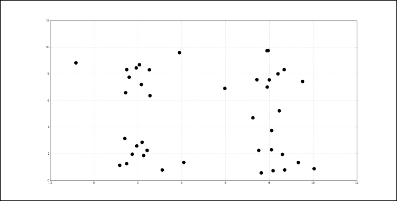

聚类可能会揭示以下两个群体，用方框和圆圈表示：

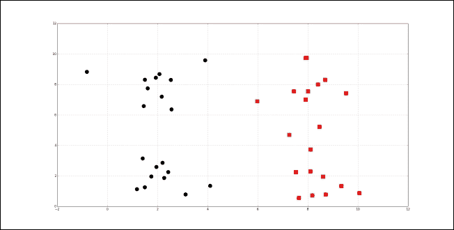

聚类也可能揭示以下四个群体：

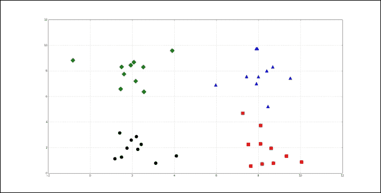

聚类常用于探索数据集。社交网络可以进行聚类，以识别社区并建议人们之间缺失的连接。在生物学中，聚类用于寻找具有相似表达模式的基因群组。推荐系统有时会使用聚类来识别可能吸引用户的产品或媒体。在营销中，聚类用于寻找相似消费者的细分群体。在接下来的章节中，我们将通过一个使用 K-Means 算法进行数据集聚类的示例。

# 使用 K-Means 算法进行聚类

K-Means 算法是一种流行的聚类方法，因其速度和可扩展性而受到青睐。K-Means 是一个迭代过程，通过将聚类的中心，即**质心**，移动到其组成点的均值位置，并重新将实例分配到它们最近的聚类中。标题中的是一个超参数，用于指定应该创建的聚类数；K-Means 会自动将观察值分配到聚类中，但无法确定适当的聚类数量。必须是一个小于训练集实例数的正整数。有时，聚类问题的上下文会指定聚类数。例如，一个生产鞋子的公司可能知道它能够支持生产三种新款式。为了了解每种款式应该面向哪些客户群体，它对客户进行了调查，并从结果中创建了三个聚类。也就是说，的值是由问题的上下文指定的。其他问题可能不需要特定数量的聚类，且最优聚类数可能模糊不清。我们将在本章后面讨论一种估算最优聚类数的启发式方法，称为肘部法则。

K-Means 的参数包括聚类质心的位置和分配给每个聚类的观察值。像广义线性模型和决策树一样，K-Means 参数的最优值是通过最小化一个成本函数来找到的。K-Means 的成本函数由以下公式给出：


在上述公式中，是聚类的质心。成本函数对聚类的扭曲进行求和。每个聚类的扭曲等于其质心与其组成实例之间的平方距离之和。紧凑的聚类扭曲较小，而包含分散实例的聚类扭曲较大。通过一个迭代过程来学习最小化成本函数的参数，过程包括将观察值分配到聚类中，然后移动聚类。首先，聚类的质心被初始化为随机位置。实际上，将质心的位置设置为随机选择的观察值的位置通常能得到最佳结果。在每次迭代中，K-Means 将观察值分配到它们最近的聚类中，然后将质心移动到它们分配的观察值的均值位置。我们通过手动操作一个例子来演示，使用如下表中的训练数据：

| 实例 | X0 | X1 |
| --- | --- | --- |
| 1 | 7 | 5 |
| 2 | 5 | 7 |
| 3 | 7 | 7 |
| 4 | 3 | 3 |
| 5 | 4 | 6 |
| 6 | 1 | 4 |
| 7 | 0 | 0 |
| 8 | 2 | 2 |
| 9 | 8 | 7 |
| 10 | 6 | 8 |
| 11 | 5 | 5 |
| 12 | 3 | 7 |

有两个解释变量，每个实例有两个特征。实例的散点图如下所示：

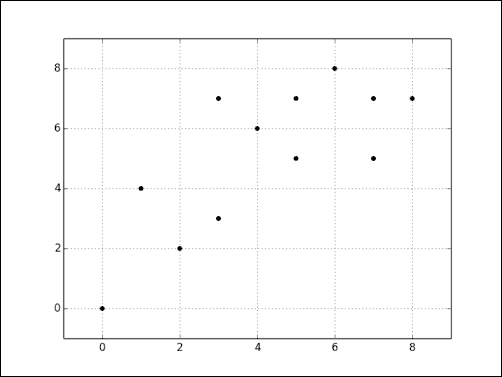

假设 K-Means 将第一个聚类的重心初始化为第五个实例，将第二个聚类的重心初始化为第十一个实例。对于每个实例，我们将计算其到两个重心的距离，并将其分配给距离最近的聚类。初始分配情况显示在下表的**Cluster**列中：

| 实例 | X0 | X1 | C1 距离 | C2 距离 | 上一个聚类 | 新聚类 | 是否改变？ |
| --- | --- | --- | --- | --- | --- | --- | --- |
| 1 | 7 | 5 | 3.16228 | 2 | 无 | C2 | 是 |
| 2 | 5 | 7 | 1.41421 | 2 | 无 | C1 | 是 |
| 3 | 7 | 7 | 3.16228 | 2.82843 | 无 | C2 | 是 |
| 4 | 3 | 3 | 3.16228 | 2.82843 | 无 | C2 | 是 |
| 5 | 4 | 6 | 0 | 1.41421 | 无 | C1 | 是 |
| 6 | 1 | 4 | 3.60555 | 4.12311 | 无 | C1 | 是 |
| 7 | 0 | 0 | 7.21110 | 7.07107 | 无 | C2 | 是 |
| 8 | 2 | 2 | 4.47214 | 4.24264 | 无 | C2 | 是 |
| 9 | 8 | 7 | 4.12311 | 3.60555 | 无 | C2 | 是 |
| 10 | 6 | 8 | 2.82843 | 3.16228 | 无 | C1 | 是 |
| 11 | 5 | 5 | 1.41421 | 0 | 无 | C2 | 是 |
| 12 | 3 | 7 | 1.41421 | 2.82843 | 无 | C1 | 是 |
| C1 重心 | 4 | 6 |   |   |   |   |   |
| C2 重心 | 5 | 5 |   |   |   |   |   |

绘制的重心和初始聚类分配如下图所示。分配给第一个聚类的实例用**X**标记，分配给第二个聚类的实例用点标记。重心的标记比实例的标记大。

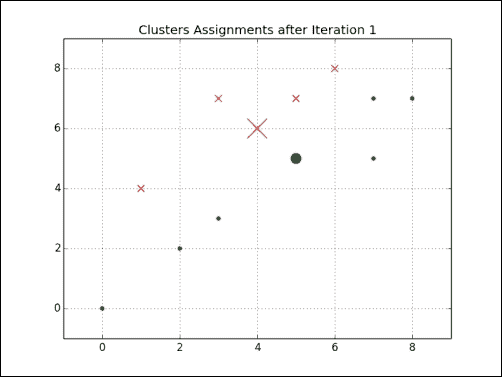

现在我们将两个重心移动到其组成实例的均值位置，重新计算训练实例到重心的距离，并将实例重新分配到距离最近的重心：

| 实例 | X0 | X1 | C1 距离 | C2 距离 | 上一个聚类 | 新聚类 | 是否改变？ |
| --- | --- | --- | --- | --- | --- | --- | --- |
| 1 | 7 | 5 | 3.492850 | 2.575394 | C2 | C2 | 否 |
| 2 | 5 | 7 | 1.341641 | 2.889107 | C1 | C1 | 否 |
| 3 | 7 | 7 | 3.255764 | 3.749830 | C2 | C1 | 是 |
| 4 | 3 | 3 | 3.492850 | 1.943067 | C2 | C2 | 否 |
| 5 | 4 | 6 | 0.447214 | 1.943067 | C1 | C1 | 否 |
| 6 | 1 | 4 | 3.687818 | 3.574285 | C1 | C2 | 是 |
| 7 | 0 | 0 | 7.443118 | 6.169378 | C2 | C2 | 否 |
| 8 | 2 | 2 | 4.753946 | 3.347250 | C2 | C2 | 否 |
| 9 | 8 | 7 | 4.242641 | 4.463000 | C2 | C1 | 是 |
| 10 | 6 | 8 | 2.720294 | 4.113194 | C1 | C1 | 否 |
| 11 | 5 | 5 | 1.843909 | 0.958315 | C2 | C2 | 否 |
| 12 | 3 | 7 | 1 | 3.260775 | C1 | C1 | 否 |
| C1 重心 | 3.8 | 6.4 |   |   |   |   |   |
| C2 重心 | 4.571429 | 4.142857 |   |   |   |   |   |

新的聚类在下图中进行了绘制。请注意，质心在分散，并且几个实例已改变了其分配：

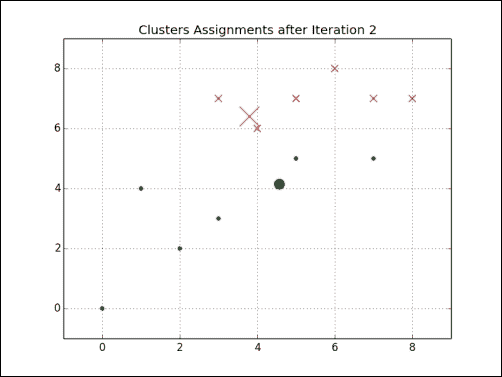

现在，我们将再次将质心移至其构成实例的位置的均值，并重新将实例分配给最近的质心。质心继续分散，如下图所示：

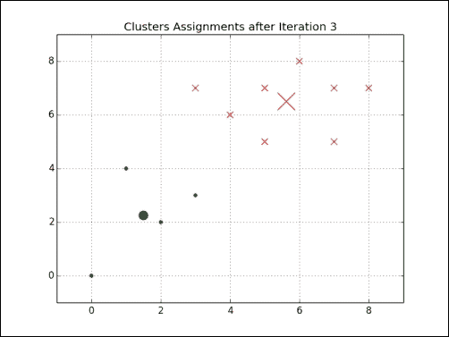

在下一次迭代中，实例的质心分配不会发生变化；K-Means 将继续迭代，直到满足某个停止准则。通常，这个准则是后续迭代中成本函数值之间的差异阈值，或质心位置变化的阈值。如果这些停止准则足够小，K-Means 会收敛到一个最优解。这个最优解不一定是全局最优解。

## 局部最优解

回想一下，K-Means 最初将聚类的质心位置设置为随机选定的观察值位置。有时，随机初始化不太幸运，质心被设置到导致 K-Means 收敛到局部最优解的位置。例如，假设 K-Means 随机初始化了两个聚类质心，位置如下：

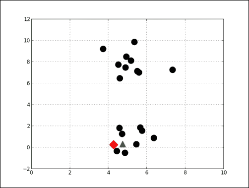

K-Means 最终会收敛到一个局部最优解，如下图所示。这些聚类可能有信息价值，但更可能的是，顶部和底部的观察组会形成更具信息性的聚类。为了避免局部最优解，K-Means 通常会重复执行数十次甚至数百次。在每次迭代中，它会随机初始化到不同的起始聚类位置。选择使成本函数最小化的初始化方案。

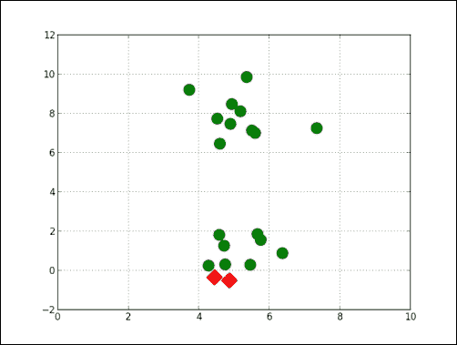

## 肘部法则

如果问题的背景没有指定，则可以使用一种叫做**肘部法则**的技术来估计最佳聚类数。肘部法则通过不同的值绘制由成本函数产生的值。当增加时，平均失真度会减小；每个聚类的构成实例会更少，且实例会更接近各自的质心。然而，随着的增加，平均失真度的改善会逐渐减少。在失真度改善下降最明显的值处，称为“肘部”。我们可以使用肘部法则来选择数据集的聚类数。下图的散点图可视化了一个有两个明显聚类的数据集：

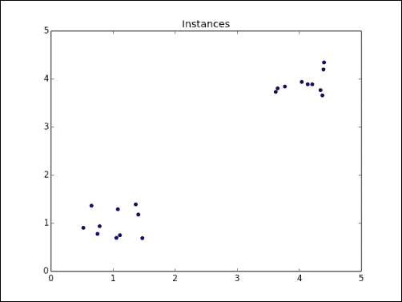

我们将使用以下代码计算并绘制每个值从 1 到 10 的聚类平均失真：

```py
>>> import numpy as np 
>>> from sklearn.cluster import KMeans 
>>> from scipy.spatial.distance import cdist 
>>> import matplotlib.pyplot as plt 

>>> cluster1 = np.random.uniform(0.5, 1.5, (2, 10))
>>> cluster2 = np.random.uniform(3.5, 4.5, (2, 10))
>>> X = np.hstack((cluster1, cluster2)).T
>>> X = np.vstack((x, y)).T 

>>> K = range(1, 10) 
>>> meandistortions = [] 
>>> for k in K: 
>>>     kmeans = KMeans(n_clusters=k) 
>>>     kmeans.fit(X) 
>>>     meandistortions.append(sum(np.min(cdist(X, kmeans.cluster_centers_, 'euclidean'), axis=1)) / X.shape[0]) 

>>> plt.plot(K, meandistortions, 'bx-') 
>>> plt.xlabel('k') 
>>> plt.ylabel('Average distortion') 
>>> plt.title('Selecting k with the Elbow Method') 
>>> plt.show()
```

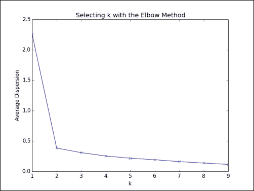

随着我们将从**1**增加到**2**，平均失真迅速改善。对于大于 2 的值，改进非常小。现在，我们将肘部法则应用于具有三个聚类的以下数据集：

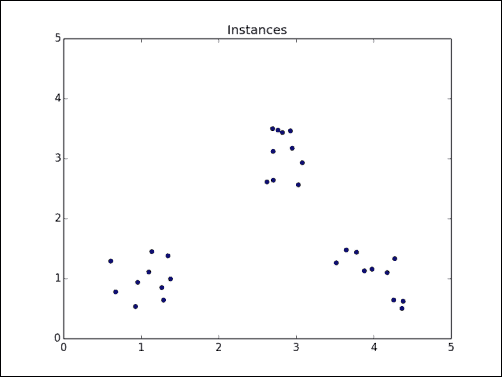

以下图形展示了该数据集的肘部图。由此可以看出，当添加第四个聚类时，平均失真的改善速度急剧下降，也就是说，肘部法则确认对于该数据集，应设置为三。

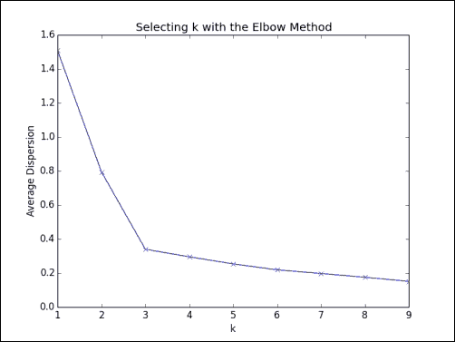

# 评估聚类

我们将机器学习定义为设计和研究从经验中学习以提高任务执行性能的系统，任务的性能通过给定的度量进行衡量。K-Means 是一种无监督学习算法；没有标签或基准真值来与聚类进行比较。然而，我们仍然可以使用内在度量来评估算法的性能。我们已经讨论了测量聚类失真度。在本节中，我们将讨论另一种聚类性能度量，称为**轮廓系数**。轮廓系数是衡量聚类紧凑性和分离度的指标。随着聚类质量的提高，它会增加；对于远离彼此的紧凑聚类，轮廓系数较大；对于大的重叠聚类，轮廓系数较小。轮廓系数是针对每个实例计算的；对于一组实例，它是个体样本分数的平均值。实例的轮廓系数通过以下公式计算：


*a*是聚类中实例之间的平均距离。*b*是实例与下一个最接近的聚类中实例之间的平均距离。以下示例运行四次 K-Means 算法，分别创建两个、三个、四个和八个聚类，并计算每次运行的轮廓系数：

```py
>>> import numpy as np
>>> from sklearn.cluster import KMeans
>>> from sklearn import metrics
>>> import matplotlib.pyplot as plt
>>> plt.subplot(3, 2, 1)
>>> x1 = np.array([1, 2, 3, 1, 5, 6, 5, 5, 6, 7, 8, 9, 7, 9])
>>> x2 = np.array([1, 3, 2, 2, 8, 6, 7, 6, 7, 1, 2, 1, 1, 3])
>>> X = np.array(zip(x1, x2)).reshape(len(x1), 2)
>>> plt.xlim([0, 10])
>>> plt.ylim([0, 10])
>>> plt.title('Instances')
>>> plt.scatter(x1, x2)
>>> colors = ['b', 'g', 'r', 'c', 'm', 'y', 'k', 'b']
>>> markers = ['o', 's', 'D', 'v', '^', 'p', '*', '+']
>>> tests = [2, 3, 4, 5, 8]
>>> subplot_counter = 1
>>> for t in tests:
>>>     subplot_counter += 1
>>>     plt.subplot(3, 2, subplot_counter)
>>>     kmeans_model = KMeans(n_clusters=t).fit(X)
>>>     for i, l in enumerate(kmeans_model.labels_):
>>>         plt.plot(x1[i], x2[i], color=colors[l], marker=markers[l], ls='None')
>>>     plt.xlim([0, 10])
>>>     plt.ylim([0, 10])
>>>     plt.title('K = %s, silhouette coefficient = %.03f' % (
>>>         t, metrics.silhouette_score(X, kmeans_model.labels_, metric='euclidean')))
>>> plt.show()
```

该脚本生成了以下图形：

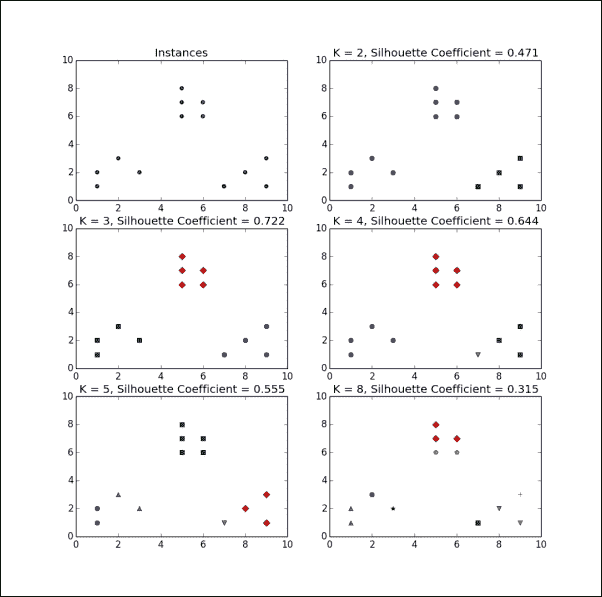

数据集包含三个明显的聚类。因此，当等于三时，轮廓系数最大。将设置为八时，产生的实例聚类相互之间的距离与它们与其他聚类的实例之间的距离相当，且这些聚类的轮廓系数最小。

# 图像量化

在前面的章节中，我们使用聚类来探索数据集的结构。现在让我们将其应用于一个不同的问题。图像量化是一种有损压缩方法，它用单一颜色替代图像中一系列相似的颜色。量化减少了图像文件的大小，因为表示颜色所需的位数较少。在以下示例中，我们将使用聚类来发现图像的压缩调色板，其中包含其最重要的颜色。然后，我们将使用压缩调色板重建图像。此示例需要`mahotas`图像处理库，可以通过`pip install mahotas`安装：

```py
>>> import numpy as np
>>> import matplotlib.pyplot as plt
>>> from sklearn.cluster import KMeans
>>> from sklearn.utils import shuffle
>>> import mahotas as mh
```

首先我们读取并展平图像：

```py
>>> original_img = np.array(mh.imread('img/tree.jpg'), dtype=np.float64) / 255
>>> original_dimensions = tuple(original_img.shape)
>>> width, height, depth = tuple(original_img.shape)
>>> image_flattened = np.reshape(original_img, (width * height, depth))
```

然后我们使用 K-Means 从 1,000 个随机选择的颜色样本中创建 64 个聚类。每个聚类将是压缩调色板中的一种颜色。代码如下：

```py
>>> image_array_sample = shuffle(image_flattened, random_state=0)[:1000]
>>> estimator = KMeans(n_clusters=64, random_state=0)
>>> estimator.fit(image_array_sample)
```

接下来，我们预测原始图像中每个像素的聚类分配：

```py
>>> cluster_assignments = estimator.predict(image_flattened)
```

最后，我们从压缩调色板和聚类分配中创建压缩图像：

```py
>>> compressed_palette = estimator.cluster_centers_
>>> compressed_img = np.zeros((width, height, compressed_palette.shape[1]))
>>> label_idx = 0
>>> for i in range(width):
>>>     for j in range(height):
>>>         compressed_img[i][j] = compressed_palette[cluster_assignments[label_idx]]
>>>         label_idx += 1
>>> plt.subplot(122)
>>> plt.title('Original Image')
>>> plt.imshow(original_img)
>>> plt.axis('off')
>>> plt.subplot(121)
>>> plt.title('Compressed Image')
>>> plt.imshow(compressed_img)
>>> plt.axis('off')
>>> plt.show()
```

图像的原始版本和压缩版本如下图所示：

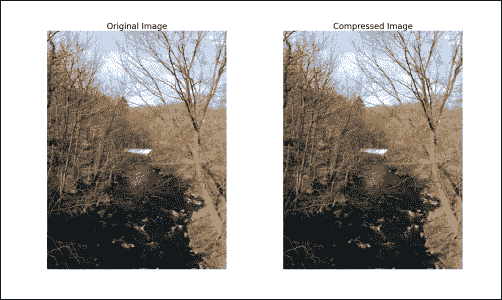

# 聚类学习特征

在这个例子中，我们将在半监督学习问题中将聚类与分类结合起来。你将通过对无标签数据进行聚类来学习特征，并使用学习到的特征构建监督分类器。

假设你拥有一只猫和一只狗。假设你购买了一部智能手机，表面上是为了与人类交流，但实际上只是为了拍摄你的猫和狗。你的照片非常棒，你确信你的朋友和同事们会喜欢详细查看这些照片。你希望能够体贴一些，尊重有些人只想看到猫的照片，而有些人只想看到狗的照片，但将这些照片分开是费力的。让我们构建一个半监督学习系统，可以分类猫和狗的图像。

回想一下从第三章，*特征提取和预处理*，我们可以看到，对图像进行分类的一个天真的方法是使用所有像素的强度或亮度作为解释变量。即使是小图像，这种方法也会产生高维特征向量。与我们用来表示文档的高维特征向量不同，这些向量并不是稀疏的。此外，显而易见的是，这种方法对图像的光照、尺度和方向非常敏感。在第三章中，*特征提取和预处理*，我们还讨论了 SIFT 和 SURF 描述符，它们以一种对尺度、旋转和光照不变的方式描述图像的有趣区域。在这个例子中，我们将聚类从所有图像中提取的描述符，以学习特征。然后，我们将用一个向量表示图像，向量的每个元素代表一个聚类。每个元素将编码从分配给聚类的图像中提取的描述符的数量。这种方法有时被称为**特征包表示法**，因为聚类的集合类似于词袋表示法的词汇表。我们将使用 Kaggle 的 *Dogs vs. Cats* 竞赛训练集中的 1,000 张猫和 1,000 张狗的图像。数据集可以从 [`www.kaggle.com/c/dogs-vs-cats/data`](https://www.kaggle.com/c/dogs-vs-cats/data) 下载。我们将猫标记为正类，狗标记为负类。请注意，这些图像有不同的尺寸；由于我们的特征向量不表示像素，因此我们不需要调整图像的尺寸使其具有相同的尺寸。我们将使用图像的前 60% 进行训练，然后在剩余的 40% 上进行测试：

```py
>>> import numpy as np
>>> import mahotas as mh
>>> from mahotas.features import surf
>>> from sklearn.linear_model import LogisticRegression
>>> from sklearn.metrics import *
>>> from sklearn.cluster import MiniBatchKMeans
>>> import glob
```

首先，我们加载图像，将它们转换为灰度图像，并提取 SURF 描述符。与许多类似特征相比，SURF 描述符可以更快地提取，但从 2,000 张图像中提取描述符仍然是计算密集型的。与之前的例子不同，这个脚本在大多数计算机上执行需要几分钟时间。

```py
>>> all_instance_filenames = []
>>> all_instance_targets = []
>>> for f in glob.glob('cats-and-dogs-img/*.jpg'):
>>>     target = 1 if 'cat' in f else 0
>>>     all_instance_filenames.append(f)
>>>     all_instance_targets.append(target)
>>> surf_features = []
>>> counter = 0
>>> for f in all_instance_filenames:
>>>     print 'Reading image:', f
>>>     image = mh.imread(f, as_grey=True)
>>>     surf_features.append(surf.surf(image)[:, 5:])

>>> train_len = int(len(all_instance_filenames) * .60)
>>> X_train_surf_features = np.concatenate(surf_features[:train_len])
>>> X_test_surf_feautres = np.concatenate(surf_features[train_len:])
>>> y_train = all_instance_targets[:train_len]
>>> y_test = all_instance_targets[train_len:]
```

然后，我们在下面的代码示例中将提取的描述符分组到 300 个聚类中。我们使用 `MiniBatchKMeans`，这是 K-Means 的一种变体，每次迭代使用实例的随机样本。由于它仅计算每次迭代中一些实例到质心的距离，`MiniBatchKMeans` 收敛更快，但其聚类的失真可能更大。实际上，结果是相似的，这种折衷是可以接受的。

```py
>>> n_clusters = 300
>>> print 'Clustering', len(X_train_surf_features), 'features'
>>> estimator = MiniBatchKMeans(n_clusters=n_clusters)
>>> estimator.fit_transform(X_train_surf_features)
```

接下来，我们为训练和测试数据构建特征向量。我们找到与每个提取的 SURF 描述符相关联的聚类，并使用 NumPy 的 `binCount()` 函数对它们进行计数。以下代码为每个实例生成一个 300 维的特征向量：

```py
>>> X_train = []
>>> for instance in surf_features[:train_len]:
>>>     clusters = estimator.predict(instance)
>>>     features = np.bincount(clusters)
>>>     if len(features) < n_clusters:
>>>         features = np.append(features, np.zeros((1, n_clusters-len(features))))
>>>     X_train.append(features)

>>> X_test = []
>>> for instance in surf_features[train_len:]:
>>>     clusters = estimator.predict(instance)
>>>     features = np.bincount(clusters)
>>>     if len(features) < n_clusters:
>>>         features = np.append(features, np.zeros((1, n_clusters-len(features))))
>>>     X_test.append(features)
```

最后，我们在特征向量和目标上训练了一个逻辑回归分类器，并评估了其精度、召回率和准确率：

```py
>>> clf = LogisticRegression(C=0.001, penalty='l2')
>>> clf.fit_transform(X_train, y_train)
>>> predictions = clf.predict(X_test)
>>> print classification_report(y_test, predictions)
>>> print 'Precision: ', precision_score(y_test, predictions)
>>> print 'Recall: ', recall_score(y_test, predictions)
>>> print 'Accuracy: ', accuracy_score(y_test, predictions)

Reading image: dog.9344.jpg
...
Reading image: dog.8892.jpg
Clustering 756914 features
             precision    recall  f1-score   support

          0       0.71      0.76      0.73       392
          1       0.75      0.70      0.72       408

avg / total       0.73      0.73      0.73       800

Precision:  0.751322751323
Recall:  0.696078431373
Accuracy:  0.7275
```

这个半监督系统比仅使用像素强度作为特征的逻辑回归分类器具有更好的精度和召回率。此外，我们的特征表示仅有 300 维；即使是小的 100 x 100 像素图像也会有 10,000 维。

# 总结

本章我们讨论了第一个无监督学习任务：聚类。聚类用于发现无标签数据中的结构。你学习了 K 均值聚类算法，该算法通过迭代地将实例分配到聚类中，并细化聚类中心的位置。虽然 K 均值是通过经验进行学习的，而非监督学习，但其性能依然可衡量；你学会了使用失真度和轮廓系数来评估聚类。我们将 K 均值应用于两个不同的问题。首先，我们使用 K 均值进行图像量化，这是一种通过单一颜色表示一系列颜色的压缩技术。我们还将 K 均值用于半监督图像分类问题中的特征学习。

在下一章，我们将讨论另一种无监督学习任务——降维。就像我们为猫狗图像分类所创建的半监督特征表示一样，降维可以用来减少一组解释变量的维度，同时尽可能保留更多信息。
