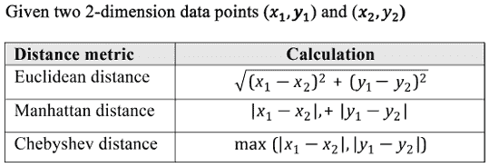
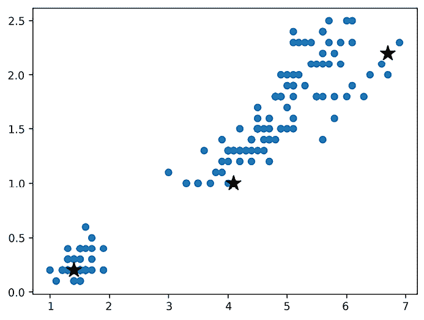
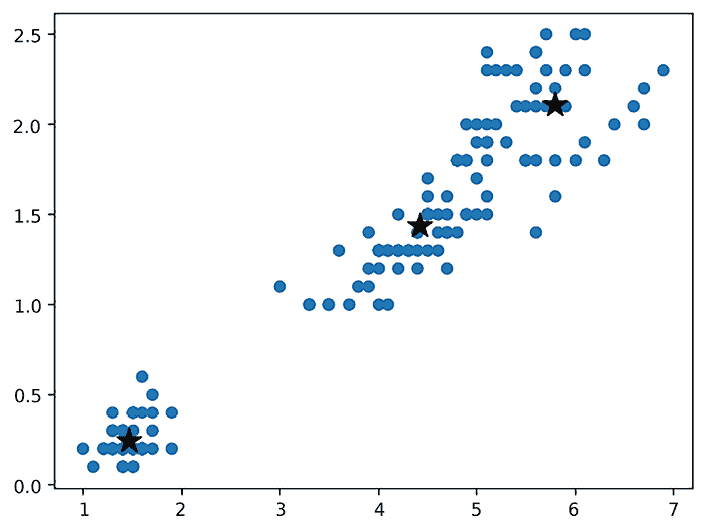
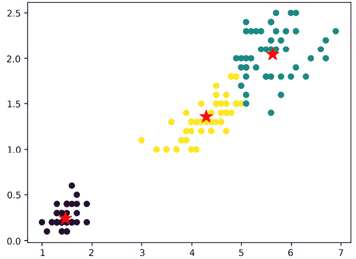
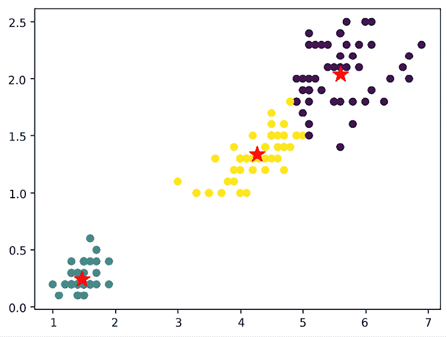
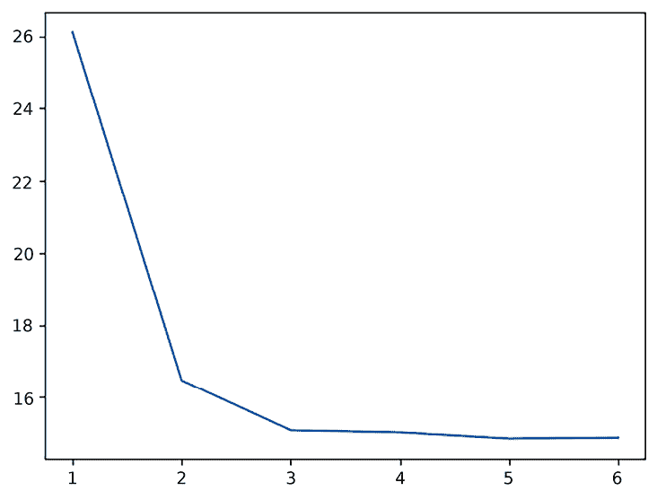

# 通过聚类和主题建模发现新闻组数据集中的潜在主题

在上一章中，我们使用 t-SNE 进行了文本可视化。t-SNE 或任何降维算法都是一种无监督学习方法。在本章中，我们将继续我们的无监督学习之旅，特别关注聚类和主题建模。我们将从无监督学习如何在没有指导的情况下进行学习以及它如何擅长发现数据中隐藏的信息开始。

接下来，我们将讨论聚类作为无监督学习的重要分支，它从数据中识别不同的观察组。例如，聚类在市场细分中非常有用，可以将具有相似行为的消费者分为一个组进行营销。我们将对 20 个新闻组文本数据集进行聚类，并看看会产生哪些聚类。

我们将采用的另一种无监督学习方法是主题建模，它是从数据集中提取隐藏主题的过程。你会对从 20 个新闻组数据集中挖掘出的许多有趣主题感到惊讶。

我们将涵盖以下主题：

+   无指导的学习——无监督学习

+   开始使用 k-means 聚类

+   聚类新闻组数据

+   发现新闻组中的潜在主题

# 无指导的学习——无监督学习

在上一章中，我们应用了 t-SNE 来可视化新闻组文本数据，并将其降维到二维。t-SNE 或一般的降维技术是一种**无监督学习**。与监督学习不同，无监督学习没有预定义的标签或类别指导（如类别或成员资格（分类）和连续值（回归））。无监督学习识别输入数据中的内在结构或共性。由于无监督学习没有指导，因此没有明确的正确或错误的结果。无监督学习有自由去发现输入数据下面隐藏的信息。

理解无监督学习的一种简单方法是将其比作通过做大量的模拟考试题目来准备考试。在监督学习中，你会得到这些模拟题的答案。你基本上是找出问题和答案之间的关系，学会如何将问题映射到答案上。希望你最终能够通过正确回答问题，顺利通过实际考试。然而，在无监督学习中，你并没有得到这些模拟题的答案。在这种情况下，你可能会做以下几件事：

+   将相似的练习题归类，以便你可以一次性学习相关的题目

+   找出那些高度重复的问题，以便你不必为每一个问题单独花费时间去解答

+   找出稀有的问题，以便你能更好地为它们做好准备

+   通过去除模板化文本提取每个问题的关键部分，这样你可以直达要点。

你会注意到，这些任务的结果都非常开放。只要能够描述数据下的共同性和结构，它们就是正确的。

机器学习中的**特征**通常也称为**属性**、**观测值**或**预测变量**。问题的答案则是机器学习中的标签，也叫**目标**或**目标变量**。提供答案的练习问题称为**有标签数据**，而没有答案的练习问题则是**无标签数据**。无监督学习适用于无标签数据，并在没有指导的情况下对这些信息进行处理。

无监督学习可以包括以下几种类型：

+   **聚类**：这意味着根据共同点对数据进行分组，通常用于探索性数据分析。将相似的练习问题分组，正如前面提到的，便是聚类的一个例子。聚类技术广泛应用于客户细分或为营销活动分组相似的在线行为。本章我们将学习流行的 k-means 聚类算法。

+   **关联**：这探索两个或多个特征的特定值的共现。异常检测（也称为离群值检测）是一个典型案例，通过它可以识别稀有的观测值。通过异常检测技术可以在前面的例子中识别出稀有问题。

+   **投影**：将原始特征空间映射到一个降维空间，保留或提取一组主变量。提取练习问题的关键部分是一个投影的例子，或者更具体地说，是一个降维过程。我们之前学习过的 t-SNE 就是一个很好的例子。

无监督学习在自然语言处理领域广泛应用，主要是因为获取标注文本数据的困难。与数值数据（如房价、股票数据和在线点击流）不同，标注文本有时是主观的、手动的且繁琐的。在挖掘文本数据时，不需要标签的无监督学习算法显得尤为有效。

在*第七章*，*使用文本分析技术挖掘 20 个新闻组数据集*，你体验了使用 t-SNE 来减少文本数据的维度。现在，让我们通过聚类算法和主题建模技术来探索文本挖掘。我们将从对新闻组数据进行聚类开始。

# 开始学习 k-means 聚类

新 sgroups 数据自带标签，这些标签是新闻组的类别，其中有一些类别之间紧密相关甚至重叠。例如，五个计算机相关的新闻组：`comp.graphics`、`comp.os.ms-windows.misc`、`comp.sys.ibm.pc.hardware`、`comp.sys.mac.hardware`、`comp.windows.x`，以及两个与宗教相关的新闻组：`alt.atheism`和`talk.religion.misc`。

现在假设我们不知道这些标签，或者它们不存在。相关主题的样本是否会被聚类到一起？我们将使用 k-means 聚类算法来验证。

## k-means 聚类是如何工作的？

k-means 算法的目标是根据特征相似性将数据划分为 k 个组。*k* 是 *k* 均值聚类模型的预定义属性。每个 *k* 个聚类由一个质心（聚类的中心）指定，每个数据样本属于与其最接近的质心对应的聚类。在训练过程中，算法根据提供的数据反复更新 *k* 个质心。具体步骤如下：

1.  **指定 k**：算法需要知道最终要生成多少个聚类。

1.  **初始化质心**：算法首先从数据集中随机选择 k 个样本作为质心。

1.  **分配聚类**：现在我们有了 *k* 个质心，共享相同最近质心的样本构成一个聚类。因此，创建了 *k* 个聚类。请注意，距离通常通过**欧几里得距离**来衡量。也可以使用其他度量标准，如**曼哈顿距离**和**切比雪夫距离**，它们列在下表中：



图 8.1：距离度量

1.  **更新质心**：对于每个聚类，我们需要重新计算其中心点，即该聚类中所有样本的均值。*k* 个质心将更新为相应聚类的均值。这就是算法被称为**k-means**的原因。

1.  **重复步骤 3 和 4**：我们不断重复分配聚类和更新质心的过程，直到模型收敛，即无法再更新质心或质心更新足够小，或者完成了足够多的迭代。

训练后的 k-means 聚类模型的输出包括以下内容：

+   每个训练样本的聚类 ID，范围从 1 到 *k*

+   *k* 个质心，可以用来对新样本进行聚类——新样本将归属于最近的质心对应的聚类。

k-means 聚类算法很容易理解，其实现也很直接，正如你接下来将发现的那样。

## 从零实现 k-means 算法

我们将以 scikit-learn 中的 `iris` 数据集为例。首先加载数据并进行可视化。为简化起见，我们这里只使用原始数据集中的两个特征：

```py
>>> from sklearn import datasets
>>> iris = datasets.load_iris()
>>> X = iris.data[:, 2:4]
>>> y = iris.target 
```

由于数据集包含三种鸢尾花类别，我们将其用三种不同的颜色表示，如下所示：

```py
>>> import numpy as np
>>> from matplotlib import pyplot as plt
>>> plt.scatter(X[:,0], X[:,1], c=y)
>>> plt.show() 
```

这将为原始数据图生成如下输出：


图 8.2：原始鸢尾花数据集的绘图

假设我们对标签 *y* 一无所知，我们尝试将数据分成三个组，因为前面的图中似乎有三个簇（或者你可能说有两个，稍后我们会回来讨论）。让我们执行*步骤 1*，*指定 k*，以及*步骤 2*，*初始化质心*，通过随机选择三个样本作为初始质心：

```py
>>> k = 3
>>> np.random.seed(0)
>>> random_index = np.random.choice(range(len(X)), k)
>>> centroids = X[random_index] 
```

我们可视化数据（不再带标签）以及初始的随机质心：

```py
>>> def visualize_centroids(X, centroids):
...     plt.scatter(X[:, 0], X[:, 1])
...     plt.scatter(centroids[:, 0], centroids[:, 1], marker='*',
                                             s=200, c='#050505')
...     plt.show()
>>> visualize_centroids(X, centroids) 
```

请参见以下截图，查看数据及初始随机质心：



图 8.3：具有随机质心的数据点

现在我们执行*步骤 3*，这包括基于最近的质心分配簇。首先，我们需要定义一个计算距离的函数，该距离通过欧几里得距离来度量，如下所示：

```py
>>> def dist(a, b):
...     return np.linalg.norm(a - b, axis=1) 
```

然后，我们开发一个函数，将样本分配给最近的质心簇：

```py
>>> def assign_cluster(x, centroids):
...     distances = dist(x, centroids)
...     cluster = np.argmin(distances)
...     return cluster 
```

分配完簇后，我们执行*步骤 4*，即将质心更新为各个簇中所有样本的均值：

```py
>>> def update_centroids(X, centroids, clusters):
...     for i in range(k):
...         cluster_i = np.where(clusters == i)
...         centroids[i] = np.mean(X[cluster_i], axis=0) 
```

最后，我们有*步骤 5*，这涉及重复*步骤 3*和*步骤 4*，直到模型收敛并且出现以下任一情况：

+   质心移动小于预设的阈值

+   已经进行了足够的迭代

我们设置了第一个条件的容差和最大迭代次数，如下所示：

```py
>>> tol = 0.0001
>>> max_iter = 100 
```

初始化簇的起始值，并为所有样本初始化簇，如下所示：

```py
>>> iter = 0
>>> centroids_diff = 100000
>>> clusters = np.zeros(len(X)) 
```

所有组件准备好后，我们可以逐轮训练模型，其中首先检查收敛性，然后执行*步骤 3*和*步骤 4*，最后可视化最新的质心：

```py
>>> from copy import deepcopy
>>> while iter < max_iter and centroids_diff > tol:
...     for i in range(len(X)):
...         clusters[i] = assign_cluster(X[i], centroids)
...     centroids_prev = deepcopy(centroids)
...     update_centroids(X, centroids, clusters)
...     iter += 1
...     centroids_diff = np.linalg.norm(centroids -
                                       centroids_prev)
...     print('Iteration:', str(iter))
...     print('Centroids:\n', centroids)
...     print(f'Centroids move: {centroids_diff:5.4f}')
...     visualize_centroids(X, centroids) 
```

让我们看看从前面的命令生成的以下输出：

+   **迭代 1**：请查看迭代 1 的以下输出：

    ```py
    Iteration: 1
    Centroids:
    [[1.462      0.246     ]
    [5.80285714 2.11142857]
    [4.42307692 1.44153846]]
    Centroids move: 0.8274 
    ```

迭代 1 后的质心图如下：



图 8.4：第一次迭代后的 k-means 聚类结果

+   **迭代 2**：请查看迭代 2 的以下输出：

    ```py
    Iteration: 2
    Centroids:
    [[1.462      0.246     ]
    [5.73333333 2.09487179]
    [4.37704918 1.40819672]]
    Centroids move: 0.0913 
    ```

迭代 2 后的质心图如下：


图 8.5：第二轮迭代后的 k-means 聚类结果

+   **迭代 6**：请查看迭代 6 的以下输出（在此我们跳过迭代 3 到 5，以避免冗长）：

    ```py
    Iteration: 6
    Centroids:
    [[1.462      0.246     ]
    [5.62608696 2.04782609]
    [4.29259259 1.35925926]]
    Centroids move: 0.0225 
    ```

迭代 6 后的质心图如下：


图 8.6：第六轮迭代后的 k-means 聚类结果

+   **迭代 7**：请查看迭代 7 的以下输出：

    ```py
    Iteration: 7
    Centroids:
    [[1.462      0.246     ]
    [5.62608696 2.04782609]
    [4.29259259 1.35925926]]
    Centroids move: 0.0000 
    ```

迭代 7 后的质心图如下：


图 8.7：第七轮迭代后的 k-means 聚类结果

模型在七次迭代后收敛。结果的聚类中心看起来很有希望，我们也可以绘制聚类：

```py
>>> plt.scatter(X[:, 0], X[:, 1], c=clusters)
>>> plt.scatter(centroids[:, 0], centroids[:, 1], marker='*',
                                           s=200, c='r')
>>> plt.show() 
```

请参阅以下截图获取最终结果：



图 8.8：数据样本及其学习到的聚类中心

如您所见，围绕相同聚类中心的样本形成了一个聚类。经过七次迭代（如果更改 `np.random.seed(0)` 中的随机种子，您可能会看到稍多或稍少的迭代次数），模型收敛，并且聚类中心不再更新。

## 使用 scikit-learn 实现 k-means

在开发了我们自己的 k-means 聚类模型后，我们将讨论如何通过执行以下步骤，使用 scikit-learn 进行更快速的解决方案：

1.  首先，导入 `KMeans` 类，并初始化一个包含三个聚类的模型，如下所示：

    ```py
    >>> from sklearn.cluster import KMeans
    >>> kmeans_sk = KMeans(n_clusters=3, n_init='auto', random_state=42) 
    ```

`KMeans` 类接受以下重要参数：

| **构造器参数** | **默认值** | **示例值** | **描述** |
| --- | --- | --- | --- |
| `n_clusters` | `8` | `3, 5, 10` | *k* 个聚类 |
| `max_iter` | `300` | `10, 100, 500` | 最大迭代次数 |
| `tol` | `1e-4` | `1e-5, 1e-8` | 声明收敛的容忍度 |
| `random_state` | `None` | `0, 42` | 用于程序可重复性的随机种子 |

表 8.1：KMeans 类的参数

1.  然后，我们将模型拟合到数据上：

    ```py
    >>> kmeans_sk.fit(X) 
    ```

1.  之后，我们可以获得聚类结果，包括数据样本的聚类和各个聚类的中心：

    ```py
    >>> clusters_sk = kmeans_sk.labels_
    >>> centroids_sk = kmeans_sk.cluster_centers_ 
    ```

1.  同样，我们绘制聚类及其中心：

    ```py
    >>> plt.scatter(X[:, 0], X[:, 1], c=clusters_sk)
    >>> plt.scatter(centroids_sk[:, 0], centroids_sk[:, 1], marker='*', s=200, c='r')
    >>> plt.show() 
    ```

这将产生以下输出：



图 8.9：使用 scikit-learn 学到的聚类中心及数据样本

使用我们从头实现的模型，我们得到与之前相似的结果。

## 选择 k 的值

让我们回到之前讨论的 *k* 值的问题。在前面的例子中，设置为 `3` 更直观，因为我们知道总共有三个类。然而，在大多数情况下，我们并不知道多少个群组是足够的或高效的，同时算法需要一个特定的 *k* 值来开始。那么，我们该如何选择 *k* 的值呢？有一种著名的启发式方法，叫做 **肘部法则**。

在肘部法则中，选择不同的 *k* 值并训练相应的模型；对于每个训练好的模型，计算 **平方误差和**（**SSE**，也称为 **聚类内距离和**），并将其与 *k* 绘制在一起。请注意，对于一个聚类，平方误差（或聚类内距离）是通过计算每个样本到聚类中心的平方距离之和来得出的。选择最优的 *k* 值是在 SSE 的边际下降开始急剧减小时，这意味着进一步的聚类不再提供任何实质性的提升。

让我们将肘部法则应用于我们在前一节中介绍的示例（通过示例学习正是本书的重点）。我们在`iris`数据上对不同的*k*值执行 k-means 聚类：

```py
>>> X = iris.data
>>> y = iris.target
>>> k_list = list(range(1, 7))
>>> sse_list = [0] * len(k_list) 
```

我们使用完整的特征空间，并将`k`值范围从`1`到`6`。然后，我们训练各个模型，并分别记录结果的 SSE：

```py
>>> for k_ind, k in enumerate(k_list):
...     kmeans = KMeans(n_clusters=k, n_init='auto', random_state=42)
...     kmeans.fit(X)
...     clusters = kmeans.labels_
...     centroids = kmeans.cluster_centers_
...     sse = 0
...     for i in range(k):
...         cluster_i = np.where(clusters == i)
...         sse += np.linalg.norm(X[cluster_i] - centroids[i])
...     print(f'k={k}, SSE={sse}')
...     sse_list[k_ind] = sse
k=1, SSE=26.103076447039722
k=2, SSE=16.469773740281195
k=3, SSE=15.089477089696558
k=4, SSE=15.0307321707491
k=5, SSE=14.858930749063735
k=6, SSE=14.883090350867239 
```

最后，我们绘制 SSE 与不同`k`范围的关系图，如下所示：

```py
>>> plt.plot(k_list, sse_list)
>>> plt.show() 
```

这将产生以下输出：



图 8.10：k-means 肘部法则 – SSE 与 k 的关系

**最佳实践**

选择适当的相似度度量来计算 k-means 聚类中的距离，取决于数据的性质和分析的具体目标。一些常见的相似度度量包括以下几种：

+   **欧几里得距离**：这是默认的度量方法，适用于连续数据，其中特征值之间的差异很重要。

+   **曼哈顿距离（也称为 L1 范数）**：它计算两点坐标之间绝对差的总和。适用于高维数据以及维度之间不可直接比较的情况。

+   **余弦相似度**：对于文本数据或表示为向量的数据，余弦相似度非常有用，因为在这种情况下，向量的大小不如方向重要。

+   **杰卡德相似度**：通过比较两个集合的交集与并集来衡量它们之间的相似度。通常用于二元或类别数据。

显然，肘部点是`k=3`，因为在`3`之后，SSE 的下降速度显著减缓。因此，`k=3`是此情况的最优解，这与有三类花朵的事实一致。

# 聚类新闻组数据集

现在你应该对 k-means 聚类非常熟悉了。接下来，让我们看看使用该算法能够从新闻组数据集中挖掘出什么。我们将以`'alt.atheism'`、`'talk.religion.misc'`、`'comp.graphics'`和`'sci.space'`四个类别的所有数据为例。然后，我们将使用 ChatGPT 来描述生成的新闻组聚类。ChatGPT 可以生成关于 k-means 聚类形成的聚类的自然语言描述。这有助于理解每个聚类的特征和主题。

## 使用 k-means 对新闻组数据进行聚类

我们首先从这些新闻组加载数据，并按*第七章*中所示进行预处理，*使用文本分析技术挖掘 20 个新闻组数据集*：

```py
>>> from sklearn.datasets import fetch_20newsgroups
>>> categories = [
...     'alt.atheism',
...     'talk.religion.misc',
...     'comp.graphics',
...     'sci.space',
... ]
>>> groups = fetch_20newsgroups(subset='all',
                                categories=categories)
>>> labels = groups.target
>>> label_names = groups.target_names
>>> from nltk.corpus import names
>>> from nltk.stem import WordNetLemmatizer
>>> all_names = set(names.words())
>>> lemmatizer = WordNetLemmatizer()
>>> def get_cleaned_data(groups, lemmatizer, remove_words):
        data_cleaned = []
        for doc in groups.data:
...         doc = doc.lower()
...         doc_cleaned = ' '.join(lemmatizer.lemmatize(word)
                                  for word in doc.split()
                                  if word.isalpha() and
                                  word not in remove_words)
...         data_cleaned.append(doc_cleaned)
...     return data_cleaned
>>> data_cleaned = get_cleaned_data(groups, lemmatizer, all_names) 
```

然后，我们使用 scikit-learn 中的`CountVectorizer`将清理后的文本数据转换为计数向量：

```py
>>> from sklearn.feature_extraction.text import CountVectorizer
>>> count_vector = CountVectorizer(stop_words="english",
                        max_features=None, max_df=0.5, min_df=2)
>>> data_cv = count_vector.fit_transform(data_cleaned) 
```

请注意，我们在这里使用的向量化器并不限制特征（词项）数量，而是限制最小和最大文档频率（`min_df`和`max_df`），它们分别是数据集的 2%和 50%。一个词的**文档频率**是通过计算数据集中包含该词的文档（样本）的比例来衡量的。这有助于过滤掉那些稀有或无关的术语。

输入数据准备好后，我们现在将尝试将其聚类为四个组，具体如下：

```py
>>> k = 4
>>> kmeans = KMeans(n_clusters=k, n_init='auto', random_state=42)
>>> kmeans.fit(data_cv) 
```

让我们快速检查一下结果聚类的大小：

```py
>>> clusters = kmeans.labels_
>>> from collections import Counter
>>> print(Counter(clusters))
Counter({3: 3360, 0: 17, 1: 7, 2: 3}) 
```

聚类看起来并不完全正确，大多数样本（`3360`个样本）聚集在一个大聚类（聚类 3）中。可能出了什么问题？事实证明，我们基于计数的特征不够具有代表性。对于文本数据，更好的数值表示是**词频-逆文档频率**（**tf-idf**）。与其简单地使用词项计数，或者所谓的**词频**（**tf**），它为每个词项频率分配一个与文档频率成反比的加权因子。实际上，术语*t*在文档*D*中的**idf**因子计算如下：


这里，*n*[D]是文档的总数，*n*[t]是包含术语*t*的文档数，*1*是为了避免除以 0 而加上的常数。

在加入`idf`因子后，`tf-idf`表示法减少了常见术语（例如*get*和*make*）的权重，强调那些很少出现但传达重要意义的术语。

要使用`tf-idf`表示法，我们只需将`CountVectorizer`替换为 scikit-learn 中的`TfidfVectorizer`，如下所示：

```py
>>> from sklearn.feature_extraction.text import TfidfVectorizer
>>> tfidf_vector = TfidfVectorizer(stop_words='english',
                                  max_features=None, max_df=0.5, min_df=2) 
```

参数`max_df`用于忽略那些文档频率高于给定阈值的术语。在本例中，出现在超过 50%的文档中的术语将在向量化过程中被忽略。`min_df`指定了一个术语被包含在输出中的最小文档频率要求。那些出现在少于两个文档中的术语将被忽略。

现在，使用`tf-idf`向量化器和 k-means 聚类算法在结果特征空间中重新进行特征提取：

```py
>>> data_tv = tfidf_vector.fit_transform(data_cleaned)
>>> kmeans.fit(data_tv)
>>> clusters = kmeans.labels_
>>> print(Counter(clusters))
Counter({1: 1478, 2: 797, 3: 601, 0: 511}) 
```

聚类结果变得更加合理。

我们还通过检查每个聚类包含的内容以及表示每个聚类的前 10 个术语（具有最高 tf-idf 得分的 10 个术语）来更深入地观察聚类结果：

```py
>>> cluster_label = {i: labels[np.where(clusters == i)] for i in
                                                        range(k)}
>>> terms = tfidf_vector.get_feature_names_out()
>>> centroids = kmeans.cluster_centers_
>>> for cluster, index_list in cluster_label.items():
...     counter = Counter(cluster_label[cluster])
...     print(f'cluster_{cluster}: {len(index_list)} samples')
...     for label_index, count in sorted(counter.items(),
                               key=lambda x: x[1], reverse=True):
...         print(f'- {label_names[label_index]}: {count} samples')
...     print('Top 10 terms:')
...     for ind in centroids[cluster].argsort()[-10:]:
...         print(' %s' % terms[ind], end="")
...     print()
cluster_0: 601 samples
- sci.space: 598 samples
- alt.atheism: 1 samples
- talk.religion.misc: 1 samples
- comp.graphics: 1 samples
Top 10 terms: just orbit moon hst nasa mission launch wa shuttle space
cluster_1: 1478 samples
- alt.atheism: 522 samples
- talk.religion.misc: 387 samples
- sci.space: 338 samples
- comp.graphics: 231 samples
Top 10 terms: say people know like think ha just university wa article
cluster_2: 797 samples
- comp.graphics: 740 samples
- sci.space: 49 samples
- talk.religion.misc: 5 samples
- alt.atheism: 3 samples
Top 10 terms: computer need know looking thanks university program file graphic image
cluster_3: 511 samples
- alt.atheism: 273 samples
- talk.religion.misc: 235 samples
- sci.space: 2 samples
- comp.graphics: 1 samples
Top 10 terms: doe bible think believe say people christian jesus wa god 
```

从我们在前面的结果中观察到的情况来看：

+   `cluster_0`显然是关于太空的，并且包含几乎所有的`sci.space`样本以及相关术语，如`orbit`，`moon`，`nasa`，`launch`，`shuttle`和`space`。

+   `cluster_1`是更为通用的主题。

+   `cluster_2`更多的是关于计算机图形学和相关术语，例如`computer`，`program`，`file`，`graphic`和`image`。

+   `cluster_3` 是一个有趣的簇，成功地将两个重叠的主题——无神论和宗教——汇集在一起，关键术语包括`bible`、`believe`、`jesus`、`christian`和`god`

随时尝试不同的 `k` 值，或使用肘部法找到最佳值（这实际上是本章后面的一个练习）。

通过聚类找到每个文本组的关键术语非常有趣。如果我们能够根据其关键术语描述每个簇，那将更有趣。让我们看看如何在下一节中通过 ChatGPT 进行此操作。

## 使用 GPT 描述簇

**ChatGPT** ([`chat.openai.com/`](https://chat.openai.com/)) 是由 **OpenAI** ([`openai.com/`](https://openai.com/)) 开发的 AI 语言模型，是 **生成预训练变换器**（**GPT**）系列模型的一部分，具体基于 GPT-3.5（在撰写时 GPT-4 处于测试阶段）架构。ChatGPT 设计用于与用户进行自然语言对话，并提供类似人类的响应。

该模型在大量来自互联网的多样文本数据上进行了训练，使其能够理解并生成各种主题和背景下类似人类的文本。ChatGPT 能够理解用户提出的问题、提示和指令，并根据其训练生成连贯的响应。

ChatGPT 已在各种应用中使用，包括聊天机器人、虚拟助手、内容生成、语言翻译等等。用户通过 API 调用或交互界面与 ChatGPT 进行交互，模型实时生成响应。然而，需要注意的是，虽然 ChatGPT 能够生成印象深刻且与上下文相关的响应，但由于当前语言模型的限制，它偶尔也可能生成不正确或无意义的答案。应对 ChatGPT 的响应应进行意义检查，以提高生成文本的质量和可靠性，并尽量减少误信息的风险。

我们将请求 ChatGPT 描述我们刚生成的簇的步骤如下。

首先，我们如下获取前 100 个术语：

```py
>>> keywords = ' '.join(
                      terms[ind] for ind in centroids[0].argsort()[-100:])
>>> print(keywords)
big power vehicle using alaska look mass money marketing company loss pluto russian scheduled office express probably research software funding billboard online pat access doe telescope april jet usa digest light want prize forwarded way large mar project sci center command technology air government commercial good work servicing know going comet world propulsion people idea design data university day international use orbital long science need time sky program thing make spencer new year earth spacecraft flight henry billion rocket think ha station lunar solar like cost satellite article toronto zoology just orbit moon hst nasa mission launch wa shuttle space 
```

在 [`chat.openai.com`](https://chat.openai.com) 注册（或登录如果您已有账户）后，我们通过使用提示`基于以下关键词描述一个共同的主题：`要求 ChatGPT 描述主题。请参考下图以获取完整的问题和答案：


图 8.11: 要求 ChatGPT 描述第 0 簇的主题

正如 ChatGPT 正确指出的那样，`“共同的主题围绕着太空探索、研究、技术和任务的各个方面，提到该领域的关键人物和天体。”` 随时可以对其他簇重复相同的过程。您还可以通过遵循以下步骤在 Python 中使用 ChatGPT API 实现相同效果：

1.  使用`pip`安装 OpenAI 库：

    ```py
    pip install openai 
    ```

您也可以使用`conda`进行此操作：

```py
conda install openai 
```

1.  在 [`platform.openai.com/account/api-keys`](https://platform.openai.com/account/api-keys) 生成一个 API 密钥。请注意，你需要先登录或注册才能进行此操作。

1.  导入库并设置你的 API 密钥：

    ```py
    >>> import openai
    >>> openai.api_key = '<YOUR API KEY>' 
    ```

1.  创建一个函数，允许你从 ChatGPT 获取响应：

    ```py
    >>> def get_completion(prompt, model="text-davinci-003"):
        messages = [{"role": "user", "content": prompt}]
        response = openai.ChatCompletion.create(
            model=model,
            messages=messages,
            temperature=0
        )
        return response.choices[0].message["content"] 
    ```

在这里，我们使用 `text-davinci-003` 模型。欲了解更多有关不同模型的信息，请访问 [`platform.openai.com/docs/models`](https://platform.openai.com/docs/models)。

1.  查询 API：

    ```py
    >>> response = get_completion(f"Describe a common topic based on the 
        following keywords: {keywords}")
    >>> print(response) 
    ```

这将返回一个类似于你在网页界面中看到的响应。请注意，API 调用受到你所选计划配额的限制。

到目前为止，我们通过首先将文档分组为聚类，然后提取每个聚类中的顶级术语，来生成主题关键词。**主题建模**是另一种生成主题关键词的方法，但它以一种更加直接的方式进行。它不仅仅是搜索预先生成的单独聚类中的关键术语。它的做法是直接从文档中提取关键术语的集合。你将在下一节中看到它是如何工作的。

**基于密度的空间聚类应用与噪声** (**DBSCAN**) 是另一种流行的聚类算法，用于识别空间数据中的聚类。与像 k-means 这样的基于质心的算法不同，DBSCAN 不需要提前指定聚类的数量，并且可以发现任意形状的聚类。它通过将数据集划分为连续的高密度区域的聚类，这些区域由低密度区域分隔，同时将异常值标记为噪声。

该算法需要两个参数：epsilon ()，定义了两个样本之间的最大距离，使其被视为同一邻域的一部分，以及 `min_samples`，它指定了形成密集区域所需的最小样本数。

DBSCAN 从随机选择一个点开始，扩展其邻域，找到所有在 ε 距离内可达的点。如果可达点的数量超过 `min_samples`，该点被标记为核心点，并形成一个新的聚类。这个过程会对所有核心点及其邻域递归执行，直到所有点都被分配到某个聚类中或标记为噪声。

# 发现新闻组中的潜在主题

**主题模型**是一种用于发现与主题相关的词汇概率分布的统计模型。在主题建模中，"主题"的定义并不完全符合字典中的解释，而是对应于一个模糊的统计概念，它是文档集合中出现的一个抽象。

当我们阅读一篇文档时，我们期望某些出现在标题或正文中的词汇能够捕捉文档的语义上下文。例如，一篇关于 Python 编程的文章可能会包含*class*和*function*等词汇，而一篇关于蛇的故事可能会包含*eggs*和*afraid*等词汇。文档通常涉及多个主题；例如，本节讨论的内容包括三项内容：主题建模、非负矩阵分解和潜在狄利克雷分配，我们将很快讨论这些内容。因此，我们可以通过为每个主题分配不同的权重来定义一个加法模型。

**主题建模**广泛应用于挖掘给定文本数据中的潜在语义结构。有两种流行的主题建模算法——**非负矩阵分解**（**NMF**）和**潜在狄利克雷分配**（**LDA**）。我们将在接下来的两节中介绍这两种算法。

## 使用 NMF 进行主题建模

**非负矩阵分解**（**NMF**）是一种用于特征提取和数据表示的降维技术。它将一个非负输入矩阵**V**分解为两个较小矩阵**W**和**H**的乘积，使得这三个矩阵都不含负值。这两个低维矩阵表示特征及其关联的系数。在自然语言处理的背景下，这三个矩阵具有以下含义：

+   输入矩阵**V**是一个大小为*n* × *m*的词项计数或 tf-idf 矩阵，其中*n*是文档或样本的数量，*m*是词项的数量。

+   第一个分解输出矩阵**W**是一个大小为*t* × *m*的特征矩阵，其中*t*是指定的主题数量。**W**的每一行表示一个主题，每行中的每个元素表示该主题中某个词项的排名。

+   第二个分解输出矩阵**H**是一个大小为*n* × *t*的系数矩阵。**H**的每一行表示一个文档，每个元素表示该文档中某个主题的权重。

如何推导**W**和**H**的计算超出了本书的范围。然而，你可以参考以下示例，以更好地理解 NMF 是如何工作的：


图 8.12：从输入矩阵 V 中得到的矩阵 W 和矩阵 H 示例

如果你对阅读更多关于 NMF 的内容感兴趣，可以查看 Inderjit S. Dhillon 和 Suvrit Sra 在 NIPS 2005 中发布的原始论文《*Generalized Nonnegative Matrix Approximations with Bregman Divergences*》。

现在让我们将 NMF 应用到我们的新闻组数据上。Scikit-learn 有一个很好的分解模块，其中包含 NMF：

```py
>>> from sklearn.decomposition import NMF
>>> t = 20
>>> nmf = NMF(n_components=t, random_state=42) 
```

我们指定了 20 个主题（`n_components`）作为示例。模型的主要参数包括在下表中：

| **构造器参数** | **默认值** | **示例值** | **描述** |
| --- | --- | --- | --- |
| `n_components` | `None` | `5`、`10`、`20` | 组件数量——在话题建模中，这对应于话题的数量。如果是 `None`，则为输入特征的数量。 |
| `max_iter` | `200` | `100`、`200` | 最大迭代次数。 |
| `tol` | `1e-4` | `1e-5`, `1e-8` | 声明收敛的容差。 |

表 8.2：NMF 类的参数

我们将词条矩阵作为输入传递给 NMF 模型，但你也可以使用 `tf-idf` 矩阵。现在，拟合 NMF 模型 `nmf`，基于词条矩阵 `data_cv`：

```py
>>> nmf.fit(data_cv) 
```

我们可以在模型训练完成后获得结果话题特征排名 **W**：

```py
>>> print(nmf.components_)
[[0.00000000e+00 0.00000000e+00 0.00000000e+00 ... 0.00000000e+00
  0.00000000e+00 1.82524532e-04]
 [0.00000000e+00 0.00000000e+00 0.00000000e+00 ... 0.00000000e+00
  7.77697392e-04 3.85995474e-03]
 [0.00000000e+00 0.00000000e+00 0.00000000e+00 ... 0.00000000e+00
  0.00000000e+00 0.00000000e+00]
 ...
 [0.00000000e+00 0.00000000e+00 0.00000000e+00 ... 2.71332203e-02
  0.00000000e+00 0.00000000e+00]
 [0.00000000e+00 0.00000000e+00 0.00000000e+00 ... 0.00000000e+00
  0.00000000e+00 4.31048632e-05]
 [0.00000000e+00 0.00000000e+00 0.00000000e+00 ... 0.00000000e+00
  0.00000000e+00 0.00000000e+00]] 
```

对于每个话题，我们根据其排名显示前 10 个词条：

```py
>>> terms_cv = count_vector.get_feature_names_out()
>>> for topic_idx, topic in enumerate(nmf.components_):
...         print("Topic {}:" .format(topic_idx))
...         print(" ".join([terms_cv[i] for i in topic.argsort()[-10:]]))
Topic 0:
available quality program free color version gif file image jpeg
Topic 1:
ha article make know doe say like just people think
Topic 2:
include available analysis user software ha processing data tool image
Topic 3:
atmosphere kilometer surface ha earth wa planet moon spacecraft solar
Topic 4:
communication technology venture service market ha commercial space satellite launch
Topic 5:
verse wa jesus father mormon shall unto mcconkie lord god
Topic 6:
format message server object image mail file ray send graphic
Topic 7:
christian people doe atheism believe religion belief religious god atheist
Topic 8:
file graphic grass program ha package ftp available image data
Topic 9:
speed material unified star larson book universe theory physicist physical
Topic 10:
planetary station program group astronaut center mission shuttle nasa space
Topic 11:
infrared high astronomical center acronym observatory satellite national telescope space
Topic 12:
used occurs true form ha ad premise conclusion argument fallacy
Topic 13:
gospel people day psalm prophecy christian ha matthew wa jesus
Topic 14:
doe word hanging say greek matthew mr act wa juda
Topic 15:
siggraph graphic file information format isbn data image ftp available
Topic 16:
venera mar lunar surface space venus soviet mission wa probe
Topic 17:
april book like year time people new did article wa
Topic 18:
site retrieve ftp software data information client database gopher search
Topic 19:
use look xv color make program correction bit gamma image 
```

有许多有趣的话题，例如：

+   与计算机图形学相关的主题，如 `0`、`2`、`6` 和 `8`

+   与太空相关的主题，如 `3`、`4` 和 `9`

+   与宗教相关的，如 `5`、`7` 和 `13`

一些话题，例如 `1` 和 `12`，很难解释。这完全正常，因为话题建模是一种自由形式的学习方法。

## 使用 LDA 进行话题建模

让我们探索另一个流行的话题建模算法——**潜在狄利克雷分配**（**LDA**）。LDA 是一种生成式概率图模型，通过一定概率的主题混合来解释每个输入文档。它假设每个文档是多个话题的混合，每个话题由特定的词概率分布表示。该算法通过迭代将文档中的词分配给话题，并根据观察到的词共现更新话题分布。再说一次，话题建模中的**话题**是指具有某种联系的词的集合。换句话说，LDA 基本上处理的是两个概率值，*P*(*term* V *topic*) 和 *P*(*topic* V *document*)。刚开始时这可能很难理解。所以，让我们从最基础的地方开始，LDA 模型的最终结果。

让我们来看一下以下文档集：

```py
Document 1: This restaurant is famous for fish and chips.
Document 2: I had fish and rice for lunch.
Document 3: My sister bought me a cute kitten.
Document 4: Some research shows eating too much rice is bad.
Document 5: I always forget to feed fish to my cat. 
```

现在，假设我们想要两个话题。由这些文档派生的话题可能如下所示：

```py
Topic 1: 30% fish, 20% chip, 30% rice, 10% lunch, 10% restaurant (which we can interpret Topic 1 to be food related)
Topic 2: 40% cute, 40% cat, 10% fish, 10% feed (which we can interpret Topic 1 to be about pet) 
```

因此，我们找到每个文档如何通过这两个话题来表示：

```py
Document 1: 85% Topic 1, 15% Topic 2
Document 2: 88% Topic 1, 12% Topic 2
Document 3: 100% Topic 2
Document 4: 100% Topic 1
Document 5: 33% Topic 1, 67% Topic 2 
```

在看到一个玩具示例后，我们回到它的学习过程：

1.  指定话题的数量 *T*。现在我们有话题 1、2、……、*T*。

1.  对于每个文档，随机为文档中的每个词分配一个话题。

1.  对于每个文档，计算 *P*(*topic* = *t* V *document*)，即文档中分配给话题 *t* 的词条所占比例。

1.  对于每个话题，计算 *P*(*term* = *w* V *topic*)，即词条 *w* 在所有分配给该话题的词条中的比例。

1.  对于每个词条 *w*，根据最新的概率 *P*(*topic* = *t* V *document*) 和 *P*(*term* = *w* V *topic* = *t*) 重新分配其话题。

1.  在每次迭代中，重复 *步骤 3* 到 *步骤 5*，并基于最新的话题分布进行训练。如果模型收敛或达到最大迭代次数，则停止训练。

LDA 是以生成方式进行训练的，它试图从文档中抽象出一组隐藏的主题，这些主题可能会生成某些特定的单词集合。

记住，LDA 模型在实际应用中的表现。LDA 模型也包括在 scikit-learn 库中：

```py
>>> from sklearn.decomposition import LatentDirichletAllocation
>>> t = 20
>>> lda = LatentDirichletAllocation(n_components=t,
                      learning_method='batch',random_state=42) 
```

再次，我们指定了 20 个主题（`n_components`）。模型的关键参数包括在下表中：

| **构造函数参数** | **默认值** | **示例值** | **描述** |
| --- | --- | --- | --- |
| `n_components` | `10` | `5, 10, 20` | 组件数——在主题建模的上下文中，这对应于主题的数量。 |
| `learning_method` | `"batch"` | `"online", "batch"` | 在`batch`模式下，每次更新都使用所有训练数据。在`online`模式下，每次更新都使用一个小批量的训练数据。一般来说，如果数据量大，`online`模式更快。 |
| `max_iter` | `10` | `10, 20` | 最大迭代次数。 |
| `randome_state` | `None` | `0, 42` | 随机数生成器使用的种子。 |

表 8.3：LatentDirichletAllocation 类的参数

对于 LDA 的输入数据，请记住 LDA 只接受词频计数，因为它是一个概率图模型。这不同于 NMF，后者可以使用词频矩阵或 tf-idf 矩阵，只要它们是非负数据。再次，我们使用之前定义的词矩阵作为 LDA 模型的输入。现在，我们在词矩阵`data_cv`上拟合 LDA 模型：

```py
>>> lda.fit(data_cv) 
```

我们可以在模型训练完成后获得结果的主题词排名：

```py
>>> print(lda.components_)
[[0.05     2.05    2.05    ...   0.05      0.05    0.05 ]
 [0.05     0.05    0.05    ...   0.05      0.05    0.05 ]
 [0.05     0.05    0.05    ...   4.0336285 0.05    0.05 ]
 ...
 [0.05     0.05    0.05    ...   0.05      0.05    0.05 ]
 [0.05     0.05    0.05    ...   0.05      0.05    0.05 ]
 [0.05     0.05    0.05    ...   0.05      0.05    3.05 ]] 
```

类似地，对于每个主题，我们根据它们的排名显示前 10 个词，如下所示：

```py
>>> for topic_idx, topic in enumerate(lda.components_):
...         print("Topic {}:" .format(topic_idx))
...         print(" ".join([terms_cv[i] for i in
                                   topic.argsort()[-10:]]))
Topic 0:
atheist doe ha believe say jesus people christian wa god
Topic 1:
moment just adobe want know ha wa hacker article radius
Topic 2:
center point ha wa available research computer data graphic hst
Topic 3:
objective argument just thing doe people wa think say article
Topic 4:
time like brian ha good life want know just wa
Topic 5:
computer graphic think know need university just article wa like
Topic 6:
free program color doe use version gif jpeg file image
Topic 7:
gamma ray did know university ha just like article wa
Topic 8:
tool ha processing using data software color program bit image
Topic 9:
apr men know ha think woman just university article wa
Topic 10:
jpl propulsion mission april mar jet command data spacecraft wa
Topic 11:
russian like ha university redesign point option article space station
Topic 12:
ha van book star material physicist universe physical theory wa
Topic 13:
bank doe book law wa article rushdie muslim islam islamic
Topic 14:
think gopher routine point polygon book university article know wa
Topic 15:
ha rocket new lunar mission satellite shuttle nasa launch space
Topic 16:
want right article ha make like just think people wa
Topic 17:
just light space henry wa like zoology sky article toronto
Topic 18:
comet venus solar moon orbit planet earth probe ha wa
Topic 19:
site format image mail program available ftp send file graphic 
```

我们刚刚挖掘出了一些有趣的话题，例如：

+   与计算机图形学相关的话题，如`2`、`5`、`6`、`8`和`19`

+   与空间相关的话题，如`10`、`11`、`12`和`15`

+   与宗教相关的话题，如`0`和`13`

也有一些涉及噪声的话题，例如`9`和`16`，这些可能需要一些想象力来进行解释。再一次，考虑到 LDA 或主题建模，如前所述，属于自由形式学习的范畴，这种观察是完全可以预期的。

# 摘要

本章的项目是关于在新闻组数据中找到隐藏的相似性，无论是语义组、主题还是词云。我们从无监督学习的功能和典型的无监督学习算法类型开始。接着，我们介绍了无监督学习中的聚类，并详细研究了一种流行的聚类算法——k 均值算法。我们还探讨了如何使用 ChatGPT 根据关键词描述各个聚类的主题。

我们还讨论了 tf-idf 作为文本数据的更高效的特征提取工具。之后，我们对新闻组数据进行了 k-means 聚类，并得到了四个有意义的聚类。通过检查每个聚类中的关键术语，我们直接使用主题建模技术从原始文档中提取代表性术语。我们讨论并实现了两种强大的主题建模方法——NMF 和 LDA。最后，我们通过解释这两种方法得到的主题，玩得不亦乐乎。

到目前为止，我们已经涵盖了所有主要的无监督学习类别，包括降维、聚类和主题建模，后者在某种程度上也是一种降维方法。

在下一章，我们将讨论 **支持向量机** (**SVMs**) 在人脸识别中的应用。SVM 是一种广泛应用于各类分类和回归任务的流行选择，尤其是在处理复杂决策边界时。我们还将介绍另一种降维技术——主成分分析。

# 练习

1.  请让 ChatGPT 描述我们通过 k-means 聚类生成的其他聚类。你可以尝试不同的提示词，发现这些聚类中的有趣信息。

1.  对新闻组数据执行 k-means 聚类，使用不同的 *k* 值，或者使用肘部法则来找到最佳的 k 值。看看是否能得到更好的分组结果。

1.  尝试在 NMF 或 LDA 中使用不同的主题数，看看哪一个能产生更有意义的主题。这个练习应该会很有趣。

1.  你能在整个 20 个新闻组数据上尝试 NMF 或 LDA 吗？最终的主题是充满噪音还是有价值的发现？

# 加入我们书籍的 Discord 社区

加入我们社区的 Discord 空间，与作者和其他读者进行讨论：

[`packt.link/yuxi`](https://packt.link/yuxi)


