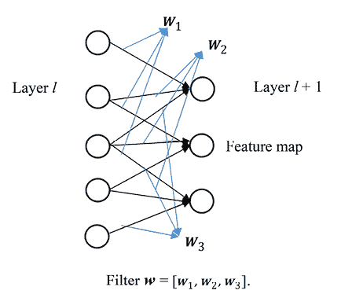
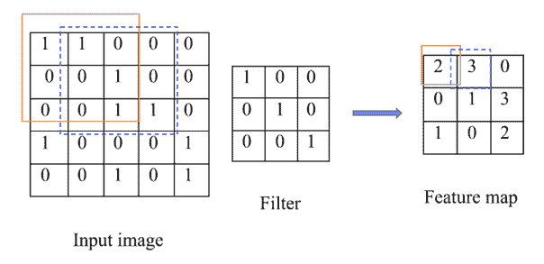
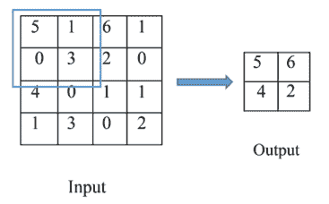
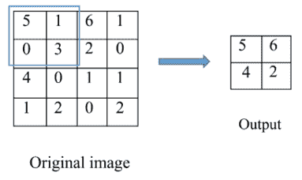
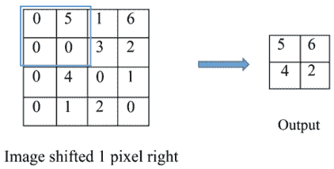
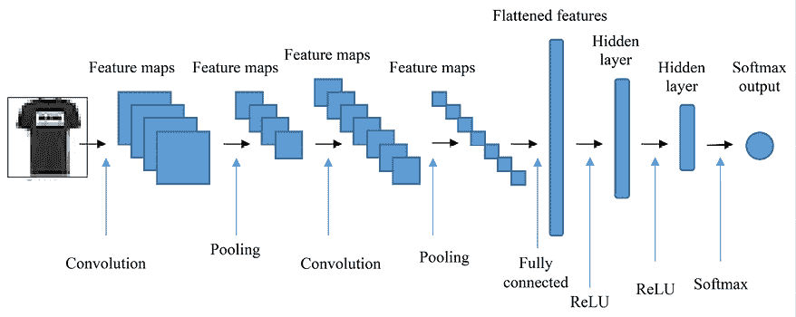
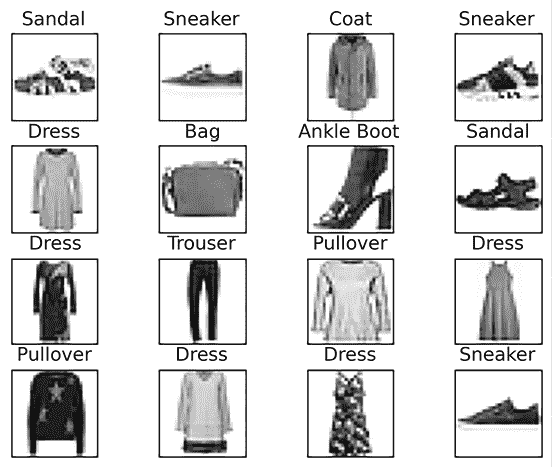
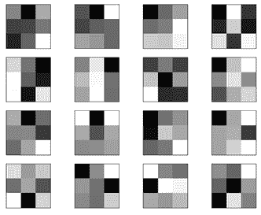
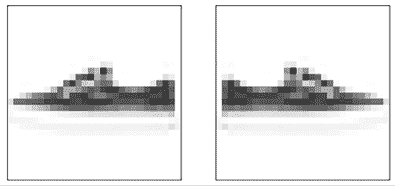

# 使用卷积神经网络对服装图像进行分类

上一章总结了我们对一般机器学习最佳实践的讲解。从本章开始，我们将深入探讨更高级的深度学习和强化学习主题。

当我们进行图像分类时，通常会将图像展开成像素向量，然后输入到神经网络（或其他模型）中。尽管这样做可能能完成任务，但我们会丢失重要的空间信息。在本章中，我们将使用**卷积神经网络**（**CNNs**）从图像中提取丰富且可区分的表示。你将看到，CNN 的表示能够将“9”识别为“9”，将“4”识别为“4”，将猫识别为猫，或者将狗识别为狗。

我们将从探索 CNN 架构中的各个构建模块开始。接着，我们将开发一个 CNN 分类器，在 PyTorch 中对服装图像进行分类，并揭示卷积机制。最后，我们将介绍数据增强技术，以提升 CNN 模型的性能。

本章将涵盖以下主题：

+   开始了解 CNN 构建模块

+   为分类设计 CNN 架构

+   探索服装图像数据集

+   使用 CNN 对服装图像进行分类

+   使用数据增强提升 CNN 分类器的性能

+   利用迁移学习提升 CNN 分类器性能

# 开始了解 CNN 构建模块

尽管常规的隐藏层（我们至今看到的全连接层）在某些层次上提取数据特征时表现良好，但这些表示可能不足以区分不同类别的图像。CNN 可以用来提取更丰富、更具区分性的表示，例如，使汽车成为汽车，使飞机成为飞机，或者使手写字母“y”和“z”可识别为“y”和“z”，等等。CNN 是一种受人类视觉皮层生物学启发的神经网络。为了揭开 CNN 的神秘面纱，我将从介绍典型 CNN 的组成部分开始，包括卷积层、非线性层和池化层。

## 卷积层

**卷积层**是 CNN 中的第一层，或者是如果 CNN 有多个卷积层的话，前几层。

CNN，特别是它们的卷积层，模仿了我们视觉细胞的工作方式，具体如下：

+   我们的视觉皮层中有一组复杂的神经细胞，这些细胞对视觉场的特定子区域非常敏感，称为**感受野**。例如，一些细胞只有在垂直边缘出现时才会响应；一些细胞仅在暴露于水平边缘时才会激活；一些细胞对特定方向的边缘反应更强。这些细胞组合在一起，产生完整的视觉感知，每个细胞专门处理特定的组成部分。CNN 中的卷积层由一组过滤器组成，作用类似于人类视觉皮层中的这些细胞。

+   简单的细胞只在其感受域内出现边缘类模式时作出反应。更复杂的细胞对更大的子区域敏感，因此可以对整个视野内的边缘类模式作出反应。一堆卷积层则是一些复杂的细胞，可以在更大的范围内检测模式。

卷积层处理输入图像或矩阵，并通过在输入上执行卷积操作，模拟神经细胞如何对它们调适的特定区域作出反应。从数学上讲，它计算卷积层节点与输入层中单个小区域的**点积**。这个小区域就是感受野，而卷积层的节点可以看作滤波器上的值。当滤波器沿着输入层滑动时，会计算滤波器与当前感受野（子区域）之间的点积。经过滤波器卷积过所有子区域后，会得到一个新的层，称为**特征图**。让我们看一个简单的例子，如下所示：



图 11.1：特征图是如何生成的

在这个例子中，层* l *包含 5 个节点，滤波器由 3 个节点组成[*w*[1], *w*[2], *w*[3]]。我们首先计算滤波器与层* l *中前 3 个节点的点积，得到输出特征图中的第一个节点；接着，计算滤波器与中间 3 个节点的点积，生成输出特征图中的第二个节点；最后，第三个节点是通过对层* l *中最后 3 个节点进行卷积得到的。

现在，我们将通过以下示例更详细地了解卷积是如何工作的：



图 11.2：卷积是如何工作的

在这个例子中，一个 3*3 的滤波器在一个 5*5 的输入矩阵上滑动，从左上角的子区域到右下角的子区域。对于每个子区域，使用滤波器计算点积。以左上角的子区域（橙色矩形）为例：我们有 1 * 1 + 1 * 0 + 1 * 1 = 2，因此特征图中的左上角节点（橙色矩形）值为 2。对于下一个最左边的子区域（蓝色虚线矩形），我们计算卷积为 1 * 1 + 1 * 1 + 1 * 1 = 3，所以结果特征图中下一个节点（蓝色虚线矩形）值为 3。最后，生成一个 3*3 的特征图。

那么，我们使用卷积层来做什么呢？它们实际上是用来提取特征的，比如边缘和曲线。如果输出特征图中的像素值较高，则说明对应的感受野包含了滤波器识别的边缘或曲线。例如，在前面的例子中，滤波器描绘了一个反斜线形状“\”的对角边缘；蓝色虚线矩形中的感受野包含了类似的曲线，因此生成了最高强度值 3。然而，右上角的感受野没有包含这样的反斜线形状，因此它在输出特征图中产生了值为 0 的像素。卷积层的作用就像是一个曲线检测器或形状检测器。

此外，卷积层通常会有多个滤波器，检测不同的曲线和形状。在前面的简单示例中，我们只使用了一个滤波器并生成了一个特征图，它表示输入图像中的形状与滤波器所表示的曲线的相似度。为了从输入数据中检测更多的模式，我们可以使用更多的滤波器，比如水平、垂直曲线、30 度角和直角形状。

此外，我们可以堆叠多个卷积层来生成更高级的表示，例如整体形状和轮廓。链式连接更多的层将产生更大的感受野，能够捕捉到更多的全局模式。

每个卷积层之后，我们通常会应用一个非线性层。

## 非线性层

非线性层基本上就是我们在*第六章*《使用人工神经网络预测股票价格》中看到的激活层。它的作用显然是引入非线性。回想一下，在卷积层中，我们只执行线性操作（乘法和加法）。无论神经网络有多少个线性隐藏层，它都只能表现得像一个单层感知器。因此，我们需要在卷积层后加一个非线性激活层。再次强调，ReLU 是深度神经网络中最常用的非线性层候选。

## 池化层

通常，在一个或多个卷积层（及非线性激活层）之后，我们可以直接利用提取的特征进行分类。例如，在多类分类问题中，我们可以应用 Softmax 层。但我们先做一些数学运算。

假设我们对 28 * 28 的输入图像应用 20 个 5 * 5 的滤波器在第一层卷积中，那么我们将得到 20 个输出特征图，每个特征图的大小为 (28 – 5 + 1) * (28 – 5 + 1) = 24 * 24 = 576。这意味着下一层的输入特征数将从 784 (28 * 28) 增加到 11,520 (20 * 576)。然后我们在第二层卷积中应用 50 个 5 * 5 的滤波器。输出的大小变为 50 * 20 * (24 – 5 + 1) * (24 – 5 + 1) = 400,000。这比我们最初的 784 要高得多。我们可以看到，在最后的 softmax 层之前，每经过一层卷积层，维度都会急剧增加。这可能会引发过拟合问题，更不用说训练如此大量权重的成本了。

为了解决维度急剧增加的问题，我们通常会在卷积层和非线性层之后使用**池化层**。池化层也叫做**下采样层**。正如你所想，它通过对子区域中的特征进行聚合来减少特征图的维度。典型的池化方法包括：

+   最大池化，取所有不重叠子区域的最大值

+   均值池化，取所有不重叠子区域的均值

在以下示例中，我们对 4 * 4 的特征图应用 2 * 2 的最大池化滤波器，并输出一个 2 * 2 的结果：



图 11.3：最大池化的工作原理

除了维度减小，池化层还有另一个优点：平移不变性。这意味着即使输入矩阵经历了小幅度的平移，它的输出也不会改变。例如，如果我们将输入图像向左或向右移动几个像素，只要子区域中的最高像素保持不变，最大池化层的输出仍然会保持相同。换句话说，池化层使得预测对位置的敏感度降低。以下示例说明了最大池化如何实现平移不变性。

这是 4 * 4 的原始图像，以及使用 2 * 2 滤波器进行最大池化后的输出：



图 11.4：原始图像和最大池化输出

如果我们将图像向右移动 1 个像素，得到以下移动后的图像和相应的输出：



图 11.5：移动后的图像和输出

即使我们水平移动输入图像，输出也是相同的。池化层增加了图像平移的鲁棒性。

你现在已经了解了 CNN 的所有组件了。比你想象的要简单，对吧？接下来我们来看看它们是如何构成一个 CNN 的。

# 构建用于分类的卷积神经网络（CNN）

将三种类型的卷积相关层与全连接层（们）结合在一起，我们可以按如下方式构建 CNN 模型进行分类：

图 11.6：CNN 架构

在此示例中，输入图像首先被传入一个卷积层（带有 ReLU 激活函数），该层由一组滤波器组成。卷积滤波器的系数是可训练的。一个训练良好的初始卷积层能够提取输入图像的良好低级特征表示，这对于后续的卷积层（如果有的话）以及后续的分类任务是至关重要的。然后，每个生成的特征图会通过池化层进行下采样。

接下来，将聚合的特征图输入到第二个卷积层。类似地，第二个池化层减少了输出特征图的尺寸。你可以根据需要链式连接任意数量的卷积层和池化层。第二个（或更多，如果有的话）卷积层试图通过一系列从前面层派生的低级表示，构建高级表示，比如整体形状和轮廓。

到目前为止，特征图都是矩阵。我们需要将它们展平为一个向量，然后才能进行后续的分类。展平后的特征就像是输入到一个或多个全连接的隐藏层。我们可以将 CNN 看作是一个常规神经网络之上的分层特征提取器。CNN 特别适合于利用强大而独特的特征来区分图像。

如果我们处理的是二分类问题，网络的输出将是一个逻辑函数；如果是多类问题，则是一个 softmax 函数；如果是多标签问题，则是多个逻辑函数的集合。

到目前为止，你应该对 CNN 有了较好的理解，并且应该准备好解决服装图像分类问题。让我们从探索数据集开始。

# 探索服装图像数据集

服装数据集 Fashion-MNIST ([`github.com/zalandoresearch/fashion-mnist`](https://github.com/zalandoresearch/fashion-mnist))是来自 Zalando（欧洲最大的在线时尚零售商）的图像数据集。它包含 60,000 个训练样本和 10,000 个测试样本。每个样本都是一个 28 * 28 的灰度图像，并带有以下 10 个类别的标签，每个类别代表一种服装：

+   0: T 恤/上衣

+   1: 长裤

+   2: 套头衫

+   3: 连衣裙

+   4: 外套

+   5: 凉鞋

+   6: 衬衫

+   7: 运动鞋

+   8: 包

+   9: 踝靴

Zalando 旨在使该数据集像手写数字 MNIST 数据集一样流行，用于基准测试算法，因此称其为 Fashion-MNIST。

你可以通过 *获取数据* 部分中的 GitHub 链接直接下载数据集，或者直接从 PyTorch 导入，它已经包含了数据集及其数据加载器 API。我们将采用后者的方法，如下所示：

```py
>>> import torch, torchvision
>>> from torchvision import transforms
>>> image_path = './'
>>> transform = transforms.Compose([transforms.ToTensor()])
>>> train_dataset = torchvision.datasets.FashionMNIST(root=image_path,
                                                      train=True,
                                                      transform=transform,
                                                      download=True)
>>> test_dataset = torchvision.datasets.FashionMNIST(root=image_path,
                                                     train=False,
                                                     transform=transform,
                                                     download=False) 
```

我们刚刚导入了 `torchvision`，这是 PyTorch 中一个包，提供了访问数据集、模型架构以及用于计算机视觉任务的各种图像转换工具。

`torchvision` 库包含以下关键组件：

+   **数据集和数据加载器**：`torchvision.datasets` 提供了用于图像分类、目标检测、语义分割等任务的标准数据集。示例包括 MNIST、CIFAR-10、ImageNet、`FashionMNIST` 等。`torch.utils.data.DataLoader` 帮助创建数据加载器，从数据集中高效加载和预处理数据批次。

+   **转换**：`torchvision.transforms` 提供了多种图像转换工具，用于数据增强、标准化和预处理。常见的转换包括调整大小、裁剪、标准化等。

+   **模型架构**：`torchvision.models` 提供了多种计算机视觉任务的预训练模型架构。

+   **工具**：`torchvision.utils` 包含用于图像可视化、将图像转换为不同格式等的实用函数。

我们刚刚加载的 Fashion-MNIST 数据集带有预设的训练集和测试集分区方案。训练集存储在 `image_path` 中。然后，我们将它们转换为 Tensor 格式。输出这两个数据集对象以获取更多细节：

```py
>>> print(train_dataset)
Dataset FashionMNIST
    Number of datapoints: 60000
    Root location: ./
    Split: Train
    StandardTransform
Transform: Compose(
    ToTensor()
   )
>>> print(test_dataset)
Dataset FashionMNIST
    Number of datapoints: 10000
    Root location: ./
    Split: Test
    StandardTransform
Transform: Compose(
               ToTensor()
           ) 
```

如你所见，共有 60,000 个训练样本和 10,000 个测试样本。

接下来，我们将训练集加载为每批 64 个样本，如下所示：

```py
>>> from torch.utils.data import DataLoader
>>> batch_size = 64
>>> torch.manual_seed(42)
>>> train_dl = DataLoader(train_dataset, batch_size, shuffle=True) 
```

在 PyTorch 中，`DataLoader` 是一个工具，用于在训练或评估机器学习模型时高效加载和预处理数据集中的数据。它本质上是对数据集的包装，提供了遍历数据批次的方法。这对于处理大型数据集（无法完全加载到内存中）特别有用。

DataLoader 的关键特性：

+   **批处理**：它会自动将数据集分成指定大小的批次，从而在训练过程中使用小批量数据。

+   **洗牌**：你可以将 `shuffle` 参数设置为 `True`，以在每个训练周期之前对数据进行洗牌，这有助于减少偏差并提高收敛性。

随时检查第一批数据中的图像样本及其标签，例如：

```py
>>> data_iter = iter(train_dl)
>>> images, labels = next(data_iter)
>>> print(labels)
tensor([5, 7, 4, 7, 3, 8, 9, 5, 3, 1, 2, 3, 2, 3, 3, 7, 9, 9, 3, 2, 4, 6, 3, 5, 5, 3, 2, 0, 0, 8, 4, 2, 8, 5, 9, 2, 4, 9, 4, 4, 3, 4, 9, 7, 2, 0, 4, 5, 4, 8, 2, 6, 7, 0, 2, 0, 6, 3, 3, 5, 6, 0, 0, 8]) 
```

标签数组不包含类别名称。因此，我们将它们定义如下，并稍后用于绘图：

```py
>>> class_names = ['T-shirt/top', 'Trouser', 'Pullover', 'Dress', 'Coat', 'Sandal', 'Shirt', 'Sneaker', 'Bag', 'Ankle boot'] 
```

查看图像数据的格式，如下所示：

```py
>>> print(images[0].shape)
torch.Size([1, 28, 28])
>>> print(torch.max(images), torch.min(images))
tensor(1.) tensor(0.) 
```

每张图像表示为 28 * 28 像素，其值的范围是 `[0, 1]`。

现在我们展示一张图像，如下所示：

```py
>>> import numpy as np
>>> import matplotlib.pyplot as plt
>>> npimg = images[1].numpy()
>>> plt.imshow(np.transpose(npimg, (1, 2, 0)))
>>> plt.colorbar()
>>> plt.title(class_names[labels[1]])
>>> plt.show() 
```

在 PyTorch 中，`np.transpose(npimg, (1, 2, 0))`用于通过`matplotlib`可视化图像。`(1, 2, 0)`是表示维度新顺序的元组。在 PyTorch 中，图像采用`(channels, height, width)`格式表示，而 matplotlib 期望图像采用`(height, width, channels)`格式。因此，使用`np.transpose(npimg, (1, 2, 0))`重新排列图像数组的维度，以匹配 matplotlib 期望的格式。

请参考下面的运动鞋图像——最终结果：


图 11.7：Fashion-MNIST 中的一个训练样本

同样地，我们展示前 16 个训练样本，如下所示：

```py
>>> for i in range(16):
...     plt.subplot(4, 4, i + 1)
...     plt.subplots_adjust(hspace=.3)
...     plt.xticks([])
...     plt.yticks([])
...     npimg = images[i].numpy()
...     plt.imshow(np.transpose(npimg, (1, 2, 0)), cmap="Greys")
...     plt.title(class_names[labels[i]])
... plt.show() 
```

请参考下面的图像以查看结果：



图 11.8：Fashion-MNIST 中的 16 个训练样本

在下一部分，我们将构建我们的 CNN 模型来分类这些服装图像。

# 使用 CNN 对服装图像进行分类

如前所述，CNN 模型有两个主要组件：由一组卷积层和池化层组成的特征提取器，以及类似常规神经网络的分类器后端。

让我们从构建 CNN 模型开始这个项目。

## 构建 CNN 模型

我们导入必要的模块并初始化一个基于 Sequential 的模型：

```py
>>> import torch.nn as nn
>>> model = nn.Sequential() 
```

对于卷积提取器，我们将使用三个卷积层。我们从第一个卷积层开始，使用 32 个小尺寸的 3 * 3 滤波器。这是通过以下代码实现的：

```py
>>> model.add_module('conv1',
                     nn.Conv2d(in_channels=1,
                               out_channels=32,
                               kernel_size=3)
                    )
>>> model.add_module('relu1', nn.ReLU()) 
```

请注意，我们使用 ReLU 作为激活函数。

卷积层后跟一个 2 * 2 滤波器的最大池化层：

```py
>>> model.add_module('pool1', nn.MaxPool2d(kernel_size=2)) 
```

下面是第二个卷积层。它有 64 个 3 * 3 滤波器，并且也带有 ReLU 激活函数：

```py
>>> model.add_module('conv2',
                     nn.Conv2d(in_channels=32,
                               out_channels=64,
                               kernel_size=3)
                    )
>>> model.add_module('relu2', nn.ReLU()) 
```

第二个卷积层后跟另一个带有 2 * 2 滤波器的最大池化层：

```py
>>> model.add_module('pool2', nn.MaxPool2d(kernel_size=2)) 
```

我们继续添加第三个卷积层。此时它有 128 个 3 * 3 滤波器：

```py
>>> model.add_module('conv3',
                     nn.Conv2d(in_channels=64,
                               out_channels=128,
                               kernel_size=3)
                    )
>>> model.add_module('relu3', nn.ReLU()) 
```

让我们暂停一下，看看生成的滤波器映射是什么。我们将一批随机样本（64 个样本）输入到到目前为止构建的模型中：

```py
>>> x = torch.rand((64, 1, 28, 28))
>>> print(model(x).shape)
torch.Size([64, 128, 3, 3]) 
```

通过提供输入形状`(64, 1, 28, 28)`，表示批量中的 64 张图像，图像大小为 28 * 28，输出的形状为`(64, 128, 3, 3)`，表示具有 128 个通道和 3 * 3 空间大小的特征图。

接下来，我们需要将这些小的 128 * 3 * 3 空间表示展平，以提供特征给下游的分类器后端：

```py
>>> model.add_module('flatten', nn.Flatten()) 
```

结果，我们得到了一个形状为`(64, 1152)`的展平输出，通过以下代码计算得出：

```py
>>> print(model(x).shape)
torch.Size([64, 1152]) 
```

对于分类器后端，我们只使用一个包含 64 个节点的隐藏层：

```py
>>> model.add_module('fc1', nn.Linear(1152, 64))
>>> model.add_module('relu4', nn.ReLU()) 
```

这里的隐藏层是常规的全连接层，使用 ReLU 作为激活函数。

最后，输出层有 10 个节点，代表我们案例中的 10 个不同类别，并带有 softmax 激活函数：

```py
>>> model.add_module('fc2', nn.Linear(64, 10))
>>> model.add_module('output', nn.Softmax(dim = 1)) 
```

让我们来看一下模型架构，如下所示：

```py
>>> print(model)
Sequential(
  (conv1): Conv2d(1, 32, kernel_size=(3, 3), stride=(1, 1))
  (relu1): ReLU()
  (pool1): MaxPool2d(kernel_size=2, stride=2, padding=0, dilation=1, ceil_mode=False)
  (conv2): Conv2d(32, 64, kernel_size=(3, 3), stride=(1, 1))
  (relu2): ReLU()
  (pool2): MaxPool2d(kernel_size=2, stride=2, padding=0, dilation=1, ceil_mode=False)
  (conv3): Conv2d(64, 128, kernel_size=(3, 3), stride=(1, 1))
  (relu3): ReLU()
  (flatten): Flatten(start_dim=1, end_dim=-1)
  (fc1): Linear(in_features=1152, out_features=64, bias=True)
  (relu4): ReLU()
  (fc2): Linear(in_features=64, out_features=10, bias=True)
  (output): Softmax(dim=1)
)_________________________________________________________________ 
```

如果你想详细显示每一层，包括其输出的形状和可训练参数的数量，可以使用`torchsummary`库。你可以通过`pip`安装它，并按如下方式使用：

```py
>>> pip install torchsummary
>>> from torchsummary import summary
>>> summary(model, input_size=(1, 28, 28), batch_size=-1, device="cpu")
----------------------------------------------------------------
        Layer (type)               Output Shape         Param #
================================================================
            Conv2d-1           [-1, 32, 26, 26]             320
              ReLU-2           [-1, 32, 26, 26]               0
         MaxPool2d-3           [-1, 32, 13, 13]               0
            Conv2d-4           [-1, 64, 11, 11]          18,496
              ReLU-5           [-1, 64, 11, 11]               0
         MaxPool2d-6             [-1, 64, 5, 5]               0
            Conv2d-7            [-1, 128, 3, 3]          73,856
              ReLU-8            [-1, 128, 3, 3]               0
           Flatten-9                 [-1, 1152]               0
           Linear-10                   [-1, 64]          73,792
             ReLU-11                   [-1, 64]               0
           Linear-12                   [-1, 10]             650
          Softmax-13                   [-1, 10]               0
================================================================
Total params: 167,114
Trainable params: 167,114
Non-trainable params: 0
----------------------------------------------------------------
Input size (MB): 0.00
Forward/backward pass size (MB): 0.53
Params size (MB): 0.64
Estimated Total Size (MB): 1.17
---------------------------------------------------------------- 
```

如你所见，卷积层的输出是三维的，其中前两个是特征图的维度，第三个是卷积层中使用的滤波器数量。在示例中，最大池化输出的大小（前两个维度）是其输入特征图的一半。特征图被池化层下采样。你可能想知道，如果去掉所有池化层，训练的参数会有多少。实际上，是 4,058,314 个！所以，应用池化的好处显而易见：避免过拟合并减少训练成本。

你可能会想知道为什么卷积滤波器的数量在每一层中不断增加。回想一下，每个卷积层都试图捕捉特定层次结构的模式。第一层卷积捕捉低级模式，例如边缘、点和曲线。然后，后续的层将这些在前几层中提取的模式组合起来，形成更高级的模式，例如形状和轮廓。随着我们在卷积层中向前推进，在大多数情况下，捕捉的模式组合会越来越多。因此，我们需要不断增加（或至少不减少）卷积层中滤波器的数量。

## 拟合 CNN 模型

现在是时候训练我们刚刚构建的模型了。

首先，我们使用 Adam 作为优化器，交叉熵作为损失函数，分类准确率作为评估指标来编译模型：

```py
>>> device = torch.device("cuda:0")
# device = torch.device("cpu")
>>> model = model.to(device)
>>> loss_fn = nn.CrossEntropyLoss()
>>> optimizer = torch.optim.Adam(model.parameters(), lr=0.001) 
```

在这里，我们使用 GPU 进行训练，因此我们运行`torch.device("cuda:0")`来指定 GPU 设备（第一个设备，索引为 0）并在其上分配张量。选择 CPU 也是一种可行的选项，但相对较慢。

接下来，我们通过定义以下函数来训练模型：

```py
>>> def train(model, optimizer, num_epochs, train_dl):
        for epoch in range(num_epochs):
            loss_train = 0
            accuracy_train = 0
            for x_batch, y_batch in train_dl:
                x_batch = x_batch.to(device)
                y_batch = y_batch.to(device)
                pred = model(x_batch)
                loss = loss_fn(pred, y_batch)
                loss.backward()
                optimizer.step()
                optimizer.zero_grad()
                loss_train += loss.item() * y_batch.size(0)
                is_correct = (torch.argmax(pred, dim=1) ==
                                               y_batch).float()
                accuracy_train += is_correct.sum().cpu()
            loss_train /= len(train_dl.dataset)
            accuracy_train /= len(train_dl.dataset)

            print(f'Epoch {epoch+1} - loss: {loss_train:.4f} - accuracy:
                  {accuracy_train:.4f}') 
```

我们将训练 CNN 模型进行 30 次迭代并监控学习进度：

```py
>>> num_epochs = 30
>>> train(model, optimizer, num_epochs, train_dl)
Epoch 1 - loss: 1.7253 - accuracy: 0.7385
Epoch 2 - loss: 1.6333 - accuracy: 0.8287
…
Epoch 10 - loss: 1.5572 - accuracy: 0.9041
…
Epoch 20 - loss: 1.5344 - accuracy: 0.9270
...
Epoch 29 - loss: 1.5249 - accuracy: 0.9362
Epoch 30 - loss: 1.5249 - accuracy: 0.9363 
```

我们能够在训练集上达到约 94%的准确率。如果你想查看在测试集上的表现，可以执行如下操作：

```py
>>> test_dl = DataLoader(test_dataset, batch_size, shuffle=False)
>>> def evaluate_model(model, test_dl):
        accuracy_test = 0
        with torch.no_grad():
            for x_batch, y_batch in test_dl:
                pred = model.cpu()(x_batch)
                is_correct = torch.argmax(pred, dim=1) == y_batch
                accuracy_test += is_correct.float().sum().item()
        print(f'Accuracy on test set: {100 * accuracy_test / 10000} %')
>>> evaluate_model(model, test_dl)
Accuracy on test set: 90.25 % 
```

该模型在测试数据集上达到了 90%的准确率。请注意，由于隐藏层初始化的差异，或 GPU 中的非确定性操作等因素，这一结果可能会有所不同。

**最佳实践**

与 CPU 相比，更适合在 GPU 上执行的操作通常涉及可以并行化的任务，这些任务能够受益于 GPU 架构提供的大规模并行性和计算能力。以下是一些例子：

+   矩阵和卷积操作

+   同时处理大量数据批次。涉及批处理的任务，如机器学习模型中小批次的训练和推理，受益于 GPU 的并行处理能力。

+   神经网络中的前向传播和反向传播，通常由于硬件加速，在 GPU 上更快。

**最佳实践**

相比于 GPU，适合在 CPU 上执行的操作通常涉及较少的可并行化任务，需要更多的顺序处理或小数据集。以下是一些示例：

+   预处理工作，如数据加载、特征提取和数据增强。

+   小模型推理。对于小模型或计算要求较低的推理任务，在 CPU 上执行操作可能更具成本效益。

+   控制流操作。涉及条件语句或循环的操作通常在 CPU 上更高效，因为 CPU 具有顺序处理的特点。

你已经看到了训练模型的表现，你可能会想知道卷积滤波器的样子。你将在下一节中了解。

## 可视化卷积滤波器

我们从训练好的模型中提取卷积滤波器，并通过以下步骤进行可视化。

从模型摘要中，我们知道模型中的`conv1`、`conv2`和`conv3`层是卷积层。以第三个卷积层为例，我们获取它的滤波器如下：

```py
>>> conv3_weight = model.conv3.weight.data
>>> print(conv3_weight.shape) 
torch.Size([128, 64, 3, 3]) 
```

很明显，有 128 个滤波器，每个滤波器的尺寸为 3x3，并且包含 64 个通道。

接下来，为了简化，我们仅可视化前 16 个滤波器中的第一个通道，排列为四行四列：

```py
>>> n_filters = 16
>>> for i in range(n_filters):
...     weight = conv3_weight[i].cpu().numpy()
...     plt.subplot(4, 4, i+1)
...     plt.xticks([])
...     plt.yticks([])
...     plt.imshow(weight[0], cmap='gray')
... plt.show() 
```

请参见以下截图以获取最终结果：



图 11.9：训练后的卷积滤波器

在卷积滤波器中，深色方块代表较小的权重，白色方块表示较大的权重。根据这一直觉，我们可以看到第二行第二个滤波器检测到了接收域中的垂直线，而第一行第三个滤波器则检测到了从右下角的亮色到左上角的暗色的梯度。

在前面的例子中，我们用 60,000 个标注样本训练了服装图像分类器。然而，在实际中收集这么大的标注数据集并不容易。具体来说，图像标注既昂贵又耗时。如何在样本数量有限的情况下有效地训练图像分类器？一种解决方案是数据增强。

# 使用数据增强提升 CNN 分类器性能

**数据增强**意味着扩展现有训练数据集的大小，以提高泛化性能。它克服了收集和标注更多数据的成本。在 PyTorch 中，我们使用`torchvision.transforms`模块来实时实现图像增强。

## 用于数据增强的翻转操作

增强图像数据的方法有很多，最简单的可能是水平或垂直翻转图像。例如，如果我们水平翻转一张现有图像，就会得到一张新图像。为了创建水平翻转的图像，我们使用`transforms.functional.hflip`，如下所示：

```py
>>> image = images[1]
>>> img_flipped = transforms.functional.hflip(image) 
```

让我们看看翻转后的图像：

```py
>>> def display_image_greys(image):
    npimg = image.numpy()
    plt.imshow(np.transpose(npimg, (1, 2, 0)), cmap="Greys")
    plt.xticks([])
    plt.yticks([])
>>> plt.figure(figsize=(8, 8))
>>> plt.subplot(1, 2, 1)
>>> display_image_greys(image)
>>> plt.subplot(1, 2, 2)
>>> display_image_greys(img_flipped)
>>> plt.show() 
```

请参阅以下截图以查看最终结果：



图 11.10：用于数据增强的水平翻转图像

在使用数据增强进行训练时，我们将使用随机生成器创建处理过的图像。对于水平翻转，我们将使用`transforms.RandomHorizontalFlip`，它以 50%的概率随机水平翻转图像，从而有效地增强数据集。让我们看三个输出样本：

```py
>>> torch.manual_seed(42)
>>>  flip_transform =
               transforms.Compose([transforms.RandomHorizontalFlip()])
>>> plt.figure(figsize=(10, 10))
>>> plt.subplot(1, 4, 1)
>>> display_image_greys(image)
>>> for i in range(3):
        plt.subplot(1, 4, i+2)
        img_flip = flip_transform(image)
        display_image_greys(img_flip) 
```

请参阅以下截图以查看最终结果：


图 11.11：用于数据增强的随机水平翻转图像

如你所见，生成的图像要么是水平翻转的，要么没有翻转。

通常，水平翻转的图像传达的信息与原始图像相同。垂直翻转的图像不常见，尽管你可以使用`transforms.RandomVerticalFlip`来生成它们。值得注意的是，翻转仅适用于与方向无关的情况，比如分类猫和狗或识别汽车部件。相反，在方向很重要的情况下进行翻转是危险的，比如区分左转标志和右转标志。

## 用于数据增强的旋转

与水平或垂直翻转每次旋转 90 度不同，可以在图像数据增强中应用小到中度的旋转。让我们看看使用`transforms`进行的随机旋转。在以下示例中，我们使用`RandomRotation`：

```py
>>> torch.manual_seed(42)
>>> rotate_transform =
            transforms.Compose([transforms. RandomRotation(20)])
>>> plt.figure(figsize=(10, 10))
>>> plt.subplot(1, 4, 1)
>>> display_image_greys(image)
>>> for i in range(3):
        plt.subplot(1, 4, i+2)
        img_rotate = rotate_transform(image)
    display_image_greys(img_rotate) 
```

请参阅以下截图以查看最终结果：


图 11.12：用于数据增强的旋转图像

在前面的示例中，图像被旋转了从-20（逆时针方向）到 20（顺时针方向）的任意角度。

## 用于数据增强的裁剪

裁剪是另一种常用的增强方法。它通过选择原始图像的一部分生成新图像。通常，这一过程伴随裁剪区域被调整为预定的输出尺寸，以确保尺寸一致。

现在，让我们探索如何利用`transforms.RandomResizedCrop`随机选择裁剪区域的宽高比，并随后调整结果的大小以匹配原始尺寸：

```py
>>> torch.manual_seed(42)
>>> crop_transform = transforms.Compose([
        transforms.RandomResizedCrop(size=(28, 28), scale=(0.7, 1))])
>>> plt.figure(figsize=(10, 10))
>>> plt.subplot(1, 4, 1)
>>> display_image_greys(image)
>>> for i in range(3):
        plt.subplot(1, 4, i+2)
        img_crop = crop_transform(image)
        display_image_greys(img_crop) 
```

这里，`size`指定裁剪和调整大小后输出图像的尺寸；`scale`定义了裁剪的缩放范围。如果设置为（`min_scale`，`max_scale`），则裁剪区域的大小会随机选择，范围在`min_scale`和`max_scale`倍的原始图像大小之间。

请参考以下截图查看最终结果：


图 11.13：用于数据增强的裁剪图像

如您所见，`scale=(0.7, 1.0)`表示裁剪区域的大小可以在原始图像大小的 70%到 100%之间变化。

# 通过数据增强改进服装图像分类器

配备了几种常见的数据增强方法后，我们将在以下步骤中应用它们来训练我们的图像分类器，使用一个小型数据集：

1.  我们通过结合刚才讨论的所有数据增强技术来构建转换函数：

    ```py
    >>> torch.manual_seed(42)
    >>> transform_train = transforms.Compose([
                           transforms.RandomHorizontalFlip(),
                           transforms.RandomRotation(10),
                           transforms.RandomResizedCrop(size=(28, 28),
                                                        scale=(0.9, 1)),
                           transforms.ToTensor(),
        ]) 
    ```

在这里，我们使用水平翻转、最多 10 度的旋转和裁剪，裁剪的尺寸范围在原始图像的 90%到 100%之间。

1.  我们重新加载训练数据集，使用这个转换函数，并仅使用 500 个样本进行训练：

    ```py
    >>> train_dataset_aug = torchvision.datasets.FashionMNIST(
                                                   root=image_path,
                                                   train=True,
                                                   transform=transform_train,
                                                   download=False)
    >>> from torch.utils.data import Subset
    >>> train_dataset_aug_small = Subset(train_dataset_aug, torch.arange(500)) 
    ```

我们将看到数据增强如何在可用的非常小的训练集上提高泛化能力和性能。

1.  将这个小型但增强过的训练集按 64 个样本一批加载，像我们之前做的那样：

    ```py
    >>> train_dl_aug_small = DataLoader(train_dataset_aug_small,
                                        batch_size, 
                                        shuffle=True) 
    ```

请注意，即使是同一原始图像，通过这个数据加载器进行迭代时，会生成不同的增强图像，可能会被翻转、旋转或在指定范围内裁剪。

1.  接下来，我们使用之前相同的架构初始化 CNN 模型，并相应地初始化优化器：

    ```py
    >>> model = nn.Sequential()
    >>> ...(here we skip repeating the same code)
    >>> model = model.to(device)
    >>> optimizer = torch.optim.Adam(model.parameters(), lr=0.001) 
    ```

1.  现在我们在增强后的小型数据集上训练模型：

    ```py
    >>> train(model, optimizer, 1000, train_dl_aug_small)
    Epoch 1 - loss: 2.3013 - accuracy: 0.1400
    ...
    Epoch 301 - loss: 1.6817 - accuracy: 0.7760
    ...
    Epoch 601 - loss: 1.5006 - accuracy: 0.9620
    ...
    Epoch 1000 - loss: 1.4904 - accuracy: 0.9720 
    ```

我们对模型进行了 1,000 次迭代的训练。

1.  让我们看看它在测试集上的表现如何：

    ```py
    >>> evaluate_model(model, test_dl)
    Accuracy on test set: 79.24% 
    ```

使用数据增强的模型在测试集上的分类准确率为 79.24%。请注意，这个结果可能会有所不同。

我们还尝试了不使用数据增强进行训练，结果测试集的准确率大约为 76%。当使用数据增强时，准确率提高到了 79%。像往常一样，您可以像我们在*第六章*《使用人工神经网络预测股票价格》中所做的那样，随意调整超参数，看看能否进一步提高分类性能。

迁移学习是提升 CNN 分类器性能的另一种方法。让我们继续下一部分。

# 通过迁移学习推进 CNN 分类器

**迁移学习**是一种机器学习技术，其中在一个任务上训练好的模型会被适配或微调用于第二个相关任务。在迁移学习中，第一次任务（源任务）训练期间获得的知识被用来改进第二次任务（目标任务）的学习。当目标任务的数据有限时，这尤其有用，因为它可以将来自更大或更具多样性的数据集的知识转移过来。

迁移学习的典型工作流程包括：

1.  **预训练模型**：从一个已经在一个大规模且相关的数据集上针对不同但相关任务训练好的预训练模型开始。这个模型通常是一个深度神经网络，例如用于图像任务的 CNN 模型。

1.  **特征提取**：使用预训练模型作为特征提取器。移除最后的分类层（如果存在），并使用其中一个中间层的输出作为数据的特征表示。这些特征可以捕捉到源任务中的高级模式和信息。

1.  **微调**：在特征提取器上添加新的层。这些新层是针对目标任务的，通常会随机初始化。然后，您将整个模型，包括特征提取器和新层，在目标数据集上进行训练。微调使得模型能够适应目标任务的具体要求。

在实现迁移学习进行我们的服装图像分类任务之前，让我们先来探索 CNN 架构和预训练模型的发展历程。即使是早期的 CNN 架构，今天仍然在积极使用！这里的关键是，所有这些架构都是现代深度学习工具箱中的宝贵工具，特别是在进行迁移学习任务时。

## CNN 架构和预训练模型的发展

用于图像处理的 CNN 概念可以追溯到 1990 年代。早期的架构如**LeNet-5**（1998 年）展示了深度神经网络在图像分类中的潜力。LeNet-5 由两组卷积层组成，后跟两层全连接层和一层输出层。每个卷积层使用 5x5 的卷积核。LeNet-5 在图像分类任务中起到了重要作用，展示了深度学习的有效性。它在 MNIST 数据集上取得了高精度，MNIST 是一个广泛使用的手写数字识别基准数据集。

LeNet-5 的成就为更复杂架构的创建铺平了道路，例如**AlexNet**（2012 年）。它由八层组成——五组卷积层后接三层全连接层。它首次在深度 CNN 中使用了 ReLU 激活函数，并在全连接层中采用了 dropout 技术以防止过拟合。使用了数据增强技术，如随机裁剪和水平翻转，来提高模型的泛化能力。AlexNet 的成功引发了对神经网络的重新关注，并促成了更深层次和更复杂架构的发展，包括 VGGNet、GoogLeNet 和 ResNet，这些架构在计算机视觉中成为了基础。

**VGGNet**由牛津大学的视觉几何小组于 2014 年提出。VGGNet 遵循一个简单且统一的架构，由一系列卷积层组成，后面跟着最大池化层，最后是堆叠的全连接层。它主要使用 3x3 卷积滤波器，能够捕捉细粒度的空间信息。最常用的版本是 VGG16 和 VGG19，它们分别有 16 层和 19 层，常作为各种计算机视觉任务中的迁移学习起点。

同年，**GoogLeNet**，更广为人知的**Inception**，由谷歌开发。GoogLeNet 的标志性特点是 Inception 模块。与使用固定滤波器大小的单个卷积层不同，Inception 模块并行使用多种滤波器大小（1x1、3x3、5x5）。这些并行操作可以在不同的尺度上捕捉特征，从而提供更丰富的表示。与 VGGNet 类似，预训练的 GoogLeNet 也有多个版本，例如 InceptionV1、InceptionV2、InceptionV3 和 InceptionV4，每个版本在架构上有所变化和改进。

**ResNet**，即**残差网络**，由 Kaiming He 等人在 2015 年提出，旨在解决消失梯度问题——在 CNN 中，损失函数的梯度变得极其微小。其核心创新是使用残差连接。这些模块允许网络在训练过程中跳过某些层。残差模块不是直接学习从输入到输出的目标映射，而是学习一个残差映射，该映射与原始输入相加。通过这种方式，深层网络成为可能。它的预训练模型有多个版本，例如 ResNet-18、ResNet-34、ResNet-50、ResNet-101 以及极深的 ResNet-152。再次强调，数字表示网络的深度。

CNN 架构和预训练模型的开发仍在继续，随着像 EfficientNet、MobileNet 等创新的出现，以及针对特定任务的定制架构。例如，**MobileNet**模型设计时注重高效的计算资源和内存使用。它们专门为在硬件能力有限的设备上部署而优化，如智能手机、物联网设备和边缘设备。

你可以在此页面查看所有可用的预训练模型：[PyTorch 预训练模型](https://pytorch.org/vision/stable/models.html#classification)。

CNN 架构的演变以及预训练模型的出现彻底改变了计算机视觉任务。它们显著提高了图像分类、目标检测、分割以及许多其他应用的技术水平。

现在，让我们探索使用预训练模型来增强我们的服装图像分类器。

## 通过微调 ResNet 来改进服装图像分类器

我们将在接下来的步骤中使用预训练的 ResNet，具体是 ResNet-18 进行迁移学习：

1.  我们首先从`torchvision`导入预训练的 ResNet-18 模型：

    ```py
    >>> from torchvision.models import resnet18
    >>> my_resnet = resnet18(weights='IMAGENET1K_V1') 
    ```

这里，`IMAGENET1K`指的是在 ImageNet-1K 数据集上训练的预训练模型（[`www.image-net.org/download.php`](https://www.image-net.org/download.php)），而`V1`指的是预训练模型的版本 1。

这是预训练模型步骤。

1.  由于 ImageNet-1K 数据集包含 RGB 图像，原始`ResNet`中的第一卷积层设计用于三维输入。然而，我们的`FashionMNIST`数据集包含灰度图像，因此我们需要修改它以接受一维输入：

    ```py
    >>> my_resnet.conv1 = nn.Conv2d(1, 64, kernel_size=7, stride=2, padding=3, bias=False) 
    ```

我们只是将原始定义中第一个卷积层的第一个参数——输入维度——从 3 改为 1：

```py
self.conv1 = nn.Conv2d(3, 64, kernel_size=7, stride=2, padding=3, bias=False) 
```

1.  将输出层改为输出 10 个类别而不是 1,000 个类别：

    ```py
    >>> num_ftrs = my_resnet.fc.in_features
    >>> my_resnet.fc = nn.Linear(num_ftrs, 10) 
    ```

在这里，我们只更新输出层的输出大小。

第 2 步和第 3 步为**微调**过程做准备。

1.  最后，我们通过在完整训练集上训练，**微调**了已适配的预训练模型：

    ```py
    >>> my_resnet = my_resnet.to(device)
    >>> optimizer = torch.optim.Adam(my_resnet.parameters(), lr=0.001)
    >>> train(my_resnet, optimizer, 10, train_dl)
    Epoch 1 - loss: 0.4797 - accuracy: 0.8256
    Epoch 2 - loss: 0.3377 - accuracy: 0.8791
    Epoch 3 - loss: 0.2921 - accuracy: 0.8944
    Epoch 4 - loss: 0.2629 - accuracy: 0.9047
    Epoch 5 - loss: 0.2336 - accuracy: 0.9157
    Epoch 6 - loss: 0.2138 - accuracy: 0.9221
    Epoch 7 - loss: 0.1911 - accuracy: 0.9301
    Epoch 8 - loss: 0.1854 - accuracy: 0.9312
    Epoch 9 - loss: 0.1662 - accuracy: 0.9385
    Epoch 10 - loss: 0.1575 - accuracy: 0.9427 
    ```

仅经过 10 次迭代，经过微调的 ResNet 模型就达到了 94%的准确率。

1.  它在测试集上的表现如何？让我们看一下以下结果：

    ```py
    >>> evaluate_model(my_resnet, test_dl)
    Accuracy on test set: 91.01 % 
    ```

通过仅进行 10 次训练迭代，我们能够将测试集的准确率从 90%提升到 91%。

使用 CNN 进行迁移学习是一种强大的技术，可以让你利用预训练模型，并将其调整为特定的图像分类任务。

# 概述

本章中，我们使用 CNN 对服装图像进行分类。我们从详细解释 CNN 模型的各个组成部分开始，学习了 CNN 是如何受到我们视觉细胞工作方式的启发。然后，我们开发了一个 CNN 模型，用于分类 Zalando 的 Fashion-MNIST 服装图像。我们还讨论了数据增强和几种流行的图像增强方法。在讨论了 CNN 架构和预训练模型的演变之后，我们通过 ResNets 进行了迁移学习的实践。

在下一章，我们将重点介绍另一种类型的深度学习网络：**循环神经网络**（**RNNs**）。CNN 和 RNN 是目前最强大的两种深度神经网络，使得深度学习在如今如此受欢迎。

# 练习

1.  如前所述，你能尝试微调 CNN 图像分类器并看看能否超越我们所取得的成绩吗？

1.  你也能使用 dropout 技术来改进 CNN 模型吗？

1.  你能尝试使用预训练的视觉 Transformer 模型吗：[`huggingface.co/google/vit-base-patch16-224?`](https://huggingface.co/google/vit-base-patch16-224?)

# 加入我们书籍的 Discord 空间

加入我们社区的 Discord 空间，与作者和其他读者一起讨论：

[`packt.link/yuxi`](https://packt.link/yuxi)


