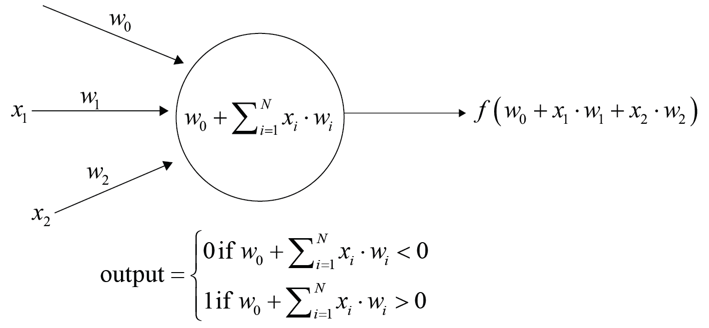
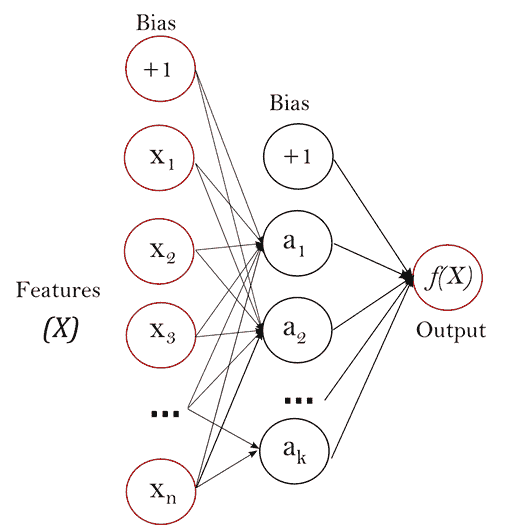

# 神经网络

本章我们将涵盖以下配方：

+   感知机分类器

+   神经网络 – 多层感知机

+   与神经网络堆叠

# 介绍

最近，神经网络和深度学习非常流行，因为它们解决了很多难题，并且可能已经成为人工智能公众面貌的重要组成部分。让我们探索 scikit-learn 中可用的前馈神经网络。

# 感知机分类器

使用 scikit-learn，你可以探索感知机分类器，并将其与 scikit-learn 中的其他分类方法进行比较。此外，感知机是神经网络的构建模块，神经网络是机器学习中的一个重要部分，特别是在计算机视觉领域。

# 准备开始

让我们开始吧。过程如下：

1.  加载 UCI 糖尿病分类数据集。

1.  将数据集划分为训练集和测试集。

1.  导入感知机。

1.  实例化感知机。

1.  然后训练感知机。

1.  尝试在测试集上使用感知机，或者更好地计算`cross_val_score`。

加载 UCI 糖尿病数据集：

```py
import numpy as np
import pandas as pd

data_web_address = "https://archive.ics.uci.edu/ml/machine-learning-databases/pima-indians-diabetes/pima-indians-diabetes.data"

column_names = ['pregnancy_x',
'plasma_con',
'blood_pressure',
'skin_mm',
'insulin',
'bmi',
'pedigree_func',
'age',
'target']

feature_names = column_names[:-1]

all_data = pd.read_csv(data_web_address , names=column_names) 

X = all_data[feature_names]
y = all_data['target']
```

你已经加载了`X`，输入特征集，以及`y`，我们希望预测的变量。将`X`和`y`划分为测试集和训练集。通过分层目标集来完成这一步，确保在训练集和测试集中类的比例平衡：

```py
from sklearn.model_selection import train_test_split
X_train, X_test, y_train, y_test = train_test_split(X, y, test_size=0.2,stratify=y)
```

# 如何实现……

1.  对特征集进行缩放。仅在训练集上执行缩放操作，然后继续进行测试集：

```py
from sklearn.preprocessing import StandardScaler 

scaler = StandardScaler()
scaler.fit(X_train) 
X_train_scaled = scaler.transform(X_train)
X_test_scaled = scaler.transform(X_test)
```

1.  实例化并在训练集上训练感知机：

```py
from sklearn.linear_model import Perceptron

pr = Perceptron()
pr.fit(X_train_scaled, y_train) 
Perceptron(alpha=0.0001, class_weight=None, eta0=1.0, fit_intercept=True,
 n_iter=5, n_jobs=1, penalty=None, random_state=0, shuffle=True,
 verbose=0, warm_start=False)
```

1.  测量交叉验证得分。将`roc_auc`作为交叉验证评分机制。此外，通过设置`cv=skf`，使用分层 K 折交叉验证：

```py
from sklearn.model_selection import cross_val_score, StratifiedKFold

skf = StratifiedKFold(n_splits=3)
cross_val_score(pr, X_train_scaled, y_train, cv=skf,scoring='roc_auc').mean()

0.76832628835771022
```

1.  在测试集上评估性能。导入`sklearn.metrics`模块中的两个指标，`accuracy_score`和`roc_auc_score`：

```py
from sklearn.metrics import accuracy_score, roc_auc_score

print "Classification accuracy : ", accuracy_score(y_test, pr.predict(X_test_scaled))
print "ROC-AUC Score : ",roc_auc_score(y_test, pr.predict(X_test_scaled))

Classification accuracy : 0.681818181818
ROC-AUC Score : 0.682592592593
```

测试很快就完成了。结果表现还行，比逻辑回归稍差，逻辑回归的准确率为 75%（这是一个估计值；我们不能将本章的逻辑回归与任何之前章节中的逻辑回归做比较，因为训练集和测试集的划分不同）。

# 它是如何工作的……

感知机是大脑中神经元的简化模型。在下面的图示中，感知机从左边接收输入 *x[1]* 和 *x[2]*。计算偏置项 *w[0]* 和权重 *w[1]*、*w[2]*。*x[i]* 和 *w[i]* 组成一个线性函数。然后将这个线性函数传递给激活函数。

在以下激活函数中，如果权重与输入向量的点积之和小于零，则将单独的行分类为 0；否则分类为 1：



这发生在单次迭代或遍历感知机时。该过程会在多个迭代中重复，每次都会重新调整权重，从而最小化损失函数。

关于感知器和当前神经网络的状态，它们表现良好，因为研究人员已经尝试了许多方法。实际上，基于目前的计算能力，它们的表现非常好。

随着计算能力的不断提升，神经网络和感知器能够解决越来越复杂的问题，且训练时间持续缩短。

# 还有更多内容...

尝试通过调整感知器的超参数来运行网格搜索。几个显著的参数包括正则化参数`penalty`和`alpha`、`class_weight`以及`max_iter`。`class_weight`参数通过赋予代表性不足的类别更多的权重，能够很好地处理类别不平衡问题。`max_iter`参数表示感知器的最大迭代次数。一般来说，其值越大越好，因此我们将其设置为 50。（请注意，这是针对 scikit-learn 0.19.0 的代码。在 scikit-learn 0.18.1 版本中，请使用`n_iter`参数代替`max_iter`参数。）

尝试以下网格搜索：

```py
from sklearn.model_selection import GridSearchCV

param_dist = {'alpha': [0.1,0.01,0.001,0.0001], 
 'penalty': [None, 'l2','l1','elasticnet'],
 'random_state': [7],
 'class_weight':['balanced',None],'eta0': [0.25,0.5,0.75,1.0], 
 'warm_start':[True,False], 'max_iter':[50], 'tol':[1e-3]}

gs_perceptron = GridSearchCV(pr, param_dist, scoring='roc_auc',cv=skf).fit(X_train_scaled, y_train)
```

查看最佳参数和最佳得分：

```py
gs_perceptron.best_params_

{'alpha': 0.001,
 'class_weight': None,
 'eta0': 0.5,
 'max_iter': 50,
 'penalty': 'l2',
 'random_state': 7,
 'tol': 0.001,
 'warm_start': True}

gs_perceptron.best_score_

0.79221656570311072
```

使用交叉验证调整超参数已改善结果。现在尝试使用一组感知器进行集成学习，如下所示。首先注意并选择网格搜索中表现最好的感知器：

```py
best_perceptron = gs_perceptron.best_estimator_
```

执行网格搜索：

```py
from sklearn.ensemble import BaggingClassifier 

from sklearn.ensemble import BaggingClassifier 
param_dist = {
 'max_samples': [0.5,1.0],
 'max_features' : [0.5,1.0],
 'oob_score' : [True, False],
 'n_estimators': [100],
 'n_jobs':[-1],
 'base_estimator__alpha': [0.001,0.002],
 'base_estimator__penalty': [None, 'l2','l1','elasticnet'], }

ensemble_estimator = BaggingClassifier(base_estimator = best_perceptron)
bag_perceptrons = GridSearchCV(ensemble_estimator, param_dist,scoring='roc_auc',cv=skf,n_jobs=-1).fit(X_train_scaled, y_train)
```

查看新的交叉验证得分和最佳参数：

```py
bag_perceptrons.best_score_

0.83299842529587864

bag_perceptrons.best_params_

{'base_estimator__alpha': 0.001,
 'base_estimator__penalty': 'l1',
 'max_features': 1.0,
 'max_samples': 1.0,
 'n_estimators': 100,
 'n_jobs': -1,
 'oob_score': True}
```

因此，对于这个数据集，一组感知器的表现优于单一感知器。

# 神经网络 – 多层感知器

在 scikit-learn 中使用神经网络非常简单，步骤如下：

1.  加载数据。

1.  使用标准缩放器对数据进行缩放。

1.  进行超参数搜索。首先调整 alpha 参数。

# 准备就绪

加载我们在第九章中使用的中等规模的加州住房数据集，*决策树算法与集成方法*：

```py
%matplotlib inline

import numpy as np
import pandas as pd
import matplotlib.pyplot as plt

from sklearn.datasets import fetch_california_housing

cali_housing = fetch_california_housing()

X = cali_housing.data
y = cali_housing.target
```

将目标变量进行分箱，使得目标训练集和目标测试集更为相似。然后使用分层的训练/测试拆分：

```py
bins = np.arange(6)
binned_y = np.digitize(y, bins)

from sklearn.model_selection import train_test_split
X_train, X_test, y_train, y_test = train_test_split(X, y, test_size=0.2,stratify=binned_y)
```

# 如何做...

1.  首先对输入变量进行缩放。仅在训练数据上训练缩放器：

```py
from sklearn.preprocessing import StandardScaler

scaler = StandardScaler()
scaler.fit(X_train)

X_train_scaled = scaler.transform(X_train)
```

1.  然后，在测试集上执行缩放：

```py
X_test_scaled = scaler.transform(X_test)
```

1.  最后，执行随机搜索（或如果你喜欢，也可以进行网格搜索）来找到`alpha`的合理值，确保其得分较高：

```py
from sklearn.model_selection import RandomizedSearchCV
from sklearn.neural_network import MLPRegressor

param_grid = {'alpha': [10,1,0.1,0.01],
 'hidden_layer_sizes' : [(50,50,50),(50,50,50,50,50)],
 'activation': ['relu','logistic'],
 'solver' : ['adam']
 }

pre_gs_inst = RandomizedSearchCV(MLPRegressor(random_state=7),
 param_distributions = param_grid,
 cv=3,
 n_iter=15,
 random_state=7)
pre_gs_inst.fit(X_train_scaled, y_train)

pre_gs_inst.best_score_

0.7729679848718175

pre_gs_inst.best_params_

{'activation': 'relu',
 'alpha': 0.01,
 'hidden_layer_sizes': (50, 50, 50),
 'solver': 'adam'}
```

# 它是如何工作的...

在神经网络的背景下，单一感知器的结构如下所示：


输出是权重和输入的点积之和的函数。该函数*f*是激活函数，可以是 sigmoid 曲线。例如，在神经网络中，超参数激活指的就是这个函数。在 scikit-learn 中，有 identity、logistic、tanh 和 relu 的选项，其中 logistic 即为 sigmoid 曲线。

整个网络是这样的（以下是来自 scikit 文档的图示，链接：[`scikit-learn.org/stable/modules/neural_networks_supervised.html`](http://scikit-learn.org/stable/modules/neural_networks_supervised.html)）：



使用我们熟悉的数据集——加利福尼亚住房数据集来训练神经网络是很有教育意义的。加利福尼亚住房数据集似乎更适合非线性算法，特别是树算法和树的集成。树算法在这个数据集上表现得很好，并为算法在该数据集上的表现建立了基准。

最终，神经网络表现还不错，但远不如梯度提升机好。此外，它们在计算上非常昂贵。

# 关于神经网络的哲学思考

神经网络是数学上通用的函数逼近器，可以学习任何函数。此外，隐藏层通常被解释为网络学习过程的中间步骤，而无需人工编写这些中间步骤。这可以来自计算机视觉中的卷积神经网络，在那里很容易看到神经网络如何推断出每一层。

这些事实构成了有趣的心智图像，并且可以应用于其他估计器。许多人往往不会把随机森林看作是树在逐步推理的过程，或者说是树与树之间的推理（也许是因为它们的结构不如有组织，而随机森林不会让人联想到生物大脑的可视化）。在更实际的细节上，如果你想组织随机森林，你可以限制它们的深度，或者使用梯度提升机。

无论神经网络是否真正智能这一事实如何，随着领域的进展和机器变得越来越聪明，携带这样的心智图像是有帮助的。携带这个想法，但要专注于结果；这就是现在机器学习的意义。

# 使用神经网络进行堆叠

两种最常见的元学习方法是袋装法和提升法。堆叠法使用得较少；然而，它非常强大，因为可以将不同类型的模型结合起来。这三种方法都通过一组较弱的估计器创建了一个更强的估计器。我们在第九章，*树算法与集成方法*中尝试了堆叠过程。在这里，我们尝试将神经网络与其他模型结合。

堆叠的过程如下：

1.  将数据集划分为训练集和测试集。

1.  将训练集划分为两部分。

1.  在训练集的第一部分上训练基础学习器。

1.  使用基础学习器对训练集第二部分进行预测。存储这些预测向量。

1.  将存储的预测向量作为输入，目标变量作为输出。训练一个更高层次的学习器（注意我们仍然处于训练集的第二部分）。

之后，你可以查看在测试集上整体过程的结果（注意，不能通过查看测试集上的结果来选择模型）。

# 准备就绪

导入加利福尼亚州住房数据集以及我们一直使用的库：`numpy`、`pandas`和`matplotlib`。这是一个中等大小的数据集，但相对于其他 scikit-learn 数据集来说，它还是比较大的：

```py
from __future__ import division
import numpy as np
import pandas as pd
import matplotlib.pyplot as plt

from sklearn.datasets import fetch_california_housing

#From within an ipython notebook
%matplotlib inline

cali_housing = fetch_california_housing()

X = cali_housing.data
y = cali_housing.target
```

将目标变量进行分箱，以提高数据集在目标变量上的平衡性：

```py
bins = np.arange(6)
binned_y = np.digitize(y, bins)
```

将数据集`X`和`y`划分为三个集合。`X_1`和`X_stack`分别表示第一个和第二个训练集的输入变量，`y_1`和`y_stack`分别表示第一个和第二个训练集的输出目标变量。测试集由`X_test_prin`和`y_test_prin`组成：

```py
from sklearn.model_selection import train_test_split
X_train_prin, X_test_prin, y_train_prin, y_test_prin = train_test_split(X, y,test_size=0.2,stratify=binned_y,random_state=7)

binned_y_train_prin = np.digitize(y_train_prin, bins)

X_1, X_stack, y_1, y_stack = train_test_split(X_train_prin,y_train_prin,test_size=0.33,stratify=binned_y_train_prin,random_state=7 )
```

另一个选择是使用来自 scikit-learn 的`model_selection`模块中的`StratifiedShuffleSplit`。

# 如何实现...

我们将使用三个基础回归器：一个神经网络，一个单一的梯度提升机，和一个梯度提升机的袋装集成。

# 第一个基础模型 - 神经网络

1.  通过对第一个训练集进行交叉验证的网格搜索，添加一个神经网络：`X_1`为输入，`y_1`为目标集合。这将找到该数据集的最佳神经网络参数。在此示例中，我们仅调整`alpha`参数。不要忘记对输入进行标准化，否则网络将无法很好地运行：

```py
from sklearn.model_selection import GridSearchCV
from sklearn.neural_network import MLPRegressor

from sklearn.pipeline import Pipeline
from sklearn.preprocessing import StandardScaler

mlp_pipe = Pipeline(steps=[('scale', StandardScaler()), ('neural_net', MLPRegressor())])

param_grid = {'neural_net__alpha': [0.02,0.01,0.005],
 'neural_net__hidden_layer_sizes' : [(50,50,50)],
 'neural_net__activation': ['relu'],
 'neural_net__solver' : ['adam']
 }

 neural_net_gs = GridSearchCV(mlp_pipe, param_grid = param_grid,cv=3, n_jobs=-1)
 neural_net_gs.fit(X_1, y_1)
```

1.  查看网格搜索的最佳参数和最佳得分：

```py
neural_net_gs.best_params_

 {'neural_net__activation': 'relu',
 'neural_net__alpha': 0.01,
 'neural_net__hidden_layer_sizes': (50, 50, 50),
 'neural_net__solver': 'adam'}

neural_net_gs.best_score_

 0.77763106799320014
```

1.  持久化在网格搜索中表现最好的神经网络。这将保存我们已经完成的训练，以免我们不得不反复进行训练：

```py
nn_best = neural_net_gs.best_estimator_

import pickle

f = open('nn_best.save', 'wb')
pickle.dump(nn_best, f, protocol = pickle.HIGHEST_PROTOCOL)
f.close()
```

# 第二个基础模型 - 梯度提升集成

1.  对梯度增强树进行随机网格搜索：

```py
from sklearn.model_selection import RandomizedSearchCV
 from sklearn.ensemble import GradientBoostingRegressor

 param_grid = {'learning_rate': [0.1,0.05,0.03,0.01],
 'loss': ['huber'],
 'max_depth': [5,7,10],
 'max_features': [0.4,0.6,0.8,1.0],
 'min_samples_leaf': [2,3,5],
 'n_estimators': [100],
 'warm_start': [True], 'random_state':[7]
 }

 boost_gs = RandomizedSearchCV(GradientBoostingRegressor(), param_distributions = param_grid,cv=3, n_jobs=-1,n_iter=25)
 boost_gs.fit(X_1, y_1)
```

1.  查看最佳得分和参数：

```py
boost_gs.best_score_

0.82767651150013244

boost_gs.best_params_

{'learning_rate': 0.1, 'loss': 'huber', 'max_depth': 10, 'max_features': 0.4, 'min_samples_leaf': 5, 'n_estimators': 100, 'random_state': 7, 'warm_start': True}
```

1.  增加估算器的数量并训练：

```py
gbt_inst = GradientBoostingRegressor(**{'learning_rate': 0.1,
 'loss': 'huber',
 'max_depth': 10,
 'max_features': 0.4,
 'min_samples_leaf': 5,
 'n_estimators': 4000,
 'warm_start': True, 'random_state':7}).fit(X_1, y_1)
```

1.  对估算器进行持久化。为了方便和可重用性，持久化的代码被封装成一个函数：

```py
def pickle_func(filename, saved_object):
 import pickle

 f = open(filename, 'wb')
 pickle.dump(saved_object, f, protocol = pickle.HIGHEST_PROTOCOL)
 f.close()

 return None

pickle_func('grad_boost.save', gbt_inst)
```

# 第三个基础模型 - 梯度提升集成的袋装回归器

1.  现在，进行一个小规模的网格搜索，尝试一组梯度增强树的袋装。理论上很难判断这种集成方法是否会表现良好。对于堆叠而言，只要它与其他基础估算器的相关性不太高，它就足够好：

```py
from sklearn.ensemble import BaggingRegressor,GradientBoostingRegressor
 from sklearn.model_selection import RandomizedSearchCV

 param_dist = {
 'max_samples': [0.5,1.0],
 'max_features' : [0.5,1.0],
 'oob_score' : [True, False],
 'base_estimator__min_samples_leaf': [4,5],
 'n_estimators': [20]
 }

 single_estimator = GradientBoostingRegressor(**{'learning_rate': 0.1,
 'loss': 'huber',
 'max_depth': 10,
 'max_features': 0.4,
 'n_estimators': 20,
 'warm_start': True, 'random_state':7})

 ensemble_estimator = BaggingRegressor(base_estimator = single_estimator)

 pre_gs_inst_bag = RandomizedSearchCV(ensemble_estimator,
 param_distributions = param_dist,
 cv=3,
 n_iter = 5,
 n_jobs=-1)

 pre_gs_inst_bag.fit(X_1, y_1)
```

1.  查看最佳参数和评分：

```py
pre_gs_inst_bag.best_score_

0.78087218305611195

pre_gs_inst_bag.best_params_

 {'base_estimator__min_samples_leaf': 5,
 'max_features': 1.0,
 'max_samples': 1.0,
 'n_estimators': 20,
 'oob_score': True}
```

1.  持久化最佳估算器：

```py
pickle_func('bag_gbm.save', pre_gs_inst_bag.best_estimator_)
```

# 堆叠器的一些函数

1.  使用类似于第九章的函数，*树算法与集成方法*。`handle_X_set`函数在`X_stack`集合上创建预测向量的数据框。概念上，它指的是对训练集第二部分进行预测的第四步：

```py
def handle_X_set(X_train_set_in):
 X_train_set = X_train_set_in.copy()

 y_pred_nn = neural_net.predict(X_train_set)
 y_pred_gbt = gbt.predict(X_train_set)
 y_pred_bag = bag_gbm.predict(X_train_set)

 preds_df = pd.DataFrame(columns = ['nn', 'gbt','bag'])

 preds_df['nn'] = y_pred_nn
 preds_df['gbt'] = y_pred_gbt
 preds_df['bag'] = y_pred_bag

 return preds_df

def predict_from_X_set(X_train_set_in):
 X_train_set = X_train_set_in.copy() 
 return final_etr.predict(handle_X_set(X_train_set)) 
```

1.  如果你之前已经持久化了文件，并希望从这一步开始，解持久化文件。以下文件使用正确的文件名和变量名加载，以执行`handle_X_set`函数：

```py
def pickle_load_func(filename):
 f = open(filename, 'rb')
 to_return = pickle.load(f)
 f.close()

 return to_return

neural_net = pickle_load_func('nn_best.save')
gbt = pickle_load_func('grad_boost.save')
bag_gbm = pickle_load_func('bag_gbm.save')
```

1.  使用`handle_X_set`函数创建预测数据框。打印预测向量之间的皮尔逊相关性：

```py
preds_df = handle_X_set(X_stack)
print (preds_df.corr())

 nn       gbt       bag
nn   1.000000  0.867669  0.888655
gbt  0.867669  1.000000  0.981368
bag  0.888655  0.981368  1.000000
```

# 元学习器 – 额外树回归器

1.  类似于第九章，*树算法与集成方法*，在预测数据框上训练一个额外树回归器。使用`y_stack`作为目标向量：

```py
from sklearn.ensemble import ExtraTreesRegressor
 from sklearn.model_selection import RandomizedSearchCV

 param_dist = {'max_features' : ['sqrt','log2',1.0],
 'min_samples_leaf' : [1, 2, 3, 7, 11],
 'n_estimators': [50, 100],
 'oob_score': [True, False]}

 pre_gs_inst = RandomizedSearchCV(ExtraTreesRegressor(warm_start=True,bootstrap=True,random_state=7),
 param_distributions = param_dist,
 cv=3,
 n_iter = 15,random_state=7)

 pre_gs_inst.fit(preds_df.values, y_stack)
```

1.  查看最佳参数：

```py
pre_gs_inst.best_params_

{'max_features': 1.0,
 'min_samples_leaf': 11,
 'n_estimators': 100,
 'oob_score': False}
```

1.  训练额外树回归器，但增加估计器的数量：

```py
final_etr = ExtraTreesRegressor(**{'max_features': 1.0,
 'min_samples_leaf': 11,
 'n_estimators': 3000,
 'oob_score': False, 'random_state':7}).fit(preds_df.values, y_stack)
```

1.  查看`final_etr`估计器的交叉验证性能：

```py
from sklearn.model_selection import cross_val_score

cross_val_score(final_etr, preds_df.values, y_stack, cv=3).mean()

0.82212054913537747
```

1.  查看测试集上的性能：

```py
y_pred = predict_from_X_set(X_test_prin)

 from sklearn.metrics import r2_score, mean_absolute_error

 print "R-squared",r2_score(y_test_prin, y_pred)
 print "MAE : ",mean_absolute_error(y_test_prin, y_pred)
 print "MAPE : ",(np.abs(y_test_prin- y_pred)/y_test_prin).mean()

R-squared 0.839538887753
MAE :  0.303109168851
MAPE :  0.168643891048
```

1.  或许我们可以进一步提高结果。将训练列与预测向量并排放置。首先修改我们一直在使用的函数：

```py
def handle_X_set_sp(X_train_set_in):
 X_train_set = X_train_set_in.copy()

 y_pred_nn = neural_net.predict(X_train_set)
 y_pred_gbt = gbt.predict(X_train_set)
 y_pred_bag = bag_gbm.predict(X_train_set)

 #only change in function: include input vectors in training dataframe
 preds_df = pd.DataFrame(X_train_set, columns = cali_housing.feature_names)

 preds_df['nn'] = y_pred_nn
 preds_df['gbt'] = y_pred_gbt
 preds_df['bag'] = y_pred_bag

 return preds_df

def predict_from_X_set_sp(X_train_set_in):
 X_train_set = X_train_set_in.copy()

 #change final estimator's name to final_etr_sp and use handle_X_set_sp within this function
 return final_etr_sp.predict(handle_X_set_sp(X_train_set))
```

1.  按照之前的方式继续训练额外树回归器：

```py
preds_df_sp = handle_X_set_sp(X_stack)

from sklearn.ensemble import ExtraTreesRegressor
from sklearn.model_selection import RandomizedSearchCV

param_dist = {'max_features' : ['sqrt','log2',1.0],
 'min_samples_leaf' : [1, 2, 3, 7, 11],
 'n_estimators': [50, 100],
 'oob_score': [True, False]}

pre_gs_inst_2 = RandomizedSearchCV(ExtraTreesRegressor(warm_start=True,bootstrap=True,random_state=7),
 param_distributions = param_dist,
 cv=3,
 n_iter = 15,random_state=7)

pre_gs_inst_2.fit(preds_df_sp.values, y_stack)
```

1.  我们继续按之前的方式进行。查看最佳参数，并使用更多的估计器训练模型：

```py
{'max_features': 'log2',
 'min_samples_leaf': 2,
 'n_estimators': 100,
 'oob_score': False}

final_etr_sp = ExtraTreesRegressor(**{'max_features': 'log2',
 'min_samples_leaf': 2,
 'n_estimators': 3000,
 'oob_score': False,'random_state':7}).fit(preds_df_sp.values, y_stack)
```

1.  查看交叉验证性能：

```py
from sklearn.model_selection import cross_val_score

cross_val_score(final_etr_sp, preds_df_sp.values, y_stack, cv=3).mean()

0.82978653642597144
```

1.  我们在堆叠器的高级学习器训练中包含了原始输入列。交叉验证性能从 0.8221 提高到 0.8297。因此，我们得出结论，包含输入列的模型是最优模型。现在，在我们选择这个模型作为最终最佳模型后，我们查看估计器在测试集上的表现：

```py
y_pred = predict_from_X_set_sp(X_test_prin)

from sklearn.metrics import r2_score, mean_absolute_error

print "R-squared",r2_score(y_test_prin, y_pred)
print "MAE : ",mean_absolute_error(y_test_prin, y_pred)
print "MAPE : ",(np.abs(y_test_prin- y_pred)/y_test_prin).mean()

R-squared 0.846455829258
MAE :  0.295381654368
MAPE :  0.163374936923
```

# 还有更多...

在尝试过 scikit-learn 中的神经网络后，你可以尝试像`skflow`这样的包，它借用了 scikit-learn 的语法，但利用了谷歌强大的开源 TensorFlow。

关于堆叠，你可以尝试在整个训练集`X_train_prin`上进行交叉验证性能评估和预测，而不是将其分割成两部分`X_1`和`X_stack`。

数据科学中的许多包都大量借鉴了 scikit-learn 或 R 的语法。
