2\. 探索性数据分析与可视化

#### 活动 2.01：汇总统计与缺失值

完成此活动的步骤如下：

导入所需的库：

import json

import pandas as pd

import numpy as np

import missingno as msno

from sklearn.impute import SimpleImputer

import matplotlib.pyplot as plt

import seaborn as sns

读取数据。使用 pandas 的 `.read_csv` 方法将 CSV 文件读取到 pandas DataFrame 中：

data = pd.read_csv('../Datasets/house_prices.csv')

使用 pandas 的 `.info()` 和 `.describe()` 方法查看数据集的汇总统计信息：

data.info()

data.describe().T

info() 方法的输出将如下所示：

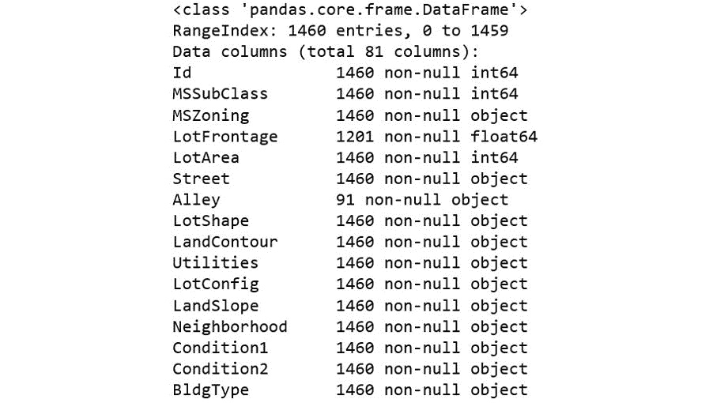

图 2.50：info() 方法的输出（缩略）

describe() 方法的输出将如下所示：

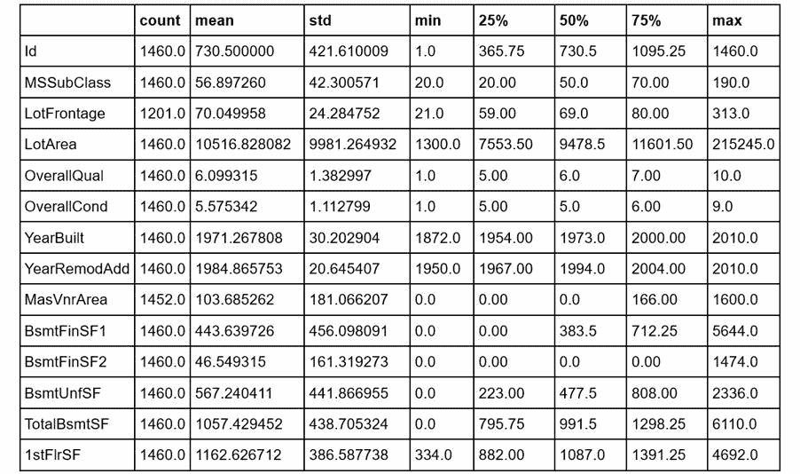

图 2.51：describe() 方法的输出（缩略）

查找每列中缺失值的总数和缺失值的总百分比，并按缺失百分比降序显示至少有一个空值的列。

正如我们在练习 2.02：可视化缺失值 中所做的那样，我们将对 DataFrame 使用 `.isnull()` 函数来获取一个掩码，使用 `.sum()` 函数计算每列中的空值数量，使用 `.mean()` 函数计算空值的比例，并乘以 100 将其转换为百分比。然后，我们将使用 `pd.concat()` 将缺失值的总数和百分比合并到一个 DataFrame 中，并根据缺失值的百分比对行进行排序：

mask = data.isnull()

total = mask.sum()

percent = 100*mask.mean()

#

missing_data = pd.concat([total, percent], axis=1, join='outer', \

keys=['count_missing', 'perc_missing'])

missing_data.sort_values(by='perc_missing', ascending=False, \

inplace=True)

#

missing_data[missing_data.count_missing > 0]

输出将如下所示：

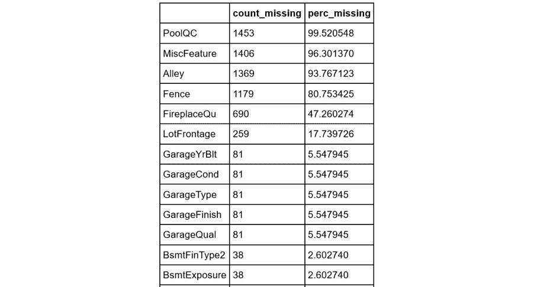

图 2.52：每列缺失值的总数和百分比

绘制空值矩阵和空值相关热图。首先，我们找到至少有一个空值的列名列表。然后，使用 missingno 库为这些列中的数据绘制空值矩阵（如同在练习 2.02：可视化缺失值 中所做的那样），并绘制空值相关热图：

nullable_columns = data.columns[mask.any()].tolist()

msno.matrix(data[nullable_columns].sample(500))

plt.show()

msno.heatmap(data[nullable_columns], vmin = -0.1, \

figsize=(18,18))

plt.show()

空值矩阵如下所示：

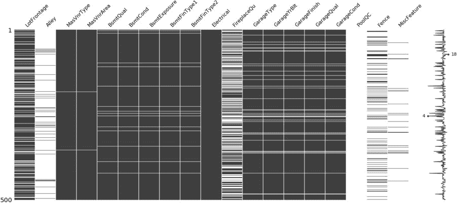

图 2.53：空值矩阵

空值相关热图将如下所示：

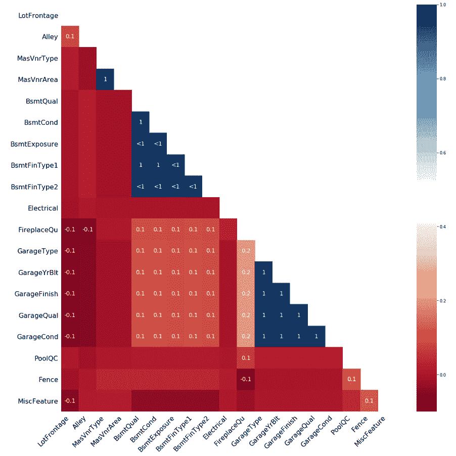

图 2.54：空值相关性热图

删除缺失值超过 80% 的列。使用我们在第 2 步中创建的 DataFrame 的 .loc 操作符，仅选择缺失值少于 80% 的列：

data = data.loc[:,missing_data[missing_data.perc_missing < 80].index]

将 FireplaceQu 列中的空值替换为 NA 值。使用 .fillna() 方法将空值替换为 NA 字符串：

data['FireplaceQu'] = data['FireplaceQu'].fillna('NA')

data['FireplaceQu']

输出应如下所示：

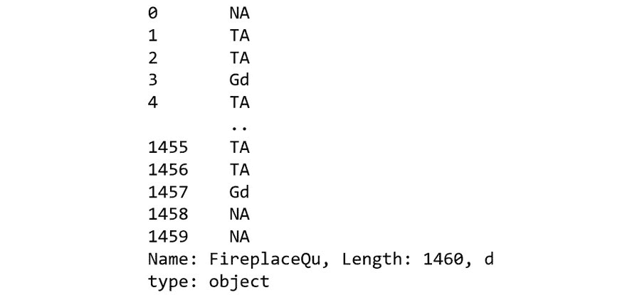

图 2.55：替换空值

#### 注意

要访问此特定部分的源代码，请参阅 https://packt.live/316c4a0。

您还可以在 https://packt.live/2Z21v5c 上在线运行此示例。您必须执行整个 Notebook 才能获得所需的结果。

#### 活动 2.02：以可视化方式表示值的分布

使用 Matplotlib 绘制目标变量 SalePrice 的直方图。首先，我们使用 plt.figure 命令初始化图形并设置图形大小。然后，使用 matplotlib 的 .hist() 函数作为主要绘图函数，将 SalePrice 系列对象传递给它以绘制直方图。最后，我们指定坐标轴标签并显示图形：

plt.figure(figsize=(8,6))

plt.hist(data.SalePrice, bins=range(0,800000,50000))

plt.ylabel('房屋数量')

plt.xlabel('销售价格')

plt.show()

输出将如下所示：

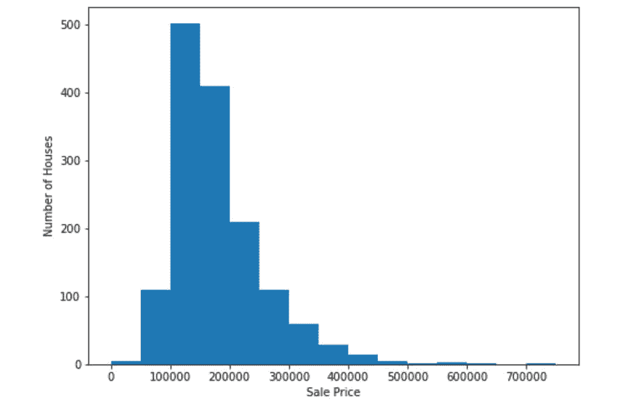

图 2.56：目标变量的直方图

查找每个列中具有对象类型的唯一值的数量。通过对原始 DataFrame 使用 .select_dtypes 函数来选择那些具有 numpy.object 数据类型的列，创建一个名为 object_variables 的新 DataFrame。然后，使用 .nunique() 函数查找此 DataFrame 中每列的唯一值数量，并对结果进行排序：

object_variables = data.select_dtypes(include=[np.object])

object_variables.nunique().sort_values()

输出将如下所示：

图 2.57：每个具有对象类型的列中的唯一值数量（已截断）

创建一个 DataFrame 来表示 HouseStyle 列中每个类别值的出现次数。使用 .value_counts() 函数按降序计算每个值的频率，以 pandas 系列的形式，然后重置索引以生成 DataFrame，并根据索引排序值：

counts = data.HouseStyle.value_counts(dropna=False)

counts.reset_index().sort_values(by='index')

输出将如下所示：

图 2.58：HouseStyle 列中每个类别值的出现次数

绘制一个饼图表示这些计数。如同第 1 步中一样，我们使用 plt.figure()初始化图形，并分别使用 plt.title()和 plt.show()方法设置图表标题和显示图形。主要绘图函数是 plt.pie()，我们将前一步创建的系列传递给它：

fig, ax = plt.subplots(figsize=(10,10))

slices = ax.pie(counts, labels = counts.index, \

colors = ['white'], \

wedgeprops = {'edgecolor': 'black'})

patches = slices[0]

hatches = ['/', '\\', '|', '-', '+', 'x', 'o', 'O', '\.', '*']

colors = ['white', 'white', 'lightgrey', 'white', \

'lightgrey', 'white', 'lightgrey', 'white']

for patch in range(len(patches)):

patches[patch].set_hatch(hatches[patch])

patches[patch].set_facecolor(colors[patch])

plt.title('显示不同房屋样式计数的饼图')

plt.show()

输出结果如下：

图 2.59：表示计数的饼图

找出每一列中具有数字类型的唯一值数量。如同在第 2 步中执行的那样，现在选择具有 numpy.number 数据类型的列，并使用.nunique()查找每列的唯一值数量。将结果序列按降序排序：

numeric_variables = data.select_dtypes(include=[np.number])

numeric_variables.nunique().sort_values(ascending=False)

输出结果如下：

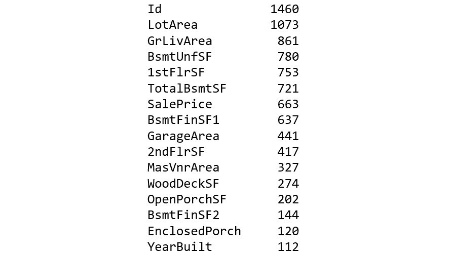

图 2.60：每个数值列中唯一值的数量（已截断）

使用 seaborn 绘制 LotArea 变量的直方图。使用 seaborn 的.distplot()函数作为主要绘图函数，需要传递 DataFrame 中的 LotArea 系列（去除任何空值，使用.dropna()方法删除空值）。为了改善图形视图，还可以设置 bins 参数，并使用 plt.xlim()指定 X 轴范围：

plt.figure(figsize=(10,7))

sns.distplot(data.LotArea.dropna(), bins=range(0,100000,1000))

plt.xlim(0,100000)

plt.show()

输出结果如下：

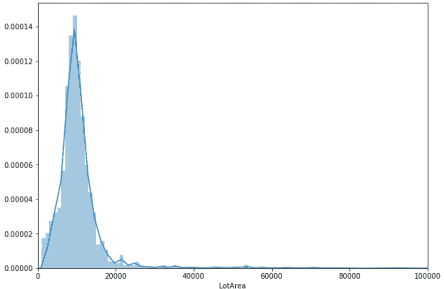

图 2.61：LotArea 变量的直方图

计算每列值的偏度和峰度值：

data.skew().sort_values()

data.kurt()

偏度值的输出将是：

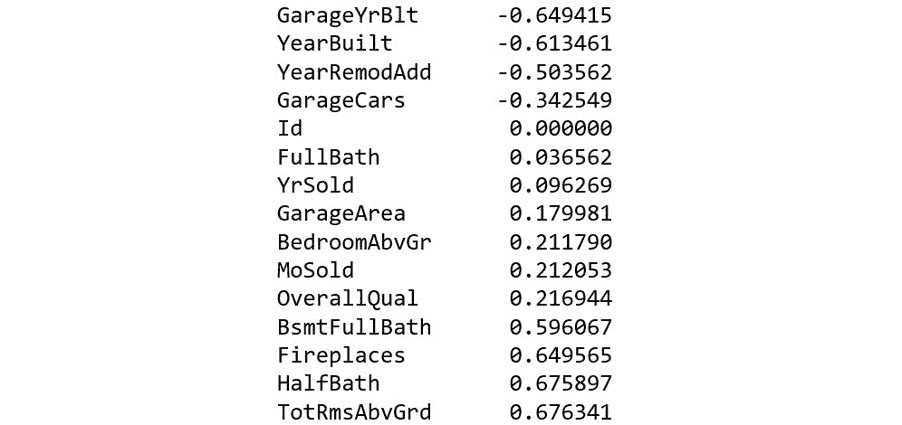

图 2.62：每列的偏度值（已截断）

峰度值的输出将是：

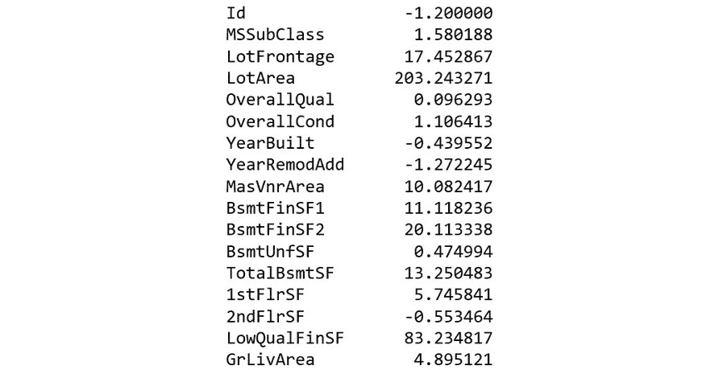

图 2.63：每列的峰度值（已截断）

#### 注意

要查看此特定部分的源代码，请访问 https://packt.live/3fR91qj。

你还可以在 https://packt.live/37PYOI4 上在线运行此示例。你必须执行整个 Notebook 才能获得期望的结果。

#### 活动 2.03：数据内的关系

绘制数据集的相关性热图。正如我们在练习 2.13：绘制相关性热图中所做的那样，使用 seaborn 的.heatmap()函数绘制热图，并传递通过 pandas 的.corr()函数计算出的特征相关性矩阵。除此之外，使用 cmap 参数将颜色映射设置为 RdBu，并分别使用 vmin 和 vmax 参数将颜色刻度的最小值和最大值设置为-1 和 1：

plt.figure(figsize = (12,10))

sns.heatmap(data.corr(), square=True, cmap="RdBu", \

vmin=-1, vmax=1)

plt.show()

输出结果如下：

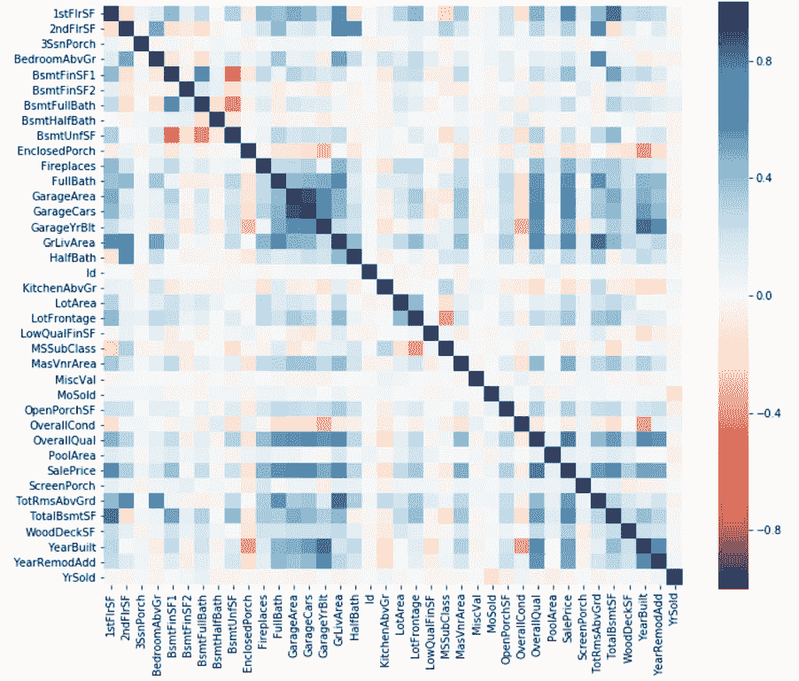

图 2.64：数据集的相关性热图

使用以下特征子集绘制更紧凑的热图，并在热图上添加相关性值注释：

feature_subset = ['GarageArea','GarageCars','GarageCond', \

'GarageFinish', 'GarageQual','GarageType', \

'GarageYrBlt','GrLivArea','LotArea', \

'MasVnrArea','SalePrice']

现在与前一步相同，这次只选择数据集中的上述列，并将参数 annot 添加到主绘图函数中，值为 True，其他内容保持不变：

plt.figure(figsize = (12,10))

sns.heatmap(data[feature_subset].corr(), square=True, \

annot=True, cmap="RdBu", vmin=-1, vmax=1)

plt.show()

输出结果如下：

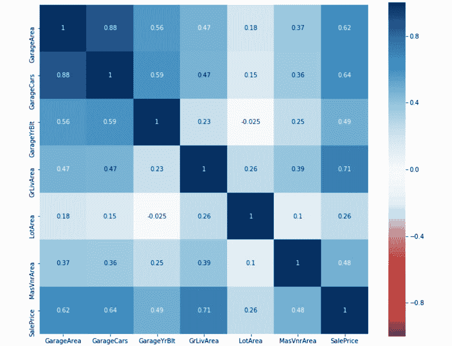

图 2.65：带有相关性值注释的特征子集相关性热图

显示相同特征子集的 Pairplot，主对角线为 KDE 图，其他位置为散点图。使用 seaborn 的.pairplot()函数绘制 DataFrame 中选定列的非空值的 Pairplot。为了渲染对角线的 KDE 图，将 kde 传递给 diag_kind 参数，而将 scatter 传递给 kind 参数，以设置所有其他图为散点图：

sns.pairplot(data[feature_subset].dropna(), \

kind ='scatter', diag_kind='kde')

plt.show()

输出结果如下：

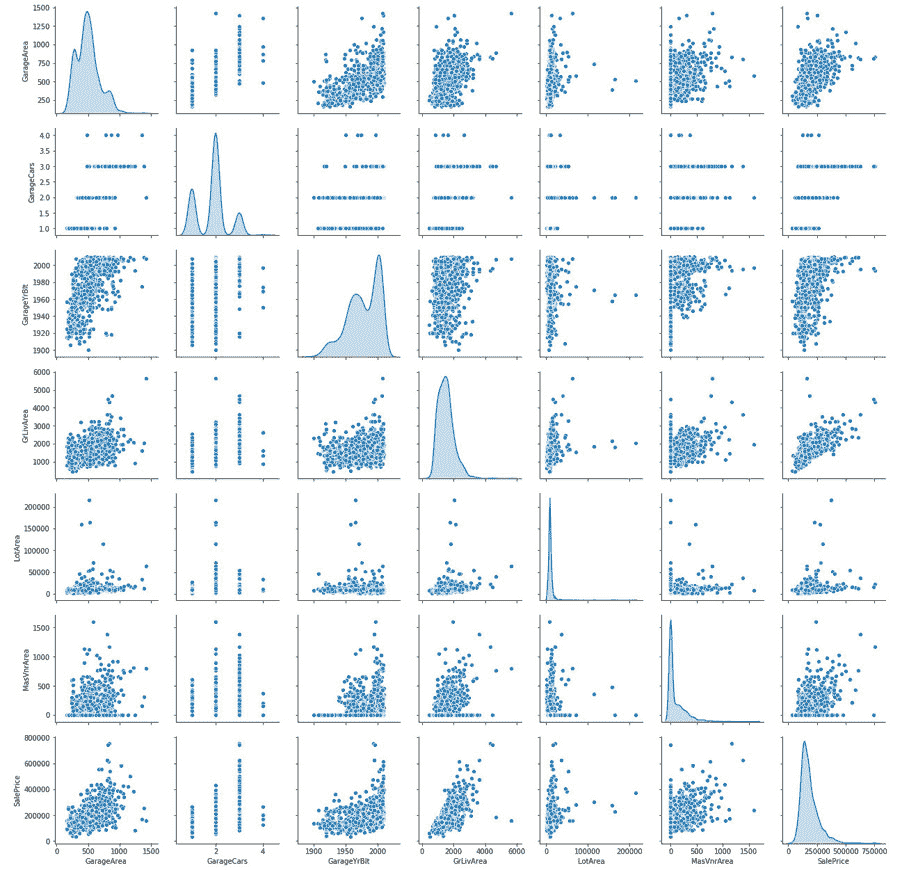

图 2.66：相同特征子集的 Pairplot

创建一个箱线图，展示每个 GarageCars 类别下 SalePrice 的变化。在这里使用的主要绘图函数是 seaborn 的.boxplot()函数，我们将 DataFrame 以及 x 和 y 参数传递给它，前者是分类变量，后者是我们想要查看每个类别内部变化的连续变量，即 GarageCars 和 SalePrice：

plt.figure(figsize=(10, 10))

sns.boxplot(x='GarageCars', y="SalePrice", data=data)

plt.show()

输出结果如下：

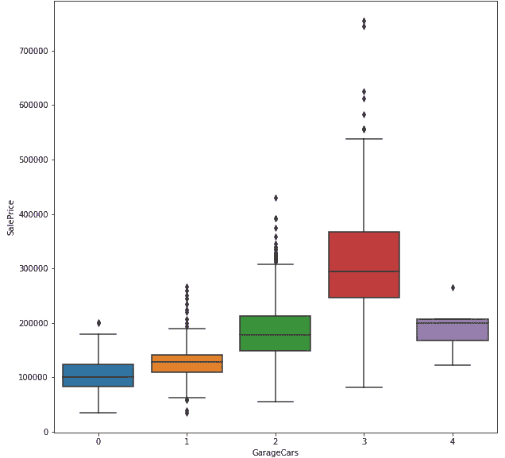

图 2.67: 箱型图显示每个 GarageCars 类别中销售价格的变化

使用 seaborn 绘制折线图，显示从较旧到最近建成的公寓销售价格的变化。在这里，我们将使用 seaborn 的 `.lineplot()` 函数绘制折线图。由于我们想查看销售价格的变化，因此我们将销售价格作为 y 变量，并且由于变化跨越了一段时间，我们将建造年份 (YearBuilt) 作为 x 变量。考虑到这一点，我们将相应的系列数据作为值传递给主要绘图函数的 y 和 x 参数。同时，我们还传递 `ci=None` 参数，以隐藏图中线条周围的标准偏差指示器：

plt.figure(figsize=(10,7))

sns.lineplot(x=data.YearBuilt, y=data.SalePrice, ci=None)

plt.show()

输出将如下所示：

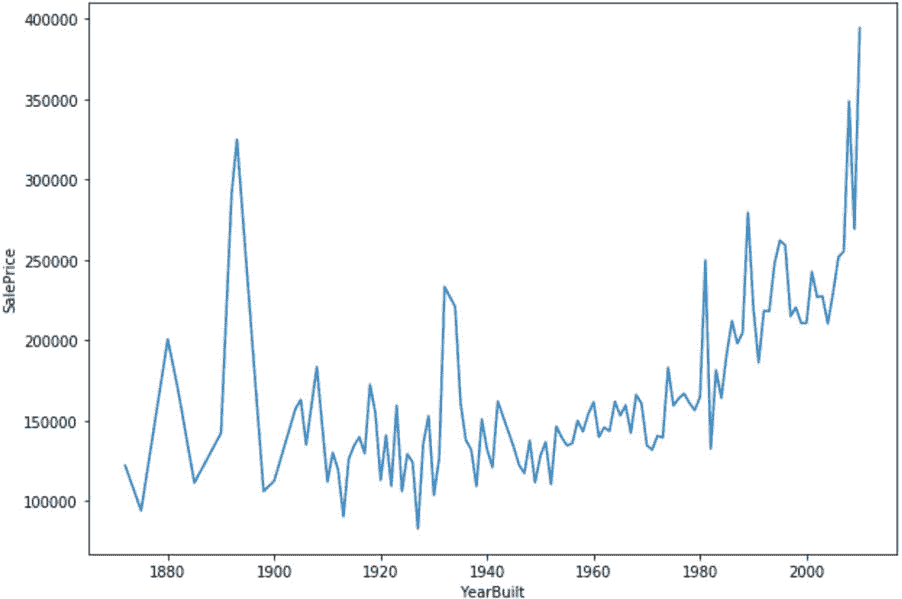

图 2.68: 折线图显示从较旧到最近建成的公寓销售价格的变化

图 2.68 展示了如何使用折线图来突出显示整体趋势以及短期时间周期中的波动。你可能想将此图表与相同数据的散点图进行比较，并考虑每种图表传达了什么信息。

#### 注意

要访问此部分的源代码，请参阅 https://packt.live/2Z4bqHM。

你也可以在线运行这个示例，网址是 https://packt.live/2Nl5ggI。你必须执行整个 Notebook 才能得到预期的结果。
