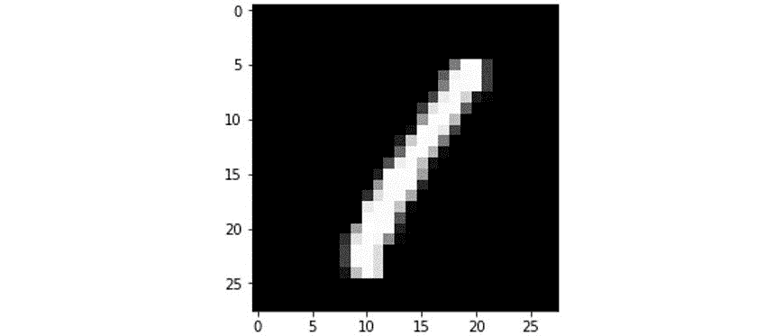
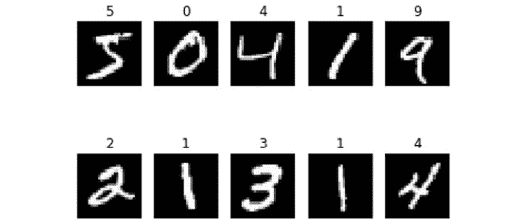
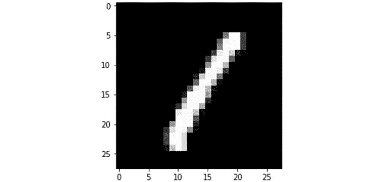

5\. 分类技术

#### Activity 5.01: 普通最小二乘分类器 – 二元分类器

解决方案：

导入所需的依赖项：

import struct

import numpy as np

import gzip

import urllib.request

import matplotlib.pyplot as plt

from array import array

from sklearn.linear_model import LinearRegression

将 MNIST 数据加载到内存中：

with gzip.open('../Datasets/train-images-idx3-ubyte.gz', 'rb') as f:

magic, size, rows, cols = struct.unpack(">IIII", f.read(16))

img = np.array(array("B", f.read())).reshape((size, rows, cols))

with gzip.open('../Datasets/train-labels-idx1-ubyte.gz', 'rb') as f:

magic, size = struct.unpack(">II", f.read(8))

labels = np.array(array("B", f.read()))

with gzip.open('../Datasets/t10k-images-idx3-ubyte.gz', 'rb') as f:

magic, size, rows, cols = struct.unpack(">IIII", f.read(16))

img_test = np.array(array("B", f.read()))\

.reshape((size, rows, cols))

with gzip.open('../Datasets/t10k-labels-idx1-ubyte.gz', 'rb') as f:

magic, size = struct.unpack(">II", f.read(8))

labels_test = np.array(array("B", f.read()))

可视化数据样本：

for i in range(10):

plt.subplot(2, 5, i + 1)

plt.imshow(img[i], cmap='gray');

plt.title(f'{labels[i]}');

plt.axis('off')

输出结果如下：

图 5.63：样本数据

构建一个线性分类器模型，用于分类数字 0 和 1。我们将要创建的模型是为了判断样本是数字 0 还是数字 1。为了实现这一点，我们首先需要选择仅包含这些样本的数据：

samples_0_1 = np.where((labels == 0) | (labels == 1))[0]

images_0_1 = img[samples_0_1]

labels_0_1 = labels[samples_0_1]

samples_0_1_test = np.where((labels_test == 0) | (labels_test == 1))

images_0_1_test = img_test[samples_0_1_test]\

.reshape((-1, rows * cols))

labels_0_1_test = labels_test[samples_0_1_test]

可视化选定的信息。以下是数字 0 的代码：

sample_0 = np.where((labels == 0))[0][0]

plt.imshow(img[sample_0], cmap='gray');

输出结果如下：

图 5.64：第一个样本数据

以下是数字 1 的代码：

sample_1 = np.where((labels == 1))[0][0]

plt.imshow(img[sample_1], cmap='gray');

输出结果如下：

图 5.65：第二个样本数据

为了将图像信息提供给模型，我们必须先将数据展平，使每张图像的形状为 1 x 784 像素：

images_0_1 = images_0_1.reshape((-1, rows * cols))

images_0_1.shape

输出结果如下：

(12665, 784)

让我们构建模型；使用 LinearRegression API 并调用 fit 函数：

model = LinearRegression()

model.fit(X=images_0_1, y=labels_0_1)

输出结果如下：

LinearRegression(copy_X=True, fit_intercept=True, n_jobs=None,

normalize=False)

确定训练集准确性：

model.score(X=images_0_1, y=labels_0_1)

输出结果如下：

0.9705320567708795

确定每个训练样本的标签预测值，使用 0.5 的阈值。大于 0.5 的值分类为 1，而小于或等于 0.5 的值分类为 0：

y_pred = model.predict(images_0_1) > 0.5

y_pred = y_pred.astype(int)

y_pred

输出将如下所示：

array([0, 1, 1, ..., 1, 0, 1])

计算预测训练值与实际值的分类准确率：

np.sum(y_pred == labels_0_1) / len(labels_0_1)

输出将如下所示：

0.9947887879984209

10. 比较在测试集上的性能：

y_pred = model.predict(images_0_1_test) > 0.5

y_pred = y_pred.astype(int)

np.sum(y_pred == labels_0_1_test) / len(labels_0_1_test)

输出将如下所示：

0.9938534278959811

#### 注意

要访问此特定部分的源代码，请参阅 https://packt.live/3emRZAk。

您还可以在 https://packt.live/37T4bGh 上在线运行此示例。必须执行整个笔记本才能获得预期的结果。

#### 活动 5.02：KNN 多类别分类器

导入以下包：

import struct

import numpy as np

import gzip

import urllib.request

import matplotlib.pyplot as plt

from array import array

from sklearn.neighbors import KNeighborsClassifier as KNN

将 MNIST 数据加载到内存中。

训练图像：

with gzip.open('../Datasets/train-images-idx3-ubyte.gz', 'rb') as f:

magic, size, rows, cols = struct.unpack(">IIII", f.read(16))

img = np.array(array("B", f.read())).reshape((size, rows, cols))

训练标签：

with gzip.open('../Datasets/train-labels-idx1-ubyte.gz', 'rb') as f:

magic, size = struct.unpack(">II", f.read(8))

labels = np.array(array("B", f.read()))

测试图像：

with gzip.open('../Datasets/t10k-images-idx3-ubyte.gz', 'rb') as f:

magic, size, rows, cols = struct.unpack(">IIII", f.read(16))

img_test = np.array(array("B", f.read()))\

.reshape((size, rows, cols))

测试标签：

with gzip.open('../Datasets/t10k-labels-idx1-ubyte.gz', 'rb') as f:

magic, size = struct.unpack(">II", f.read(8))

labels_test = np.array(array("B", f.read()))

可视化数据样本：

for i in range(10):

plt.subplot(2, 5, i + 1)

plt.imshow(img[i], cmap='gray');

plt.title(f'{labels[i]}');

plt.axis('off')

输出将如下所示：

图 5.66：样本图像

构建一个 k=3 的 KNN 分类器来分类 MNIST 数据集。同样，为了节省处理能力，随机抽取 5,000 张图像用于训练：

np.random.seed(0)

selection = np.random.choice(len(img), 5000)

selected_images = img[selection]

selected_labels = labels[selection]

为了将图像信息提供给模型，我们必须首先将数据展平，使得每个图像的形状为 1 x 784 像素：

selected_images = selected_images.reshape((-1, rows * cols))

selected_images.shape

输出将如下所示：

(5000, 784)

构建三邻居 KNN 模型并拟合数据到模型中。请注意，在此活动中，我们为模型提供了 784 个特征或维度，而不仅仅是 2：

model = KNN(n_neighbors=3)

model.fit(X=selected_images, y=selected_labels)

输出将如下所示：

KNeighborsClassifier(algorithm='auto', leaf_size=30, metric='minkowski',

metric_params=None, n_jobs=None, n_neighbors=3, p=2,

weights='uniform')

确定模型在训练集上的得分：

model.score(X=selected_images, y=selected_labels)

输出将如下所示：

0.9692

显示模型对训练数据的前两个预测结果：

model.predict(selected_images)[:2]

plt.subplot(1, 2, 1)

plt.imshow(selected_images[0].reshape((28, 28)), cmap='gray');

plt.axis('off');

plt.subplot(1, 2, 2)

plt.imshow(selected_images[1].reshape((28, 28)), cmap='gray');

plt.axis('off');

输出将如下所示：

图 5.67：测试集的前两个值

比较模型在测试集上的表现：

model.score(X=img_test.reshape((-1, rows * cols)), y=labels_test)

输出将如下所示：

0.9376

#### 注意

要访问此特定部分的源代码，请参考 https://packt.live/313xdlc。

您也可以在 https://packt.live/2Nl6DMo 上在线运行此示例。您必须执行整个 Notebook 才能获得预期结果。

#### 活动 5.03：使用 CART 决策树进行二分类

解决方案：

导入所需的依赖项：

import struct

import numpy as np

import pandas as pd

import gzip

import urllib.request

import matplotlib.pyplot as plt

from array import array

from sklearn.model_selection import train_test_split

from sklearn.tree import DecisionTreeClassifier

加载 MNIST 数据到内存：

with gzip.open('../Datasets/train-images-idx3-ubyte.gz', 'rb') as f:

magic, size, rows, cols = struct.unpack(">IIII", f.read(16))

img = np.array(array("B", f.read())).reshape((size, rows, cols))

with gzip.open('../Datasets/train-labels-idx1-ubyte.gz', 'rb') as f:

magic, size = struct.unpack(">II", f.read(8))

labels = np.array(array("B", f.read()))

with gzip.open('../Datasets/t10k-images-idx3-ubyte.gz', 'rb') as f:

magic, size, rows, cols = struct.unpack(">IIII", f.read(16))

img_test = np.array(array("B", f.read()))\

.reshape((size, rows, cols))

with gzip.open('../Datasets/t10k-labels-idx1-ubyte.gz', 'rb') as f:

magic, size = struct.unpack(">II", f.read(8))

labels_test = np.array(array("B", f.read()))

可视化数据的一个样本：

for i in range(10):

plt.subplot(2, 5, i + 1)

plt.imshow(img[i], cmap='gray');

plt.title(f'{labels[i]}');

plt.axis('off')

输出将如下所示：

图 5.68：样本数据

构建一个线性分类器模型来分类数字 0 和 1。我们将要创建的模型是确定样本是否为数字 0 或 1。为此，我们首先需要仅选择这些样本：

samples_0_1 = np.where((labels == 0) | (labels == 1))[0]

images_0_1 = img[samples_0_1]

labels_0_1 = labels[samples_0_1]

samples_0_1_test = np.where((labels_test == 0) | (labels_test == 1))

images_0_1_test = img_test[samples_0_1_test]\

.reshape((-1, rows * cols))

labels_0_1_test = labels_test[samples_0_1_test]

可视化选定的信息。以下是 0 的代码：

sample_0 = np.where((labels == 0))[0][0]

plt.imshow(img[sample_0], cmap='gray');

输出将如下所示：

图 5.69：第一组样本数据

以下是 1 的代码：

sample_1 = np.where((labels == 1))[0][0]

plt.imshow(img[sample_1], cmap='gray');

输出将如下所示：

图 5.70：第二组样本数据

为了将图像信息提供给模型，我们必须先将数据展平，使得每个图像的形状为 1 x 784 像素：

images_0_1 = images_0_1.reshape((-1, rows * cols))

images_0_1.shape

输出将如下所示：

(12665, 784)

让我们构建模型；使用 DecisionTreeClassifier API 并调用 fit 函数：

model = DecisionTreeClassifier(random_state=123)

model = model.fit(X=images_0_1, y=labels_0_1)

model

输出将如下所示：

DecisionTreeClassifier(class_weight=None, criterion='gini', max_depth=None,

max_features=None, max_leaf_nodes=None,

min_impurity_decrease=0.0, min_impurity_split=None,

min_samples_leaf=1, min_samples_split=2,

min_weight_fraction_leaf=0.0, presort=False,

random_state=None, splitter='best')

确定训练集的准确率：

model.score(X=images_0_1, y=labels_0_1)

输出将如下所示：

1.0

使用 0.5 的阈值来确定每个训练样本的标签预测值。大于 0.5 的值分类为 1，小于或等于 0.5 的值分类为 0：

y_pred = model.predict(images_0_1) > 0.5

y_pred = y_pred.astype(int)

y_pred

计算预测的训练值与实际值的分类准确率：

np.sum(y_pred == labels_0_1) / len(labels_0_1)

与测试集的表现进行比较：

y_pred = model.predict(images_0_1_test) > 0.5

y_pred = y_pred.astype(int)

np.sum(y_pred == labels_0_1_test) / len(labels_0_1_test)

输出将如下所示：

0.9962174940898345

#### 注意

若要访问此特定部分的源代码，请参阅 https://packt.live/3hNUJbT。

您还可以在线运行此示例，网址：https://packt.live/2Cq5W25。您必须执行整个 Notebook 才能获得期望的结果。

#### 活动 5.04：使用人工神经网络进行乳腺癌诊断分类

导入所需的包。对于这个活动，我们将需要 pandas 包来加载数据，matplotlib 包用于绘图，scikit-learn 用于创建神经网络模型，以及将数据集分割为训练集和测试集。导入所有必要的包和相关模块以完成这些任务：

import pandas as pd

导入 matplotlib.pyplot

来自 sklearn.neural_network 的 MLPClassifier

来自 sklearn.model_selection 的 train_test_split

来自 sklearn 的预处理

使用 pandas 加载乳腺癌诊断数据集并检查前五行：

df = pd.read_csv('../Datasets/breast-cancer-data.csv')

df.head()

输出结果如下：

图 5.71：乳腺癌数据集的前五行

此外，拆分数据集为输入（X）和输出（y）变量：

X, y = df[[c for c in df.columns if c != 'diagnosis']], df.diagnosis

下一步是特征工程。该数据集的不同列具有不同的量级；因此，在构建和训练神经网络模型之前，我们对数据集进行归一化。为此，我们使用来自 sklearn 的 MinMaxScaler API，它将每一列的值归一化到 0 和 1 之间，正如本章的逻辑回归部分所讨论的那样（请参阅练习 5.03，逻辑回归–多类分类器）：https://scikit-learn.org/stable/modules/generated/sklearn.preprocessing.MinMaxScaler.html：

X_array = X.values # 返回一个 numpy 数组

min_max_scaler = preprocessing.MinMaxScaler()

X_array_scaled = min_max_scaler.fit_transform(X_array)

X = pd.DataFrame(X_array_scaled, columns=X.columns)

检查归一化数据集的前五行：

X = pd.DataFrame(X_array_scaled, columns=X.columns)

X.head()

输出结果如下：

图 5.72：归一化数据集的前五行

在我们构建模型之前，必须首先将诊断值转换为可以在模型中使用的标签。将“良性”诊断字符串替换为值 0，将“恶性”诊断字符串替换为值 1：

诊断类别 = ['良性', '恶性',]

输出 = [diagnoses.index(diag) for diag in y]

此外，为了公平地评估模型，我们应将训练数据集分割为训练集和验证集：

train_X, valid_X, \

train_y, valid_y = train_test_split(X, output, \

test_size=0.2, random_state=123)

使用归一化后的数据集和分配的诊断标签创建模型：

model = MLPClassifier(solver='sgd', hidden_layer_sizes=(100,), \

max_iter=1000, random_state=1, \

learning_rate_init=.01)

model.fit(X=train_X, y=train_y)

输出结果如下：

MLPClassifier(activation='relu', alpha=0.0001, batch_size='auto',

beta_1=0.9, beta_2=0.999, early_stopping=False,

epsilon=1e-08, hidden_layer_sizes=(100,),

learning_rate='constant',

learning_rate_init=0.01, max_iter=1000, momentum=0.9,

n_iter_no_change=10, nesterovs_momentum=True, power_t=0.5,

random_state=1, shuffle=True, solver='sgd', tol=0.0001,

validation_fraction=0.1, verbose=False, warm_start=False)

计算模型在验证集上的准确性：

model.score(valid_X, valid_y)

输出结果如下：

0.9824561403508771

#### 注意

要访问此特定部分的源代码，请参考 https://packt.live/3dpNt2G。

你也可以在 https://packt.live/37OpdWM 上在线运行此示例。你必须执行整个 Notebook 才能得到期望的结果。
