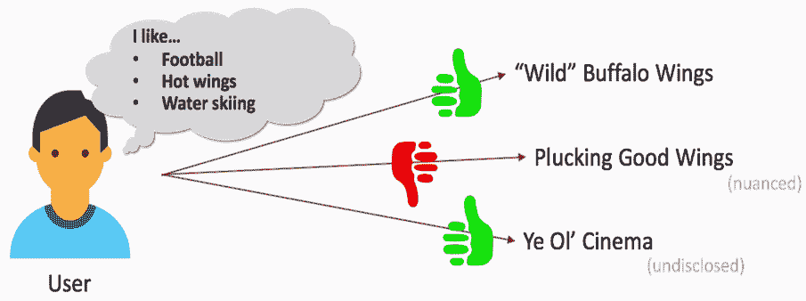
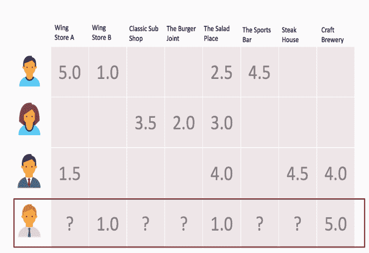
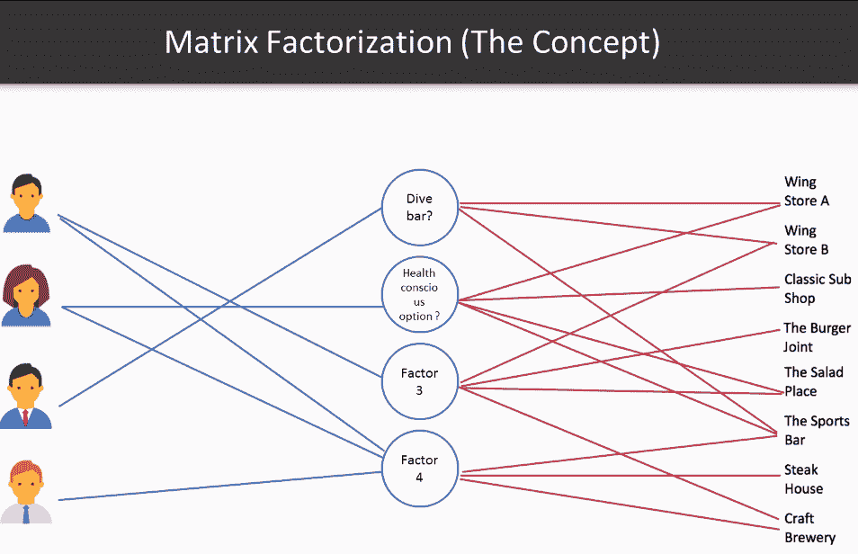
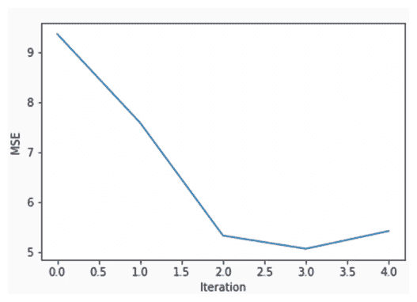
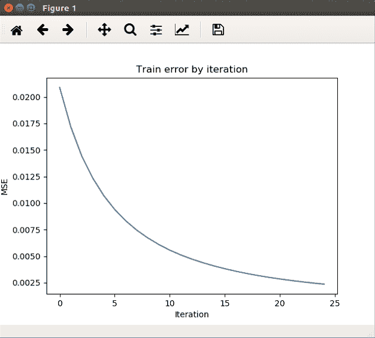
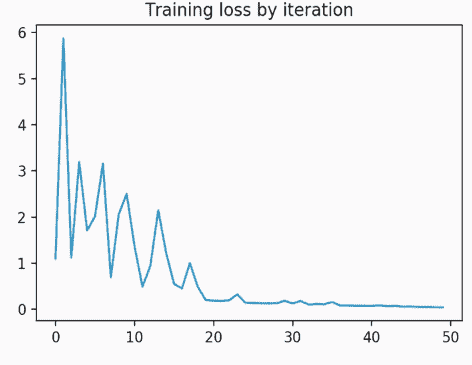
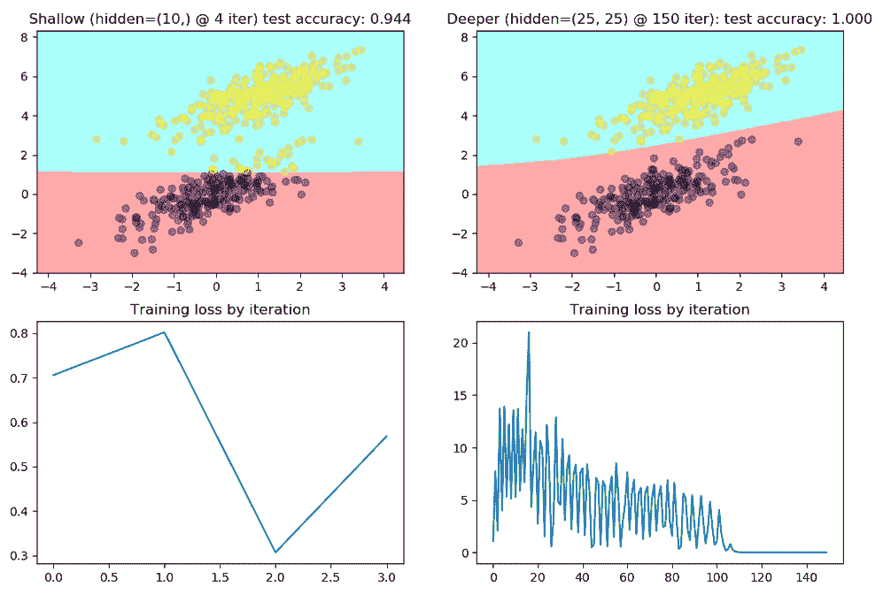
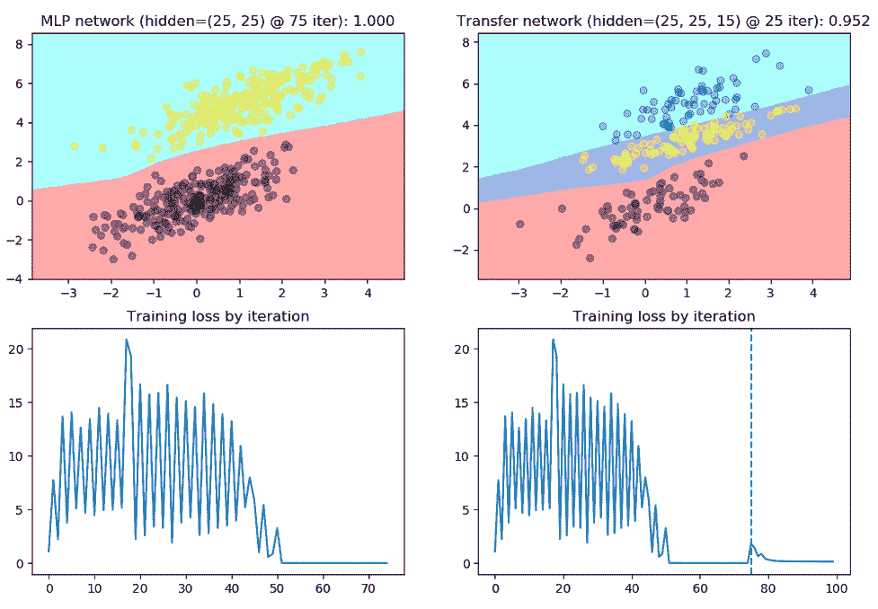

# 监督式机器学习中的高级主题

在本章中，我们将专注于一些高级主题。我们将讨论两个主题：推荐系统和神经网络。我们将从协同过滤开始，然后探讨如何将基于内容的相似性融入协同过滤系统中。接着我们将讲解神经网络和迁移学习。最后，我们将介绍每个主题背后的数学和概念，再深入到 Python 代码。

我们将涵盖以下主题：

+   推荐系统与协同过滤介绍

+   矩阵分解

+   基于内容的过滤

+   神经网络和深度学习

+   使用迁移学习

# 技术要求

对于本章内容，如果你还没有安装以下软件，需进行安装：

+   Jupyter Notebook

+   Anaconda

+   Python

本章的代码文件可以在 [https:/​/​github.​com/​PacktPublishing/](https://github.com/PacktPublishing/Supervised-Machine-Learning-with-Python) 上找到。

[Supervised-Machine-Learning-with-Python](https://github.com/PacktPublishing/Supervised-Machine-Learning-with-Python)。

# 推荐系统与协同过滤介绍

在这一部分，我们将讨论协同过滤和推荐系统。我们将从解释什么构成推荐系统开始，探讨用户是如何在不知情的情况下自愿分享大量关于自己的数据，接着讲解协同过滤。

无论你是否意识到，你每天都在与大量的推荐系统互动。如果你曾经在亚马逊上购物，或者在 Facebook 上浏览，或者在 Netflix 上观看节目，你就已经接触到某种形式的个性化内容。这就是电子商务平台如何最大化转化率并让你不断回头购买的方式。

一个真正优秀的推荐系统的标志是它知道你想要什么，不论你是否已经意识到这一点。一个好的推荐系统会让你真的想：他们是怎么知道的？事实证明，人类的行为是非常可预测的，即使不需要分享个人信息，我们也能通过“脚投票”来表达偏好，意思是用户可能声称喜欢某种电影类型，比如喜剧，但实际却偏好观看另一种类型，比如爱情片。所以，推荐系统的目标仅仅是让你点击；然而，第二个目标通常根据平台的不同而有所不同。它可能是为了最大化卖家的收入，创造客户满意度，或任何其他的度量标准。但真正让这些系统有趣的是，它们是直接供人类消费的，而许多其他**机器学习**（**ML**）模型则存在于替代自动化过程。

这里有一个示例，解释“脚投票”：



这个用户说他喜欢足球、辣翅和水上滑雪。然而，他的评分历史显示他给一家翅膀餐厅点赞，给另一家餐厅点了踩，然后又给一家电影院点赞。那这意味着，他对第二家翅膀餐厅有不满之处。也许是环境不佳，或者是翅膀酱的味道问题。不管怎样，他对辣翅的兴趣——他宣称的兴趣——比他最初告诉我们的更为复杂。同样，他对电影也表示了兴趣，尽管他没有明确说出来。因此，关键在于，人们通过行动传达的信息比通过语言更多，他们的行动比语言更真实。我们可以利用这一点，通过推荐系统来学习物品与人们兴趣之间这些细微的模式。

协同过滤是一类常见的推荐系统。它基于一个叫做**同质性**的概念，意思是*物以类聚，人以群分*。也就是说，如果你喜欢某样东西，那么其他也喜欢它的人可能与你有一些共同的兴趣；这样，我们就有了一个很好的兴趣池，可以开始彼此推荐东西了。

在典型的协同过滤系统中，我们的数据将类似于这种格式：



在前面的截图中，用户沿着 *y* 轴（即行）展示，而物品沿着 *x* 轴（即列）展示。你可能有明确的评分，通常是连续的，也可能是隐式评分，通常是二进制的。这里展示的是明确评分。我们要回答的问题是，预测用户的评分是多少？但要做到这一点，我们必须计算物品之间的相似度。这是一种叫做物品对物品协同过滤的协同过滤形式，我们只能计算用户共同评分的物品之间的相似度。这种方法通常对明确评分的系统效果最佳；它基于亚马逊几年前发布的一篇论文。

计算物品之间的相似度非常简单。我们可以使用几种常见的度量方法来计算成对的相似度，包括**皮尔逊相关系数**或余弦相似度。例如，我们将使用余弦相似度，方法如下：


其计算方法与我们在第三章《与非参数模型的工作》中看到的聚类方法非常相似，即**欧几里得距离**。然而，这里计算的是相似度，而不是空间距离。因此，它是这一概念的完全逆向计算，但采用类似的方法。

由于我们的数据非常稀疏，我们将首先通过 SciPy 将其转换为稀疏 CSR 矩阵，而不是存储 32 个元素，我们现在只需要存储 14 个：

```py
from scipy import sparse
import numpy as np

rows = np.array([0,0,0,0,1,1,1,2,2,2,2,3,3,3])
cols = np.array([0,1,4,5,2,3,4,0,4,6,7,1,4,7])
data = np.array([5.,1.,2.5,4.5,3.5,2.,3.,1.5,
                 4.,4.5,4.,1.,1.,5.])
# Make a sparse matrix
R = sparse.csr_matrix((data, (rows, cols)), shape = (4, 8))
print(R.todense())
```

前面代码的输出如下：

```py
[[5\. 1\. 0\. 0\. 2.5 4.5 0\. 0\. ]
 [0\. 0\. 3.5 2\. 3\. 0\. 0\. 0\. ]
 [1.5 0\. 0\. 0\. 4\. 0\. 4.5 4\. ]
 [0\. 1\. 0\. 0\. 1\. 0\. 0\. 5\. ]]
```

这是一个基于实际情况的稠密矩阵。所以，你可以想象当我们有成千上万的用户和数百万个物品时，这会变得非常方便——比如亚马逊。

我们将简单地计算矩阵转置后的成对余弦相似度。这里面有很多零。这并不是说这些项目是正交的，数学上来说，余弦相似度为零意味着正交；而是因为我们遇到了一种被称为物品冷启动的问题，即有一些物品从未被共同评分。因此，我们不能仅凭评分有效地计算相似度。

现在我们将看看如何根据给定用户的历史数据生成预测，这些预测基于计算出的物品相似度。在以下示例中，我们使用相同的用户，并且只是为`user_3`做预测：

```py
from sklearn.metrics.pairwise import cosine_similarity

# Compute the sim matrix
sim = cosine_similarity(R.T).round(3)
sim
top_k = 3
user_3 = np.array([0., 1., 0., 0., 1., 0., 0., 5.])

# compute dot product btwn user vec and the sim matrix
recommendations = user_3.dot(sim)
item_indices = np.arange(recommendations.shape[0])

# now arg sort descending (most similar items first)
order = np.argsort(-recommendations)[:top_k]
items = item_indices[order]

# zip them together (item, predicted rating)
list(zip(items, recommendations[order]))
```

前面代码的输出如下：

```py
[(7, 6.130000000000001), (4, 4.326), (1, 4.196)]
```

所以，在这个算法中，计算预测其实很简单。你只需要计算该用户的评分向量与相似度矩阵的点积。然后，像我们对最近邻做的那样，使用`argsort`按降序排列，但与升序相反。需要注意的是，首先，预测评分超过了实际评分的范围，实际评分是`6.12`。我们最多只评分到五分，但我们无法保证评分的范围是有界的。因此，我们可以选择保留这些评分或者使用其他策略，但另外两个评分实际上是用户之前给出的评分。如果你查看评分矩阵，你会发现这两个评分都被用户打了 1 星。所以，我们可以看出，这个推荐模型的效果不太好，表现出低秩和较少的用户数量。

推荐系统技术上是监督学习，但它们与传统的*x*，*y*配对有所不同，因为我们的真实数据实际上就是我们的数据本身。所以，在我们的例子中，我们可以查看物品四和物品一的评分，然后看看我们与真实值的差距有多大。

# 物品之间的协同过滤

让我们来看一下代码。这是物品之间的协同过滤。我们从`packtml/recommendation`中的`base.py`文件开始：

```py
class RecommenderMixin(six.with_metaclass(ABCMeta)):
    """Mixin interface for recommenders.

    This class should be inherited by recommender algorithms. It provides an
    abstract interface for generating recommendations for a user, and a
    function for creating recommendations for all users.
    """
    @abstractmethod
    def recommend_for_user(self, R, user, n=10, filter_previously_seen=False,
                           return_scores=True, **kwargs):
        """Generate recommendations for a user.

        A method that should be overridden by subclasses to create
        recommendations via their own prediction strategy.
        """

    def recommend_for_all_users(self, R, n=10,
                                filter_previously_seen=False,
                                return_scores=True, **kwargs):
        """Create recommendations for all users."""
        return (
            self.recommend_for_user(
                R, user, n=n, filter_previously_seen=filter_previously_seen,
                return_scores=return_scores, **kwargs)
            for user in xrange(R.shape[0]))
```

这个`base`类叫做`RecommenderMixin`。它只是一个接口。里面有两个方法：一个是为所有子类写好的，就是`recommend_for_all_users`；另一个是`recommended_for_user`。所以，我们需要根据子类来重写它。我们接下来要看的子类是基于物品之间的协同过滤。

在接下来的`itemitem.py`文件中，我们看到了两个参数：

```py
 def __init__(self, R, k=10):
        # check the array, but don't copy if not needed
        R = check_array(R, dtype=np.float32, copy=False) # type: np.ndarray

        # save the hyper param for later use later
        self.k = k
        self.similarity = self._compute_sim(R, k)

    def _compute_sim(self, R, k):
        # compute the similarity between all the items. This calculates the
        # similarity between each ITEM
        sim = cosine_similarity(R.T)

        # Only keep the similarities of the top K, setting all others to zero
        # (negative since we want descending)
        not_top_k = np.argsort(-sim, axis=1)[:, k:] # shape=(n_items, k)

        if not_top_k.shape[1]: # only if there are cols (k < n_items)
            # now we have to set these to zero in the similarity matrix
            row_indices = np.repeat(range(not_top_k.shape[0]),
                                    not_top_k.shape[1])
            sim[row_indices, not_top_k.ravel()] = 0.

        return sim

    def recommend_for_user(self, R, user, n=10,
                           filter_previously_seen=False,
                           return_scores=True, **kwargs):
        """Generate predictions for a single user.
```

我们有 `R` 和 `k`。`R` 是我们的评分矩阵，它不同于其他基础估计器，因为我们没有相应的 `y` 值。`R` 是我们的真实数据以及训练数组。`k` 是一个参数，我们可以用它来限制相似的物品的数量。它有助于减少我们比较的空间，并使得计算更容易。因此，对于构造函数，拟合过程只是通过 `compute_sim` 函数计算相似度数组。我们获取 `R` 数组，进行转置，使得物品排列在行轴上，然后计算行之间的余弦相似度，行现在表示物品。我们得到一个 *n x n* 矩阵，第一个 *n* 表示十一月矩阵，第二个 *n* 是物品数量的维度。基本上，我们会说任何不在 `top_k` 中的物品，将其相似度设为零。这里的一种策略是，它允许我们以一种否则无法实现的方式增强我们的相似度矩阵。这就是我们正在做的：将结果按降序进行 argsort。我们希望最相似的排在前面，沿列进行 argsort。我们将相似度矩阵存储在 `self.similarity` 中。在计算预测时，我们将使用它。

所以，`recommend_for_user` 是我们需要在超抽象接口中重写的函数。我们可以传递几个参数。首先是用户向量，它是一个索引，和 *n*，即我们想要生成的推荐数量。现在，我们从 `R` 中获取 `user_vector`：

```py
# check the array and get the user vector
R = check_array(R, dtype=np.float32, copy=False)
user_vector = R[user, :]
```

推荐——原始推荐——是用户向量与相似度矩阵的内积，它在 NumPy 中生成一个 *nD* 或 *1D* 数组。

我们通过 NumPy 中的 `arange` 方法获取 `item_indices`：

```py
# compute the dot product between the user vector and the similarity
# matrix
recommendations = user_vector.dot(self.similarity) # shape=(n_items,)

# if we're filtering previously-seen items, now is the time to do that
item_indices = np.arange(recommendations.shape[0])
if filter_previously_seen:
    rated_mask = user_vector != 0.
    recommendations = recommendations[~rated_mask]
    item_indices = item_indices[~rated_mask]
```

我们将根据推荐的降序 `argsort` 排序这个列表。现在，如果我们想，可以将它们限制为前 `n` 个。

如果你想为所有项目生成推荐，可以将 `None` 作为 `n` 传递。我们将返回 `items`、`indices` 和 `recommendations`，即每个对应物品的预测评分，如下所示：

```py
# now arg sort descending (most similar items first)
order = np.argsort(-recommendations)[:n]
items = item_indices[order]

if return_scores:
   return items, recommendations[order]
return items
```

我们进入 `example_item_item_recommender.py` 文件。我们将加载一个名为 `get_completely_fabricated_ratings_data` 的有趣数据集，它可以在 `data.py` 文件中找到。这里，我们有多个用户，如以下代码所示：

```py
    return (np.array([
        # user 0 is a classic 30-yo millennial who is nostalgic for the 90s
        [5.0, 3.5, 5.0, 0.0, 0.0, 0.0, 4.5, 3.0,
         0.0, 2.5, 4.0, 4.0, 0.0, 1.5, 3.0],

        # user 1 is a 40-yo who only likes action
        [1.5, 0.0, 0.0, 1.0, 0.0, 4.0, 5.0, 0.0,
         2.0, 0.0, 3.0, 3.5, 0.0, 4.0, 0.0],

        # user 2 is a 12-yo whose parents are strict about what she watches.
        [4.5, 4.0, 5.0, 0.0, 0.0, 0.0, 0.0, 4.0,
         3.5, 5.0, 0.0, 0.0, 0.0, 0.0, 5.0],

        # user 3 has just about seen it all, and doesn't really care for
        # the goofy stuff. (but seriously, who rates the Goonies 2/5???)
        [2.0, 1.0, 2.0, 1.0, 2.5, 4.5, 4.5, 0.5,
         1.5, 1.0, 2.0, 2.5, 3.5, 3.5, 2.0],

        # user 4 has just opened a netflix account and hasn't had a chance
        # to watch too much
        [0.0, 0.0, 0.0, 0.0, 2.0, 0.0, 0.0, 0.0,
         0.0, 0.0, 0.0, 1.5, 4.0, 0.0, 0.0],
    ]), np.array(["Ghost Busters", "Ghost Busters 2",
                  "The Goonies", "Big Trouble in Little China",
                  "The Rocky Horror Picture Show", "A Clockwork Orange",
                  "Pulp Fiction", "Bill & Ted's Excellent Adventure",
                  "Weekend at Bernie's", "Dumb and Dumber", "Clerks",
                  "Jay & Silent Bob Strike Back", "Tron", "Total Recall",
                  "The Princess Bride" ]))
```

假设用户 0 是一个经典的 30 岁千禧一代，喜欢 90 年代的怀旧感。所以，他们会高度评价《公主新娘》，《幽灵 busters》和《幽灵 busters 2》。用户 1 是一个 40 岁的人，只喜欢动作电影。所以，他们会评分《虎胆龙威》和《低俗小说》。用户 2 是一个 12 岁的孩子，父母相对严格，因此我们可以假设用户 2 没有看过《低俗小说》之类的电影。但用户 2 看过《幽灵 busters》，《幽灵 busters 2》以及《怪物史瑞克》。并且用户 2 对这些电影的评分都很高。用户 3 什么都看过。用户 4 刚刚开通了 Netflix 账户，还没有机会看太多东西。所以，用户 4 可能是我们最感兴趣的推荐对象。

这一切都是一个 NumPy 数组。我们返回的是一个密集数组。你也可以将其返回为稀疏数组。

在`examples/recommendation`目录下的`example_item_item_recommender.py`文件中，我们将从`get_completely_fabricated_ratings_data`函数中获取`R`评分矩阵和`titles`：

```py
# #############################################################################
# Use our fabricated data set
R, titles = get_completely_fabricated_ratings_data()

# #############################################################################
# Fit an item-item recommender, predict for user 0
rec = ItemItemRecommender(R, k=3)
user0_rec, user_0_preds = rec.recommend_for_user(
    R, user=0, filter_previously_seen=True,
    return_scores=True)
```

我们创建一个`recommender`对象，设置`k=3`。我们只保留每个项目的三个最相似的项目。然后，我们为用户 0 生成推荐。

如果我们运行`example_item_item_recommender.py`文件，我们可以查看用户 0 的前三部评分电影：


用户 0 的前三部评分电影是：《幽灵 busters》，《怪物史瑞克》，和《低俗小说》。这意味着用户 0 高度评价了《幽灵 busters》和《怪物史瑞克》，但并未评价《低俗小说》。

我们还可以看到，平均精准度大约是 2/3。平均精准度是我们在推荐系统中将要使用的一个指标。它实际上来自信息检索领域。它不像例如平均绝对误差或均方误差。我们所做的是表明我们推荐的项在实际结果集中所占的比例。在这个案例中，它表示用户最初评分很高的那些项目，这显示我们产生的推荐是相当不错的。

# 矩阵分解

在本节中，我们将深入探讨推荐系统，并介绍矩阵分解技术。在典型的协同过滤问题中，我们在一个轴上有用户，另一个轴上有项目或物品。我们想为每个给定的项目计算用户的预测评分，但为了达到这个目的，我们必须以某种方式计算用户或项目之间的相似度。在前一节中，我们探讨了项对项的协同过滤方法，其中我们显式地使用余弦相似度度量来计算相似度矩阵，但现在我们希望探索一种不显式地将项目与项目或用户与用户进行比较的方法。

矩阵分解是一种协同过滤的形式，侧重于产品的无形因素。从概念上讲，每个产品或餐厅都有无形因素，导致你喜欢、不喜欢或对它们保持中立。例如，对于一家餐厅，可能是气氛或你感受到的氛围比菜单更重要。或者，考虑以下表述：食物很糟糕，但欢乐时光很棒。在这种情况下，我们感兴趣的是学习隐藏或潜在变量，它们在数据模式中以某种方式体现出来。

矩阵分解将允许我们通过将单一的评分矩阵分解成两个低秩矩阵来发现这些潜在变量，这两个矩阵相乘时能够近似原始评分矩阵。直观地说，我们在学习这些隐藏因素或潜在变量，并且学习我们的用户和物品如何在这些因素上得分。如下图所示，其中一个低秩矩阵映射用户对已发现因素的偏好，另一个映射该物品在这些因素上的排名：



矩阵分解的一个缺点是缺乏清晰的直觉或对因素组成的理解。这类似于**主成分分析**（**PCA**）类型的技术，其中一个因素可以被概念化为一个主题。一个有深厚专业知识的、仔细且有洞察力的分析师可能能够从这些主题中提取出意义，但这是非常困难的，因此通常不被追求。例如，也许前面图中的**因素 1**是一个低调的氛围。所以，鸡翅店在不同程度的低调程度上被评分。正如你在前面图的右侧所看到的，**鸡翅店 A**和第一个因素之间有很强的亲和力，即**低调酒吧**。你也可以假设**体育酒吧**在这个尺度上可能会评分较高。那么，可能**因素 2**是一个有一些健康选项的地方。所以，这个连接的强度是某个人或某个产品在潜在因素上的排名程度。你可以在前面图的左右两边看到这一点。

本质上，我们有一个评分矩阵，*Q*。在不同的文献中，它被称为*Q*或*R*。我们在这里称之为*Q*。我们想要发现两个低秩矩阵，*X*和*Y*，使得它们的乘积近似评分矩阵。也就是说，*Q*或*Q* prime 大致等于*X.Y^T*：


我们的目标函数在底部，基本上是一个正则化的均方误差。所以，我们在关注*X*和*Y*与*Q* prime 之间的均方误差，或者叫重构误差，然后我们在另一边有正则化项，带有 lambda。

对于数学领域的人来说，矩阵分解并不新鲜。但在非凸优化问题中，寻找这样的低秩矩阵可能是一个挑战。因此，我们将看到的这种方法叫做**交替最小二乘法**（**ALS**）。

ALS 算法如下：

1.  初始化两个随机矩阵，*X*和*Y*

1.  设置*Q*和*O*的空值

1.  从*X*开始，求解以下问题：


1.  现在用新的*X*来求解*Y*：


1.  迭代，在*X*和*Y*之间交替，直到收敛

本质上，我们将交替求解每个矩阵，并最终达到收敛点。因此，我们从初始化*X*和*Y*为随机值开始。然后，从*X*开始，我们求解*X*的改进版本。现在，我们有了更精细的*X*，可以用它来求解*Y*。每次迭代时，每个矩阵都会为另一个矩阵提供更好的解。我们可以像这样交替进行多次迭代，直到达到收益递减点，此时我们可以认为已收敛。

这里有一个关于符号的简要说明：你可以看到与 lambda 旁边的*I*实际上是一个*F x F*的单位矩阵，其中*F*是我们希望发现的潜在因子的数量。我们将其与正则化参数 lambda 相乘。因此，在对角轴上我们有 lambda，其他位置则是零。

这里是一个常见的 30 行 Python 代码，用于近似 ALS。我们从定义`Q`或评分矩阵开始：

```py
import numpy as np
from numpy.linalg import solve

nan = np.nan
Q = np.array([[5.0, 1.0, nan, nan, 2.5, 4.5, nan, nan],
              [nan, nan, 3.5, 2.0, 3.0, nan, nan, nan],
              [1.5, nan, nan, nan, 4.0, nan, 4.5, 4.0],
              [nan, 1.0, nan, nan, 1.0, nan, nan, 5.0]])

nan_mask = np.isnan(Q) # mask applied when computing loss
Q[nan_mask] = 0.

f = 3 # num factors
n_iter = 5 # num iterations
I_lambda = np.eye(f) * 0.01 # regularizing term
random_state = np.random.RandomState(42)

# initialize X, Y randomly
X = random_state.rand(Q.shape[0], f)
Y = random_state.rand(f, Q.shape[1])
W = nan_mask.astype(int) # weights for calculating loss (0/1)

# iterate:
errors = []
for i in range(n_iter):
    X = solve(Y.dot(Y.T) + I_lambda, Y.dot(Q.T)).T
    Y = solve(X.T.dot(X) + I_lambda, X.T.dot(Q))
    errors.append(((W * (Q - X.dot(Y))) ** 2).sum())

X.dot(Y).round(3)
```

这是我们在前面示例和章节中看到的评分。现在，我们将得到一个布尔掩码，`nan_mask`。首先，我们将所有缺失的值设置为零，便于后续计算。接下来，我们将初始化`I`为单位矩阵，并将其与 lambda 相乘。我们只需要做一次这一步，这很方便。现在 lambda 值是 0.01，但它是一个可以通过交叉验证调优的超参数。因此，lambda 值越高，我们的正则化越强。然后，我们使用`random_state`初始化`X`和`Y`。`X`将等于*M x F*，即用户数量乘以因子数量。`Y`将等于因子数量乘以项目数量：*F x N*。

在迭代中，我们先求解`X`，然后在给定新的`X`的情况下求解`Y`。接着，我们计算训练误差，这也是均方误差的掩码版本，我们将原始真实值数组中的缺失值（即评分数组）去除。然后我们继续迭代，直到达到收敛。

在前面代码的底部，你可以看到`X`和`Y`之间逼近的输出。这是一个逼近。如果你查看`Q`的定义，3 和底部的输出，看起来是非常相似的。因此，我们最终创建预测的方式是利用整个系统中的误差，并返回用户的最高预测项目，同时过滤掉先前已评分的项目。所以，用户 4（最后一个用户）将得到一条推荐，推荐的牛排馆是*2.0*，这是该用户未评分的最高项目。这实际上只是乘法误差或逼近误差的结果。

在下图中，你可以看到训练损失如何随着每次迭代而减少：



# Python 中的矩阵分解

在上一节中，我们想将评分矩阵分解为两个低秩矩阵，以发现驱动消费者决策的无形潜在因子。一个矩阵映射了用户对已发现因子的偏好，另一个矩阵映射了物品在这些因子上的排名。

那么，让我们来看一下如何在 Python 中实现这一点。我们有两个文件，`als.py` 和 `example_als_recommender`。让我们看看我们的`als.py`文件。在上一节中，我们看到了基于物品的协同过滤；ALS 非常相似。它将实现`RecommenderMixin`：

```py
def __init__(self, R, factors=0.25, n_iter=10, lam=0.001,
 random_state=None):
```

我们有几个参数用于 ALS。第一个，也是唯一的非可选参数，是`R`，我们的评分矩阵。在我们看到的一些数学中，我们将其交替称为`R`和`Q`。这也是文献中的一个特点。根据你阅读的论文，它可能是其中之一。第二个参数是`factors`。`factors`参数是我们想要发现的潜在变量的数量。我使用的是浮动点数，但你也可以使用整数。浮动点数的范围将限制在零到一之间。`n_iter`是迭代次数。这个模块中的 ALS 不支持提前收敛或提前停止。这是你完全可以编写的功能。但如果你有太多的迭代，结果可能会是过拟合数据。Lambda 是我们的正则化参数，然后你可以传递`random_state`来确保可复现性。

对于第一步，像往常一样，我们将检查我们的数组，确保只有浮动点数：

```py
# check the array
R = check_array(R, dtype=np.float32) # type: np.ndarray
n_users, n_items = R.shape
# get the random state
random_state = check_random_state(random_state)
```

我们将在这里允许缺失数据，因为在推荐系统中，缺失数据是很自然的。我们几乎可以保证总会有缺失数据。

在下面的代码中，我们确保我们的因子是一个整数。如果它是`float`，我们会计算出我们要发现的`factors`的数量：

```py
# get the number of factors. If it's a float, compute it
if isinstance(factors, float):
    factors = min(np.ceil(factors * n_items).astype(int), n_items)
```

所以，这里的`W`等于`nan_mask`，我们在上一节中已经查看过：

```py
W = (R > 0.).astype(np.float32)
```

这将基本上是一个权重数组，用来表示某个值是否最初缺失。因此，我们使用它来掩盖我们在迭代中计算均方误差时的评分矩阵中的真实值。

这里，我们初始化`Y`：

```py
# initialize the first array, Y, and X to None
 Y = random_state.rand(factors, n_items)
 X = None
# the identity matrix (time lambda) is added to the XX or YY product
# at each iteration.
 I = np.eye(factors) * lam
```

我们没有初始化`X`，因为我们知道它将在迭代中首先被求解。因此，正如我们在前面的部分所看到的，我们也将`I`初始化为单位矩阵——即*F x F*——并将其与我们的正则化参数相乘。

现在我们要进行迭代，如下代码所示：

```py
# for each iteration, iteratively solve for X, Y, and compute the
 # updated MSE
 for i in xrange(n_iter):
 X = solve(Y.dot(Y.T) + I, Y.dot(R.T)).T
 Y = solve(X.T.dot(X) + I, X.T.dot(R))
# update the training error
 train_err.append(mse(R, X, Y, W))
# now we have X, Y, which are our user factors and item factors
 self.X = X
 self.Y = Y
 self.train_err = train_err
 self.n_factors = factors
 self.lam = lam
```

从解决`X`开始，然后解算`Y`。在每次迭代中，我们只计算训练误差，即均方误差。我们将其添加到在以下代码中作为`self`参数存储的列表中。

对于 ALS，训练阶段实际上是异常简单的。现在，在前面的部分中，我们没有看到如何具体生成预测。我们看到了背后的数学原理，但还没有实现它。如果你像下面的代码所示调用`predict`，它只是计算用户因子和项目因子的乘积，从而返回`R`的近似值：

```py
def predict(self, R, recompute_users=False):
        """Generate predictions for the test set.

        Computes the predicted product of ``XY`` given the fit factors.
        If recomputing users, will learn the new user factors given the
        existing item factors.
        """
        R = check_array(R, dtype=np.float32, copy=False) # type: np.ndarray
        Y = self.Y # item factors
        n_factors, _ = Y.shape

        # we can re-compute user factors on their updated ratings, if we want.
        # (not always advisable, but can be useful for offline recommenders)
        if recompute_users:
            I = np.eye(n_factors) * self.lam
            X = solve(Y.dot(Y.T) + I, Y.dot(R.T)).T
        else:
            X = self.X

        return X.dot(Y)
```

你可以传入`R`，这通常是测试数据。这些数据包括最初未参与拟合的新用户，或者可能意味着用户已经更新了他们的数据。如果需要，我们可以重新计算用户因子。所以，如果用户已经有了时间上的变化，而我们的拟合大约有一周的历史，那么我们可以根据现有的项目因子重新计算用户因子。最后，我们只是返回`X`和`Y`的乘积。

现在，我们将调用`recommend_for_user`函数。所以，给定你的测试矩阵和用户索引，我们想知道推荐给某个用户的前`n`个项目是什么，我们基本上做的是同样的事情：

```py
def recommend_for_user(self, R, user, n=10, recompute_user=False,
                       filter_previously_seen=False,
                       return_scores=True):
```

我们将创建这个预测，但提取出预测的用户向量。所以，我们使用`self.predict`方法，如下代码所示：

```py
R = check_array(R, dtype=np.float32, copy=False)
# compute the new user vector. Squeeze to make sure it's a vector
 user_vec = self.predict(R, recompute_users=recompute_user)[user, :]
 item_indices = np.arange(user_vec.shape[0])
# if we are filtering previously seen, remove the prior-rated items
 if filter_previously_seen:
 rated_mask = R[user, :] != 0.
 user_vec = user_vec[~rated_mask]
 item_indices = item_indices[~rated_mask]
order = np.argsort(-user_vec)[:n] # descending order of computed scores
 items = item_indices[order]
 if return_scores:
 return items, user_vec[order]
 return items
```

如果我们有兴趣过滤掉之前看到的项目，我们只需将它们掩盖掉，并返回按降序排列的我们感兴趣的项目的索引。这与我们之前在进行空间聚类时看到的非常相似，不过在这里，我们所做的只是计算`X`和`Y`的近似值，并对列进行 argsort 排序。

让我们来看一下`example_als_recommender.py`文件中的示例：

```py
# -*- coding: utf-8 -*-

from __future__ import absolute_import

from packtml.recommendation import ALS
from packtml.recommendation.data import get_completely_fabricated_ratings_data
from packtml.metrics.ranking import mean_average_precision
from matplotlib import pyplot as plt
import numpy as np
import sys

# #############################################################################
# Use our fabricated data set
R, titles = get_completely_fabricated_ratings_data()

# #############################################################################
# Fit an item-item recommender, predict for user 0
n_iter = 25
rec = ALS(R, factors=5, n_iter=n_iter, random_state=42, lam=0.01)
user0_rec, user_0_preds = rec.recommend_for_user(
    R, user=0, filter_previously_seen=True,
    return_scores=True)

# print some info about user 0
top_rated = np.argsort(-R[0, :])[:3]
print("User 0's top 3 rated movies are: %r" % titles[top_rated].tolist())
print("User 0's top 3 recommended movies are: %r"
      % titles[user0_rec[:3]].tolist())
```

你可能还记得前面代码中的推荐数据。这些完全是我们在前几节中提到的虚构数据。我们将使用相同的数据，并在其上进行 ALS 拟合。我们想知道用户 0 的预测值，因此，在运行之前，我们需要一些信息。假设用户 0 对《Ghost Busters》评价很高，并且对《The Goonies》评价也很高。这个人真是行家！所以，他是典型的 90 年代/80 年代末期的千禧一代。

在下面的截图中，你会注意到我们已经激活了我的`packt-sml` conda 环境：


上述代码的输出如下：



你也需要做同样的事情。所以，当我们运行这个时，我们会得到前面的图表，它展示了训练误差如何随着迭代而减少，正如我们预期的那样。因此，我们会推荐用户 0 观看`Weekend at Bernie's`，作为评分最高的推荐。这似乎很有道理，因为他已经看过`The Goonies`和`Ghost Busters`。但是，`Pulp Fiction`有点暴力，所以我们也推荐了`Clockwork Orange`，这也似乎很吻合。因此，平均精度，基本上是查看推荐结果，然后将其与真实情况进行比较，看看其中有多少是之前被高度评价过的。

# ALS 的局限性

我们一直在使用显式评分。例如，在亚马逊上，评分是介于一到五星之间的问题。这里的问题是，显式评分系统通常会遇到让用户进行评分的困难，因为与其从用户角度评估内容，不如直接消费内容更为容易。所以，隐式评分是显式评分的反面，它们通常能在用户不知情的情况下被系统收集。很多时候，这更有利，因为它不需要用户在二次交互中显式评分，从而可以收集更多数据，也意味着数据更不稀疏。所以，隐式评分可能包括歌曲的收听次数。Last FM 团队收集的一个非常著名的评分数据集就使用了隐式评分，通常用于推荐系统的基准测试。ALS 有一个隐式版本，但我们只讲解了显式版本。不过，如果你在 Google 上搜索隐式 ALS，会有很多相关文献。我们鼓励你去查阅。

推荐系统的下一个挑战是稀疏性与密集性。正如我们所见，评分矩阵通常是非常稀疏的。对于一些系统，比如亚马逊，每个用户的所有项目评分可能不到百分之一，很多时候甚至更少。因此，密集矩阵通常不是最佳的解决方案，很多时候甚至不可行。所以，我们要么使用稀疏矩阵，要么在如何分配数据上足够聪明，这样就不会把内存消耗得太高。

推荐系统通常需要很长时间进行训练。像许多其他机器学习模型一样，我们会遇到类似的情况，但推荐系统有些不同，因为它们需要更加频繁地更新，在许多情况下，每天多次更新，具体取决于系统本身。因此，新项目的加入或新用户开始使用媒体意味着推荐系统需要刷新。但我们不能在线或实时进行更新，否则可能会使系统崩溃。因此，一般来说，推荐系统会定期离线重新训练。而模型的评分则是在在线或更实时的方式下进行的。

在这一部分，我们看了 `packtml` 库中 ALS 的 Python 实现以及一个示例。最后，我们讨论了推荐系统中一些现实世界的挑战。

# 基于内容的过滤

在这一部分，我们将通过介绍一种完全不同的计算相似度的方法来结束我们对推荐系统的讨论，并看看如何利用这种方法来增强我们的协同过滤系统。

基于内容的推荐系统的工作方式与我们之前看到的原始的项目对项目协同系统类似，但它们并不使用评分数据来计算相似度。相反，它们通过使用目录中项目的属性直接计算相似度。然后，预测可以像项目对项目协同过滤一样通过计算评分矩阵和相似度矩阵的乘积来得出。

下面是我们如何使用内容向量直接计算项目相似度矩阵的一个示例：

```py
import numpy as np
from sklearn.metrics.pairwise import cosine_similarity

ratings = np.array(([5.0, 1.0, 0.0, 0.0, 2.5, 4.5, 0.0, 0.0],
                    [0.0, 0.0, 3.5, 2.0, 3.0, 0.0, 0.0, 0.0],
                    [1.5, 0.0, 0.0, 0.0, 4.0, 0.0, 4.5, 4.0],
                    [0.0, 1.0, 0.0, 0.0, 1.0, 0.0, 0.0, 5.0]))
# content vector

categories = ['Alcohol license',
              'Healthy options',
              'Burgers on menu',
              'Located in downtown',
              '$', '$$', '$$$', '$$$$',
              'Full bar', 'Southern cooking',
              'Grilled food']
# categories        a1   he  bu  dt  1$  2$  3$  4$  fb  sc  gf
content = np.array([[0., 1., 0., 0., 0., 1., 0., 0., 0., 0., 0.],
                    [1., 0., 1., 1., 0., 1., 0., 0., 1., 0., 0.],
                    [0., 1., 1., 0., 1., 0., 0., 0., 0., 0., 1.],
                    [1., 1., 1., 1., 0., 0., 1., 0., 0., 1., 1.],
                    [0., 1., 0., 0., 1., 0., 0., 0., 0., 0., 1.],
                    [1., 0., 1., 0., 0., 0., 1., 0., 0., 1., 1.],
                    [1., 1., 0., 1., 0., 0., 0., 1., 1., 0., 1.],
                    [1., 1., 1., 0., 0., 0., 1., 0., 0., 0., 1.]
                   ])
sim = cosine_similarity(content)
ratings.dot(sim).round(3)
```

上述代码的输出如下：

```py
array([[6.337, 4.381, 6.169, 6.738, 5.703, 5.545, 4.813, 6.872],
 [2.997, 1.797, 7.232, 5.294, 6.904, 4.03 , 4.078, 5.587],
 [5.697, 4.539, 8.515, 8.305, 8.799, 5.876, 9.01 , 9.005],
 [2.306, 3\. , 4.444, 5.169, 3.582, 4.658, 3.758, 5.916]])
```

我们使用的是与之前几个部分相同的评分矩阵，并且我们为不同的餐厅创建了 11 个不同的属性。通常，这些虚拟编码特征的内容向量表示一个项目是否属于某个特定类别。因此，您可以看到，相似度的计算方式完全相同。所以，我们只是计算行之间的余弦相似度。然后，我们也以相同的方式生成预测。我们计算相似度和评分的乘积。

# 基于内容的系统的局限性

基于内容的系统有几个显著的局限性，使得它们在大多数场景中并不理想。首先是特征工程的手动性质，由于收集有关项目的数据可能非常耗时，而我们关于项目的数据往往仅限于文本描述，因此这会非常困难。所以，我们并没有这个很好的编码矩阵，这意味着我们必须从描述中提取属性，而这可能是具有挑战性并且非常耗时的。

接下来，我们得到了一个大多数为虚拟编码的内容向量集合，这意味着它大部分是零膨胀的。因此，自然地，我们的相似度计算会相对较低，和其他可比的协同过滤方法的计算结果相比，可能会较差。最后，随着我们的特征矩阵秩的增加，两个给定项目之间的相似度将变得正交或为零，因此其概率接近 1。有关更多信息，您可以参考 [`math.stackexchange.com/questions/995623/why-are-randomly-drawn-vectors-nearly-perpendicular-in-high-dimensions`](https://math.stackexchange.com/questions/995623/why-are-randomly-drawn-vectors-nearly-perpendicular-in-high-dimensions)。这是一个松散的证明，表明秩越高，越有可能接近这种正交性，而我们并不希望这样。所有这些局限性为内容驱动的系统相较于协同驱动的系统较不有利提供了一个充分的理由。

但是也有一些情况，它们实际上可以非常有用。其中之一被称为**冷启动问题**，我们在本节前面讨论过，它出现在每个协同过滤应用中。这是指当一个新项目被添加时，由于缺乏评分，无法根据评分与现有项目进行比较。因此，这里的挑战除了无法计算相似度外，还是如果你用 0 或其他随机值填充它，你可能永远无法将其推荐给消费者。你实际上是减少了推荐该项目的机会。

在基于项目的协同过滤中，也会出现两项未被同一用户互相评分的情况，因为我们无法计算它们的相似度。因此，这是一个额外的情况，在这种情况下，由于我们用 0 填充了所有缺失的值，即使我们在理论上有评分可以用来衡量亲和度，最终我们矩阵中的相似度也将为 0。在这些情况下，制定一个备用方案是非常有用的。

在这里，我们正在拟合一个基于项目的协同过滤推荐系统：

```py
from packtml.recommendation import ItemItemRecommender

rec = ItemItemRecommender(ratings, k=5)

zero_mask = rec.similarity == 0
rec.similarity[zero_mask] = sim[zero_mask]
rec.similarity
```

前面代码的输出如下：

```py
array([[0.99999994, 0.67728543, 0.35355338, 0.26726124, 0.62405604,
        0.95782626, 0.28734788, 0.31622776],
       [0.67728543, 0.99999994, 0.2236068 , 0.50709254, 0.43580094,
        0.70710677, 0.5477226 , 0.5521576 ],
       [0.35355338, 0.2236068 , 1\. , 1\. , 0.52827054,
        0.4472136 , 0.4082483 , 0.6708204 ],
       [0.26726124, 0.50709254, 1\. , 1\. , 0.52827054,
        0.8451542 , 0.6172134 , 0.8451542 ],
       [0.62405604, 0\. , 0.52827054, 0.4364358 , 1\. ,
        0.2581989 , 0.7043607 , 0.577514 ],
       [0.95782626, 0.70710677, 0.4472136 , 0.8451542 , 0.44022545,
        1\. , 0.36514837, 0.8 ],
       [0.28734788, 0.5477226 , 0.4082483 , 0.6172134 , 0.7043607 ,
        0.36514837, 1\. , 0.62469506],
       [0.1795048 , 0.5521576 , 0.6708204 , 0.8451542 , 0.577514 ,
        0.8 , 0.62469506, 0.99999994]], dtype=float32)
```

从前面的代码中，我们可以看到`packtml`包中的几个部分，这些部分涉及我们在过去几节中使用的评分数据。我们将使用内容相似度计算来填补受冷启动问题影响的数据。当我们检查相似度矩阵时，可以看到不再有 0 的存在。因此，可能会出现一个极端情况，那就是如果你遇到缺失的互相评分相似度或冷启动问题，且实际内容向量之间存在完美的正交性，那么你可能会得到一个 0。但我们没有看到这种情况。因此，表面上看，这让我们离更强健的模型更近了一步。但你仍然受限于我们之前看到的局限性，即收集内容属性并计算这些可能的正交向量。

到目前为止，你已经熟悉了这个概念，并且意识到单纯基于内容的相似性并不是很可行。但实际上，如果你有合适的情境和设置，它们可以增强你的协同过滤方法。很多研究围绕使用神经网络来自动混合基于内容和协同的系统展开。许多方法使用神经网络从文本描述中创建一些稍微非正式的特征，然后创建一个独立的网络来对矩阵进行因式分解。所以，未来在内容和协同系统并存的希望是非常大的。

以下是追求这种方法的两篇论文：

+   *使用神经网络的混合协同过滤*，Florian Strub，Jeremie Mary，Romaric Gaudel，2016 年

+   *基于高斯混合模型的半监督聚类混合推荐系统*，《Cyberworlds（CW）》2016 国际会议论文集，第 155-158 页，2016 年

# 神经网络与深度学习

这是机器学习中的一个巨大话题，所以我们无法在这一章中涵盖所有内容。如果你之前从未见过神经网络，它们看起来像一张巨大的蜘蛛网。这些蜘蛛网的顶点被称为神经元或单元，它们基于一种旧式的线性分类器，叫做感知机。其基本思路是，输入你的向量，计算与相应权重向量的点积，然后加上一个偏置值。接着，我们通过激活函数进行转换。一般来说，如果使用 sigmoid 转换，感知机在本质上可以与逻辑回归是一样的。

当你将一大堆这样的感知机串在一起时，你得到的是一个巨大的感知机网络：这叫做多层感知机，但它也被称为神经网络。当这些感知机逐层传递信息时，神经元最终会在输入空间中学习一系列非线性变换，最终在最后一层产生预测结果。

这些模型的历史实际上非常有趣。它们最早是在 1950 年代初提出的，但由于计算开销巨大，其潜力一直没有得到真正的释放。如今，深度学习已经成为一个随处可见的话题，实际上它指的是更广泛的神经网络家族，包括一些无监督和生成的变体。

那么，神经网络究竟是如何学习的呢？我们将通过多次循环将数据通过网络的各层，在每个周期中输入数据。前向传播的过程非常简单，就是计算当前层和下一层之间的矩阵乘积，将偏置向量加到列轴上，然后通过激活函数转换输出。你可以使用许多不同的激活函数，但一些最常见的包括 sigmoid 函数；双曲正切函数，它类似于 sigmoid，但它的输出范围是从负一到一，而不是零到一；还有**修正线性单元**（**ReLUs**），它们实际上只是将值和零之间的最小值作为输出，确保输出值没有负数。所以，在每个周期或迭代之后，在输出层外，我们将计算网络的误差，并通过各层传递误差信息，以便它们相应地调整权重。这个过程叫做反向传播。我们通常使用梯度下降法来实现这一过程。

对于我们的两层示例，实际上只是中间有一层，最后有一个输出层，我们每个时期只需要计算两个矩阵乘积。已经发现，如何初始化权重对网络学习能力有很大影响。对于这个策略有几种方法，但最简单的方法是将它们初始化为非常小的值。我们通常选择在负 0.1 到正 0.1 之间的随机值。你可以选择更小的值，也可以做得更聪明。我们将偏置初始化为 1 的向量。同样，也有其他更巧妙的方法来实现这一点。我们这里只用 1，而权重矩阵本身将一层映射到下一层。所以，从第一层到第二层，我们从三个单元到四个单元。你可以看到在单元数中维度的变化。我们相应的权重矩阵将是*3 x 4*，同样，第二个权重矩阵将是*4 x 2*。

在这里，我们只是将我们的网络表示为一组线性方程：


第一层被传递到第二层，在内部的嵌套括号中，然后传递到外部括号中的最后一层。最终得到的结果是一个*m x 2*的真实矩阵。

下面是一个非常简化的 Python 代码片段中的前向传播：

```py
import numpy as np

# define activation function
f = (lambda v: 1./ (1\. + np.exp(-v)))
lam = 0.01
# input matrix
X = np.array([[1.5, 5.0, 2.5],
             [0.6, 3.5, 2.8],
             [2.4, 5.6, 5.6]])

y = np.array([1, 1, 0])
# initialize hidden layers, bias

rs = np.random.RandomState(42)
H1 = rs.rand(3, 4)
H2 = rs.rand(4, 2)
b1, b2 = np.ones(4), np.ones(2)

# feed forward
H1_res = f(X.dot(H1) + b1)
output = f(H1_res.dot(H2) + b2)
```

我们在这里定义了激活函数。`f`是一个逻辑或 sigmoid 变换。`lam`，或称`lambda`，将是我们的学习率，我们在讨论梯度下降时已经了解过它。你还记得在逻辑回归中，我们可以控制下降梯度的速率。在初始化`X`和`y`（我们这里只是用随机值）后，我们创建了隐藏层`H1`和`H2`，以及偏置`b1`和`b2`。在这个例子中，我们使用了 NumPy 的`rand`函数来创建这些层。但在这里，你应该聪明一点，将它们限制在正负`0.1`之间。然后，隐藏层一的结果`H1_res`通过将我们的`f`激活函数应用于`AX + b`线性方程来计算。所以，我们只是计算`X`和`H1`之间的内积，然后沿列向量加上偏置向量。

输出是通过将第二个隐藏层应用于第一个隐藏层的输出来计算的，方式与之前相同。因此，我们将这些线性系统彼此链接，并对该输出应用非线性转换。

所以，现在我们已经完成了第一次训练周期，我们需要调整网络的权重，以达到一个最小化误差的状态，因为目前网络可能产生了一个非常大的误差。因此，反向传播的乐趣就开始了，如果你认为我们之前在本书中涉及了很多微积分，那么接下来你将大快朵颐。我们将计算四个导数：每一层两个。我们用它们来调整立即上一层的权重，就像在逻辑回归中做的那样。然后，在下一次前向传播时，权重已经被调整，理论上，网络的误差会比之前小。

这里，我们从零开始实现反向传播：

```py
# back prop
out_delta = output.copy() # get a copy of the output
out_delta[range(X.shape[0]), y] -= 1.
H2_d = H1_res.T.dot(out_delta)
b2_d = H2_d.sum(axis=0)
delta2 = out_delta.dot(H2.T) * (1\. - np.power(H1_res, 2.))
H1_d = X.T.dot(delta2)
b1_d = delta2.sum(axis=0)

# update weights, bias

H1 += -lam * H1_d
b1 += -lam * b1_d
H2 += -lam * H2_d
b2 += -lam * b2_d
```

我们将计算四个导数：每个权重层关于损失函数的导数——两个；每个偏置层的导数——另两个。第一个 delta 很容易计算：它仅仅是预测的概率，即这个矩阵减去`y`的真实索引。接下来，我们将使用刚才计算的 delta 来计算第一层的输出，这将是关于最后一层（即输出层）的导数。之后，我们可以沿着结果的列求和，得到第二层偏置的导数。

我们可以使用相同的过程来计算下一个`H1`和`b1`层的导数。一旦我们计算出这些梯度，就可以像在逻辑回归中那样更新权重和偏置，即将每个导数乘以负学习率，并将结果加到权重矩阵和`H1`、`b1`、`H2`、`b2`偏置向量中。现在，我们已经沿着损失函数的最大变化轴更新了权重和偏置。

因此，如果你正确地进行反向传播，你将得到类似于以下图表中误差项的收敛结果：



# 训练神经网络的技巧和窍门

这里有一些技巧，当你从零开始训练神经网络时，这些技巧可以让你的工作更轻松。你可以提前停止训练，以避免过拟合。在前面的图表中，你可以看到在误差不再下降而我们仍在训练的地方有一条长尾。大约是在第 25 或 30 轮时。我们本可以提前停止训练。

正则化和 Dropout 是防止网络过拟合的方式。对于极大的数据集，你可以进行每轮的部分拟合，这意味着你可以在每次前向传播时通过网络拟合多个批次，以便不必将所有数据都加载到内存中。这也使得反向传播变得更容易，而且不同的激活函数会给你不同的结果。所以，始终尝试它们。最后，像之前所讲的，始终使用交叉验证来选择你的模型超参数，以避免无意间造成验证集泄漏，或甚至训练集过拟合的情况。

# 神经网络

我们将通过网络中的各层，按轮次（epoch）逐步输入数据。每次迭代后，我们将计算网络的误差和输出，并将信号反向传递通过各层，以便它们可以相应地调整权重。所以，以上就是理论部分和总结。

我们有两个文件要查看。我们有源代码和一个示例：`base.py`和`mlp.py`，它代表多层感知器。我们先从`base.py`开始：

```py
def tanh(X):
    """Hyperbolic tangent.

    Compute the tan-h (Hyperbolic tangent) activation function.
    This is a very easily-differentiable activation function.

    Parameters
    ----------
    X : np.ndarray, shape=(n_samples, n_features)
        The transformed X array (X * W + b).
    """
    return np.tanh(X)

class NeuralMixin(six.with_metaclass(ABCMeta)):
    """Abstract interface for neural network classes."""
    @abstractmethod
    def export_weights_and_biases(self, output_layer=True):
        """Return the weights and biases of the network"""
```

我们有两个函数。一个函数，`tanh`，是我们将用作激活函数的双曲正切函数。它实际上是`np.tanh`的一个封装。然后，我们有一个`NeuralMixin`类，它是我们用来导出每个网络的权重和偏置的抽象接口。

在`mlp.py`中，我们将依赖于 scikit-learn 的典型`check_X_y`、`check_classification_targets`。由于我们只进行二分类或多分类任务，我们将使用 softmax，然后是`check_random_state`。这样，我们就可以在神经网络中使用可复现的`random_state`。

在类本身之外，有一个函数——`calculate_loss`：

```py
def _calculate_loss(truth, preds, weights, l2):
    """Compute the log loss.

    Calculate the log loss between the true class labels and the predictions
    generated by the softmax layer in our neural network.

    Parameters
    ----------
    truth : np.ndarray, shape=(n_samples,)
        The true labels

    preds : np.ndarray, shape=(n_samples, n_classes)
        The predicted class probabilities

    weights : list
        The list of weights matrices. Used for computing the loss
        with the L2 regularization.

    l2 : float
        The regularization parameter
    """
    # get the log probs of the prediction for the true class labels
    n_samples = truth.shape[0]
    logprobs = -np.log(preds[range(n_samples), truth])

    # compute the sum of log probs
    sum_logprobs = logprobs.sum()

    # add the L2 regularization term
    sum_logprobs += l2 / 2\. * sum(np.square(W).sum() for W in weights)
    return 1\. / n_samples * sum_logprobs
```

本质上，这是我们神经网络中的目标函数，我们可以计算它，并将损失反向传播到网络中。Softmax 是广义化的，也就是我们将逻辑函数应用于多个类别。所以，这就是我们从中得到的。从`K`矩阵中，`K`是类别数的维度，我们有一个三类问题；我们可以计算每个类别的归属概率。这就是 softmax 的作用。

现在我们的神经网络分类器将接受多个不同的参数，如下所示：

```py
 def __init__(self, X, y, hidden=(25,), n_iter=10, learning_rate=0.001,
              regularization=0.01, random_state=42):
```

像往常一样，我们有`X`和`y`，然后我们有`hidden`，它将是一个元组或其他可迭代对象，包含表示每一层单元数量的位置信息。所以，如果我们想要两个层，我们可能会有`X`、`25`，其中每一层都会有`25`个单元。确定你想要多少单元并没有确切的科学依据，这取决于你的目标。如果你想压缩维度，你可能会将单元的数量设置得比输入维度小。如果你想发现各种细致的特征，那么你可能会增加单元的数量。迭代次数实际上就是我们要执行的 epoch 的数量。学习率是我们在逻辑回归中看到的 lambda。正则化是我们的`l2`惩罚，它将帮助我们防止过拟合。而`random_state`，再次是我们用来控制`random_state`的种子，这样就可以保证可重复性。

在构造函数中，我们所做的只是将不同的属性自我分配给算法：

```py
self.hidden = hidden
self.random_state = random_state
self.n_iter = n_iter
self.learning_rate = learning_rate
self.regularization = regularization
# initialize weights, biases, etc.
X, y, weights, biases = self._init_weights_biases(
    X, y, hidden, random_state, last_dim=None)
```

然后，我们初始化权重和偏置。我们正在追踪最后一个矩阵的最后一个维度，或者说是隐藏权重矩阵。所以，我们将输入设置为`none`。我们将使用列的维度作为下一层的输入维度。所以，在例子中我们提到我们从三维到了四维。我们第一个隐藏矩阵或隐藏层的维度可能是*3 x 4*。我们追踪最后一列的维度，因为它将成为下一层的行维度。我们返回到`X`、`y`、`weights`、`biases`，这些稍后会被子类使用，这也是为什么它是一个类函数的原因。

现在我们开始推进网络的前向传播。首先，我们计算前向步骤：

```py
    def _forward_step(X, weights, biases):
        # track the intermediate products
        intermediate_results = [X]

        # progress through all the layers EXCEPT the very last one.
        for w, b in zip(weights[:-1], biases[:-1]):

            # apply the activation function to the product of X and the weights
            # (after adding the bias vector)
            X = tanh(X.dot(w) + b)

            # append this layer result
            intermediate_results.append(X)

        # we handle the very last layer a bit differently, since it's out
        # output layer. First compute the product...
        X = X.dot(weights[-1]) + biases[-1]

        # then rather than apply the activation function (tanh), we apply
        # the softmax, which is essentially generalized logistic regression.
        return softmax(X), intermediate_results
```

前向步骤很简单。我们有`X`、我们的权重和偏置。我们将把权重和偏置一起 ZIP，以便一起追踪。然后我们将计算`X.dot(w)`的乘积，`w`是权重，并加上偏置。这再次是那个`AX`线性系统加`b`。接着，我们应用这个非线性变换`tanh`。但是，如果你想使用 sigmoid，你也可以这么做。最后一层略有不同。我们在最后一层并没有使用`tanh`，而是使用了 softmax。因为这是一个分类问题，所以我们将 softmax 应用于`X`的输出，而不是`tanh`。这就是输出层。

在构造函数中，我们计算了第一次前向步骤和第一次迭代：

```py
        # for each iteration, feed X through the network, compute the loss,
        # and back-propagate the error to correct the weights.
        for _ in xrange(n_iter):
            # compute the product of X on the hidden layers (the output of
            # the network)
            out, layer_results = self._forward_step(X, weights, biases)

            # compute the loss on the output
            loss = _calculate_loss(truth=y, preds=out, weights=weights,
                                   l2=self.regularization)
            train_loss.append(loss)

            # now back-propagate to correct the weights and biases via
            # gradient descent
            self._back_propagate(y, out, layer_results, weights,
                                 biases, learning_rate,
                                 self.regularization)
```

现在我们想计算损失；损失就是我们之前看到的对数损失。我们将在`train_loss`中跟踪每个 epoch 的损失。如果你想加速这一过程，你可以选择每五次迭代计算一次损失。在接下来的反向传播示例中，我们将得到一个巧妙的想法，关于如何以比上一个例子中的两层模型更具可扩展性的方式实现这些梯度。

现在，在反向传播函数中，我们再次计算 delta，即每个类别的概率减去真实索引：

```py
probas[range(n_samples), truth] -= 1.
# iterate back through the layers computing the deltas (derivatives)
 last_delta = probas
 for next_weights, next_biases, layer_res in \
 zip(weights[::-1], biases[::-1], layer_results[::-1]):
# the gradient for this layer is equivalent to the previous delta
# multiplied by the intermittent layer result
 d_W = layer_res.T.dot(last_delta)
# column sums of the (just-computed) delta is the derivative
# of the biases
 d_b = np.sum(last_delta, axis=0)
# set the next delta for the next iter
 last_delta = last_delta.dot(next_weights.T) * \
 (1\. - np.power(layer_res, 2.))
# update the weights gradient with the L2 regularization term
 d_W += l2 * next_weights
# update the weights in this layer. The learning rate governs how
# quickly we descend the gradient
 next_weights += -learning_rate * d_W
 next_biases += -learning_rate * d_b
```

这就是我们的第一个 delta。现在，我们要做的是通过将该层的结果与当前的 delta 相乘来迭代计算导数。我们从刚刚减去的概率的当前 delta 开始。所以，现在我们得到了梯度，我们可以通过对导数中的列求和来计算偏差的导数。现在我们有了偏差的导数，并且我们将计算下一个 delta，为下一次迭代做准备。我们使用正则化的方法是通过将正则化项与`next_weights`相乘。所以，`next_weights`是我们将要对其计算梯度的权重矩阵。我们对它进行正则化，并将其加到导数上，然后调整权重。因此，我们可以加上`learning_rate`乘以 delta，或者梯度，对偏差做同样的操作。我们已经在权重和偏差中更改了`next_weights`和`next_biases`。这是一个`void`函数。它不返回任何东西，因为一切都在原地完成了。

现在，权重和偏差已经被反复更新。下次我们执行迭代时——即下一轮 epoch——我们应该会看到更低的误差。因此，我们会在多个迭代中继续这一过程，完成所有的 epochs，并保存我们的权重和偏差。接下来，我们将生成一个预测，并通过执行一次前向传播，最终使用 softmax 计算这些概率。取该列的`argmax`值：这就是具有最高概率的类别。我们将在一个压缩的向量中返回这个结果。

在`example_mlp_classifier`文件中，我们使用了与决策树分类中类似的数据集，这些是我们二维空间中的`multivariate_normal`簇状数据。我们将像往常一样执行`train_test_split`：

```py
# Fit a simple neural network
n_iter = 4
hidden = (10,)
clf = NeuralNetClassifier(X_train, y_train, hidden=hidden, n_iter=n_iter,
                          learning_rate=0.001, random_state=42)
print("Loss per training iteration: %r" % clf.train_loss)

pred = clf.predict(X_test)
clf_accuracy = accuracy_score(y_test, pred)
print("Test accuracy (hidden=%s): %.3f" % (str(hidden), clf_accuracy))

# #############################################################################
# Fit a more complex neural network
n_iter2 = 150
hidden2 = (25, 25)
clf2 = NeuralNetClassifier(X_train, y_train, hidden=hidden2, n_iter=n_iter2,
                           learning_rate=0.001, random_state=42)

pred2 = clf2.predict(X_test)
clf_accuracy2 = accuracy_score(y_test, pred2)
print("Test accuracy (hidden=%s): %.3f" % (str(hidden2), clf_accuracy2))
```

现在我们将训练两个神经网络。第一个神经网络只会使用四次迭代，并且有一个包含 10 个单元的单隐藏层。第二个神经网络稍微复杂一点，我们将进行 150 次迭代，包含两个各有`25`个单元的隐藏层。

因此，我们运行`example_mlp_classifier.py`文件：


使用 10 个单元的单隐藏层，我们得到了一个相当不错的测试准确率：94.4%。但是可以看到，如果我们使用两个 25 单元的隐藏层，几乎可以达到 100%的准确率。我们还得到第一个网络的训练迭代次数。

你可以在下面的图表中看到损失值有些波动：



但随着时间的推移，损失值会逐渐减小。虽然不能保证损失值会完美下降，它可能会有小幅的上升或下降，但我们可以看到，随着时间的推移，损失值最终会变得非常小。我们在更复杂的模型中学到的这个函数是一个非常有趣的非线性决策边界。它在对这些边界点进行分类时有些困难，但这就是我们如何使用神经网络来学习一个远比逻辑回归能学到的更复杂的函数。

# 使用迁移学习

在本节中，我们将进一步探讨一个问题：神经网络是否能够从其他神经网络中学习，以及它们已经学到的内容。我们将首先介绍迁移学习的概念，然后进入一些 Python 代码。

迁移学习本质上是机器学习中的“弗兰肯斯坦怪物”。这个想法来源于这样一个问题：我如何能够利用其他网络已经学到的东西，从那里继续学习？我们基本上是将几个不同的网络进行“大脑拼接”。在一些情况下，这非常有价值，尤其是当一个网络是在你无法访问的数据上进行训练，或者训练过程本身需要几个小时甚至几天的时间时，比如文本或图像处理领域。

我们不想重新训练我们的模型，因为那样会花费很长时间，但我们希望利用已经学习到的其他两个类别的知识，继续学习关于另一个类别的内容。与其重新训练整个模型，我们可以直接使用迁移学习从之前的进展继续。所以，既然你已经理解了背后的概念和原理，我们来看一下如何将它应用到我们现在熟悉的现有多层感知机框架中。

在 `transfer.py` 文件中，从 `TransferLearningClassifier` 开始，相较于 `MLPClassifier`，它多了一个参数：预训练网络。这个预训练网络可以是 `NeuralNetClassifier` 或者 `TransferLearningClassifier`。但在这个示例中，我们只会选择 `NeuralNetClassifier`。和 MLP 构造函数类似，我们将用几行代码将一切保存为自定义属性，然后确保你传入的预训练网络是某种形式的 `NeuralMixin`。

```py
    def __init__(self, X, y, pretrained, hidden=(25,), n_iter=10,
                 regularization=0.01, learning_rate=0.001, random_state=42):

        # initialize via the NN static method
        self.hidden = hidden
        self.random_state = random_state
        self.n_iter = n_iter
        self.learning_rate = learning_rate
        self.regularization = regularization

        # this is the previous model
        self.model = pretrained

        # assert that it's a neural net or we'll break down later
        assert isinstance(pretrained, NeuralMixin), \
            "Pre-trained model must be a neural network!"

        # initialize weights, biases, etc. for THE TRAINABLE LAYERS ONLY!
        pt_w, pt_b = pretrained.export_weights_and_biases(output_layer=False)
        X, y, weights, biases = NeuralNetClassifier._init_weights_biases(
            X, y, hidden, random_state,

            # use as the last dim the column dimension of the last weights
            # (the ones BEFORE the output layer, that is)
            last_dim=pt_w[-1].shape[1])
```

因为我们必须访问之前类的权重和偏差，所以我们获取了预训练的权重和偏差。我们只需要初始化新的权重和偏差，这些新权重和偏差可以附加到网络的末尾。因此，如果我们之前有一个四层的网络，那些层只是辅助层。我们不会训练它们——我们只会冻结它们。然后，我们希望在末尾堆叠一些可以训练的新层，用来学习新的特征——关于我们可能想要预测的新类别的特征。我们只会为新的权重和偏差初始化权重和偏差。

Epochs 稍微有些不同；它们看起来很像 MLP，但也有一点不同。

因此，在每一个 epoch 中，我们将执行一次预训练的前向传播步骤。基本上，我们在这里做的就是，对于预训练的每一层权重和偏差，我们将使用`tanh`函数计算*AX + b*。注意，即使在输出层，我们也不会计算 softmax，而是计算`tanh`，因为我们不再关心获得类别的概率了。现在，我们只希望将其传递到下一层。因此，我们将使用任何激活函数，可能是`sigmoid`或`relu`。

现在我们希望在现有的或我们希望训练的新的权重和偏差层上进行前向步骤：

```py
        train_loss = []
        for _ in xrange(n_iter):
            # first, pass the input data through the pre-trained model's
            # hidden layers. Do not pass it through the last layer, however,
            # since we don't want its output from the softmax layer.
            X_transform = _pretrained_forward_step(X, pt_w, pt_b)

            # NOW we complete a forward step on THIS model's
            # untrained weights/biases
            out, layer_results = NeuralNetClassifier._forward_step(
                X_transform, weights, biases)

            # compute the loss on the output
            loss = _calculate_loss(truth=y, preds=out, weights=pt_w + weights,
                                   l2=self.regularization)
            train_loss.append(loss)

            # now back-propagate to correct THIS MODEL's weights and biases via
            # gradient descent. NOTE we do NOT adjust the pre-trained model's
            # weights!!!
            NeuralNetClassifier._back_propagate(
                truth=y, probas=out, layer_results=layer_results,
                weights=weights, biases=biases,
                learning_rate=learning_rate,
                l2=self.regularization)
```

我们将计算`loss`，然后只在新的层上进行反向传播。因此，我们完全不会训练旧的权重和偏差，但会对新的权重和偏差进行训练。

预测稍有不同：

```py
    def predict(self, X):
        # compute the probabilities and then get the argmax for each class
        probas = self.predict_proba(X)

        # we want the argmaxes of each row
        return np.argmax(probas, axis=1)

    def predict_proba(self, X):
        # Compute a forward step with the pre-trained model first:
        pt_w, pt_b = self.model.export_weights_and_biases(output_layer=False)
        X_transform = _pretrained_forward_step(X, pt_w, pt_b)

        # and then complete a forward step with the trained weights and biases
        return NeuralNetClassifier._forward_step(
            X_transform, self.weights, self.biases)[0]

    def export_weights_and_biases(self, output_layer=True):
        pt_weights, pt_biases = \
            self.model.export_weights_and_biases(output_layer=False)
        w = pt_weights + self.weights
        b = pt_biases + self.biases

        if output_layer:
            return w, b
        return w[:-1], b[:-1]
```

我们不会仅仅计算单一的前向步骤，而是再次计算预训练的前向步骤，因为我们不希望其他网络的末端有 softmax。然后，我们将使用预训练前向步骤的输出计算常规的前向步骤，这会将 softmax 添加到末尾。

对于预测，我们再次对列使用`argmax`。也就是说，从预测的概率中获取最高的概率类别。

让我们看一个示例文件。这看起来与我们在之前的 MLP 示例中设置的非常相似，唯一不同的是我们有两个数据集：

```py
# these are the majority classes
n_obs = 1250
x1 = rs.multivariate_normal(mean=[0, 0], cov=covariance, size=n_obs)
x2 = rs.multivariate_normal(mean=[1, 5], cov=covariance, size=n_obs)

# this is the minority class
x3 = rs.multivariate_normal(mean=[0.85, 3.25], cov=[[1., .5], [1.25, 0.85]],
                            size=n_obs // 3)

# this is what the FIRST network will be trained on
n_first = int(0.8 * n_obs)
X = np.vstack((x1[:n_first], x2[:n_first])).astype(np.float32)
y = np.hstack((np.zeros(n_first), np.ones(n_first))).astype(int)

# this is what the SECOND network will be trained on
X2 = np.vstack((x1[n_first:], x2[n_first:], x3)).astype(np.float32)
y2 = np.hstack((np.zeros(n_obs - n_first),
                np.ones(n_obs - n_first),
                np.ones(x3.shape[0]) * 2)).astype(int)
```

第一个将具有两个部分：我们一直在使用的`multivariate_normal`部分和主要类别。第三个将把第三个类别堆叠在两个类别之间。我们的迁移学习任务就是基于它已经从二元分类示例中学到的知识来学习这个新类别。

让我们训练第一个神经网络，即我们预训练的网络：

```py
# Fit the transfer network - train one more layer with a new class
t_hidden = (15,)
t_iter = 25
transfer = TransferLearningClassifier(X2_train, y2_train, pretrained=clf,
                                      hidden=t_hidden, n_iter=t_iter,
                                      random_state=42)

t_pred = transfer.predict(X2_test)
trans_accuracy = accuracy_score(y2_test, t_pred)
print("Test accuracy (hidden=%s): %.3f" % (str(hidden + t_hidden),
                                           trans_accuracy))
```

这将与我们在第一个示例中看到的非常相似，那里我们有一个两层网络，每层有`25`个单元。我们将进行`75`次训练，并使用一个相当低的学习率，我们将看看它在学习二元分类任务时的表现。

假设我们正在预测某种疾病，并且有第一型和第二型的分类。我不会用糖尿病，因为只有两种类型。但假设出现了第三种类型，可能是某种寨卡病毒，我们想预测这种新类型是否出现在前来就诊的患者身上。我们不想重新训练所有内容，因为这可能需要很长时间。因此，我们只会在末尾加上这一新层，学习关于第三类的新特征。然后我们将生成一个新的输出层，以适应三个类别而不是两个类别。我们只需要进行`25`个新的周期，基于我们已经从之前的二分类任务中学到的内容。我们想看看能否在不重新训练所有内容的情况下学习这个新类别。这就是我们在这里要做的所有事情：

```py
# Fit the transfer network - train one more layer with a new class
t_hidden = (15,)
t_iter = 25
transfer = TransferLearningClassifier(X2_train, y2_train, pretrained=clf,
                                      hidden=t_hidden, n_iter=t_iter,
                                      random_state=42)

t_pred = transfer.predict(X2_test)
trans_accuracy = accuracy_score(y2_test, t_pred)
print("Test accuracy (hidden=%s): %.3f" % (str(hidden + t_hidden),
                                           trans_accuracy))
```

然后我们将把两者都绘制出来，这样你可以看到来自二分类和这个三分类问题的决策边界。

让我们运行一个迁移学习的示例：


我们的测试准确率降至`95.2`百分比。

你可以在下面的图表中看到，我们能够在二分类任务中学习到一个复杂的决策边界：



然后我们就用这个方法说，来做迁移学习，添加一个新类别，我们仍然能够很好地学习它。所以，现在我们已经学会了第二个决策边界，它是在我们最初的决策边界上构建的，看起来非常好。因此，我们获得了 95.2%的准确率。

# 总结

迁移学习是一个灵活的概念，它允许你将网络堆叠在一起，以完成比你想象的更复杂的任务。我们特别讨论了推荐系统和协同过滤，然后我们研究了矩阵分解技术，以及如何通过基于内容的相似度来补充你的推荐系统。最后，我们探讨了神经网络和迁移学习。
